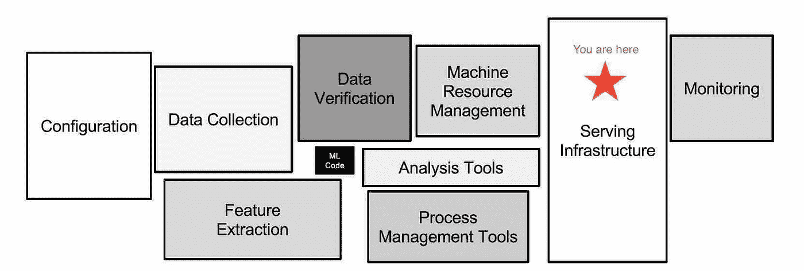
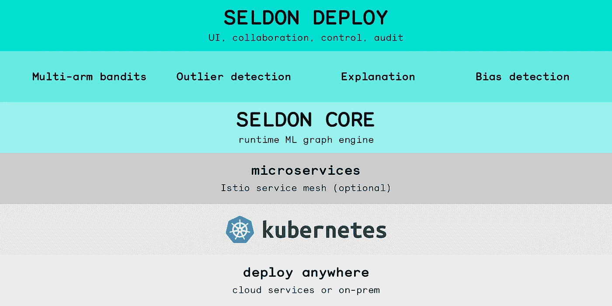
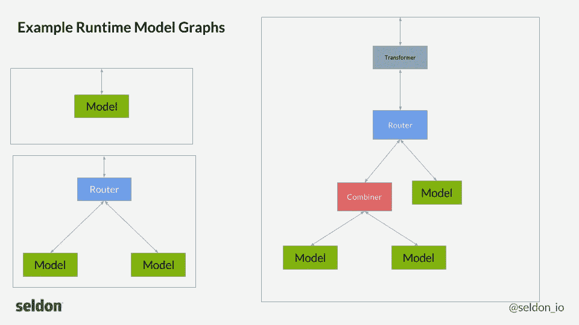

# 为人类服务

> 原文：<https://towardsdatascience.com/to-serve-man-60246a82d953?source=collection_archive---------14----------------------->

## 使用 Seldon Core 在 Kubernetes 上部署模型


来源:Pixabay

# 介绍

讽刺的是，有史以来关于机器学习的最好的论文之一与实际的机器学习几乎没有关系！

在论文[机器学习系统中隐藏的技术债务](https://www.google.com/url?sa=t&rct=j&q=&esrc=s&source=web&cd=11&cad=rja&uact=8&ved=2ahUKEwjBoYzg-8DnAhWIl-AKHfQ2AOEQFjAKegQIAxAB&url=https%3A%2F%2Fpapers.nips.cc%2Fpaper%2F5656-hidden-technical-debt-in-machine-learning-systems&usg=AOvVaw3pwxPSkCQaevZTdxkTOe0G)中，一群来自谷歌的机器学习研究人员敏锐地指出，“任何现实世界的 ML 系统中只有一小部分是由 ML 代码组成的”，并且通常“[模型]所需的周围基础设施是巨大而复杂的。”

换句话说，能够将一个模型从 Jupyter 笔记本中的单个单元转换为一个实际的生产软件并不容易。

# 服务基础设施



正如本文的图表所示，任何生产 ML 系统的一个较大部分是它的服务基础设施，它通常是利益相关者与 ML 代码实际交互的地方。

对于许多企业来说，该基础架构是某种容器编排引擎，如 Kubernetes。

但是在深入研究如何使用像 Seldon Core 这样的框架为 Kubernetes 下的模型提供服务的技术细节之前，*为什么首先要经历所有这些麻烦呢？*

# 作为一等公民的模范

当一个复杂的系统在其主要的功能领域中定义和执行真正的关注点分离时，维护和管理它就容易得多。

简而言之，您希望所有的机器学习代码都是自包含的，并且不依赖于它所在的更广泛的应用程序的运行时。

这就是为什么，例如，将模型作为自包含的 Docker 图像，或将它们隐藏在定制的烧瓶或闪亮的应用程序中，在生产中通常会受到反对——它将机器学习位隐藏在许多层之下，使其更难管理。

理想情况下，您希望能够利用与 CPU、存储等其他计算资源相同的部署和管理习惯。但是你的模特。

这样，数据科学家和/或机器学习工程师可以专注于模型设计和性能，而您的 MLop 人员则可以专注于模型部署和相关基础设施。

在 Kubernetes 的世界中，这意味着模型应该被定义为真正的 Kubernetes 对象( [YAML](https://kubernetes.io/docs/concepts/overview/working-with-objects/kubernetes-objects/) / [CRDs](https://kubernetes.io/docs/concepts/extend-kubernetes/api-extension/custom-resources/) )，并使用 kubectl 进行管理。

# 进入谢顿核心



资料来源:谢顿核心文件

Seldon Core 是一个开源项目，为您的 Kubernetes 集群提供通用模型服务框架。它解决了三个主要挑战:

*   支持大量不同语言的机器学习框架。
*   将模型作为 REST 或 gRPC web 服务自动公开。
*   支持模型部署的全生命周期管理，包括健康、遥测、安全和扩展。

在本文中，我们将在 Seldon Core 下部署一个简单的 REST 风格的模型服务，它接收一个图像，然后不加修改地返回它。

在这个过程中，您将看到注入 ML 代码来执行推理以创建一个成熟的模型微服务是多么容易。

到本文结束时，您应该对如何在 Kubernetes 上的 Seldon Core 下部署模型有了很好的理解。

# 推理图



资料来源:谢顿核心文件

谢顿核心的预测 API 让你将你的模型定义为一个**推理图**。

请求流过图的每个节点，最终到达一个**模型**叶节点，该节点在您最喜欢的 ML 框架(例如 Tensorflow、scikit-learn)中运行某种预测功能，并返回结果。

[Seldon Core 支持许多不同种类的节点](https://docs.seldon.io/projects/seldon-core/en/latest/reference/apis/internal-api.html)，允许您创建更复杂的推理图工作流程，如上图所示。

最简单的推理图只有一个根模型节点，这是我们的示例服务将要实现的。

# 先决条件

在阅读下面的教程时，会做出以下假设:

*   您可以访问已经安装了 Seldon Core 的 Kubernetes 集群(≥1.12)，或者拥有管理权限来安装该集群。

谢顿核心很容易安装:[只需遵循几个简单的指令来部署它](https://docs.seldon.io/projects/seldon-core/en/latest/workflow/install.html)。

*   您已经安装了 Docker，并且可以轻松地编写 Docker 文件以及构建映像并将其推送到本地集群注册表。

# 选择一种语言，任何语言…

目前， [Seldon Core 支持多种语言](https://docs.seldon.io/projects/seldon-core/en/latest/wrappers/README.html)包括 Python、R、Java、NodeJS，现在还有 Go (alpha)。

但是*如何*？

任何 k8s 集群中的基本执行单元是一个 Pod，它总是由一个或多个 Docker 容器支持。

Seldon Core 让您首先在他们的预测 API 下实现您的模型代码，然后将其包装在 Docker 容器中。

您创建的图像既可以通过 **Dockerfile** 直接构建，也可以使用 [OpenShift 的 s2i 工具](https://github.com/openshift/source-to-image)以 Seldon Core 的包装图像为基础构建。

对于我们简单的基于 Python 的服务示例，我们将使用几个简单的 Dockerfile 指令直接创建它。

# 听候吩咐

好了，让我们编写一个简单的 Python 服务，我们可以使用它的预测 API 部署在 Seldon Core 下。

我们的服务只是将图像作为张量读入，然后返回。

创建一个名为 **MyModel.py** 的文件，如下 **:**

```
#!/usr/bin/env python3import io
import logging
import numpy as npfrom PIL import Imagelogger = logging.getLogger('__mymodel__')**class MyModel(object):** def __init__(self): logger.info("initializing...")
    logger.info("load model here...")
    self._model = None
    logger.info("model has been loaded and initialized...") **def predict(self, X, features_names):** """ Seldon Core Prediction API """

    logger.info("predict called...") # Use Pillow to convert to an RGB image then reverse channels.
    logger.info('converting tensor to image')
    **img = Image.open(io.BytesIO(X)).convert('RGB')
    img = np.array(img)
    img = img[:,:,::-1]** logger.info("image size = {}".format(img.shape)) if self._model:
      logger.info("perform inference here...") # This will serialize the image into a JSON tensor
    logger.info("returning prediction...") # Return the original image sent in RGB
    **return img[:,:,::-1]**
```

让我们来分解一下:

*   我们的模型服务类是一个简单的 Python 对象，它实现了一个 **predict()** 方法。请注意，在您的实际模型代码中不需要 Seldon 核心 API。您所需要做的就是用 predict()方法创建一个类对象，这样就完成了！
*   predict()方法将一个**张量 X** 和一列**特征名**作为输入。这些类型由谢顿核心 protobuf 规范定义，在此处找到。在我们的示例服务中，我们将只使用张量对象，因为我们的模型吸收图像。
*   我们需要将 Seldon Core 传入的 object X 这样的字节数组转换成 RGB 图像。
*   然后我们反转图像的通道来创建我们最终的 BGR 图像进行处理(适合一些 OpenCV 处理)。
*   注意，我们可以在类实例化时注入加载模型，然后在 predict()函数中非常容易地运行推理。

# 包起来！

既然我们已经整理好了模型类，让我们使用这段代码来构建一个使用 Seldon 核心包装 API 的 Docker 容器。

创建一个 **Dockerfile** ，看起来像:

```
FROM python:3.7-busterRUN apt-get update && DEBIAN_FRONTEND=noninteractive && apt-get install -y \
   curl \
   python3-setuptools && \
apt-get clean && apt-get autoremove -y && rm -rf /var/lib/apt/lists/*COPY requirements.txt .
RUN curl -s [https://bootstrap.pypa.io/get-pip.py](https://bootstrap.pypa.io/get-pip.py) -o get-pip.py && python3 get-pip.py && rm -f get-pip.pyRUN pip3 install --no-cache numpy Pillow **seldon-core****# Seldon Core specific**
**COPY . /microservice
WORKDIR /microservice****ENV MODEL_NAME MyModel
ENV API_TYPE REST
ENV SERVICE_TYPE MODEL
ENV PERSISTENCE 0****CMD exec seldon-core-microservice $MODEL_NAME $API_TYPE --service-type $SERVICE_TYPE --persistence $PERSISTENCE****EXPOSE 5000**
```

让我们来分解一下:

*   docker 文件的大部分是相当标准的内容，因为我们创建了一个小的 Python 3.7 buster 映像，有一些运行时需求。
*   注意，我们安装了**谢顿核心** Python 模块，作为模型运行时的一部分。
*   我们将应用程序安装在容器的**/微服务**目录中。
*   您的模型类对象实际上是由**seldon-core-microservice**应用程序加载的，并在内部将其公开为一个 [Flask](https://flask.palletsprojects.com) webapp(我们将在实际部署模型时意识到这一点)。
*   Seldon Core 同时支持 REST 和 gRPC web 服务 API。这里我们指定 REST，因为我们将使用一个简单的 http POST 操作来测试我们的服务。

构建映像并将其推送到集群的存储库:

```
$ docker build --no-cache -t my-model:0.1 .
Sending build context to Docker daemon  6.144kB
Step 1/14 : FROM python:3.7-buster
---> 879165535a54
...
Step 14/14 : EXPOSE 5000
 ---> Running in 8e9f588abe89
 ---> 83b0a4682783
Successfully built 83b0a4682783$ docker tag my-model:latest <your repo>/my-model:0.1
$ docker push <your repo>/my-model:0.1
```

# 为当地服务

现在我们已经构建了一个映像，让我们通过运行我们的 **seldon-core-microservice** 作为一个独立的 docker 容器来测试它:

```
$ docker run -d --rm --name my-model -p 5000:5000 my-model:0.1
5aa997b0b093612f88499e13260cf96ee6d9931749f2dfa23ee3d61d303c2cc5
$ docker logs -f my-model
2020-02-21 01:49:38,651 - seldon_core.microservice:main:190 - INFO:  Starting microservice.py:main
...
**2020-02-21 01:49:38,659 - __mymodel__:__init__:15 - INFO:  initializing...
2020-02-21 01:49:38,659 - __mymodel__:__init__:16 - INFO:  load model here...
2020-02-21 01:49:38,659 - __mymodel__:__init__:18 - INFO:  model has been loaded and initialized...**
2020-02-21 01:49:38,659 - seldon_core.microservice:main:325 - INFO:  REST microservice running on **port 5000**
2020-02-21 01:49:38,659 - seldon_core.microservice:main:369 - INFO:  Starting servers
 * Serving Flask app "seldon_core.wrapper" (lazy loading)
 * Environment: production
   WARNING: This is a development server. Do not use it in a production deployment.
   Use a production WSGI server instead.
 * Debug mode: off
2020-02-21 01:49:38,673 - werkzeug:_log:113 - INFO:   * Running on [http://0.0.0.0:5000/](http://0.0.0.0:5000/) (Press CTRL+C to quit)
```

请注意，您上面编写的 MyModel 类已被加载，并作为 Flask 应用程序在端口 5000 上提供。模型的预测终点在**'/预测'**或**'/API/v 0.1/预测'**。

# 当地商店

让我们通过编写一个简单的客户端脚本来测试我们的 MyModel 服务，该脚本将向我们的模型的预测端点发送一个图像文件。我们将使用相同的脚本来测试我们在 Kubernetes 上的部署，只需更改 URL。

这是我们的客户，my-model-client.py :

```
#!/usr/bin/env python3import base64
import json
import logging
import os
import numpy as np
import requests
import sysfrom PIL import Imagelogger = logging.getLogger('__mymodelclient__')
logger.setLevel(logging.INFO)
logger.addHandler(logging.StreamHandler())if __name__ == '__main__':
    url = sys.argv[1]
    path = sys.argv[2] **# base64 encode image for HTTP POST
    data = {}
    with open(path, 'rb') as f:
        data['binData'] = base64.b64encode(f.read()).decode('utf-8')** logger.info("sending image {} to {}".format(path, url))
  **  response = requests.post(url, json = data, timeout = None)**

    logger.info("caught response {}".format(response))
    status_code = response.status_code
    js = response.json() if response.status_code == requests.codes['ok']:
        logger.info('converting tensor to image')
        data = js.get('data')
        tensor = data.get('tensor')
        shape = tensor.get('shape')
        values = tensor.get('values')
        logger.info("output image shape = {}".format(shape)) # Convert Seldon tensor to image
       ** img_bytes = np.asarray(values)
        img = img_bytes.reshape(shape)
        Image.fromarray(img.astype(np.uint8)).save('result.jpg')**
        logger.info('wrote result image to result.jpg')
    elif response.status_code == requests.codes['service_unavailable']:
        logger.error('Model service is not available.')
    elif response.status_code == requests.codes['internal_server_error']:
        logger.error('Internal model error.')
```

让我们来分解一下:

*   我们传递想要张贴图像的 URL 和图像本身的路径。
*   我们需要对图像进行 base64 编码，为发布到本地作为容器运行的 Seldon Core 微服务做准备。
*   我们发送一个包含 JSON 字符串的 POST，该字符串包含 **binData** 键和 base64 编码图像作为其值。
*   如果 POST 成功(HTTP STATUS OK 200 ),我们从 JSON 响应中读取**数据**键，并提取**张量**,这实际上是我们的结果图像。
*   张量有一个**形状**和**值**键——值键是图像本身作为像素强度的数组。
*   我们使用 **Pillow** 将张量值写成一个名为“result.jpg”的 JPEG 文件。

现在让我们使用这个脚本来测试我们的服务:

```
$ file test_image.jpg
test_image.jpg: JPEG image data, JFIF standard 1.00, resolution (DPI), density 0x0, segment length 16, comment: "LEAD Technologies Inc. V1.01", baseline, precision 8, **1280x960, components 3**$ python3 my-model-client.py [http://localhost:5000/api/v0.1/predictions](http://localhost:5000/api/v0.1/predictions) test_image.jpg
sending image test_image.jpg to [http://localhost:5000/api/v0.1/predictions](http://localhost:5000/api/v0.1/predictions)
caught response <Response [200]>
converting tensor to image
result image shape = [960, 1280, 3]
wrote result image to result.jpg$ file result.jpg
result.jpg: JPEG image data, JFIF standard 1.01, aspect ratio, density 1x1, segment length 16, baseline, precision 8, **1280x960, components 3**
```

让我们看看处理图像的 docker 容器的日志消息:

```
$ docker logs my-model
2020-02-21 15:32:33,363 - __mymodel__:predict:22 - **INFO:  predict called...**
2020-02-21 15:32:33,391 - __mymodel__:predict:27 - **INFO:  image size = (960, 1280, 3)**
2020-02-21 15:32:33,391 - __mymodel__:predict:33 - **INFO:  returning prediction...**
2020-02-21 15:32:33,977 - seldon_core.user_model:client_class_names:166 - INFO:  class_names is not implemented
2020-02-21 15:32:33,977 - seldon_core.user_model:client_custom_tags:134 - INFO:  custom_tags is not implemented
2020-02-21 15:32:33,977 - seldon_core.user_model:client_custom_tags:134 - INFO:  custom_tags is not implemented
2020-02-21 15:32:33,977 - seldon_core.user_model:client_custom_metrics:307 - INFO:  custom_metrics is not implemented
2020-02-21 15:32:34,271 - werkzeug:_log:113 - INFO:  172.17.0.1 - - [21/Feb/2020 15:32:34] **"POST /api/v0.1/predictions HTTP/1.1" 200 -**
```

# 部署它！

像所有 Kubernetes 的东西一样，Seldon Core 通过一个**自定义资源定义(CRD)** 文件定义了自己的部署对象，称为 **SeldonDeployment** 。

让我们通过一个 **seldon-deploy.yaml** 文件来定义我们的模型的 seld deploy:

```
apiVersion: machinelearning.seldon.io/v1alpha2
kind: SeldonDeployment
metadata:
  name: my-model
spec:
  name: my-deployment
  **predictors:**
  - componentSpecs:
    - spec:
        containers:
        - name: my-model-graph
          image: <your cluster's registry>/my-model:0.1
    **graph:**
      **children: []**
      **endpoint:
        type: REST
      name: classifier**
      **type: MODEL
    annotations:
      predictor_version: "0.1"
      seldon.io/svc-name: my-model-svc   ** 
    **name: my-graph**
 **   replicas: 1**
```

让我们来分解一下:

*   一个很少部署由一个或多个**预测器**组成，这些预测器定义了这个部署中包含哪些模型。注意:您可能想要为金丝雀或多臂强盗类型场景定义多个预测器。
*   每个预测器都由一个 **Pod spec** 组成，它定义了我们上面构建的模型代码的 Docker 映像。
*   由于 SeldonDeployment 是一种部署类型，每个预测器都由一个或多个**复制集**支持，复制集定义了应该创建多少个 pod 来支持您的模型(推理图)。这是允许您扩展部署以满足计算需求的方法之一。
*   我们还设置了一个自定义的服务名，因为一个很少部署会将我们的微服务自动公开为 Kubernetes **Service** 对象。

让我们创建 SeldonDeployment，并查看部署以及创建的背后的对象:

```
$ kubectl get seldondeployments
NAME       AGE
my-model   6s$ kubectl create -f seldon-deploy.yaml
seldondeployment.machinelearning.seldon.io/my-model created$ kubectl get all
NAME                                                  READY   STATUS    RESTARTS   AGE
**pod/my-deployment-my-graph-20302ae-5cfc6c47f4-m78ll**   2/2     Running   0          80sNAME                                              TYPE        CLUSTER-IP       EXTERNAL-IP   PORT(S)             AGE
**service/my-model-svc**                              ClusterIP   172.26.126.119   <none>        8000/TCP,5001/TCP   55s
service/seldon-9d8927429acc983eba0168e21059f589   ClusterIP   172.28.210.215   <none>        9000/TCP            80sNAME                                             READY   UP-TO-DATE   AVAILABLE   AGE
**deployment.apps/my-deployment-my-graph-20302ae**   1/1     1            1           80sNAME                                                        DESIRED   CURRENT   READY   AGE
replicaset.apps/my-deployment-my-graph-20302ae-5cfc6c47f4   1         1         1       80s
```

注意一些事情:

*   创建的运行您的模型代码的 Pod 实际上有两个容器——您的模型代码以及在部署时注入的“sidecar”**seldon-container-engine**。
*   **谢顿容器引擎**将把所有请求和响应整理成谢顿核心信息格式，并监控你的模型容器的健康和遥测。
*   ClusterIP 服务在端口 8000 上公开，以便我们与微服务进行通信。

现在我们的模型微服务已经启动并运行，让我们使用上面的同一个客户端来测试它。我们需要设置一个公共可访问的**入口**或者使用**端口转发**来创建到我们的服务对象的直接连接。

在我们的简单示例中，我们只使用一个简单的端口转发:

```
$ kubectl port-forward svc/my-model-svc 8000:8000
Forwarding from 127.0.0.1:8000 -> 8000
Forwarding from [::1]:8000 -> 8000
Handling connection for 8000$ python3 my-model-client.py [http://localhost:8000/api/v0.1/predictions](http://localhost:8000/api/v0.1/predictions) test_image.jpg
sending image test_image.jpg to [http://localhost:8000/api/v0.1/predictions](http://localhost:8000/api/v0.1/predictions)
caught response <Response [200]>
converting tensor to image
result image shape = [960, 1280, 3]
wrote result image to result.jpg
```

成功！

我们刚刚发送了一个图像进行推断，并从运行在我们集群上的微服务得到了一个响应。

你现在可以打开你的原始图像和我们的微服务返回的结果图像，看起来应该是一样的。

为了验证我们甚至可以在 Pod 内部转储日志:

```
$ kubectl logs deployment.apps/my-deployment-my-graph-20302ae -c my-model-graph
...
2020-02-22 01:44:49,163 - __mymodel__:predict:22 - INFO:  predict called...
2020-02-22 01:44:49,223 - __mymodel__:predict:27 - INFO:  image size = (960, 1280, 3)
2020-02-22 01:44:49,223 - __mymodel__:predict:33 - INFO:  returning prediction...
2020-02-22 01:44:49,948 - seldon_core.user_model:client_class_names:166 - INFO:  class_names is not implemented
2020-02-22 01:44:49,949 - seldon_core.user_model:client_custom_tags:134 - INFO:  custom_tags is not implemented
2020-02-22 01:44:49,949 - seldon_core.user_model:client_custom_tags:134 - INFO:  custom_tags is not implemented
2020-02-22 01:44:49,949 - seldon_core.user_model:client_custom_metrics:307 - INFO:  custom_metrics is not implemented
2020-02-22 01:44:50,355 - werkzeug:_log:113 - INFO:  127.0.0.1 - - [22/Feb/2020 01:44:50] "POST /predict HTTP/1.1" 200 -
```

# 打扫

```
$ kubectl delete -f seldon-deploy.yaml
seldondeployment.machinelearning.seldon.io "my-model" deleted
```

我们很少部署和相关的物体现在都被终止了。

# 结论

我希望通过这篇简短的教程，你能更深入地了解如何使用 Seldon Core 将你的模型部署为 Kubernetes 下的微服务。

一般来说，谢顿核心开发工作流程如下:

*   按照 Seldon 核心预测 API，将您的推理图编码为一组简单的 Python 对象。
*   将模型代码和运行时包装成 Docker 容器。
*   首先在本地测试您的容器，以验证您的模型代码是否按预期工作。
*   将您的模型部署为一个微服务，作为一个取消部署对象。
*   通过创建入口或使用端口转发将请求推送给它，来测试您的 SeldonDeployment 微服务。

Seldon Core 支持许多我在本文中没有提到的高级特性，因此我鼓励您仔细阅读该项目的[大量文档](https://docs.seldon.io/projects/seldon-core/en/latest/)，以更好地理解其整体设计和丰富的特性集。

但是，希望这篇文章能让您体会到为什么像 Seldon Core 这样的专用服务基础设施值得您花费时间和精力。