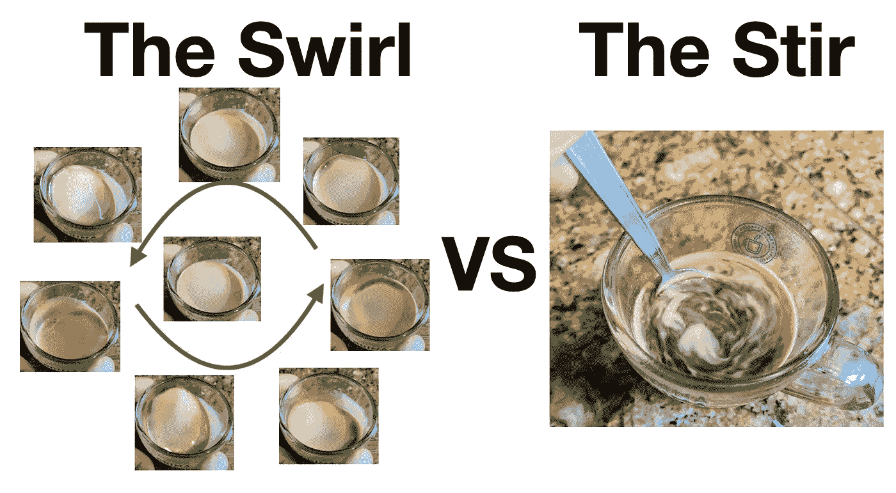
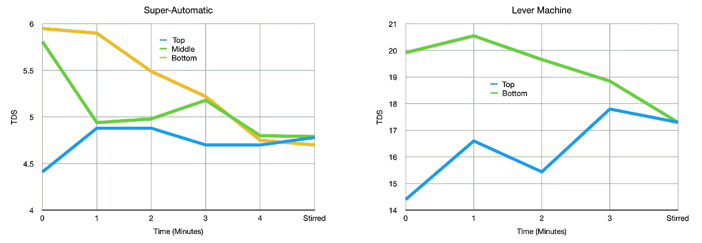
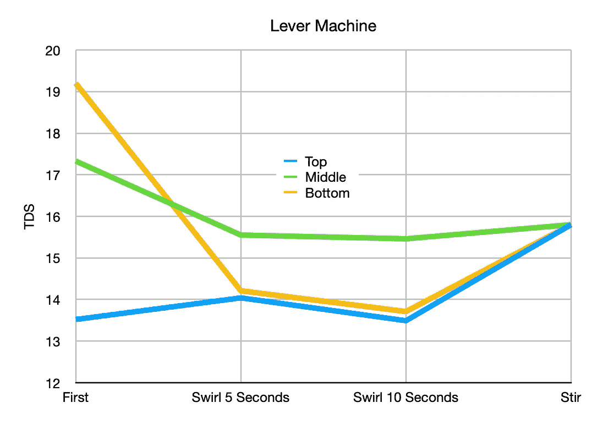
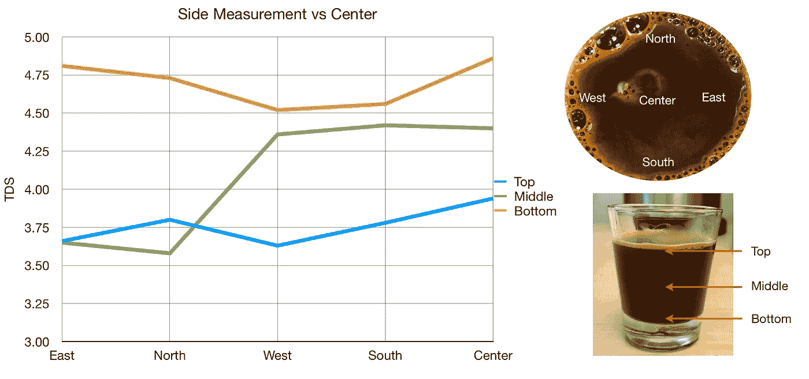
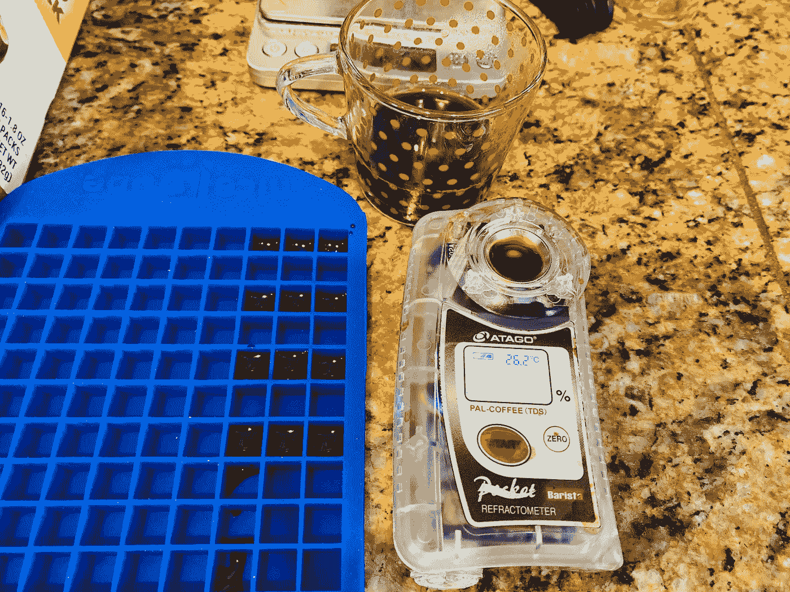
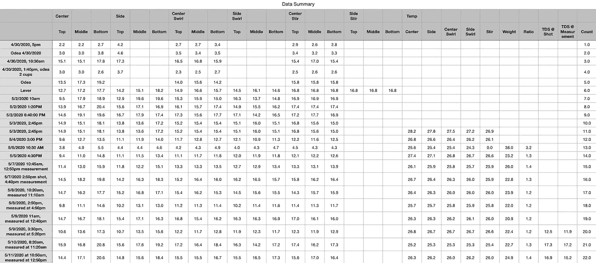
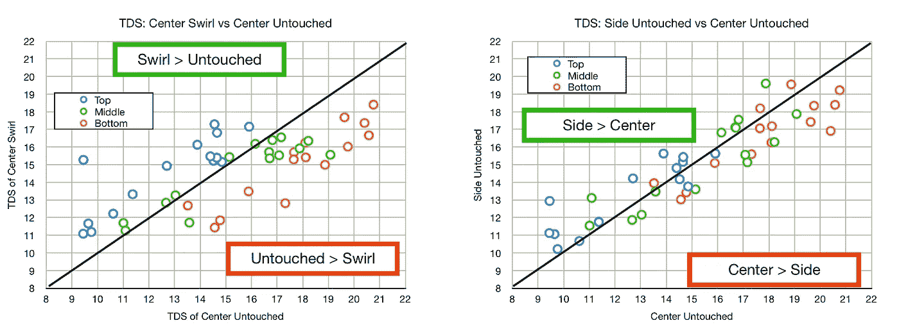
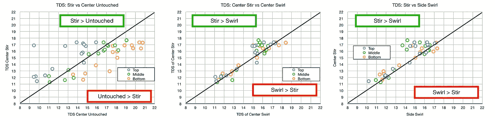
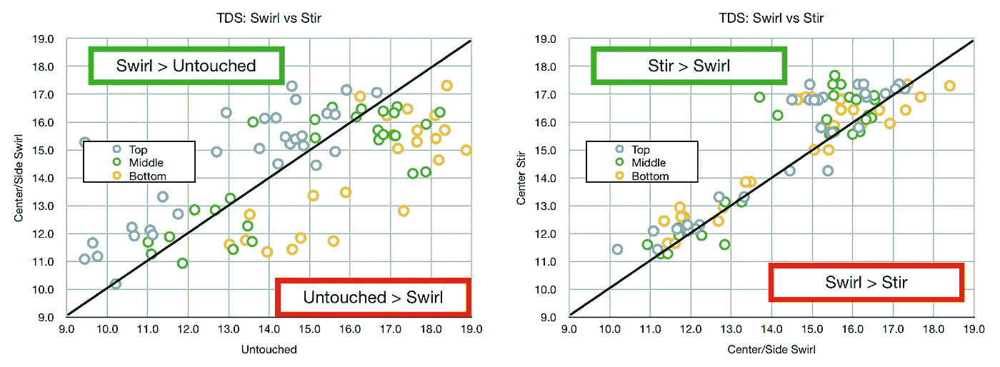
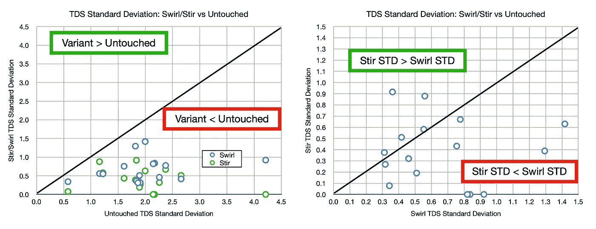

# 搅拌还是旋转:更好的浓缩咖啡体验

> 原文：<https://towardsdatascience.com/to-stir-or-to-swirl-better-espresso-experience-8cf623ea27ef?source=collection_archive---------40----------------------->

## 跨空间和时间分析咖啡浓度

我第一次听说搅拌和漩涡是在詹姆斯·霍夫曼的视频中，他认为你不应该搅拌你的浓缩咖啡。他给出了不少似乎有科学依据的理由，但没有容易理解的数字来说明什么都不做、旋转或搅拌浓缩咖啡之间的区别。[白马也有一篇令人信服的文章](https://whitehorsecoffee.com.au/blog/2017/04/why-you-should-stir-your-espresso/)关于为什么应该搅拌而不是漩涡。我开始激动，从品尝经验来看，我不得不同意他的观点，但我想知道我们是否可以在这个问题上获得更多数据。

还有另一个类似的对话，关于等多久才能喝一杯浓缩咖啡。 [Clive Coffee 很好地引入了这个话题，有些人认为应该马上来一杯浓缩咖啡。我通常会等它冷却一点，但不小心，我注意到当它冷却很多时，它有一种更糖浆的味道。然后我开始测量酒的温度，现在，我喝 47 度的酒。](https://clivecoffee.com/blogs/learn/is-your-espresso-dying-while-you-wait)

然而，在所有这些讨论中，除了单镜头比较，我还没有看到数据，所以我收集了一些[数据](/coffee-data-sheet-d95fd241e7f6)。我想用数据来回答这个问题，对于浓缩咖啡来说，最有用和最著名的指标是总溶解固体(TDS)。在过去的几个月里，我一直在使用这个指标来帮助理解我的过程中的各种变量，与其他测试不同，我可以对我拍摄的每个镜头进行漩涡/搅拌测试。

1.  搅拌和旋转哪个更好？
2.  多大的漩涡能让你更接近搅拌？
3.  关于 TDS，随着时间的推移，击球会发生什么变化？

# 单次分析

我测量了几张照片，从照片的顶部、中部和底部开始。除了试图在我的设置中处于中间位置，很难获得合适的深度，而拍摄的顶部和底部更容易一致地测量。

下面这两张照片表明，如果你留下一张照片，它会随着时间的推移在 TDS 方面自我均匀化。我认为随着镜头的稳定，TDS 在镜头的顶部会减少，在底部会增加。然而，弹丸根据扩散原理运行，这意味着较高的浓度扩散到较低的浓度区域。

## 漩涡次数

看漩涡的次数，似乎漩涡越长，越接近搅动，这是一个直观的结果。在你愿意搅拌多久和搅拌多久之间有一个权衡。该数据还显示，就 TDS 均匀性而言，涡旋仍然没有接近搅拌。

## 侧面对中间

那你测量射击的位置呢？我通常从照片的中心开始测量，但是我想我也应该从侧面收集测量数据。我惊讶地发现，两边和中间有很大的不同。我曾怀疑从上到下的 TDS 会与两侧不同，我很惊讶地发现不同侧的 TDS 差异有多大。这可能是由于测量误差或测量过程中干扰液体，我还没有分离出这些变量。

# 多次拍摄的大量数据收集

为了更好地理解，我收集了一些照片的数据。对于每个镜头，我收集每个镜头的样本如下:

1.  每个位置的顶部、中部和底部
2.  在中心和侧面收集
3.  未接触时收集，旋转(5 秒)，搅拌(仅中心)
4.  每次射击的温度

然后，我将这些样品放在盖子上，直到它们达到室温，在测量过程中，我一直将样品盖着，以确保没有水分蒸发。

根据这些数据，我使用散点图对 TDS 进行了一些比较，以了解 TDS 的不同之处。首先，让我们来看看**漩涡 vs 未触及**以及**侧 vs 中心**的比较:

漩涡肯定会改变击球的落点。它导致顶部具有较高的 TDS，底部具有较低的 TDS，而中间部分基本不受影响。结果应该是更均匀的拍摄。与侧面相比，中间有一些变化，但不太明显。侧面顶部似乎有更高的 TDS，中心底部似乎有更高的 TDS。

现在让我们比较一下**漩涡和搅拌**:

搅拌的均匀性增加，搅拌似乎比侧边的漩涡好一点。让我们更仔细地看看中心和侧面的数据。与未搅动相比，漩涡移动了周围的浓度，但与搅动相比，它并没有好到哪里去。

# 做决定

这些图表很有趣，但数据似乎令人困惑。有大量的数据，希望答案是显而易见的。如果我们使用这样的标准，即浓度越分散，搅拌或涡旋就越好。因此，我们可以查看顶部、中部和底部这些镜头的标准偏差(STD)。

从这些图表来看，旋转或搅拌肯定比不动镜头要好。这是假设你在一两分钟内喝完你的饮料，因为接近 4 或 5 分钟是东西自然扩散的时候。

当比较搅拌与涡旋时，数据倾向于搅拌比涡旋具有更低的 STD，表明搅拌在使注射均匀方面更好。

就均质浓缩咖啡而言，搅拌比涡旋要好，但由于扩散，这与让一杯咖啡静置几分钟是一样的。当然，也许这只是冰山一角。也许我们并不像自己认为的那样理解浓缩咖啡。

最后，我希望这能帮助你在每次搅拌咖啡时做出一个小而重要的决定。无论你做什么，一定要选一杯，因为这比不碰就喝要好。未接触的镜头是在液体开始于高浓度，结束于较低浓度的过程中制作的，因此有理由认为它不会是均匀的。

如果你愿意，可以在 Twitter 和 YouTube 上关注我，我会在那里发布不同机器上的浓缩咖啡视频和浓缩咖啡相关的东西。你也可以在 [LinkedIn](https://www.linkedin.com/in/robert-mckeon-aloe-01581595?source=post_page---------------------------) 上找到我。

# 我的进一步阅读:

[香辣浓缩咖啡:热磨，冷捣以获得更好的咖啡](/spicy-espresso-grind-hot-tamp-cold-36bb547211ef)

[断续浓缩咖啡:提升浓缩咖啡](https://medium.com/overthinking-life/staccato-espresso-leveling-up-espresso-70b68144f94)

[用纸质过滤器改进浓缩咖啡](/the-impact-of-paper-filters-on-espresso-cfaf6e047456)

[浓缩咖啡中咖啡的溶解度:初步研究](/coffee-solubility-in-espresso-an-initial-study-88f78a432e2c)

[断奏捣固:不用筛子改进浓缩咖啡](/staccato-tamping-improving-espresso-without-a-sifter-b22de5db28f6)

[浓缩咖啡模拟:计算机模型的第一步](https://medium.com/@rmckeon/espresso-simulation-first-steps-in-computer-models-56e06fc9a13c)

[更好的浓缩咖啡压力脉动](/pressure-pulsing-for-better-espresso-62f09362211d)

[咖啡数据表](/coffee-data-sheet-d95fd241e7f6)

[工匠咖啡价格过高](https://medium.com/overthinking-life/artisan-coffee-is-overpriced-81410a429aaa)

被盗咖啡机的故事

[浓缩咖啡过滤器分析](/espresso-filters-an-analysis-7672899ce4c0)

[便携式浓缩咖啡:指南](https://medium.com/overthinking-life/portable-espresso-a-guide-5fb32185621)

克鲁夫筛:一项分析