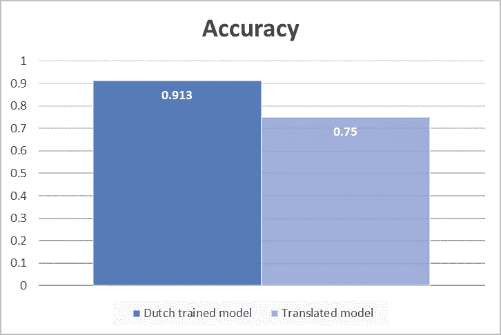
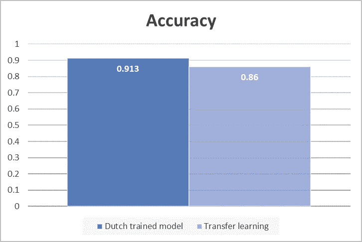
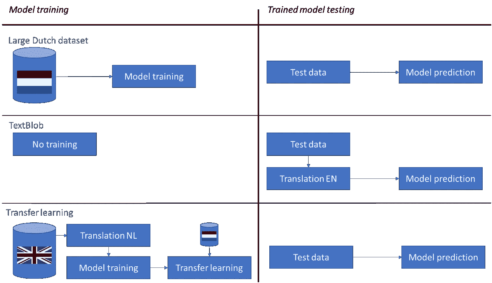
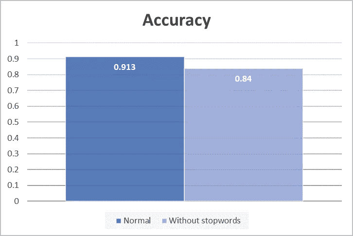
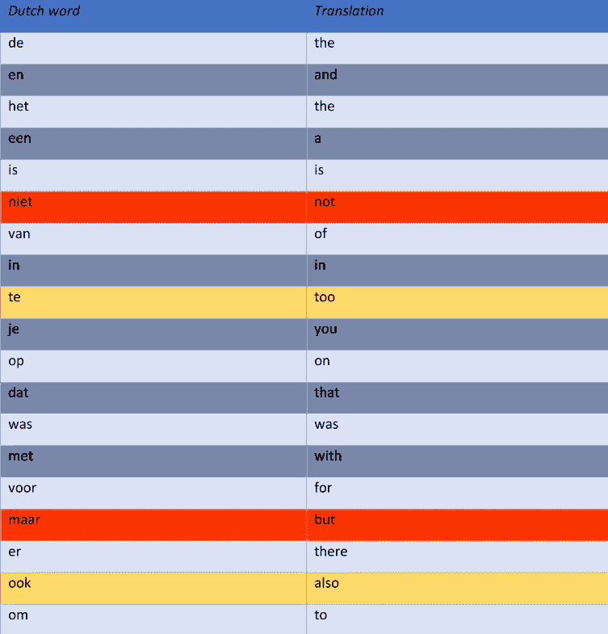
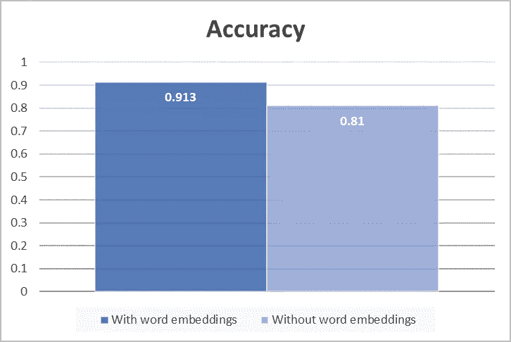
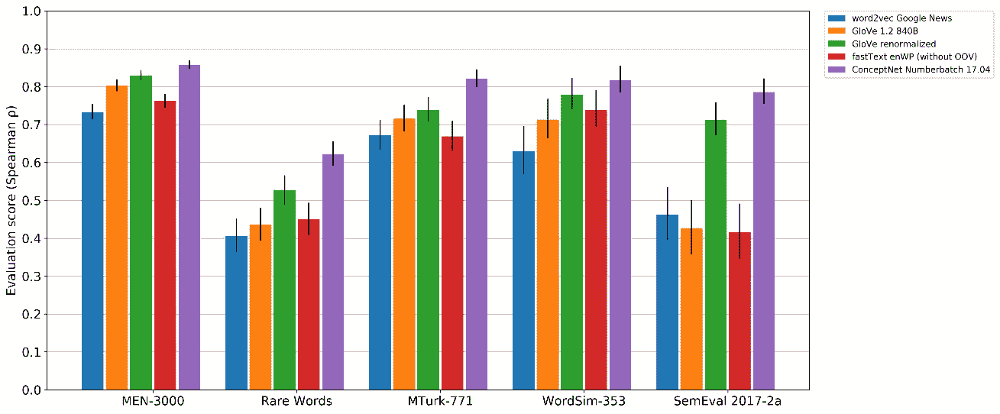
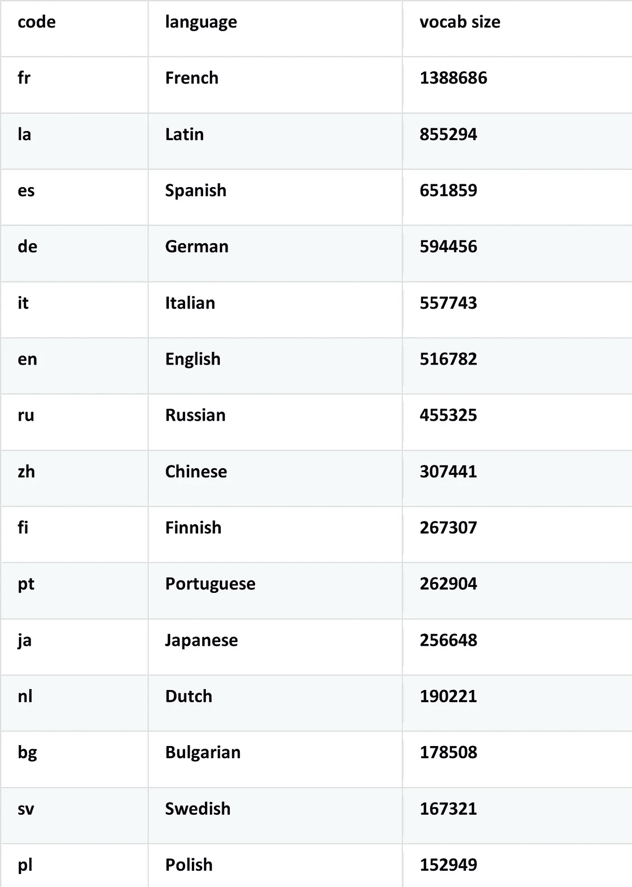
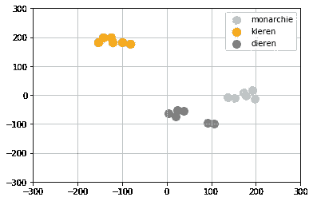

# 翻译还是不翻译，非英语情感分析的最佳实践

> 原文：<https://towardsdatascience.com/to-translate-or-not-to-translate-best-practices-in-non-english-sentiment-analysis-144a53613913?source=collection_archive---------22----------------------->

## 在本文中，在具有正/负标签的多样化的 50，000 个荷兰评论数据集上建立和训练递归神经网络。将性能与测试集被翻译成英语并通过预先训练的英语情感模型分类的情况进行比较。接下来，在去除停用词和不嵌入使用词的情况下测试该模型。ConceptNet Numberbatch 受到更密切的关注，因为这种多语言单词嵌入优于其他单词嵌入。

[图片来自维基共享资源](https://commons.wikimedia.org/wiki/File:Macbeth_consulting_the_Vision_of_the_Armed_Head.jpg)

**总结**
翻译对于情感分析来说不是一个好的选择，它会导致 16%的准确率下降。对于情感分析，停用词和词嵌入是有用的。事实证明，对于荷兰语自然语言处理，Conceptnet Numberbatch 单词嵌入优于 Word2vec/Glove。

**翻译与递归神经网络** 在本文中，递归神经网络在独立测试集上的准确性与 Textblob 在该测试集的英语 google 翻译上的性能进行了比较。荷兰训练模型是在一个数据集上训练的，该数据集包括近 50，000 条对酒店、购物产品、食品和服务的各种评论，标签为正面或负面。训练后，该模型用于预测独立测试集的标签。翻译后的模型是从 Textblob 预训练的。Textblob 是 Python 中广泛使用的预训练文本分析库。翻译后的模型首先翻译测试集，然后使用预训练的情感分析模型。独立测试集的结果如下:

如您所见，性能降低了 16%。根据斯坦福大学的研究，Textblob 在母语英语测试集上的准确率约为 87.5%。因此，如果翻译是完美的，Textblob 模型的性能已经降低了 4%左右。另外 12%是因为翻译不完美。因此，在这种情况下，建议收集大量的母语数据集。

但有时在小语种中，获取大数据集可能会很困难。除了英语和中文，没有很多大的标准数据集可以使用，网络内容也不太容易获得。如果你能设法得到几百个数据点(但不是 10.000 以上)，那么迁移学习可能是一种选择。为了在这种情况下应用迁移学习，一个带有正负标签的(大)英语数据集被翻译成荷兰语，然后被训练。然后，该模型的权重用于在荷兰数据集的一小部分(1000 条评论)上进一步训练。这给出了比翻译的 Textblob 模型更好的结果:

培训和测试中的三种方法概述:

**无停用词** 如果停用词被过滤，数据集中最常见的词是好、好吃、酒店、预订、快捷和送货。这些词有些是中性的，有些则带有感情色彩。但是，结果表明准确率下降了 7%以上:

如果检查未过滤数据集中最常见的单词，可以看到前 20 个单词全部是停用词(这是有道理的)。性能下降变得明显。“不是”和“但是”这两个词颠倒了句子的意思。单词“too”和“also”也会改变句子的意思。如果模型不能考虑到这些词，它就不能预测一个句子/评论的反转情绪。

所以在这种情况下，最好将停用词保留在数据集中。

**没有单词嵌入** 为了新鲜起见，单词嵌入是用数字(或张量)来表示单词。例如，“遛狗的人”可以表示为这样的二维单词嵌入:[1.3，-0.2] [0.4，1.1] [-0.3，0.1] [1.3，-0.2] [1.2，0.7]。因此，当像上面那样使用二维嵌入时，每个(唯一的)单词都被转换成两个数字的组合。单词嵌入工作得如此之好是因为单词的语义被捕获了。意义相同的词具有相似的张量值，与其他词群的差异也相似。如下图所示，单词嵌入的性能要高得多。

**concept net number batch** concept net 是一个多语言的单词嵌入集。ConceptNet 优于其他众所周知的单词嵌入，如 Word2Vec 和 GloVe，如下图所示:

[*图来自 ConceptNet 项目*](https://github.com/commonsense/conceptnet-numberbatch)

word embeddings 文件可以在下载部分下载[。该文件的结构如下:/c/*language _ code*/*word*0.4…0.1。例如，dog 的结构如下:/c/en/dog 0.2 … 0.9。使用 Numberbatch 时，请确保只上传所需的语言，以减少冗余。Numberbatch 的词汇量令人印象深刻，请看下面的 15 种顶级语言:](https://github.com/commonsense/conceptnet-numberbatch)

那么嵌入如何寻找荷兰人呢？这些单词是用 300 个维度来表示的。为了将这个数字压缩到 2，可以使用 T-SNE 算法。共测试了三大类 18 个单词，分别是服装类的夹克、围巾、裤子、鞋子、袜子、毛衣的荷兰语翻译(下图黄色)，动物类的虎、鹰、蜘蛛、鹰、狮子、鬣狗的荷兰语翻译(下图灰色)，君主制类的皇冠、国王、女王、王子、宫殿、加冕(下图浅蓝色)。如您所见，单词根据相似性进行聚类，这意味着单词嵌入有助于需要处理荷兰语的模型:

最后，下面是一些关于如何实现 Numberbatch 的代码。下一节中的代码打开了 Numberbatch 单词嵌入(确保文件只包含您的语言部分，所以对于荷兰语是 c/nl/)。它创建了一个包含所有荷兰语单词及其 Numberbatch 单词嵌入表示的 300 维字典。例如，单词 dog 将保存为{ 'dog': [0.2，0.1，0.5 … 0.3]}:

这部分将数据集标记化。代码为每个唯一的单词分配一个数字，所有唯一的单词都被计算在内。接下来，将构建包含在训练集中出现的单词的字典，并且脚本向其添加 300 维嵌入:

最后，让 Keras 网络的第一层成为嵌入层。这确保了输入数据句子被转换为 Numberbatch 张量:

**结论** 如果你能够收集一个母语的大数据集，那么在这个数据集上训练的模型可能会给出最好的分类精度。如果你不能得到一个大的数据集，但只能得到几百个数据点，那么迁移学习仍然可以给出很好的结果。翻译数据，然后使用英语训练的模型是不推荐的，除了坏的准确性，这也将恶化您的应用程序的性能，因为数据首先需要被翻译。关于停用词和词嵌入，在这种情况下它们是有用的。Conceptnet Numberbatch 是一个非常好的单词嵌入工具，用于非英语的自然语言处理任务。

**Next up 2021** 我要写一篇关于神经风格转移的文章。要查看文章的最终应用，请查看以下页面(荷兰语):

[Schilderij laten maken](https://gan-studios.nl/ontwerpen)

到时候见！