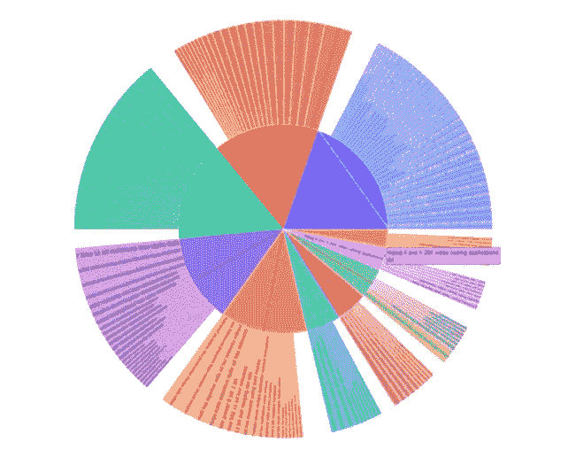
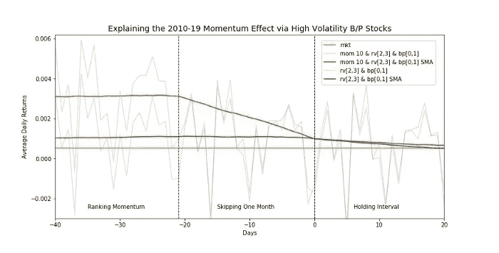
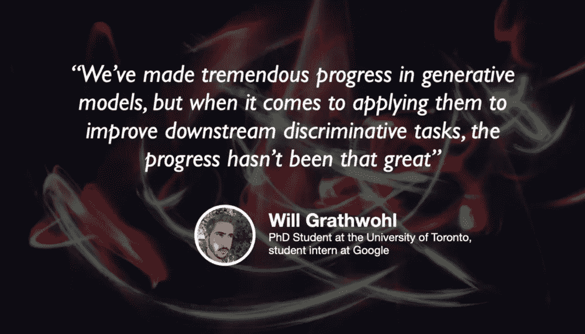

# 令牌输出及其他

> 原文：<https://towardsdatascience.com/token-outputs-and-beyond-fc63bcdfd752?source=collection_archive---------77----------------------->

## [主题建模:超越令牌输出](/️-topic-modelling-going-beyond-token-outputs-5b48df212e06)

由[劳里·威廉姆斯](https://medium.com/u/e98db206e1b3?source=post_page-----fc63bcdfd752--------------------------------) — 9 分钟阅读

我最近面临一项任务，其最终目标是将大量非结构化的句子和短文段自动聚合到相关主题的组中。
在这个任务中，我意识到在主题建模方法方面还没有太多的报道，特别是当试图给主题起一个有意义的名字的时候。

斯特凡·格雷奇在 Unsplash 上拍摄的照片

## [机器学习对儿童电视剧角色的痴迷](/machine-learnings-obsession-with-kids-tv-show-characters-728edfb43b3c)

由凯瑟琳·杨 — 7 分钟读完

埃尔默、伯特和玛吉(辛普森饰)不仅仅是你在成长过程中最喜欢的电视角色——他们也是机器学习和自然语言处理模型

## [用滚动跨期分析揭示动量效应](/uncovering-momentum-effect-with-rolling-intertemporal-analysis-36eedc1d8a96)

由 Yulia Malitskaia[—9 分钟阅读](https://medium.com/u/1cfccd7daa5c?source=post_page-----fc63bcdfd752--------------------------------)

文章展示了跨期方法，扩展和概括了滚动时间序列技术的范围，用于导出过渡过程和经验策略的模型。该方法是在解释动量溢价的背景下说明的，动量溢价是一个长期的持续挑战。

照片由 Valery Rabchenyuk 在 Unsplash 上拍摄

## [我如何使用 Python 代码提高我的韩语水平](/how-i-used-python-code-to-improve-my-korean-2f3ae09a9773)

由尼娅姆·金斯利 — 4 分钟读完

2020 年初，我决定要自学韩语。我对这种文化很感兴趣，并被学习一门非欧洲语言的挑战所吸引。我不想成为这种感觉像家务杂事的常见陷阱的受害者，所以我开始使用各种资源，包括 Duolingo、LingoDeer、Talktomeinkorean.com、闪存卡、韩剧，显然还有几千小时的 BTS 专辑。

背景图片由[艾哈迈德·迪里尼](https://unsplash.com/@ahmadirini)

## [基于能量的模型和生成算法的未来](/energy-based-models-and-the-future-of-generative-algorithms-3950e1103323)

与[杰瑞米·哈里斯](https://medium.com/u/59564831d1eb?source=post_page-----fc63bcdfd752--------------------------------)和威尔·格拉斯沃尔——50 分钟🎧

研究生院中的机器学习和工业中的机器学习是非常不同的东西。在行业中，部署和数据收集变得很关键，唯一重要的是你是否能以足够快的速度交付真正客户想要的产品，以满足内部期限。