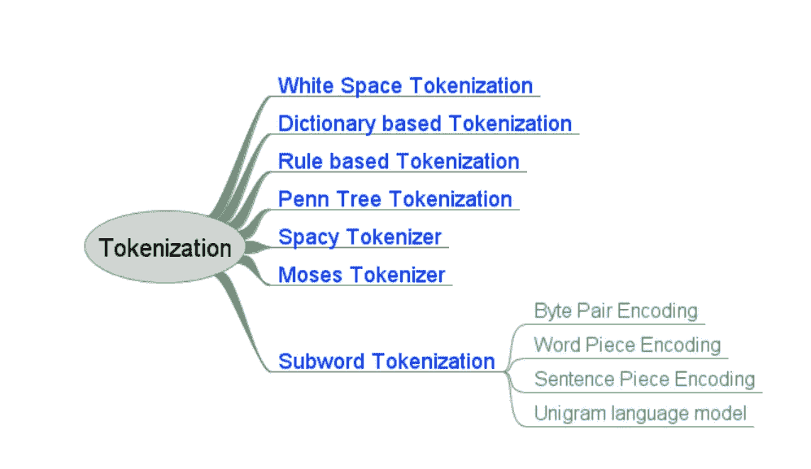
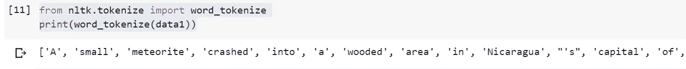
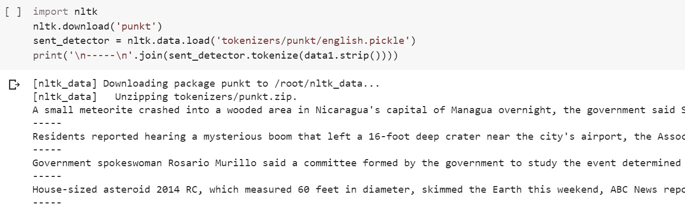
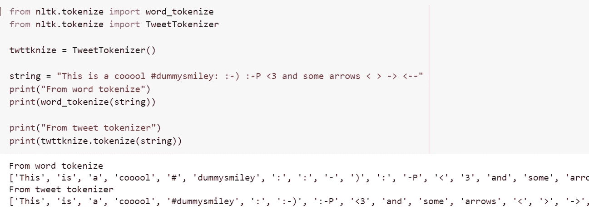
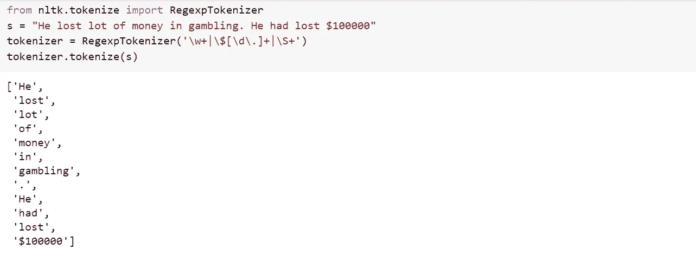
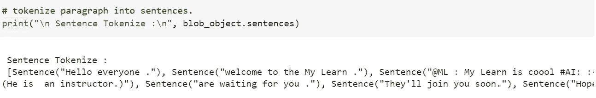
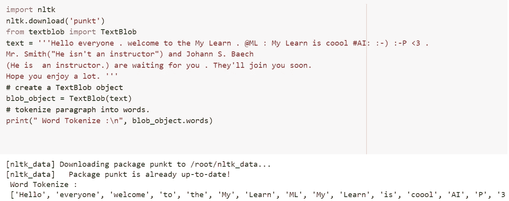
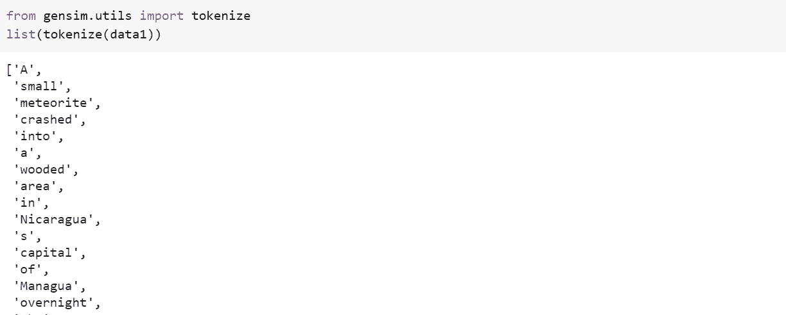
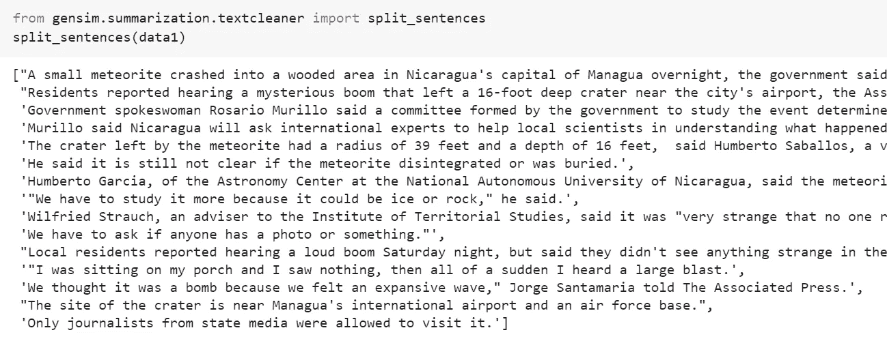
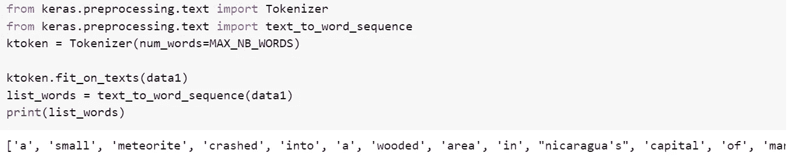

# 自然语言处理的标记化

> 原文：<https://towardsdatascience.com/tokenization-for-natural-language-processing-a179a891bad4?source=collection_archive---------3----------------------->

自然语言处理是编程中由软件处理自然语言的领域之一。这有许多应用，如情感分析、语言翻译、假新闻检测、语法错误检测等。

自然语言处理中的输入是文本。本文的数据收集来自许多来源。在数据可以用于分析之前，这需要大量的清理和处理。

以下是 NLP 中处理数据的一些方法:

*   标记化
*   停止单词删除
*   堵塞物
*   正常化
*   词汇化
*   词性标注

**标记化**

标记化是将原始文本分成小块。记号化将原始文本分解成单词和句子，称为记号。这些标记有助于理解上下文或开发 NLP 的模型。标记化有助于通过分析单词的顺序来解释文本的意思。

例如，文本“It is raining”可以标记为“It”、“is”、“raining”

由 [SOULSANA](https://unsplash.com/@soulsana?utm_source=unsplash&utm_medium=referral&utm_content=creditCopyText) 在 [Unsplash](https://unsplash.com/s/photos/scrabble?utm_source=unsplash&utm_medium=referral&utm_content=creditCopyText) 上拍摄的照片

有不同的方法和库可用于执行标记化。NLTK、Gensim、Keras 是可以用来完成这项任务的一些库。

可以对单独的单词或句子进行标记化。如果使用某种分离技术将文本分成单词，这被称为单词标记化，对句子进行的相同分离被称为句子标记化。

停用词是文本中对句子没有添加任何意义的那些词，它们的移除不会影响用于定义目的的文本处理。它们被从词汇表中删除，以减少噪声并降低特征集的维数。

基于建模的语言和目的，有各种可用的标记化技术。下面是 NLP 中使用的一些标记化技术。

**空白标记化**

这是最简单的记号化技术。给定一个句子或段落，每当遇到空白时，它通过分割输入来标记成单词。这是最快的标记化技术，但对于用空格将句子分割成有意义的单词的语言来说，这种技术也是有效的。比如:英语。

**基于词典的标记化**

在这种方法中，基于字典中已经存在的标记来找到标记。如果找不到令牌，则使用特殊规则对其进行令牌化。与空白标记器相比，这是一种先进的技术。

**基于规则的标记化**

在这种技术中，为特定的问题创建了一组规则。标记化是基于规则完成的。例如，为特定语言创建基于语法的规则。

**正则表达式标记器**

这种技术使用正则表达式来控制文本到标记的标记化。正则表达式可能从简单到复杂，有时很难理解。当上述方法不能达到要求的目的时，这种技术是首选。这是一个基于规则的记号赋予器。

**宾夕法尼亚树库标记化**

树库是一个语料库，它给出语言的语义和句法注释。Penn Treebank 是已出版的最大的树库之一。这种标记化技术将标点符号、连字符号(与其他单词一起出现的单词，如 I'm，don't)和连字符单词分开。

**空间标记器**

这是一种更快、更容易定制的现代标记化技术。它提供了指定不需要分段或需要使用特殊规则分段的特殊令牌的灵活性。假设您希望将$作为一个单独的标记，它优先于其他标记化操作。

**摩西记号赋予者**

这是一个高级的记号赋予器，在 Spacy 引入之前就有了。它基本上是一个复杂的规范化和分段逻辑的集合，对于像英语这样的结构化语言非常有效。

**子词标记化**

这种标记化对于子词有意义特定应用非常有用。在这种技术中，最频繁使用的单词被赋予唯一的 id，而不太频繁使用的单词被分成子单词，它们最好独立地表示意思。例如，如果单词“很少”在文本中频繁出现，它将被分配一个唯一的 id，其中越来越少的罕见单词和在文本中不太频繁的单词将被分成子单词，如“很少”、“er”和“est”。这有助于语言模型不学习越来越少的两个独立的单词。这允许在训练期间识别数据集中的未知单词。下面给出了不同类型的子词标记化，并且将简要讨论字节对编码和单词块。

*   字节对编码(BPE)
*   文字片
*   单语法语言模型
*   句子片断

**字节对编码(BPE)**

该技术基于信息论和压缩中的概念。BPE 使用霍夫曼编码进行符号化，这意味着它使用更多的嵌入或符号来表示不太频繁的单词，使用较少的符号或嵌入来表示更频繁使用的单词。

BPE 分词是自底向上的分词技术。BPE 算法涉及的步骤如下。

1.  首先将输入单词分割成单个 unicode 字符，每个字符对应最终词汇表中的一个符号。
2.  从当前词汇表中找出最频繁出现的符号对。
3.  把这个加到词汇量里，词汇量就会增加一。
4.  重复步骤 ii 和 iii，直到构建了定义数量的符号，或者没有新的符号组合以所需的频率存在。

**文字块**

除了将新的令牌添加到词汇表的方式之外，WordPiece 类似于 BPE 技术。BPE 考虑将出现频率最高的符号对合并到词汇表中。而单词块也考虑单个符号的频率，并基于下面的计数将其合并到词汇表中。

计数(x，y) =频率(x，y) /频率(x) *频率(y)

具有最大计数的符号对将被视为合并到词汇中。因此，与 BPE 相比，它允许将罕见的标记纳入词汇。

**用 NLTK 进行标记化**

NLTK(自然语言工具包)是微软开发的一个 python 库，用于辅助 NLP。

Word_tokenize 和 sent_tokenize 是 NLTK 中非常简单的标记化器

它基本上从字符串中返回单个作品。

Sent_tokenize 将字符串拆分成多个句子。sent_tokenizer 是从 PunktSentenceTokenizer 类派生的。sent_tokenize 使用来自 token izers/punkt/English . pickle 的预训练模型。有针对不同语言的预训练模型可供选择。PunktSentenceTokenizer 可以根据我们自己的数据进行训练，以制作一个定制的句子标记器。

custom _ sent _ tokenizer = punksentencetokenizer(train _ data)

还有一些其他特殊的标记器，如多词表达式标记器(MWETokenizer)，Tweet 标记器。

MWETokenizer 通过使用 MWEs 的词典，获取已经被分成记号的字符串，并对其进行重组，将多词表达式合并成单个记号。

想想“尽管面临重重障碍，他还是完成了任务”这句话

这被标记为['他'，'完成'，'任务'，'在'，'怨恨'，'的'，'所有'，'障碍'，'面临']

如果我们在 MWETokenizer 的词典中添加“尽管”，那么当上述标记传递给 MWETokenizer 时，它将被标记为['他'，'完成'，'任务'，'尽管'，'所有'，'障碍'，'面临']

TweetTokenizer 解决了 tweets 的具体问题，比如处理表情符号。

RegexpTokenizer

这个分词器根据正则表达式将句子拆分成单词。例如，在下面的例子中，记号赋予器从货币表达式和任何其他非空白序列中形成记号。

**用文本块进行标记**

Textblob 用于处理文本数据，是 Python 中的一个库。与其他包类似，它提供了用于情感分析、词性标注、分类、翻译等的 API。下面是要标记成句子和单词的代码片段，你可以注意到在输出中表情符号被从标点符号中删除了。

**用 Gensim 进行符号化**

Gensim 是主要用于主题建模的库之一。Gensim 为标记化提供了实用函数。

Gensim 也有一个句子标记器。来自文本清理器的 Split_sentences 对这个句子进行标记化。

**用 Keras 进行标记化**

标记化也可以用 Keras 库来完成。我们可以使用 Keras 中的 text_to_word_sequence。预处理. text 来标记文本。Keras 使用 fit_on_words 开发文本中单词的语料库，并使用该语料库创建具有 text_to_word 序列的单词序列。

**标记化的挑战**

在标记化方面有很多挑战，但是我们讨论了一些单词切分的困难。

标记化的最大挑战之一是获取单词的边界。在英语中，单词的边界通常由空格和标点符号来定义句子的边界，但这在所有语言中并不相同。在诸如中文、朝鲜语、日语的语言中，符号代表单词，并且很难得到单词的边界。

甚至在英语中也有很多符号，比如，$，€，后面跟着数字来代表钱，还有很多科学符号，比如，α等等。这给标记化带来了挑战。

英语中也有很多缩写形式，如 I'm(我是)，dot(没有)等。这些问题需要解决，否则会在 NLP 的下一步中引起很多问题。

在自然语言处理领域仍有许多研究在进行，我们需要为手头的自然语言处理任务选择合适的语料库。

**参考文献:**

Gensim 文档:[https://pypi.org/project/gensim/](https://pypi.org/project/gensim/)

NLTK 文档:[https://www.nltk.org/](https://www.nltk.org/)

Keras 文件:[https://keras.io/](https://keras.io/)

**作者**

斯里尼瓦斯·查克拉瓦蒂——srinivas.yeeda@gmail.com

钱德拉塞卡·纳加拉吉——chandru4ni@gmail.com