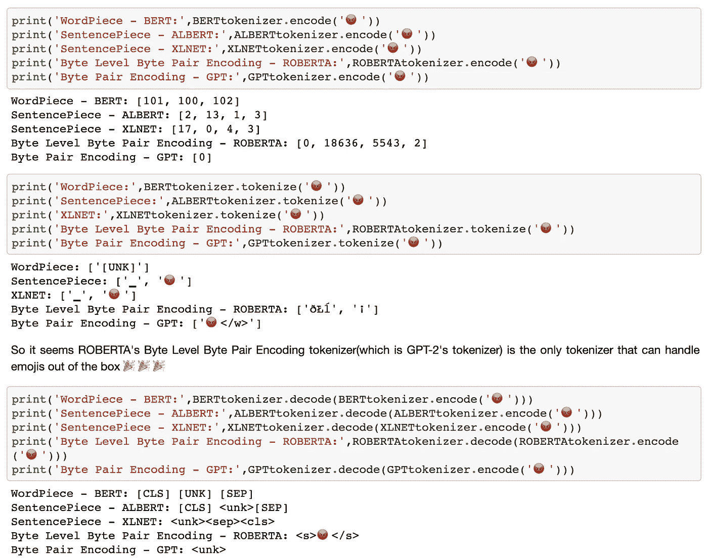
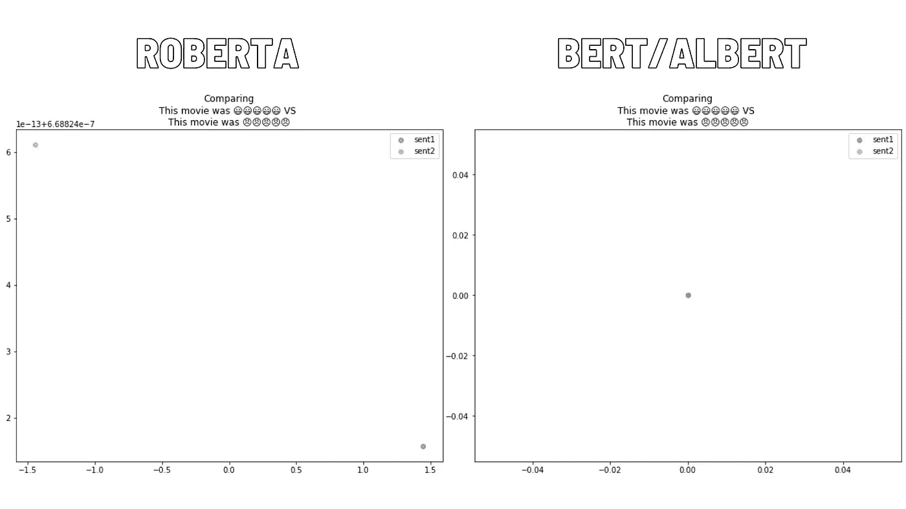
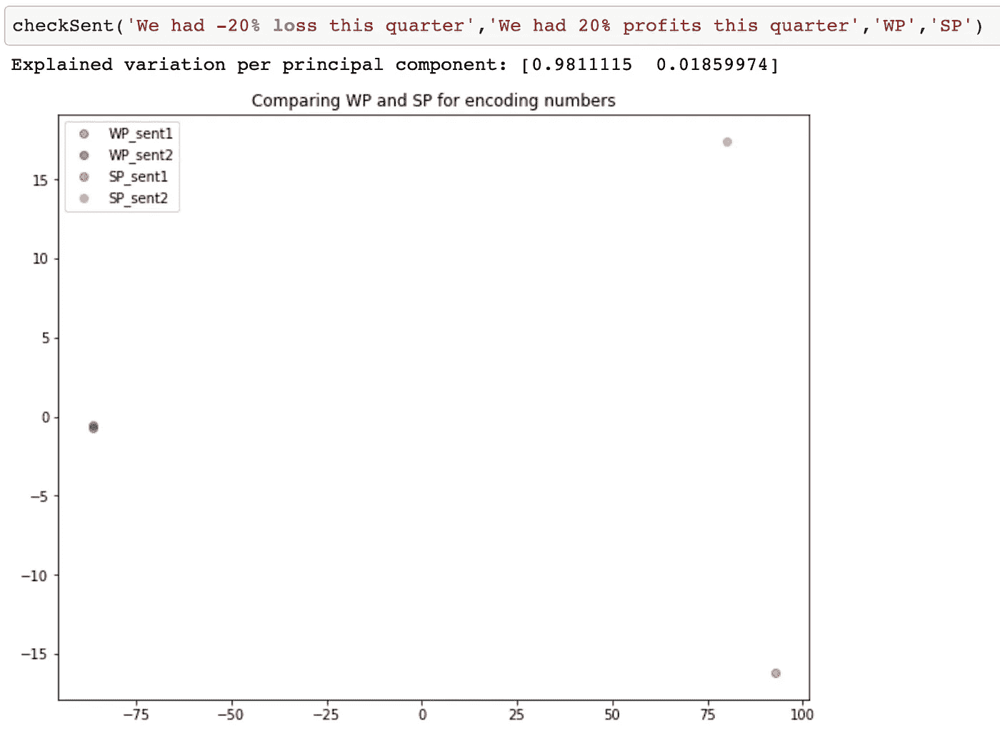
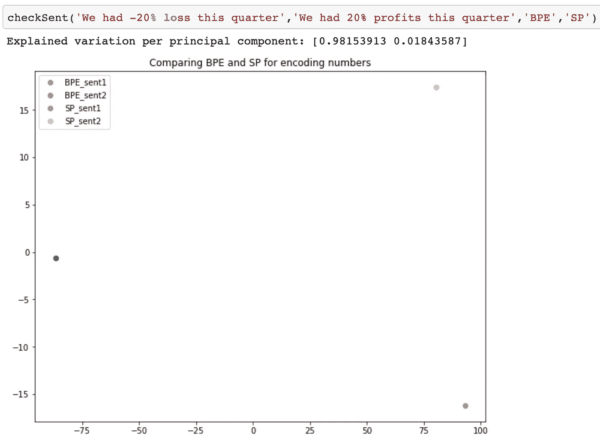

# Tokenizers: NLP 的构建模块

> 原文：<https://towardsdatascience.com/tokenizers-nlps-building-block-9ab17d3e6929?source=collection_archive---------25----------------------->

## 探索经常被忽视的变压器构件

学分:Unsplash

事实是，令牌化者并不那么有趣。当我第一次阅读 BERT 论文时，我跳过了单词片段标记部分，因为它不像论文的其他部分那样令人兴奋。但是标记化已经从单词发展到子单词标记化，不同的转换器使用不同的标记化器，这些标记化器很难理解。

已经有一些讨论和解释记号赋予者的好文章——我最喜欢的是 [FloydHub](https://medium.com/u/fd2a02f2ad47?source=post_page-----9ab17d3e6929--------------------------------) 的[详细博客文章](https://blog.floydhub.com/tokenization-nlp/)和[拥抱脸](https://medium.com/u/b1574f0c6c5e?source=post_page-----9ab17d3e6929--------------------------------)的[简短教程](https://huggingface.co/transformers/master/tokenizer_summary.html)。

相反，我想把重点放在应用上——特别是不同模型的标记化器如何开箱即用，以及这如何影响我们的模型的理解能力。如果你从一个预先训练好的 Transformer 模型开始你的 NLP 任务(这通常比从头开始训练更有意义)，你会被这个模型的预先训练好的记号化器和它的词汇所困扰——知道它的行为和怪癖可以让你更容易地选择最好的模型和调试问题。

但首先，我们需要一些基础知识，这样这篇文章才能独立阅读。如果您已经了解了标记化的基础知识，可以跳过这一部分。

# 基本原则

**子词标记化:**在具有无限内存和计算能力的理想世界中，我们将保存我们的词汇表中的每个词，并在我们的词汇表中为每个词保留一个位置。遗憾的是，事实并非如此，所以我们需要有一个固定的词汇表，通常在 30-50k 左右。限制词汇大小的需要意味着几乎肯定会有不够“重要”而不被包括在内的单词，即“词汇表之外”或 OOV。这导致了可怕的< UNK >记号，即未知记号——这被归入每个未知单词，因此，模型将很难理解其语义。但是通过子词标记化，我们能够用更频繁的子词来标记不常用的词，从而两全其美，拥有更小的词汇量，同时仍然能够标记罕见的或拼写错误的词。

**词汇构建:**前面我提到过，只有重要的单词才会被收录到词汇中。那么“重要性”是如何确定的呢？我们从基本字符开始，然后通过将字符合并到子字中来构建词汇表，直到达到最大词汇量。主要的记号化方法在首先考虑什么子词(即，要合并的子词的顺序)以及合并决定方面有所不同。下面的图片来自 [Floydhub 的博客](https://blog.floydhub.com/tokenization-nlp/)，展示了 3 种主要子词分词方法的区别。

来源:https://blog.floydhub.com/tokenization-nlp/

**嵌入:**输入记号由一个嵌入层表示，它是每个记号的多维投影。通过将嵌入传递通过变换器块，获得了对输入的上下文理解，即，标记的嵌入依赖于序列中的其他单词。层次越多，表示就越具体。

# 符号化者如何看待表情符号

为了分析任何现代文本，特别是用户生成的内容，如推文或消息，我们的模型应该理解表情符号的意思。理想情况下，该模型应该能够直接读取表情符号，尽可能少地进行预处理，以保留句子的原始上下文。

凭借我们对符号化器如何工作的初步理解，我们知道模型阅读表情符号的能力简单地取决于字符是否被添加到模型的词汇中。

装货🤗的预训练模型包含预训练模型及其标记器的全部范围，我们只看到罗伯塔的词汇包含表情符号——其字节级 BPE 的秘密酱允许它标记所有字符，并避免可怕的<unk>标记。</unk>

来源:[https://gist . github . com/neoyipeng 2018/CB 6b 5 BC 10624 AE 6 fcb 9 b 0 e 3c 76 CB 01 f 0](https://gist.github.com/neoyipeng2018/cb6b5bc10624ae6fcb9b0e3c76cb01f0)

这样做的后果是巨大的——即使你给预训练的 BERT 输入更多的训练数据，它也永远不会知道😀和🤬，因为表情符号不在词汇表里。

为了看到这一点，我们来看看不同的模型如何看待包含不同表情符号的极性句子。只有 Roberta 的 BPEtokenizer 能够区分只有表情符号不同的两个句子，如两个不同的点所示，而 BERT 或 ALBERT 具有相同的极性句子嵌入投影。

这个例子是人为设计的，因为通常有其他不同的单词帮助模型理解句子，但关键是，如果我们希望我们的模型真正辨别我们的表情符号加载推文的含义，我们需要预处理并用相应的含义替换表情符号，或者如果我们不使用 GPT-2 的罗伯塔，从头重新训练标记化器/模型。

# 记号赋予者如何看待数字

当将 NLP 应用于金融时，一个关键的考虑因素是我们的模型如何看待数字——这也受到表征器/模型本身的影响。

如果我们可视化一些样本句子的隐藏状态，我们会看到，与 XLNet 的句子相比，BERT 的单词块和 ROBERTA 的 BPE 对数字的敏感度要低得多——这表明带有句子标记器的模型更适合有大量数字的文档。

来源:[https://gist . github . com/neoyipeng 2018/f 5 cbbbf 4d 39404464122 CD 41 ef 2e 4 e 6d](https://gist.github.com/neoyipeng2018/f5cbbbf4d39404464122cd41ef2e4e6d)

来源:[https://gist . github . com/neoyipeng 2018/f 5 cbbbf 4d 39404464122 CD 41 ef 2e 4 e 6d](https://gist.github.com/neoyipeng2018/f5cbbbf4d39404464122cd41ef2e4e6d)

对于我做的更多实验，你可以在这里查看我的要点。

# 结论

最好的 transformer tokenizer 是什么？至于所有乱七八糟的事情，看情况。这取决于您的数据，当您进行 EDA 并可视化一些样本文本时，检查模型的最大错误并检查是否有任何重要的单词<unk>将帮助您了解预先训练的模型理解什么，并让您做出更好的选择。</unk>

# 来源

[1] [语境嵌入有多语境化？](https://arxiv.org/abs/1909.00512)作者 [Kawin Ethayarajh](https://arxiv.org/search/cs?searchtype=author&query=Ethayarajh%2C+K)