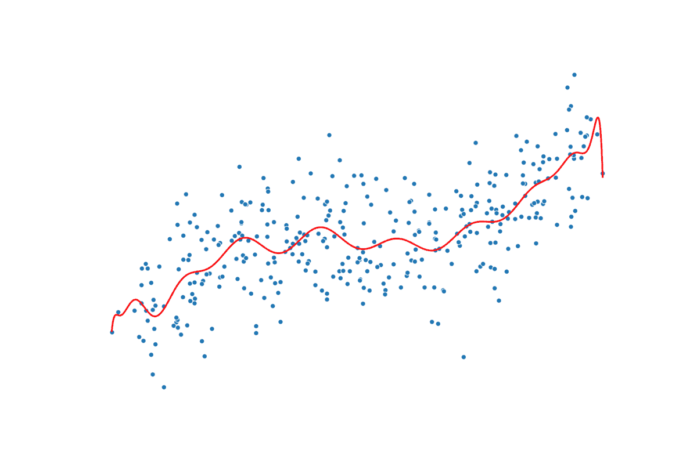
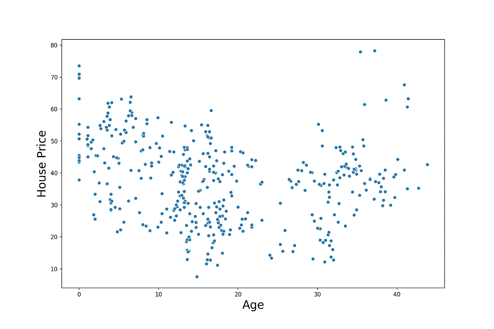
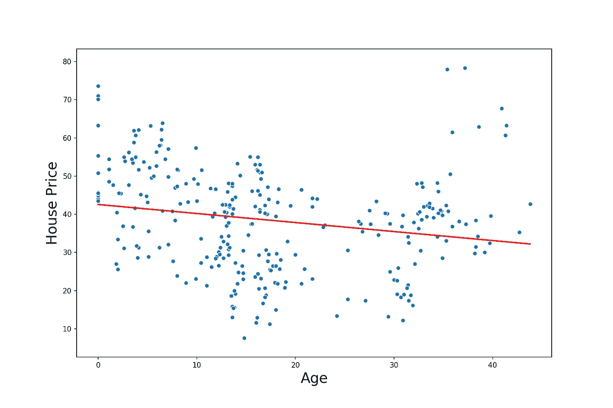
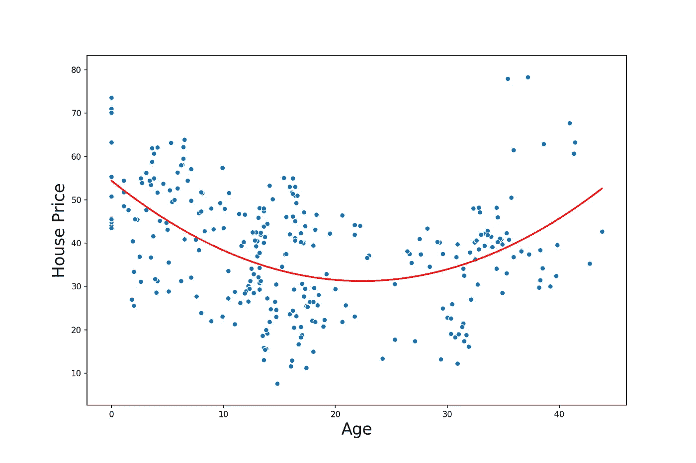
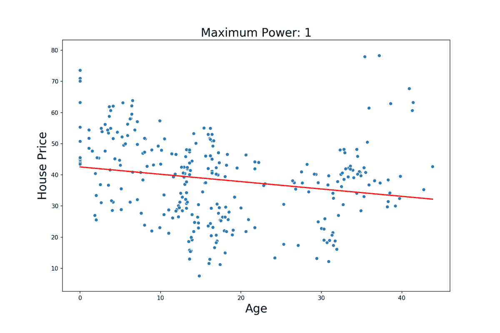
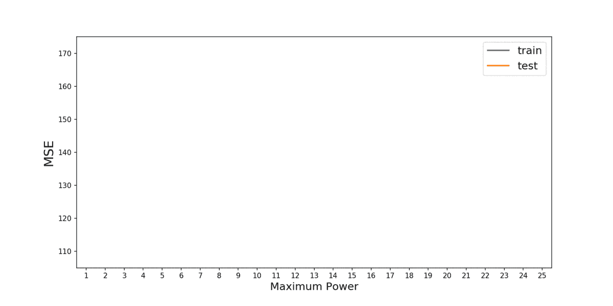
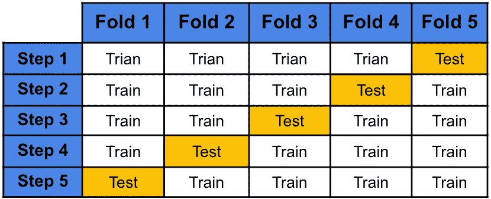
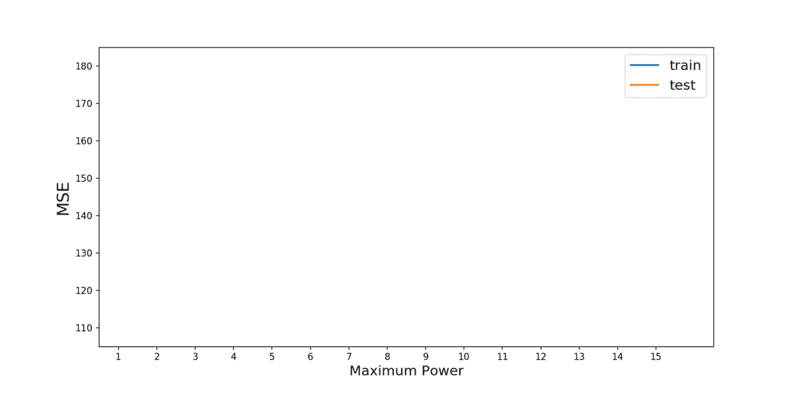

# 太多的术语会破坏回归

> 原文：<https://towardsdatascience.com/too-many-terms-ruins-the-regression-7cf533a0c612?source=collection_archive---------21----------------------->

## 多项式回归过度拟合及其避免方法

通过增加现有要素的功能，多项式回归可帮助您充分利用数据集。它允许我们用简单的模型来模拟非线性关系，比如线性回归。这可以提高模型的准确性，但是如果使用不当，可能会出现过度拟合。我们希望避免这种情况，因为这会给你留下一个在未来表现不佳的模型。

来源:作者

在本文中，我们将解释多项式回归的概念，并展示它如何导致过度拟合。我们还将讨论一些可以用来避免过度拟合的技巧。这些方法包括使用 k-fold 交叉验证或坚持集，但最重要的是，我们将讨论如何应用领域知识来帮助您避免过度拟合。我们不会讨论任何代码，你可以在 GitHub 上找到完整的项目。

# 什么是多项式回归？

让我们通过将一些线性回归模型拟合到一个数据集来直接进入这个概念。我们将使用一个[房地产估价数据集](https://archive.ics.uci.edu/ml/datasets/Real+estate+valuation+data+set)，其中包含 414 所售出房屋的信息。为了简单起见，我们只考虑两个变量——单位面积的房价和房龄。我们可以在下面的图 1 中看到这两个变量之间的关系。这个想法是利用房子的年龄来预测价格。

图 1:房价与年龄的散点图

查看图 1，这两个变量之间似乎没有线性关系。这意味着这种关系不能用直线来表示。在我们的案例中，房价最初会随着年龄的增长而下降。然而，大约 25 年后，它开始随着年龄的增长而增加。这表明这种关系可能是二次的。在我们进入建模之前，让我们讨论一下为什么会这样。我们将在后面看到，当涉及到多项式回归时，为数据中的关系提供充分的理由是很重要的。

来源: [flaticon](https://www.flaticon.com/premium-icon/teacher_3300897)

最初的行为是有意义的。随着房屋的老化，它们会越来越破旧，失去价值。房地产专家会有更好的理解，但也许，经过一段较长的时间，房子会变得古色古香。随着人们开始重视他们悠久的历史，他们的年龄会增加价值。也可能有一些选择偏差来解释这种上升趋势。也就是说，昂贵的房子往往不会被拆除，因此出售的唯一老房子就是这些昂贵的房子。

## 标准线性回归

不管是什么原因，因为这种关系不是线性的，我们不会期望一个标准的线性模型做得很好。让我们通过尝试使用线性回归来展示仅使用年龄的房价模型。我们通过以下方式做到这一点:

1.  将数据集**随机**分成训练集(70%)和测试集(30%)。
2.  使用训练集训练模型。
3.  通过对测试集进行预测并计算 [MSE 来评估模型。](https://en.wikipedia.org/wiki/Mean_squared_error#:~:text=In%20statistics%2C%20the%20mean%20squared,values%20and%20the%20actual%20value.)

按照这个过程，我们将最终得到一个由以下等式表示的模型:

房价= β₁(age) + β₀

其中β₁和β₀是由模型估计的参数。这个方程也可以称为模型的预测线。它给出了给定年龄的预测房价。

在图 2 中，我们可以看到在数据集上使用该模型的结果。这里，红线给出了预测线。看这条线，我们看到模型在捕捉潜在的二次趋势方面做得不好。我们可以使用测试集 MSE(145.91)来总结该模型的准确性。

图 2:标准线性回归

## 多项式回归

现在让我们尝试使用多项式回归来改进我们的模型。最终，由于关系似乎是二次的，我们期望下面的等式能做得更好:

房价= β₂(age ) + β₁(age) + β₀

问题是，如果我们对当前数据集使用线性回归，就不可能得到这样的方程。为了解决这个问题，我们可以简单地添加一个新的变量到我们的数据集，年龄。为了避免混淆，让我们把它重新标记为年龄平方。增加这个特性，允许我们把非线性方程改写成线性方程:

房价= β₂(age_squared) + β₁(age) + β₀

我们现在有一个两个变量的线性函数(即年龄的平方&年龄),它实际上是一个变量(即年龄)的非线性函数。这允许我们像以前一样使用线性回归来估计β参数。我们可以在图 3 中看到最终的预测线。在这种情况下，测试 MSE 为 127.42，比我们之前的模型低 13%。所以这个新模型在预测房价方面做得更好。

图 3:随年龄的多项式线性回归

通过使用这个新特性，年龄，我们正在做多项式回归。概括地说，每当使用 n 次多项式来模拟目标和特征之间的关系时，就要进行多项式回归。比如:

房价= βn(ageⁿ)+…+ β₂(age)+β₂(age)+β₁(age)+β₀

通过添加这些功能，我们可以在数据集中模拟更复杂的关系。在我们上面的模型中，我们有 n =2，但是我们可能通过使用更高次的多项式得到更好的结果。也就是说，通过添加更多的功能，我们也可能会过度适应我们的数据。

# 多项式回归过度拟合

当模型与训练数据集过于接近时，我们称之为过度拟合。该模型捕捉数据中的噪声，而不仅仅是潜在的趋势。其结果是，该模型可能在训练数据集上表现良好，但在测试数据集上表现不佳。事实上，我们不会期望该模型在任何未经训练的数据集上表现良好。

过度拟合通常是因为模型太复杂或特征太多。随着你添加更多的特性，你就越有可能过度适应。随着多项式回归次数的增加，也会发生同样的情况。在图 3 中，您可以看到这意味着什么。我们遵循相同的建模过程，但是每一步，我们增加多项式的次数。我们从 n=1 开始，到 n=25 结束。请注意，随着度数的增加，预测线变得更加扭曲。

图 3:增加 x 次方对回归的影响

现在的情况是，随着你增加度数，你允许模型有更多的转折点。二次多项式有 1 个转折点，三次多项式有 2 个转折点，依此类推…对于每个额外的转折点，我们给予模型更大的自由度以更接近训练数据集。对于更高的度数，模型可能只是捕捉噪声。真实的潜在趋势不太可能如此复杂。

另一种可视化的方法是查看训练集和测试集的 MSE。如图 4 所示，随着度数的增加，训练 MSE 趋于减小。这意味着模型在训练集上变得越来越准确。测试 MSE 讲述了一个不同的故事。当 n=2 时，测试 MSE 最小，之后趋于增加。这意味着模型在测试集上的表现越来越差。换句话说，随着我们增加程度，模型变得更加过度拟合。

图 4:训练和测试的 MSE

# 如何避免过度拟合

我们已经看到了多项式回归是如何出错的。现在的问题是，我们如何选择正确的程度，避免过度拟合。像任何机器学习模型一样，我们希望训练一个具有在测试集和训练集上都表现良好的特征组合的模型。这样，为多项式回归选择最佳特征的过程与任何其他机器学习问题没有什么不同。

## 坚持组

一种常见的方法是使用拒绝集。对于这种方法，数据集被分成训练集和保留/测试集。对于不同的特征集，模型在训练集上被训练，并在测试集上被评估。在这里，我们使用 MSE 等指标来评估性能。我们通常会选择在测试集上表现最好的特性集。

看着上面所做的工作，我们可以将这个方法应用到我们的房价例子中。在这种情况下，n=2 的模型具有最小的测试 MSE。这意味着我们将只在最终模型中使用年龄和年龄。这似乎是一个合理的结果，因为真正的潜在趋势似乎是二次的。我们也想出了一些逻辑上的理由来支持这个结果。

## k 倍交叉验证

类似的方法是使用 k-fold 交叉验证。这里，我们将数据集划分为 k 个大小相等的子集\折叠。然后，我们在 k-1 个折叠上进行训练，并计算剩余折叠的 MSE。我们重复这个步骤 k 次，这样每一次折叠都作为测试集。模型的最终得分将是所有测试折叠的均方误差的平均值。具有最低平均 MSE 的模型将被选为最终模型。图 5 显示了如何使用 5 重交叉验证来划分数据集的示例。在这种情况下，我们将计算 5 次测试折叠的平均 MSE。

图 5:五重交叉验证示例

## 领域知识和常识

使用拒绝集和 k-fold 交叉验证通常可以给你一个好的模型。但是数据是杂乱的，统计异常可能发生。仅仅盲目地使用这些方法而不考虑你的问题，你仍然会偶然地得到一个坏的模型。到目前为止，我们已经使用一个特定的训练测试分割执行了上述分析。在这种情况下，我们得出结论，年龄模型是最好的。但是，如果我们使用不同的随机列车测试分裂呢？

您可以在图 6 中看到我们的意思。这里，我们遵循与之前完全相同的过程，除了这一次，我们使用不同的随机训练测试分割。在这种情况下，测试 MSE 最低，n = 8。通过使用拒绝方法，我们将使用它作为我们的最终模型。

图 6:具有替代训练测试分割的 MSE

此时，你应该问问自己，使用 8 次多项式是否有逻辑意义。我们的预测线将采用以下形式:

房价=β₈(age⁸)+β₇(age⁷)+…+β₂(age)+β₁(age)+β₀

价格和年龄的关系真的有那么复杂还是以上结果只是统计上的异常？答案可能是后者，这强调了为什么我们不应该仅仅依赖于像 k 倍交叉验证这样的方法。

在选择特性时，考虑您的问题并应用任何领域知识是很重要的。在我们的房价例子中，n = 2 的模型似乎捕捉到了潜在的趋势。我们也为这种关系提出了一些很好的潜在原因。考虑到这一点，这种模式可能更好。一般来说，如果你包含的特征有一个逻辑上的原因来解释为什么它们是可预测的，那么你就不太可能捕捉噪音和过度拟合。

# 图像来源

图片是我自己的或从[www.flaticon.com](http://www.flaticon.com/)获得。在后者的情况下，我拥有他们的[高级计划](https://support.flaticon.com/hc/en-us/articles/202798201-What-are-Flaticon-Premium-licenses-)中定义的“完全许可”。

# 参考

[1] J. Frost，过度拟合回归模型:问题、检测和避免(2020)，[https://statisticsbyjim . com/Regression/over fitting-Regression-Models/](https://statisticsbyjim.com/regression/overfitting-regression-models/)

[2]机器学习中的过度拟合:什么是过度拟合以及如何防止过度拟合(2020 年)，[https://elitedata science . com/overfit-in-Machine-Learning](https://elitedatascience.com/overfitting-in-machine-learning)