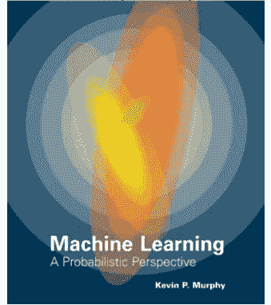

# 拿了一个机器学习的硕士学位，我(非常)没有准备

> 原文：<https://towardsdatascience.com/took-a-masters-in-machine-learning-and-i-was-very-unprepared-7aba95f044a8?source=collection_archive---------3----------------------->

## 我从全职到人工智能硕士生过渡的探索。

在 [Unsplash](https://unsplash.com/s/photos/study?utm_source=unsplash&utm_medium=referral&utm_content=creditCopyText) 上由 [Gery Wibowo](https://unsplash.com/@gergilgad?utm_source=unsplash&utm_medium=referral&utm_content=creditCopyText) 拍摄的照片

我其实在题目里撒了谎——*喘气*，我没有考机器学习硕士。那是在**计算机视觉、机器学习和太空机器人学。**

陈述确切的过程可能会增加对学位难度的理解…也可能不会。外面的天才可能会想，“ *meh 听起来像在公园里散步*”，但我向你保证不是。

# 背景

去年 12 月，我写了一篇文章，强调了我申请的一个数据科学职位遭到拒绝的情况。我将在本文末尾为感兴趣的人放置一个链接。

我关于我被拒的文章传开了(在 Medium 上)，有几个人通过 LinkedIn 联系我，询问我读机器学习硕士的经历如何，更重要的是，这是否值得？

我将为您节省一些时间和麻烦，并通知您，在机器学习等有前途和发展中的领域拥有高级资格或学位是绝对值得的。

从我目前的经验来看，我注意到雇主不仅需要某个领域的专业知识；他们还要求资格证明。

拥有神经网络的实践和理论知识，或者详细了解反向传播的工作原理，会让你在竞争中脱颖而出。

*但是我偏离了这篇文章的主要观点，将回到我是如何对机器学习硕士学位毫无准备的。*

# 自负

对于那些熟悉过于自信的人，我们知道它有各种各样的形式。

对我来说，它有两种形式。

首先，我对自己在软件工程本科学位(BSc)的优异表现过于自信。那时，关于软件开发生命周期的一切似乎都一拍即合。随着我一次又一次地经历这个过程，设计、实现和测试软件应用程序成了我的第二天性。

这种软件开发的便捷性随后投射到了我四年的 Web 开发生涯中。我知道如何开发一个网站的用户界面，由一个具有 API 的完善的后端系统和一个连接的数据库系统支持，该系统托管在一个托管平台上，如亚马逊。简单对吗？

我错误地认为机器学习对我来说会像网络开发一样容易。

伙计，我错了。对我来说一点都不容易。

我的第二种过度自信来自于低估了机器学习领域整体的复杂程度。

我对机器学习可能有多难的天真，部分是因为那些华而不实的新闻文章，这些文章提到“一名 10 年的执业律师如何在 3 个月内成为一名数据科学家”。

你无法逃避围绕人工智能的大肆宣传。

# 三个月。

我的近期目标是在三个月内学会机器学习。所以，我买了这本书。

对于那些不熟悉这本书的人来说，这就像你给一个小学教育的孩子一本关于微积分的书；或者就像通过阅读一本关于火箭船的书来学习如何修理自行车一样——*我在这里有些夸张，但你已经明白了。*

这本书里的术语和方程式对我来说就像一种完全不同的语言。直到今天，有些仍然如此。

老实说，这本书的内容吓坏了我，结果我把研究机器学习与这个星球上最具挑战性的事情之一联系起来。

快进到现在，我不得不承认，这本书对于任何渴望认真对待机器学习的人来说都是必不可少的。这本书是为那些希望超越框架、API 和库的人准备的。

## 我原以为机器学习会轻而易举，结果却更像是一场龙卷风。

> **提示**:如果你正着手研究机器学习，从小处着手。这里有一个自我激励的资源:

 [## 如何学习机器学习，自我启动的方式

### 如果你已经选择认真研究机器学习，那么恭喜你！你有一个有趣且有意义的旅程…

elitedatascience.com](https://elitedatascience.com/learn-machine-learning?utm_source=mybridge&utm_medium=web&utm_campaign=read_more) 

# 毫无准备

我的过度自信导致我在攻读学位时缺乏准备。

首先是数学，然后是论文，最后是紧张的学习——起床后睡在图书馆学习。

不幸的是，在我的学术生涯中，数学和我从来都不是最好的朋友。获得硕士学位也没有什么不同。尽管如果你在高中或大学时数学或统计学很强，那么与机器学习相关的数学可能一点也不令人生畏。

对我来说，恰恰相反；我喜欢学习反向传播，但是寻找函数的偏导数并不有趣。但这是必须的。

在工作了三年之后，我已经习惯了为了赶上发布日期而一坐就是几个小时。

但是硕士学位要求更多。

我不得不将我的注意力和集中力提高四倍。这很有挑战性，我为这个学位的前半部分而奋斗。

一旦我让自己沉浸在学习小组中，在图书馆安静的房间里，使用生产力应用程序，对我来说专注变得更加舒适

> **提示**:如果你发现很难放下手机，远离社交媒体平台，那么使用**森林**:

 [## 森林

### Forest 是一款帮助你远离智能手机，专注工作的应用。

www.forestapp.cc](https://www.forestapp.cc/) 

> 从教科书中学习和在 StackOverflow 上寻找解决方案是非常不同的。

只有在几门硕士课程中表现不佳后，我才意识到，在大学里，你周围有一个资源库。

所以我和一些我见过的最聪明的人进行了一对一的谈话。我上网找到了一个很多机器学习工程师和数据科学家都很熟悉的 YouTube 频道，3Blue1Brown。

 [## 3 蓝色 1 棕色

### 格兰特·桑德森的《3blue1brown》是数学和娱乐的结合，这取决于你的喜好。目标是…

www.youtube.com](https://www.youtube.com/channel/UCYO_jab_esuFRV4b17AJtAw) 

最后，写论文。论文写作本身就是一种技能，而我严重缺乏这种技能。当然，我可以花几个小时在笔记本电脑上打字，但那是在调试或实现代码的时候。写作文就不一样了。

文章写作是我必须通过经常练习来学习的东西。我在网上没有找到任何资源可以帮助你获得机器学习方面的论文写作技能。

> **提示:**练习在媒体上撰写和发表解释机器学习主题和概念的文章。从某种意义上来说，这和写论文很相似，你必须进行研究，并能言善辩地写作(有时是*)*。下面是这类文章的一个例子:

 [## 理解梯度下降及其变体

### 简要了解机器学习模型中的学习过程是如何得到优化支持的…

towardsdatascience.com](/understanding-gradient-descent-and-its-variants-cf0df5c45478) 

# 经验教训

## 不要低估机器学习(或任何专业学位)

简单的说，机器学习不是闹着玩的。个人已经将他们的生命奉献给了开发机器学习内部的主题和角落，所以当我告诉你你不可能在三个月内掌握或学习机器学习时，请相信我。在最好的情况下，你可能知道一些在很短的时间内很容易理解的常见概念。

## 不要低估你的能力

在整篇文章中，我提到了我的缺点。然而，我必须给自己一些荣誉，因为我克服了所有的困难，设法完成并通过了我的硕士学位。如果你曾经克服了你认为不可能的事情，你也应该给自己一些信任。

## 不要高估你的能力

既然我们都拍了拍自己的背，是时候谦虚一下了。如果我只是做了充分的准备，我就不会经历硕士期间的所有混乱。我在软件开发方面的能力蒙蔽了我，我错误地将学习机器学习比作学习新的 web 开发框架或库。

> 你在一个领域的成功并不能保证你在另一个领域的成功，即使它们可能是相关的。我知道，这似乎是显而易见的，但不得不说。

## 永远让自己完全沉浸其中

诚实地说，长时间保持全神贯注的能力应该被认为是一种超能力。在当前的数字时代，时间和注意力是新的黄金，您设备上的移动应用程序经过优化，每次都能吸引您的注意力。

你需要重新获得自制力，能够断开互联网。从长远来看，断开一个小时左右的联系，利用这段时间专注于一项特定的任务可能会有所收获。

能够集中注意力是一项需要培养的技能，所以要有耐心，从小处着手。

# 结论

如果你已经做到了这一步，我告诉你学位的结果是公平的。我通过了硕士考试，获得了与人工智能相关的各种主题的有用知识。

我确实发现，在我的硕士课程中(所以这可能不是标准)，你不会学到实际的技能，比如部署你的 ML 模型，建立数据库。我没有听说过像 Sci-Kit Learn、Numpy 和 Pandas 这样的标准数据科学库。但是你可以自己独立地学习所有这些。

攻读硕士学位可能不是获得机器学习或其相关领域工作的必要条件，但它确实有助于你入门。

如果你有一个 ML 硕士学位和一些很酷的项目/投资组合，你将拥有别人可能没有的竞争优势。

这是我拒绝文章的链接，如下面所承诺的，如果你喜欢这篇文章并想看更多，给我一个关注。

 [## (拒绝)来自我的第一次数据科学面试

### 拒绝是获得数据科学工作的整个过程的一部分。但它并不经常被提起。这是我的账户…

towardsdatascience.com](/rejected-from-my-first-data-science-interview-c9784dd65296) 

**这里有一篇来自**[**David Chong**](https://medium.com/u/f392dd76f846?source=post_page-----7aba95f044a8--------------------------------)**的有趣文章，他在文章中探索了机器学习/数据科学研究后的现实。**

 [## 我有人工智能硕士学位。现在怎么办？

### 更多的时候，人们开始了硕士课程，以进一步他们在某一领域的专业知识或获得一些…

towardsdatascience.com](/i-have-a-masters-in-artificial-intelligence-now-what-a71a92b4c51)