# 在线共享 Jupyter 笔记本的工具

> 原文：<https://towardsdatascience.com/tools-for-sharing-jupyter-notebooks-online-28c8d4ff821c?source=collection_archive---------2----------------------->


马文·迈耶在 [Unsplash](https://unsplash.com/s/photos/online?utm_source=unsplash&utm_medium=referral&utm_content=creditCopyText) 上的照片

## 与非程序员共享 python 笔记本的三个工具

我最近开始帮助一个新的数据项目，这个项目是由我的一个朋友建立的。项目的数据部分是一个分析部分，将一些自然语言处理应用于调查中基于文本的回答。我为这个项目创建了一个 Github 库，并在一个 [Jupyter 笔记本](https://jupyter.org/)中完成了分析。

作为这个项目的一部分，我希望能够与非程序员分享这些笔记本，他们不一定熟悉 Github。这是大多数数据科学家面临的共同问题。

Jupyter 笔记本是探索性数据分析的伟大工具，但在项目中需要与非程序员利益相关者分享这种分析是很常见的。幸运的是，有很多工具可以让非 Github 用户在线托管笔记本。

在下面的文章中，我将介绍如何使用其中的三种工具，并讨论每种工具的优缺点。

## 安装

为了测试这些工具，我创建了一个 Github 库和一个样本笔记本。

如果您还没有 Github 帐户，您可以免费创建一个。如果你对创建、克隆和推送 Github 库不熟悉，我之前在这里写了一个指南。

我创建了一个 Github 存储库，用于测试，结构如下。

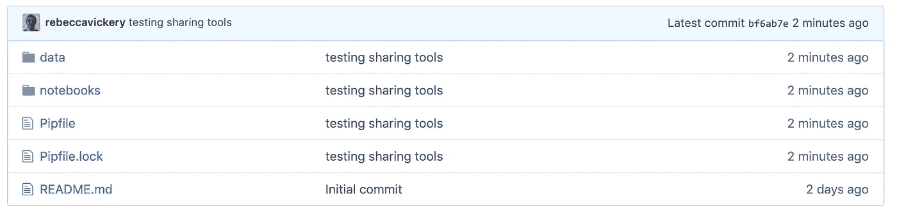

笔记本文件夹包含一个笔记本，该笔记本由 Kaggle 数据集的机器学习工作流组成，该数据集包含标记为灾难或非灾难的推文。关于这个数据集和数据的信息可以在这个[链接](https://www.kaggle.com/c/nlp-getting-started/data)中找到。

可以在下面查看笔记本的快照。

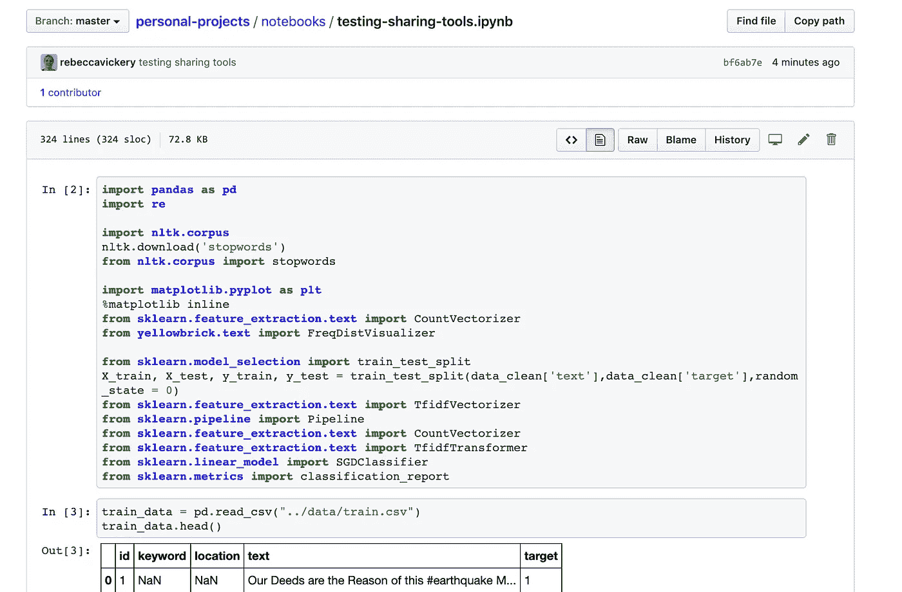

现在让我们来看一些与非程序员共享这个笔记本的方法。

## **Jupyter nbviewer**

Jupyter nbviewer 是 Jupyer 社区创建的一个工具，用于呈现 Github online 上托管的笔记本。

使用起来极其简单。只需将笔记本的 URL 粘贴到这个[网页](https://nbviewer.jupyter.org/)中。

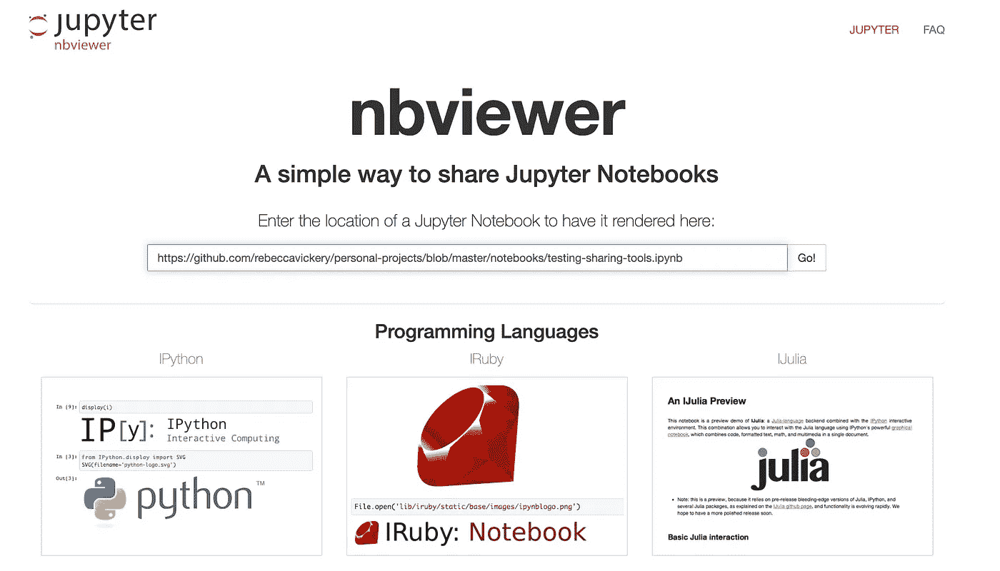

笔记本现在通过一个独特的链接呈现，您可以与他人共享。

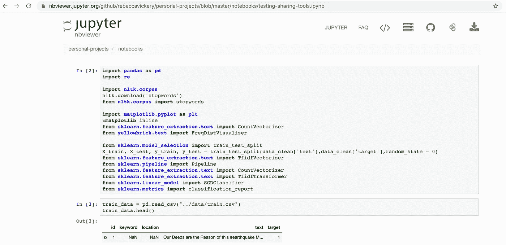

**优点**

*   使用起来极其简单。
*   只要笔记本在 Github 存储库中的位置不变，Link 就会保持活动状态。

**劣势**

*   Nbviewer 只渲染笔记本的输入和输出。链接中的代码不可执行。
*   为了减少渲染时间，nbviewer 缓存输出大约 10 分钟。因此，在查看您在链接中所做的任何更改时会有延迟。

## 粘合剂

Binder 是另一个共享笔记本的开源项目。Binder 不仅在笔记本中呈现输入和输出，还构建存储库的 Docker 映像，使托管笔记本具有交互性。

要共享笔记本，请导航到此[链接](https://mybinder.org/)。与 nbviewer 不同，您需要添加存储库 URL，而不是笔记本的路径，如下所示。您可以选择将路径添加到笔记本，但是如果留空，Binder 将通过链接提供整个存储库。

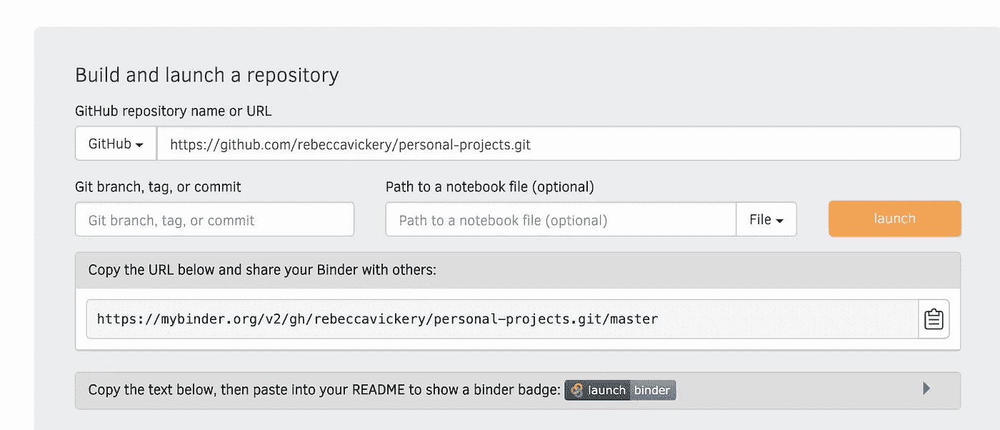

Binder 将需要几分钟来构建 docker 映像。

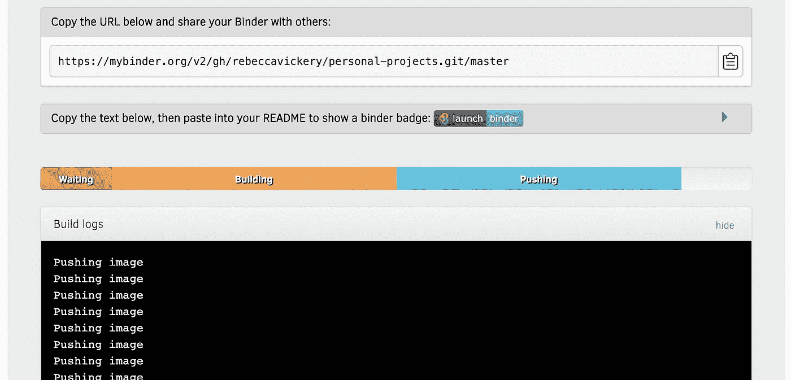

该笔记本现已在网上出售。链接的接收者可以查看代码和输出并与之交互。

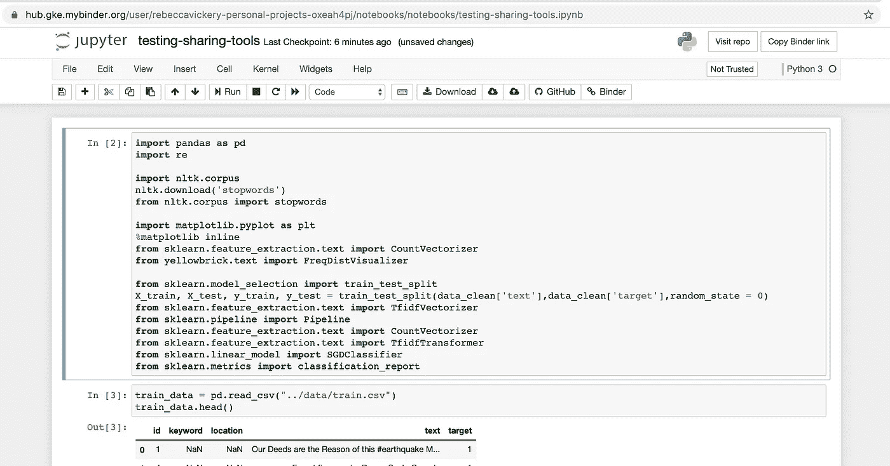

**优点**

*   笔记本可以作为可执行代码使用，因此意味着接收者可以复制您的项目并与之交互。
*   简单易用，不需要注册账户什么的。
*   当对存储库进行新的提交时，docker 映像会自动重建。

**缺点**

*   Github 存储库需要包含 Docker 映像的配置文件。可接受的格式包括 environment.yml、Pipfile、requirements.txt、setup.py。这并不是一个缺点，但如果您还没有使用过这些文件，这可能会增加您的复杂性。

## 木星的

[Jovian](https://jovian.ml/docs/) 是一个跟踪和协作数据科学项目的平台。该平台的一部分是一个在线托管 Jupyter 笔记本的工具，与上面提到的其他工具略有不同。Jovian 是开源的，但在定价上也有一些企业元素。免费层给你无限的公共项目和访问 5 个私人项目。这足以快速共享偶尔的笔记本。

要上传笔记本，您首先需要创建一个帐户。一旦注册，你需要在你的项目虚拟环境的机器上安装 jovian。这可以通过带有`pip install jovian`的 pip 安装。

要上传笔记本，请添加`import jovian`。准备好共享笔记本后，请键入以下内容。

```
jovian.commit()
```

这将要求提供 API 密钥，您可以在 jovian.ml 网站上的帐户中找到该密钥。

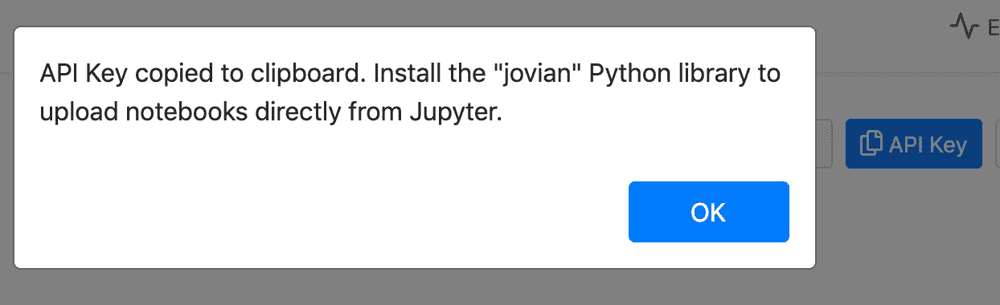

一旦你输入了密钥，几秒钟后你会得到一个**“提交成功！”**消息。


如果您现在转到您的个人资料页面，您将看到您的笔记本。Jovian.ml 捕获并上传 python 虚拟环境和笔记本，以便合作者可以与代码进行交互。

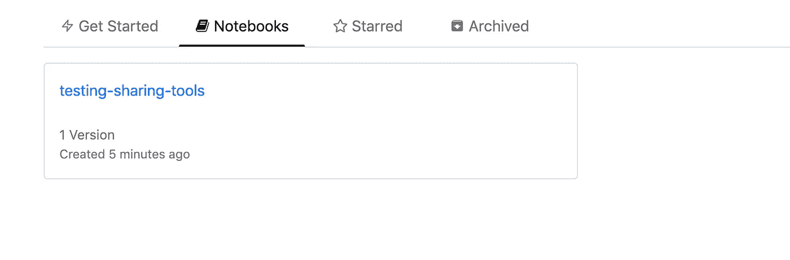

如果您导航到笔记本，您可以添加协作者或使用链接与其他人共享。

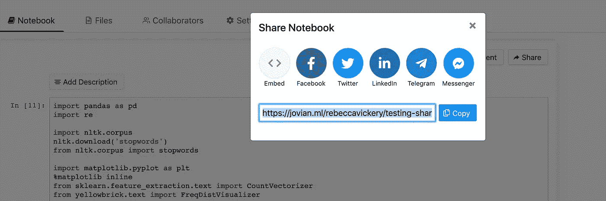

**优势**

*   共享选项适合程序员和非程序员，因为您可以选择简单地查看静态输入和输出，或者克隆并运行您自己的版本。
*   Jovian 允许细胞水平的评论和讨论，这是一个非常好的功能。

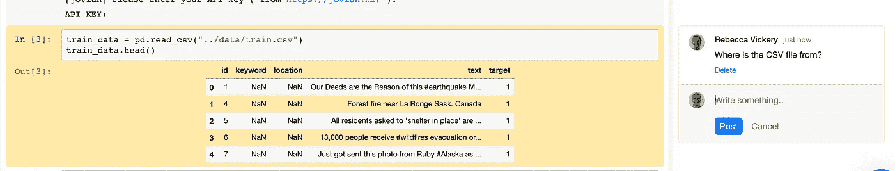

**劣势**

*   你需要有一个 Jovian.ml 帐户，并且需要在本地安装 Jovian 来共享你的笔记本，因此这个工具比其他两个选项需要更多的设置。
*   笔记本需要单独上传到 Jovian.ml，所以如果你使用 Github 进行版本控制，你需要提交两次，你的项目可能会在两个不同的地方。

本文概述了在线共享 Jupyter 笔记本的三种工具。每种工具本身都非常有用，我肯定会使用这三种工具。然而，对于我在文章开头提出的目的，即与非程序员共享笔记本，nbviewer 绝对是我会选择的选项。这是最简单的选择，并且为我提供了我所需要的，一种仅查看的共享形式。

感谢阅读！

[**我每月发一份简讯，如果你想加入请通过这个链接注册。期待成为您学习旅程的一部分！**](https://mailchi.mp/ce8ccd91d6d5/datacademy-signup)