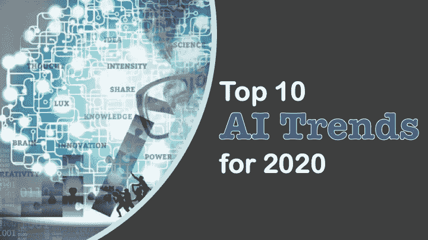
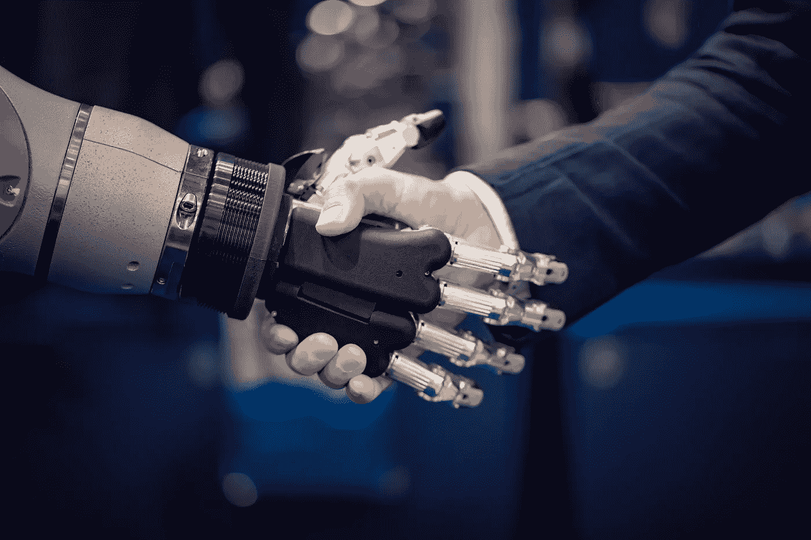

# 2020 年及以后的十大人工智能趋势

> 原文：<https://towardsdatascience.com/top-10-ai-trends-for-2020-d6294cfee2bd?source=collection_archive---------6----------------------->

图片由[皮克斯拜](https://pixabay.com/?utm_source=link-attribution&utm_medium=referral&utm_campaign=image&utm_content=3075837)的 Gerd Altmann 提供

## 人工智能在工作场所的兴起支持和维持数字劳动力是 2020 年的明显趋势。

人工智能、机器学习、神经网络或任何其他行业正在出现的花哨术语，被定义为复杂的计算机技术，正被广泛用于理解和改善业务和客户体验。我假设你以前听说过它，但是今天它的定义是计算机科学的一个领域，强调创造像人类一样工作和反应的**智能机器**。

# 以下是今年值得关注的十大人工智能趋势:

照片由[莫赫达姆·阿里](https://unsplash.com/@mohdali_31?utm_source=medium&utm_medium=referral)在 [Unsplash](https://unsplash.com?utm_source=medium&utm_medium=referral) 上拍摄

## 对数字智能的需求。

随着越来越多的企业意识到他们必须了解自己的运营，数字智能将在每个数字化转型战略中发挥越来越重要的作用，它是衡量组织从各种关键角度了解其业务流程以及其中的内容和数据的能力的标准。

数字智能解决方案将通过优化自动化计划和补充 RPA 和 BPM 等平台，帮助组织提高这种业务关键型能力。2020 年，随着企业意识到这些解决方案照亮了改善客户体验、降低运营成本和增强竞争优势的道路，更多的组织将在其总体数字化转型计划中采用数字智能技术。(如之前发布的[此处](https://blog.abbyy.com/5-ai-trends-to-watch-in-2020/)。)

图片由 [www_slon_pics](https://pixabay.com/users/www_slon_pics-5203613/?utm_source=link-attribution&utm_medium=referral&utm_campaign=image&utm_content=2539844) 来自 [Pixabay](https://pixabay.com/?utm_source=link-attribution&utm_medium=referral&utm_campaign=image&utm_content=2539844)

## 数字工作者将改变办公室。

正如我最近谈到的，全球范围内数字工作者的使用越来越多。根据新的 IDC 研究报告，到 2022 年，数字工作者——如软件机器人和人工智能——的贡献将增长 50%以上。(如前所述[此处](https://blog.abbyy.com/5-ai-trends-to-watch-in-2020/)。)

**每个人类工作者都有一个数字工作者。预计许多数字机器人将在办公室承担极简任务。数字工作者将接受培训，像任何员工一样执行业务任务，只是速度更快，没有错误。未来，整个企业的所有员工都将有数字工作者与他们并肩工作。这在工作场所将变得非常正常，你肯定会在你的工作场所看到更多这样的技术(继续阅读了解原因)。**

图片来自 [Pixabay](https://pixabay.com/?utm_source=link-attribution&utm_medium=referral&utm_campaign=image&utm_content=3075837) 的 [Gerd Altmann](https://pixabay.com/users/geralt-9301/?utm_source=link-attribution&utm_medium=referral&utm_campaign=image&utm_content=3075837)

## 过程智能的扩散。

如果你以前没听过，今年你一定会看到。[流程智能](https://www.abbyy.com/solutions/process-intelligence/)允许企业使用其系统中包含的信息来创建其流程的可视化模型，实时分析它们以识别异常值和瓶颈，并预测未来结果以促进技术投资决策。

随着更复杂的数字化转型技术的部署，监控组织各个方面的运营变得越来越重要。管理非常具体的功能(CRM、ERP、CMS、EHR 等)的单独技术系统。)只提供对其平台控制的流程的可见性。这些独立的系统都无法提供全面而深入的洞察力。

 [## 过程智能增强供应链的 7 种方式

### 随着供应链变得更加全球化和复杂，监控和管理流程变得越来越困难

medium.com](https://medium.com/@ryraiker/7-ways-process-intelligence-enhances-the-supply-chain-6d83b444ba5e) 

为了获得这种可见性，组织需要利用流程智能技术，提供所有流程的全面、准确和实时的视图—跨部门、职能、人员，甚至不同的位置。在未来的几年中，更多的企业将会认识到，流程智能使组织能够更好地理解和更有效地管理他们的端到端流程，这些技术将会成为企业的标准。(如之前发布的[此处](https://blog.abbyy.com/5-ai-trends-to-watch-in-2020/)。)

图片由 [Gerd Altmann](https://pixabay.com/users/geralt-9301/?utm_source=link-attribution&utm_medium=referral&utm_campaign=image&utm_content=1616459) 从 [Pixabay](https://pixabay.com/?utm_source=link-attribution&utm_medium=referral&utm_campaign=image&utm_content=1616459) 拍摄

## 人工智能不仅适用于消费者，也适用于企业。

作为消费者，我们每天都在体验人工智能，但往往不知道它正在被使用。在企业中，预计到 2020 年，流程负责人和那些领导客户体验改善计划的人将会看到他们对人工智能工具的参与和访问大幅增加。

许多企业在数字化转型项目上花费了数百万美元，但这些项目从未与企业需求保持一致。当然，他们仍然想知道为什么他们失败了。只有解决业务问题，并确保 it 解决正确的问题，才能确保在 2020 年及以后的企业中取得数字成功。不要只是为了拥有 AI 或 RPA 而拥有它们，要让技术与业务保持一致。

正如 Nathan Furr 和 Andrew Shipilov 在他们的文章中解释的那样,[打破了《哈佛商业评论》*中关于数字颠覆的观点*](https://hbr.org/2019/07/digital-doesnt-have-to-be-disruptive),,*“管理者通常认为数字转型主要是关于技术变革。当然，这涉及到技术变革，但聪明的公司认识到，转型最终是为了更好地服务于客户需求，无论是通过更有效的运营、大规模定制还是新的产品。”*

人工智能将变得更容易在工作场所使用。商业用户将很快进入机器人和其他易于使用的自动化工具的内部市场，所有技术熟练的人都可以使用这些工具。这些新平台将在改善员工完成工作的方式方面发挥作用，从而改善客户体验，使流程优于竞争对手。

## 人工智能将监测和改善业务流程。

但是你不能改善你不理解和衡量的东西。

虽然简单的任务自动化已经成为工作场所的常见做法，但高度自动化(如【2020 年十大技术趋势中所述)和智能、认知自动化项目取决于集成人工智能工具的能力，以重塑和重新定义业务流程的实时执行方式。RPA 本身并不智能；这是简单的基于规则的任务自动化。

> *Derek Miers 是 Gartner RPA 软件魔力象限的高级总监兼分析主管。Miers 参加了今年的 Gartner Symposium/ITxpo，他在会上发表了一篇讲话，对当今存在的 RPA 提出了令人惊讶的批评。*
> 
> “你所做的是用创可贴覆盖组织，希望能有一个健康计划，”迈尔斯解释道。"**你必须修正流程**。所以，你真正要做的是在你的旧应用程序前搭建一个小门面，你可以重复使用。”

实现认知自动化将需要为这项任务构建新的工具。人工智能支持的流程和内容智能技术将为数字工作者提供处理自然语言、推理和判断所必需的技能和理解，建立上下文，提供数据驱动的见解。

RPA 工具本身不是用人工智能构建的智能机器人，因此它们需要人工智能驱动的解决方案来实现智能。监控整个企业的流程并触发 RPA、capture 或其他工具的能力将由理解流程(参见上面的流程智能部分)和作为流程有效负载的内容的工具来处理。

> 简而言之，RPA 的作用是自动化以前由人类处理的重复性任务。该软件被编程为跨应用程序和系统执行重复性任务。该软件被教导具有多个步骤和应用的工作流程。”–[安东尼·爱德华兹](https://www.linkedin.com/in/antonyedwards/)，首席运营官在[茄子](https://eggplant.io/)。

图片由 [kiquebg](https://pixabay.com/users/kiquebg-5133331/?utm_source=link-attribution&utm_medium=referral&utm_campaign=image&utm_content=4256275) 从 [Pixabay](https://pixabay.com/?utm_source=link-attribution&utm_medium=referral&utm_campaign=image&utm_content=4256275) 获得

## 混合劳动力的常态-人类和人工智能的合作。

许多人认为企业内部的人工智能和自动化是工作杀手。新兴的混合劳动力——人类和机器人——还活着，并且在成长。组织正在迅速实施认知 AI 和 RPA，这些技术可以大规模处理大量重复任务。随着越来越多的用例出现，混合劳动力也在增长。

获得认同可能很难，但企业领导人应该对员工开放和诚实，让他们透明地了解人工智能将如何使用，以及对当前人类工人及其日常工作生活的持久影响

总的来说，无论你的组织是否努力获得认同，信息都很明确:**习惯它**。在不远的将来，你可能会在日常工作中与人工智能工具、数字工人和机器人一起工作。希望这些数字工作者与业务保持一致，并帮助解决问题，从而加快您的价值实现。

## 更多人类与 AI 的互动。

人工智能在工作场所的常态也将是我们看到更多人类与人工智能互动的原因。我们将被期待与人工智能一起生活和工作，就像我们已经与 Alexa、Siri 和其他数字助理一起生活一样。你的智能数字工作者会叫什么名字？

随着技术能力的提高，监管允许和社会接受度的增长，更多的人工智能将被部署在不受控制的公共空间。我想象我们中的更多人将与人工智能互动，也许甚至不知道它。虽然我们已经明白，客户体验往往是基于我们的个人资料和兴趣而改进和定制的，但我期待与人工智能的许多其他形式的交互，即使在我们看不到它发生的地方。

图片来自 Pexels.com[的](https://www.pexels.com/photo/abstract-art-blur-bright-373543/) [Pixabay](https://www.pexels.com/@pixabay)

## 数据是人工智能火上浇油。

正如比利·周所说:我们没有放火；它总是在燃烧；因为世界一直在转动；我们没有放火；不，我们没有点燃它；但我们试图与之抗争:不久前，企业将数据视为许多业务流程和交易结束时产生的多余废气。这里发生了巨大的转变，大大小小的组织现在都在系统和方法上进行投资，以收集和记录他们能够收集和记录的所有数据——当然是为了改进！

在过去的 25 年中，数据的快速增长、存储成本的降低以及访问数据的便利性都取得了令人难以置信的增长。数据正在推动客户体验的改善，提升分析能力(特别是在流程数据和流程智能的新领域)，实现机器学习和人工智能，并允许企业利用由数据驱动的智能自动化的真正价值。

迈克·科诺诺夫在 [Unsplash](https://unsplash.com?utm_source=medium&utm_medium=referral) 上拍摄的照片

## 人工智能促进网络安全。

在改善网络安全的持续努力中，人工智能将为首席信息安全官带来令人印象深刻的新优势。

虽然人工智能可以增强安全性，但它不是万能的。“人工智能不会解决你所有的安全问题，”安全公司[迈克菲](https://www.mcafee.com/)前副总裁兼企业产品总经理[拉贾·帕特尔](https://www.linkedin.com/in/raja-patel-0910101/)说，他现在是[阿卡迈科技](https://www.akamai.com/)安全产品副总裁。"把它看作是提高安全态势的一种方法，而不是银弹."

正如我在[2020 年前 20 大技术趋势文章](/top-10-technology-trends-for-2020-4a179fdd53b1)中指出的，未来的人工智能安全将有 3 个关键视角。

照片由[内特·格兰特](https://unsplash.com/@nateggrant?utm_source=medium&utm_medium=referral)在 [Unsplash](https://unsplash.com?utm_source=medium&utm_medium=referral) 上拍摄

## 更多的人工智能做人工智能的事情——自动化人工智能开发。

“2020 年，预计将在 IBM 所谓的‘人工智能的人工智能’领域看到重大的新创新:使用人工智能来帮助自动化创建、部署、管理和操作人工智能模型的生命周期中涉及的步骤和过程，以帮助将人工智能更广泛地扩展到企业中，”IBM 研究人工智能副总裁 [Sriram Raghavan](https://www.linkedin.com/in/rsram10/) 说。来源:[下网](https://thenextweb.com/artificial-intelligence/2019/12/17/8-biggest-ai-trends-of-2020-according-to-experts/)。

2019 年，IBM 推出了 [AutoAI](https://developer.ibm.com/articles/autoai-humans-and-machines-better-together/) ，这是一个自动化数据准备、模型开发、特征工程和超参数优化的平台。

寻找包括分布式深度学习的开发技术，使开发人员能够更快更有效地构建人工智能引擎。自动化机器学习将使人工智能开发可用于更多样化的开发人员群体。

在 [Unsplash](https://unsplash.com?utm_source=medium&utm_medium=referral) 上由 [Hitesh Choudhary](https://unsplash.com/@hiteshchoudhary?utm_source=medium&utm_medium=referral) 拍摄的照片

总的来说，人工智能有能力重塑和重新定义我们的生活和工作方式。我们都应该期待的增长趋势是在工作场所看到越来越多的人工智能解决方案。这些工具将有助于创造新的用户体验和更好的结果，并确保我们及时高效地实现我们的目标。当考虑混合劳动力的需求时，领导者需要决定简单的基于任务的自动化工具是否是他们问题的答案，或者他们是否需要人工智能和其他变革性技术的组合来实现真正的智能和认知自动化。

选择仍然存在——你的组织将成为由人工智能驱动的成功和可持续数字化的领导者，还是因为害怕变化而保持静止和停滞不前。

RYAN M. RAIKER，MBA // Ryan Raiker 是 ABBYY 的高级产品营销经理，ABBYY 是一家业务流程和数字智商解决方案的全球供应商。作为常驻的“流程智商人员”，Ryan 在流程发现、分析、监控和预测/说明性分析、业务战略管理、业务发展方面拥有专业知识，专注于帮助公司了解其业务流程并从中获得价值。他获得了威得恩大学的工商管理硕士学位、商业分析/信息学学士学位和运营管理辅修学位，并继续在该大学担任兼职教授。