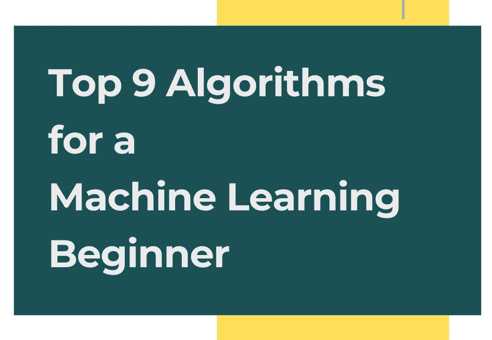
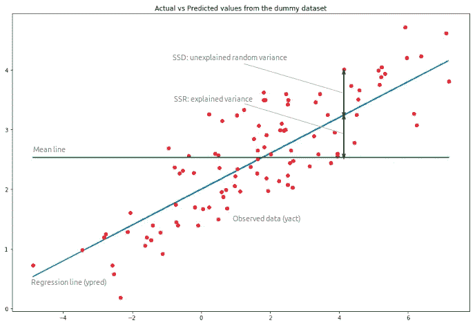
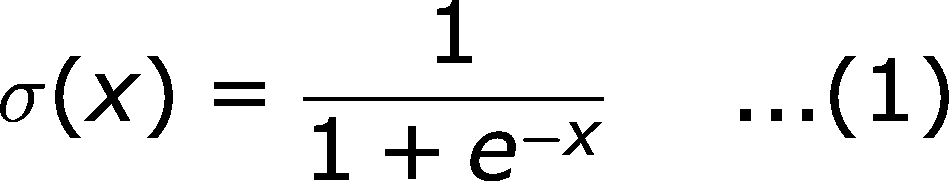
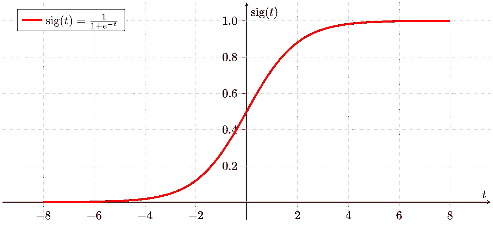
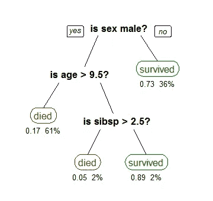
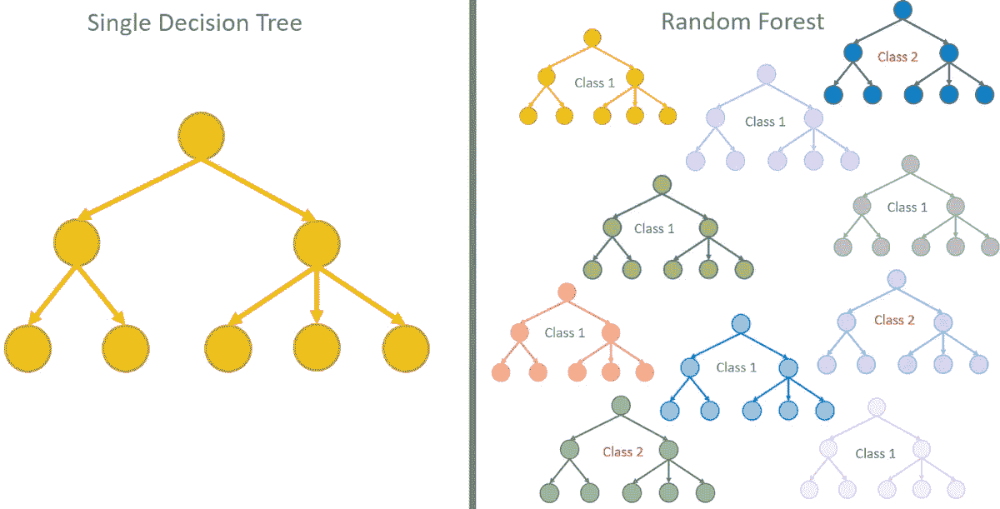
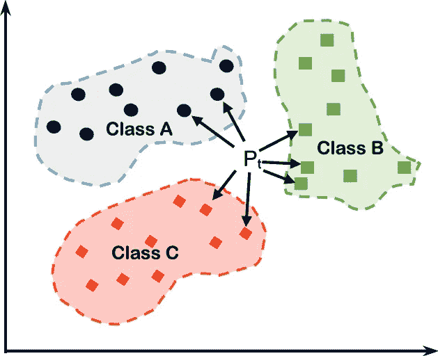
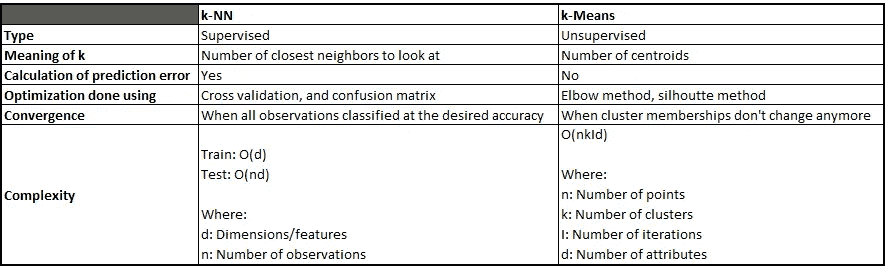
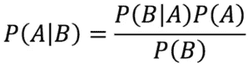

# 机器学习初学者的 9 大算法

> 原文：<https://towardsdatascience.com/top-10-algorithms-for-machine-learning-beginners-149374935f3c?source=collection_archive---------2----------------------->

## 有大脑的机器是未来。

在过去的几年里，机器学习的使用和它的威力已经成倍增长。我们的祖父母认为只有有智力的人才能做的事情现在正在由机器在没有人类干预的情况下完成。这就是机器学习的力量。

1952 年，当 IBM 的亚瑟·塞缪尔(Arthur Samuel)在他的跳棋游戏中首次提出“机器学习”这个词时，他从未想到机器学习会开辟一个全新的领域，从帮助残疾人到祝贺企业决策和动态定价。

机器学习是一种自动建立分析模型的数据分析方法。它是一个技术分支，允许系统从数据中学习，识别模式并在最少的人工干预下做出决策。

机器学习使构建能够理解图像、声音和语言的软件成为可能，并使我们每天都能够了解更多的技术。

当我在 2013 年第一次从 Verge 的一篇文章中知道机器学习的时候，我永远无法理解机器是如何被训练出来的！？？直到 2015 年开始本科，开始学习机器学习。训练数据，测试数据，监督-非监督数据，决策树，深度学习和神经网络的随机森林，这是一个沉重的知识云。

一个接一个，我学习了不同的机器学习算法，并做了相关的项目。我读得越多，和他们一起工作得越多，我明白有些算法是从你开始的，这让你对整个人工智能和人工智能生态系统更加熟悉。

在我们进入这个故事之前，非常重要的是要把基础正确地建立在监督和非监督学习上。

## 监督学习

监督学习是当你有一些输入变量，比如说 *x* 和一个输出变量 *y* ，你用一个算法学习从输入到输出的映射函数为 **y = *f* (x)**

监督学习的目标是逼近映射函数*，当您有新的输入数据(x)时，您可以以相同的精度预测该数据的输出变量(Y)* 。

它被称为监督学习，因为算法的学习过程是通过从训练数据集进行学习，这可以被视为类似于教师监督一些学生的学习过程。

## 无监督学习

无监督学习是*当你只有输入数据 x，没有对应的输出变量。*

无监督学习的目标是构建数据中的底层结构或分布，以便了解更多关于数据的信息。

这些被称为非监督学习，因为与监督学习不同，没有解决问题的正确方法，也没有老师来监督。算法学习数据本身，设计以最佳方式发现和呈现数据中有趣的结构。

因此，有了我的这个故事，让我们进入*9 大机器学习算法*吧，我们已经听过上百次了，但这次要清楚地阅读它的应用和能力，没有特定的重要性顺序。

# 1.线性回归

线性回归线

线性回归是一种基于监督学习的机器学习算法。线性回归对因变量和一个或多个自变量之间的关系进行建模。线性回归主要用于处理标量和探索性变量。

线性回归应用于确定因变量(标量)和一个或多个自变量(探索性的)之间存在线性关系的程度。单个自变量用于预测因变量的值。

## 线性回归的实际应用

1.  金融服务或保险领域的风险管理
2.  预测分析
3.  计量经济学的
4.  流行病学
5.  天气数据分析
6.  客户调查结果分析

# 2.逻辑回归

当因变量为二元时，使用逻辑回归。这是统计学中二元分类问题的常用方法。首先，理解什么时候使用线性回归，什么时候使用逻辑回归是很重要的。

## 线性回归和 Logistic 回归有什么区别？

当因变量连续且回归线为线性时，使用线性回归。

当因变量本质上是二元时，使用逻辑回归。

## 何时使用逻辑回归？

这是线性回归的一个特例，其中目标变量本质上是明确的。它使用概率的对数作为因变量。

sigmoid 函数也称为逻辑函数，它给出了一条“S”形曲线，可以将任何实数值映射为 0 到 1 之间的值。

1.  如果曲线趋向正无穷大，y 预测值将变为 1
2.  如果曲线走向负无穷大，预测的 y 将变成 0
3.  如果 sigmoid 函数的输出大于 0.5，我们可以将结果分类为 1 或是，如果小于 0.5，我们可以将其分类为 0 或否
4.  如果输出是 0.75，我们可以按照概率说:病人有 75%的机会患癌症。

因此，*逻辑回归利用 sigmoid 函数预测二元事件的发生概率。*

## 逻辑回归的实际应用

1.  癌症检测
2.  创伤和损伤严重程度评分
3.  图像分割和分类
4.  地理图像处理
5.  手写识别
6.  基于语料库中的单词包预测一个人是否抑郁

# 3.支持向量机

机器学习很大程度上涉及预测和分类数据。为此，需要根据数据集实现一组机器学习算法。这些最大似然算法之一是 SVM。想法很简单:创建一条线或一个超平面，将数据分成多个类。

SVM 超平面及其类

支持向量机(SVM)是一种*监督的*机器学习算法，可用于分类或回归挑战。但多用于分类问题。SVM 在此基础上转换你的数据库，在可能的输出之间找到一个最佳的边界。

支持向量机通过寻找最大化两个类之间的间隔的超平面来执行分类。

定义超平面的向量被称为*支持向量。*

*SVM 算法*

1.  定义一个具有最大余量的最优超平面
2.  将数据映射到更易于使用线性决策表面进行分类的高维空间
3.  重新表述问题，使数据隐式映射到这个空间

## SVM 的现实生活应用

1.  人脸检测—对图像上的人脸和非人脸区域进行分类
2.  文本和超文本分类
3.  图像分类
4.  生物信息学——蛋白质、基因、生物学或癌症分类。
5.  手写识别
6.  用于治疗的药物发现

近年来，SVM 通过其在分类中的应用在癌症检测和治疗中发挥了非常重要的作用。

# 4.决策树

来源:维基百科

决策树是一种决策支持工具，它使用决策过程和可能结果的树状模型。它涵盖了事件结果、资源成本和决策的效用。决策树类似于只包含条件控制语句的算法或流程图。

*倒过来画决策树，根节点在上面。每个决策树有 3 个关键部分:根节点、叶节点、分支。*

在决策树中，每个内部节点代表一个*测试*或一个*事件。*比如说，掷硬币是正面还是反面。每个分支代表测试的结果，每个叶节点代表一个类标签——这是在计算所有属性后做出的决定。从根到叶节点的路径代表分类规则。

决策树可以是用于分类和回归的强大的机器学习算法。*分类树*对目标进行分类，判断它是正面还是反面。*回归树*以类似的方式表示，但它们预测连续值，如附近的房价。

*关于决策树最好的部分:*

1.  处理数字和分类数据
2.  处理多输出问题
3.  决策树需要相对较少的数据准备工作
4.  参数之间的非线性关系不会影响采油树的性能

## 决策树的实际应用

1.  选择要旅行的航班
2.  预测酒店入住高峰期
3.  附近药店的数量对客户 X 特别有效
4.  癌细胞与非癌细胞分类，其中癌细胞很少，例如 1%
5.  建议顾客买什么车

# 5.随机森林

机器学习中的随机森林是一种关于分类、回归和其他操作的集成学习技术，这些操作在训练时依赖于大量决策树。它们快速、灵活，代表了挖掘高维数据的健壮方法，并且是我们上面讨论的分类和回归决策树的扩展。

总体而言，集成学习可以定义为通过组合单个模型来进行预测的模型。集合模型倾向于更灵活，偏差和方差更小。集成学习有两种流行的方法:

*   *装袋* **:** 从数据集中随机抽取每棵树，并通过 s 个随机数据子集进行训练，从而产生不同的树
*   *助推* **:** 每一个单独的树/模型都从先前模型所犯的错误中学习并改进

随机森林运行时间相当快。他们在处理缺失和不正确的数据时非常有效。从负面来看，它们无法预测超出训练数据定义范围的数据，并且可能会过度拟合噪声特别大的数据集。

*随机森林应该有 64-128 棵树。*

## 随机森林和决策树的区别

随机森林本质上是决策树的集合。决策树是在整个数据集上构建的，使用所有感兴趣的特征/变量，而随机森林随机选择观察值/行和特定的特征/变量来构建多个决策树，然后对结果进行平均。

## 随机森林的实际应用

1.  银行账户、信用卡欺诈检测
2.  检测和预测药物的药物敏感性
3.  通过分析病人的医疗记录来确定他们的疾病
4.  预测购买特定股票时的估计损失或利润

# 6.k-最近邻

K-最近邻(kNN)是一种简单的监督机器学习算法，可用于解决分类和回归问题。

kNN 存储可用的输入，并基于类似的度量(即距离函数)对新输入进行分类。KNN 主要应用于统计估计和模式识别。

## kNN 是做什么的？

KNN 的工作原理是找出查询和数据中所有输入之间的距离。接下来，它选择最接近查询的指定数量的输入，比如 K。然后它投票给最频繁的标签(在分类的情况下)或平均标签(在回归的情况下)。

*kNN 算法:*

1.  加载数据
2.  将 *k* 初始化为数据中选定数量的邻居
3.  对于数据中的每个示例，计算查询示例和数据的当前输入之间的距离
4.  将该距离添加到输入的索引中，以形成有序集合
5.  按距离分组的升序对距离和索引的有序集合进行排序
6.  从排序的集合中挑选前 K 个条目
7.  获取所选 K 个条目的标签
8.  如果是回归，返回 K 个标签的平均值；如果分类，返回 K 标签的模式

## kNN 的真实世界应用

1.  指纹检测
2.  预测股票市场
3.  货币汇率
4.  银行破产
5.  信用评级
6.  贷款管理
7.  洗钱分析
8.  根据糖尿病患者血液的红外吸收光谱估计该患者血液中的葡萄糖含量。
9.  根据临床和人口统计学变量确定癌症的风险因素。

# 6.k 均值聚类

K-means 聚类是最简单也是最流行的无监督机器学习算法之一。

我们上面不是讲过这么类似的东西吗？

## k-最近邻和 k-均值聚类的区别

K-means 算法识别 k 个质心，然后将每个数据点分配到最近的聚类，同时保持质心尽可能小。K-means 中的*表示*是指数据的平均；也就是求质心。

K-means 算法从第一组随机选择的质心开始，这些质心被用作每个聚类的起始点，然后执行迭代(重复)计算以优化质心的位置。当质心稳定或达到定义的迭代次数时，它会停止创建和优化簇。

*K-means 聚类算法:*

1.  指定集群的数量 *K* 。
2.  通过首先改组数据集，然后为质心随机选择 *K* 个数据点来初始化质心，而无需替换
3.  不断迭代，直到质心稳定
4.  计算数据点和所有质心之间距离的平方和
5.  将每个数据点分配给最近的聚类(质心)
6.  通过取属于每个聚类的数据点的平均值来计算聚类的质心。

## K-均值聚类的实际应用

1.  识别假新闻
2.  垃圾邮件检测和过滤
3.  将书籍或电影按流派分类
4.  城市规划中的热门交通路线

# 8.朴素贝叶斯

朴素贝叶斯是我最喜欢的，超级有效的，常用的机器学习分类器。朴素贝叶斯本身是一个算法家族，包括用于监督和非监督学习的算法。

朴素贝叶斯分类器是一组基于贝叶斯定理的分类算法。它不是一个单一的算法，而是一个算法家族，所有算法都有一个共同的原则，即每一对被分类的特征都是相互独立的。

为了理解朴素贝叶斯，让我们回忆一下贝叶斯法则:

## 什么是如此“天真:在朴素贝叶斯？

朴素贝叶斯(NB)是*朴素*的，因为它假设测量的属性是相互独立的。我们可以简单地将一个属性作为独立的量，并确定属于该类的先前测量的比例，该类仅具有该属性的相同值。

朴素贝叶斯主要用于基于多个属性预测不同类的概率。它主要用于挖掘数据时的文本分类。如果你看看朴素贝叶斯的应用，你一直想做的项目可以由这个算法家族最好地完成。

## 朴素贝叶斯的现实应用

1.  对一篇关于技术、政治或体育的新闻文章进行分类
2.  社交媒体上的情感分析
3.  面部识别软件
4.  网飞和亚马逊的推荐系统
5.  垃圾邮件过滤

# 9.主成分分析

现在，这一个，主成分分析可能不是算法类别中的最佳候选，但它绝对是一种超级有用的机器学习技术。

主成分分析(PCA)是一种无监督的统计技术，主要用于通过机器学习中的特征提取进行*降维*。

当我们谈论高维度时，它意味着数据集具有大量的特征。这需要大量的内存和计算能力。

PCA 使用正交变换，将一组相关变量转换成一组不相关变量。它用于通过线性组合来解释一组变量的方差-协方差结构。它也是探索性数据分析和预测建模中最广泛使用的工具。

PCA 背后的思想是简单地找到一组概括数据的低维轴。比方说，我们有一个由一组汽车属性组成的数据集；尺寸、颜色、座位数量、车门数量、行李箱尺寸、圆形度、紧凑度、半径……然而，这些特征中的许多将指示相同的结果，因此可能是多余的。作为聪明的技术专家，我们应该努力消除这些冗余，用更少的属性描述每辆车，使计算变得简单。这正是 PCA 的目标。

主成分分析不考虑属性信息。它与每个属性的方差有关，因为高方差的存在表明类别之间的良好划分，这就是我们如何降低维度。PCA 从来不会只考虑一些而抛弃另一些。它从统计上考虑了这些属性。

## **PCA 的实际应用**

1.  优化多个通信信道中的功率分配
2.  图像处理
3.  电影推荐系统

感谢您的阅读！我希望你喜欢这篇文章。请务必让我知道，在你的机器学习之旅中，你期待学习或探索什么技能？

数据帐篷快乐！

*免责声明:本文表达的观点仅代表我个人，不代表严格的观点。*

# 了解你的作者

拉什是芝加哥伊利诺伊大学的研究生。她喜欢将数据可视化，并创造有见地的故事。她是用户体验分析师和顾问、技术演讲者和博客作者。