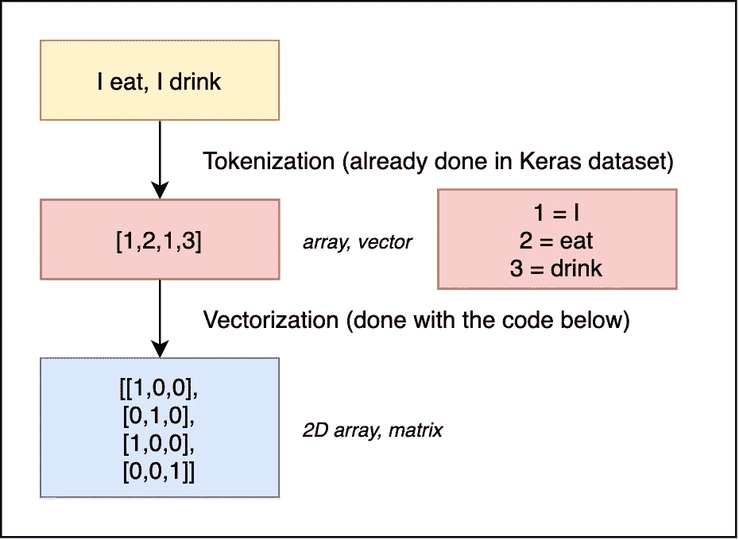

# 十大二元分类算法[初学者指南]

> 原文：<https://towardsdatascience.com/top-10-binary-classification-algorithms-a-beginners-guide-feeacbd7a3e2?source=collection_archive---------5----------------------->

## 如何用几行 Python 代码实现 10 个最重要的二进制分类算法


Javier Allegue Barros 在 [Unsplash](https://unsplash.com?utm_source=medium&utm_medium=referral) 上拍摄的照片

# 介绍

B 一元分类问题可以通过从朴素贝叶斯到深度学习网络的各种机器学习算法来解决。哪种解决方案在运行时间和准确性方面表现最佳取决于数据量(样本和要素的数量)和数据质量(异常值、不平衡数据)。

本文提供了一个概述和代码示例，您可以很容易地自己尝试。目标是快速获得 Python 的第一个工作结果。在这里，我将保持事情简短，并将详细解释每个算法。我已经添加了对每个算法的参考，以防你想了解更多关于算法，它的基本理论和如何调整它的参数。

在本文中，我们将重点介绍 10 种最常见的二进制分类算法:

1.  [朴素贝叶斯](https://scikit-learn.org/stable/modules/naive_bayes.html)
2.  [逻辑回归](/understanding-logistic-regression-9b02c2aec102)
3.  [K-最近邻](/machine-learning-basics-with-the-k-nearest-neighbors-algorithm-6a6e71d01761)
4.  [支持向量机](/support-vector-machine-introduction-to-machine-learning-algorithms-934a444fca47)
5.  [决策树](/decision-trees-in-machine-learning-641b9c4e8052)
6.  [Bagging 决策树(集成学习 I)](https://medium.com/ml-research-lab/bagging-ensemble-meta-algorithm-for-reducing-variance-c98fffa5489f)
7.  [增强决策树(集成学习 II)](https://medium.com/ml-research-lab/boosting-ensemble-meta-algorithm-for-reducing-bias-5b8bfdce281)
8.  [随机森林(集成学习 III)](https://medium.com/all-things-ai/in-depth-parameter-tuning-for-random-forest-d67bb7e920)
9.  [投票分类(集成学习 IV)](https://scikit-learn.org/stable/modules/generated/sklearn.ensemble.VotingClassifier.html)
10.  [神经网络(深度学习)](https://medium.com/botsupply/a-beginners-guide-to-deep-learning-5ee814cf7706)

为了让事情尽可能简单，我们在本教程中将只使用三个 Python 库: [*Numpy*](https://numpy.org/) 、 [*Sklearn*](https://scikit-learn.org/) 和 [*Keras*](https://keras.io/) 。

在代码示例中，我总是在代码片段的顶部导入必要的 Python 模块，以明确接下来会用到它。你可以在你的脚本开始的时候加载它们。

我创建了一个 Jupyter 笔记本，里面有你能在我的 Github 资源库中找到的所有代码:[https://Github . com/alexortner/teaching/tree/master/binary _ classification](https://github.com/alexortner/teaching/tree/master/binary_classification)

# 资料组

在本文中，我们将对电影评论进行二元情感分析，这是自然语言处理中的一个常见问题。

我们使用高度极性电影评论的 [IMDB 数据集](https://keras.io/api/datasets/imdb/)，以对不同电影的文本评论和正面或负面评分的形式。

目标是通过分析评论文本中的情感来训练可以预测评论的模型。

## 数据导入

我们直接从 *Keras* 加载数据集。这样做的好处是，我们不需要下载文件，也几乎不需要在代码中准备数据。Keras 网站的描述称:

> 这是来自 IMDB 的 25，000 个电影评论的数据集，由情绪(正面/负面)标记。评论已经过预处理，每个评论都被编码成一个单词索引(整数)列表。为方便起见，单词按数据集中的总频率进行索引，例如，整数“3”编码数据中第三个最频繁出现的单词。这允许快速过滤操作，例如:“仅考虑前 10，000 个最常用的单词，但排除前 20 个最常用的单词”。
> 
> 按照惯例，“0”不代表特定的单词，而是用于编码任何未知的单词。
> 
> (引自:[https://keras.io/api/datasets/imdb/](https://keras.io/api/datasets/imdb/))

```
import keras.datasets as keras_data(imdb_train_data,imdb_train_labels),(imdb_test_data,imdb_test_labels) = keras_data.imdb.load_data(num_words=10000)
```

*num_words* 将文本导入限制为 10，000 个最常用的单词。

## 数据的快速概览

训练和测试数据各包含 25000 个样本。来自 *Keras* 源的文本已经被标记化，这意味着它被编码成一个整数序列，其中每个数字对应一个单词。

```
print(imdb_train_data.shape)
print(imdb_test_data.shape)print(imdb_train_data[5])**# output** (25000,)
(25000,)
[1, 778, 128, 74, 12, 630, 163, 15, 4, 1766, 7982, 1051, 2, 32, 85, 156, 45, 40, 148, 139, 121, 664, 665, 10, 10, 1361, 173, 4, 749, 2, 16, 3804, 8, 4, 226, 65, 12, 43, 127, 24, 2, 10, 10]
```

如果您想以明文形式查看评论，可以使用数据集中的 *get_word_index* 函数将索引映射回原始单词。请记住，标点和空格已经从数据集中移除，因此无法恢复。

```
word_index = keras_data.imdb.get_word_index()**# map index to word mapping into a Python dict**
reverse_word_index = dict([(value,key) for (key,value) in word_index.items()])**# map the word index to one of the tokenized comments**
decoded_word_index = ''.join([reverse_word_index.get(i-3,'?') for i in imdb_train_data[5]])
```

打印单词索引列表中最常用的 10 个单词:

```
for key in sorted(reverse_word_index.keys()):
    if(key<=10): 
        print("%s: %s" % (key, reverse_word_index[key]))**# output**
1: the
2: and
3: a
4: of
5: to
6: is
7: br
8: in
9: it
10: i
```

打印解码的注释:

```
print(decoded_word_index)**# output**
beginsbetterthanitendsfunnythattherussiansubmarinecrewoutperformsallotheractorsit'slikethosesceneswheredocumentaryshotsbrbrspoilerpartthemessagedechiferedwascontrarytothewholestoryitjustdoesnotmeshbrbr
```

## 数据矢量化和一键编码

目前，每个样本都是一个整数数组，长度取决于注释的文本长度。所使用的算法需要一个张量，其中每个样本具有相同数量的特征。为此，我们通过将每个数字替换为长度为 10，000 的向量来对整数列表进行一次性编码，该向量在索引位置的值为 1，在所有其他位置的值为 0。所以我们基本上是把整数序列编码成二进制矩阵。



文本的符号化和矢量化示意图(图片由作者提供)

对于向量化，我们写一个简单的函数

```
import numpy as npdef vectorize_sequence(sequences,dimensions):
    results=np.zeros((len(sequences),dimensions))
    for i, sequence in enumerate(sequences):
        results[i,sequence] = 1.
    return results
```

并用它将我们的测试和训练数据转换成张量

```
x_train=vectorize_sequence(imdb_train_data,10000)
x_test=vectorize_sequence(imdb_test_data,10000)
```

标签数据已经是一个二进制整数，我们只需将它转换成一个 *Numpy* 数组和浮点类型，因为 *Keras* 只接受这种数据类型

```
y_train=np.asarray(imdb_train_labels).astype('float32')
y_test=np.asarray(imdb_test_labels).astype('float32')
```

对张量形状的检查表明，对于训练和测试数据集，我们现在有 25000 个样本和 10000 个特征

```
print(x_train.shape)
print(x_test.shape)**#output**
(25000, 10000)
(25000, 10000)
```

# 1.朴素贝叶斯

朴素贝叶斯方法是一种监督学习算法，它基于应用贝叶斯定理和给定类变量值的每对要素之间条件独立性的“朴素”假设。

```
from sklearn.naive_bayes import MultinomialNBmnb = MultinomialNB().fit(x_train, y_train)print("score on test: " + str(mnb.score(x_test, y_test)))
print("score on train: "+ str(mnb.score(x_train, y_train)))
```

**总结:**朴素贝叶斯算法对于这个特征丰富的数据集非常快(记住我们有一个具有 10，000 个特征向量的张量)，并且已经提供了 80%以上的好结果。训练和测试数据上的得分彼此接近，这表明我们没有过度拟合。

```
**Results Naive Bayes**
+-------------+------+
| **run time**    | 2s   |
+-------------+------+
| **train score** | 0.87 |
+-------------+------+
| **test score ** | 0.84 |
+-------------+------+
```

# 2.逻辑回归

[逻辑回归](/understanding-logistic-regression-9b02c2aec102)是解决分类问题的最古老、最基本的算法之一:

```
from sklearn.linear_model import LogisticRegressionlr=LogisticRegression(max_iter=1000)
lr.fit(x_train, y_train)print("score on test: " + str(lr.score(x_test, y_test)))
print("score on train: "+ str(lr.score(x_train, y_train)))
```

**总结:**逻辑回归需要相当长的训练时间，而且会过拟合。从训练数据得分(98%)与测试数据得分(86%)的偏差中可以看出算法过拟合。

```
**Results Logistic Regression** +-------------+------+
| **run time**    | 60s  |
+-------------+------+
| **train score** | 0.98 |
+-------------+------+
| **test score ** | 0.86 |
+-------------+------+
```

# 3.k-最近邻

[k-最近邻(KNN)](/machine-learning-basics-with-the-k-nearest-neighbors-algorithm-6a6e71d01761) 算法是一种监督机器学习算法，可用于解决分类和回归问题。对于 KNN，众所周知，它不太适用于大型数据集(高样本量)，尤其是许多特征(高维)。我们具有 25000 个样本和 10000 个特征的数据集对于该算法来说已经不是最优的了。我必须设置两个参数， *algorithm = "brute "和 n_jobs=-1* 来让分类器在最近运行。

```
from sklearn.neighbors import KNeighborsClassifierknn = KNeighborsClassifier(algorithm = 'brute', n_jobs=-1)knn.fit(x_train, y_train)print("train shape: " + str(x_train.shape))
print("score on test: " + str(knn.score(x_test, y_test)))
print("score on train: "+ str(knn.score(x_train, y_train)))
```

**总结:**不出所料，这个算法不太适合这类预测问题。它需要 12 分钟，预测非常差，只有 62%，并显示出过度拟合的趋势。

```
**Results K-Nearest Neighbours** +-------------+------+
| **run time**    | 12m  |
+-------------+------+
| **train score** | 0.79 |
+-------------+------+
| **test score ** | 0.62 |
+-------------+------+
```

# 4.支持向量机

[支持向量机](/support-vector-machine-introduction-to-machine-learning-algorithms-934a444fca47)是用于分类和回归任务的简单算法。它能以较小的计算能力非常快地提供高精度。由于大量的特性，我们使用 *LinearSVC。*结果表明，设置正则化参数 *C=0.0001* 提高了预测质量，减少了过拟合。

```
from sklearn.svm import LinearSVCsvm=LinearSVC(C=0.0001)
svm.fit(x_train, y_train)print("score on test: " + str(svm.score(x_test, y_test)))
print("score on train: "+ str(svm.score(x_train, y_train)))
```

**总结:**支持向量机速度非常快，预测得分高，没有过拟合问题。

```
**Results Support Vector Machine** +-------------+------+
| **run time**    | 2s   |
+-------------+------+
| **train score** | 0.86 |
+-------------+------+
| **test score ** | 0.85 |
+-------------+------+
```

# 5.决策图表

[决策树](/decision-trees-in-machine-learning-641b9c4e8052)是一种用于分类和回归的非参数监督学习方法。目标是通过学习从数据特征推断的简单决策规则(if-else)来创建预测目标变量的值的模型。

```
from sklearn.tree import DecisionTreeClassifierclf = DecisionTreeClassifier()
clf.fit(x_train, y_train)print("score on test: "  + str(clf.score(x_test, y_test)))
print("score on train: " + str(clf.score(x_train, y_train)))
```

**总结:**对这个特征丰富的数据集应用单个决策树会导致大量的过度拟合。事实上，100%的准确率意味着它准确地记住了训练数据集，因此对测试数据的概括很差。我们在这里看到的是单一决策树的缺点之一，它不能处理太多特征的数据。

```
**Results Decision Tree** +-------------+------+
| **run time**    | 4m   |
+-------------+------+
| **train score** | 1.0  |
+-------------+------+
| **test score ** | 0.70 |
+-------------+------+
```

然而，这个问题可以通过调整算法的一些参数或引入集成学习技术来解决。在这里可以找到关于决策树分类器参数调优的深度文章:[https://medium . com/@ mohtedibf/indepth-parameter-tuning-for-decision-tree-6753118 a03c 3](https://medium.com/@mohtedibf/indepth-parameter-tuning-for-decision-tree-6753118a03c3)。接下来，我们将关注一些常见的集成学习方法。

# 6.Bagging 决策树(集成学习 I)

当决策树过度拟合时，应用像 bagging 这样的[集成学习算法可能会提高预测模型的质量。在打包中，通过从训练数据中提取引导来增加训练数据。这意味着从训练数据中获取多个样本(替换)，并在这些子数据集上训练模型。最终预测是每个引导样本所有预测的平均值。](https://medium.com/ml-research-lab/bagging-ensemble-meta-algorithm-for-reducing-variance-c98fffa5489f)

```
from sklearn.ensemble import BaggingClassifier
from sklearn.tree import DecisionTreeClassifier**# max_samples:** maximum size 0.5=50% of each sample taken from the full dataset**# max_features:** maximum of features 1=100% taken here all 10K 
**# n_estimators:** number of decision trees bg=BaggingClassifier(DecisionTreeClassifier(),max_samples=0.5,max_features=1.0,n_estimators=10)
bg.fit(x_train, y_train)print("score on test: " + str(bg.score(x_test, y_test)))
print("score on train: "+ str(bg.score(x_train, y_train)))
```

**总结:**Bagging 分类器要慢得多，因为它基本上运行 10 个决策树，但人们可以看到我们在单个决策树上看到的过度拟合的减少和测试分数的增加。调整参数以进一步改善这个结果。

```
**Results Bagging Decision Tree** +-------------+------+
| **run time**    | 10m  |
+-------------+------+
| **train score** | 0.93 |
+-------------+------+
| **test score ** | 0.77 |
+-------------+------+
```

# 7.推进决策树(集成学习 II)

一般来说，我们不能用[提升](https://medium.com/ml-research-lab/boosting-ensemble-meta-algorithm-for-reducing-bias-5b8bfdce281)来改善一个*分值= 1* 的完全过拟合的模型。要应用 Boosting，我们首先必须稍微调整一下决策树分类器。我花了一些试验和错误，直到我得到了决策树和 AdaBoost 分类器的最佳参数。我确信你可以通过更多的比赛进一步提高。

```
from sklearn.ensemble import AdaBoostClassifier
from sklearn.tree import DecisionTreeClassifieradb = AdaBoostClassifier(DecisionTreeClassifier(min_samples_split=10,max_depth=4),n_estimators=10,learning_rate=0.6)
adb.fit(x_train, y_train)print("score on test: " + str(adb.score(x_test, y_test)))
print("score on train: "+ str(adb.score(x_train, y_train)))
```

**总结:**通过 Boosting 和改进的底层决策树，我们摆脱了过拟合问题。尽管我们只能以大约 80%的把握进行预测，但我们可以对所有的测试数据进行可靠的预测。

```
**Results Boosting Decision Tree** +-------------+------+
| **run time**    | 5m   |
+-------------+------+
| **train score** | 0.80 |
+-------------+------+
| **test score ** | 0.78 |
+-------------+------+
```

# 8.随机森林(集成学习 III)

[随机森林算法](https://medium.com/all-things-ai/in-depth-parameter-tuning-for-random-forest-d67bb7e920)是另一种常用的集成学习分类器，它使用多个决策树。随机森林分类器基本上是决策树的改进的 bagging 算法，它不同地选择子集。我发现 *max_depth=9* 对于这个特性丰富的数据集来说是一个很好的值。

```
from sklearn.ensemble import RandomForestClassifier**# n_estimators = number of decision trees** rf = RandomForestClassifier(n_estimators=30, max_depth=9)
rf.fit(x_train, y_train)print("score on test: " + str(rf.score(x_test, y_test)))
print("score on train: "+ str(rf.score(x_train, y_train)))
```

**总结:**随机森林不会过拟合，其预测分数与增强决策树的预测分数相当，但它的性能要好得多，因为它比增强决策树快一个数量级以上(快 15 倍)。

```
**Results Random Forest** +-------------+------+
| **run time**    | 20s  |
+-------------+------+
| **train score** | 0.83 |
+-------------+------+
| **test score ** | 0.80 |
+-------------+------+
```

# 9.投票分类器(集成学习 IV)

这个来自集成学习工具箱的分类器评估不同的分类器并从中选择最好的

> `[**VotingClassifier**](https://scikit-learn.org/stable/modules/generated/sklearn.ensemble.VotingClassifier.html#sklearn.ensemble.VotingClassifier)`背后的想法是结合概念上不同的机器学习分类器，并使用多数投票或平均预测概率来预测类别标签。这种分类器可以用于一组同样表现良好的模型，以平衡它们各自的弱点。
> 
> (引用自:[https://sci kit-learn . org/stable/modules/generated/sk learn . ensemble . voting classifier . html](https://scikit-learn.org/stable/modules/generated/sklearn.ensemble.VotingClassifier.html#sklearn.ensemble.VotingClassifier))

因此，让我们使用这个分类器来组合我们到目前为止的一些模型，并应用投票分类器

*   朴素贝叶斯(84%，2 秒)
*   逻辑回归(86%，60 秒，过度拟合)
*   随机森林(80%，20 秒)
*   支持向量机(85%，10s)

请注意，对于这个代码片段，所有使用的模型定义都必须加载到 Python 内核中。

```
from sklearn.ensemble import VotingClassifier**# 1)** naive bias = mnb
**# 2)** logistic regression =lr
**# 3)** random forest =rf
**# 4)** support vector machine = svmevc=VotingClassifier(estimators=[('mnb',mnb),('lr',lr),('rf',rf),('svm',svm)],voting='hard')
evc.fit(x_train, y_train)print("score on test: " + str(evc.score(x_test, y_test)))
print("score on train: "+ str(evc.score(x_train, y_train)))
```

*   **总结:**即使有点过拟合，但它在测试数据上得到了迄今为止最好的预测分数。

```
**Results Voting Classifier** +-------------+------+
| **run time**    | 2s   |
+-------------+------+
| **train score** | 0.91 |
+-------------+------+
| **test score ** | 0.86 |
+-------------+------+
```

# 10.神经网络(深度学习)

[深度学习](https://medium.com/botsupply/a-beginners-guide-to-deep-learning-5ee814cf7706)使用人工神经网络，该网络使用多层从训练数据中逐步提取更高级别的特征。我们使用一个简单的三层网络，没有任何优化，除了使用一个小的验证数据集。这里我们用的是 *Keras* 而不是 *Sklearn。*

```
from keras import layers
from keras import models
from keras import optimizers
from keras import losses
from keras import metrics**# split an additional validation dataset**
x_validation=x_train[:1000]
x_partial_train=x_train[1000:]
y_validation=y_train[:1000]
y_partial_train=y_train[1000:]model=models.Sequential()
model.add(layers.Dense(16,activation='relu',input_shape=(10000,)))
model.add(layers.Dense(16,activation='relu'))
model.add(layers.Dense(1,activation='sigmoid'))
model.compile(optimizer='rmsprop',loss='binary_crossentropy',metrics=['accuracy'])model.fit(x_partial_train,y_partial_train,epochs=4,batch_size=512,validation_data=(x_validation,y_validation))print("score on test: " + str(model.evaluate(x_test,y_test)[1]))
print("score on train: "+ str(model.evaluate(x_train,y_train)[1]))
```

**总结:**使用神经网络得到了迄今为止我们所达到的最好的测试分数，大约为 88%。然而，标准设置导致训练数据的过度拟合。

这个问题可以通过添加一些较小的调整参数来轻松解决，这些参数会将训练分数降低到 0.90。

在下文中，我应用了在神经网络中处理过拟合的 [3 个最佳实践:](/handling-overfitting-in-deep-learning-models-c760ee047c6e)

1.  缩小网络的规模
2.  增加一些重量调整
3.  添加辍学

```
from keras import layers
from keras import models
from keras import optimizers
from keras import losses
from keras import regularizers
from keras import metrics# add validation dataset
validation_split=1000
x_validation=x_train[:validation_split]
x_partial_train=x_train[validation_split:]
y_validation=y_train[:validation_split]
y_partial_train=y_train[validation_split:]model=models.Sequential()
model.add(layers.Dense(**8**,**kernel_regularizer=regularizers.l2(0.003)**,activation='relu',input_shape=(10000,)))
**model.add(layers.Dropout(0.5))** model.add(layers.Dense(**8**,**kernel_regularizer=regularizers.l2(0.003)**,activation='relu'))
**model.add(layers.Dropout(0.6))** model.add(layers.Dense(1,activation='sigmoid'))
model.compile(optimizer='rmsprop',loss='binary_crossentropy',metrics=['accuracy'])model.fit(x_partial_train,y_partial_train,epochs=4,batch_size=512,validation_data=(x_validation,y_validation))print("score on test: " + str(model.evaluate(x_test,y_test)[1]))
print("score on train: "+ str(model.evaluate(x_train,y_train)[1]))**Results Deep Learning with Neural Network standard** +-------------+------+
| **run time**    | 8s   |
+-------------+------+
| **train score** | 0.95 |
+-------------+------+
| **test score ** | 0.88 |
+-------------+------+**Results Deep Learning with Neural Network optimised** +-------------+------+
| **run time**    | 8s   |
+-------------+------+
| **train score** | 0.90 |
+-------------+------+
| **test score ** | 0.88 |
+-------------+------+
```

# 摘要

我们现在在同一数据集上训练了 10 种不同的机器学习算法来解决同一任务，根据对文本段落的情感分析预测正面或负面的评论。让我们看看谁在预测质量和运行时间方面胜出。参数过拟合(OF)就是训练分数与测试分数之间的差异。如果它很大，这意味着我们有很高的过度拟合。

```
+----+-------------------+----------+-------+------+---------+
**| No | Algorithm         | Time [s] | Train | Test | OF      |**
+----+-------------------+----------+-------+------+---------+
| 1  | Naive Bayes       | **2 **       | 0.87  | 0.84 | 0.03    |
+----+-------------------+----------+-------+------+---------+
| 2  | Logistic Reg.     | 60       | 0.98  | **0.86** | **0.12 !!** |
+----+-------------------+----------+-------+------+---------+
| 3  | KNN               | 720      | 0.79  | 0.62 | **0.17** !! |
+----+-------------------+----------+-------+------+---------+
| 4  | SVM               | **2**        | 0.86  | 0.85 | 0.01    |
+----+-------------------+----------+-------+------+---------+
| 5  | Decision Tree     | 240      | 1.0   | 0.70 | **0.3 !! ** |
+----+-------------------+----------+-------+------+---------+
| 6  | Bagging DT        | 600      | 0.93  | 0.77 | **0.16 !!** |
+----+-------------------+----------+-------+------+---------+
| 7  | Boosting DT       | 300      | 0.80  | 0.78 | 0.02    |
+----+-------------------+----------+-------+------+---------+
| 8  | Random Forest     | 20       | 0.83  | 0.80 | 0.03    |
+----+-------------------+----------+-------+------+---------+
| 9  | Voting Classifier | **2 **       | 0.91  | **0.86** | 0.04    |
+----+-------------------+----------+-------+------+---------+
| 10 | **Neuronal Network**  | **8**        | 0.90  | **0.88** | 0.02    |
+----+-------------------+----------+-------+------+---------+
```

## **最佳运行时间:**

在运行时间方面，最快的算法是**朴素贝叶斯、支持向量机、投票分类器**和**神经网络。**

## **最佳预测得分:**

就测试数据集的最佳预测而言，最佳算法是**逻辑回归、投票分类器**和**神经网络。**

## **最差过拟合:**

过拟合最多的算法是**逻辑回归、K 近邻**、**决策树**和 **Bagging 决策树。**

## **最佳算法:**

解决该文本情感分析任务的总体最佳方法是**神经网络、**，其速度快、精度高且低过拟合。速度稍快但预测质量稍差的是**投票分类器**。

# Jupyter 笔记本

你可以在我的 Github 资源库中找到所有作为 Jupyter 笔记本的代码:[https://Github . com/alexortner/teaching/tree/master/binary _ classification](https://github.com/alexortner/teaching/tree/master/binary_classification)

在这里，您会发现应用于不同机器学习问题和数据集的相同的前 10 个二进制分类算法。

1.  IMDB 数据集— *自然语言处理* —二元情感分析
2.  FashionMNIST 数据集— *计算机视觉* —二值图像分类
3.  威斯康星州乳腺癌数据集-简单二元分类法

# 感谢阅读！

我希望你喜欢这篇文章。如果您看到任何需要纠正的地方，请发表评论，以便我尽快修复。