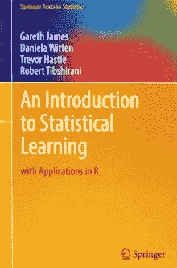
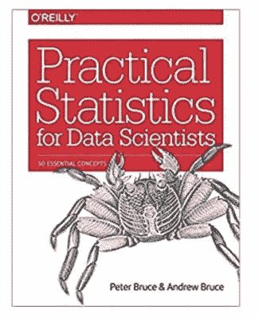
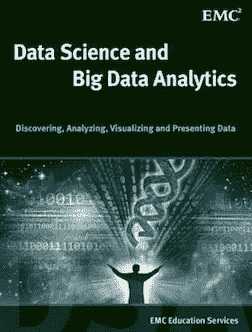
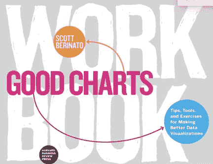
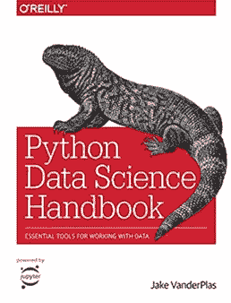
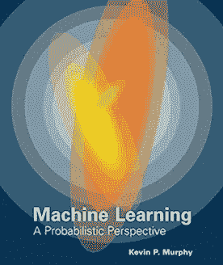
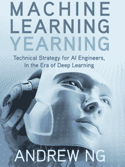
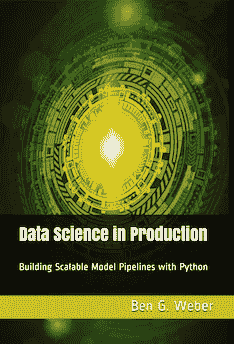

# 2020 年研究数据科学和机器学习的前 8 本书

> 原文：<https://towardsdatascience.com/top-10-books-to-study-data-science-and-machine-learning-in-2020-483a8c9279b1?source=collection_archive---------31----------------------->

本文涵盖了一些最受欢迎的数据科学书籍，旨在帮助新手探索数据科学的世界，并帮助有经验的从业者获得更深入的知识。以下是我发现有用或被推荐的前 8 条。

以下书籍将让你了解和理解数据科学的重要领域，如**统计学、数据科学、机器学习、深度学习和部署**。

# 入门水平

# 1.统计学习导论

作者:加雷斯·詹姆斯、丹妮拉·威滕、特雷弗·哈斯蒂和罗伯特·蒂布拉尼

这本书非常适合**初学者**，有很多插图和真实世界的场景，结合在一起是一堂容易理解的机器学习课。这本书的长处在于解释关键概念。我也可以向 Python 开发人员强烈推荐这一点。广泛应用于大学课程。

# 2.数据科学家实用统计学

彼得·布鲁斯

这是数据科学统计学中许多概念的综合参考指南。这是一本**在统计学和数据科学之间架起桥梁的好书**。尽管这本书假设读者熟悉 R，但它仍然是 Python 程序员学习统计概念的好书。

# 3.**数据科学和大数据分析:发现、分析、可视化和呈现数据**

本书介绍了**大数据并涵盖了数据分析生命周期**。这本书易于阅读，并且澄清了所有的概念，否则你可能很难在其他地方找到。还向读者介绍了使用 **MapReduce、Hadoop 和 SQL** 的高级分析。

# 4.制作更好的数据可视化的好图表、提示工具和练习

作者:斯科特·贝里纳托

在本书中，你将学会如何选择最适合你的数据的**图表**；当你有决策者的五分钟时间时，与他们沟通的最有效方式；如何有效地使用色彩？

# 中间能级

# 5.Python 数据科学手册

杰克·范德普拉斯

Python 数据科学手册也是所有标准 Python 库的优秀指南:NumPy、pandas、Matplotlib、Scikit-learn。对于有 Python 经验但需要数据科学工作可用工具指南的人来说，这是完美的。

# 专家级

如果你是专家级别的，那么我会推荐阅读科学论文。

# 6.概率视角下的机器学习

凯文·p·墨菲

如果你对数学感兴趣，那么你会喜欢这本书，并且作为机器学习研究的参考非常有用。

# 7.机器学习向往

作者:吴恩达

这本书旨在教数据科学家**如何构建机器学习项目**，并为数据科学团队设定方向。它很好地概述了何时以及如何使用机器学习，以及如何处理在现实世界中实现人工智能所涉及的复杂性。

# 8.生产中的数据科学；用 Python 构建可扩展的模型管道

作者本·G·韦伯

这本书涵盖了**云部署**、**开发 web 端点**和**机器学习模型。**韦伯从自上而下的方法教导:建立可复制的模型，在生产中可以很好地扩展。在 **PySpark** 、 **Pub/Sub** 技术和 **Kafka** 之间，Weber 深入研究了基本的数据科学工具。