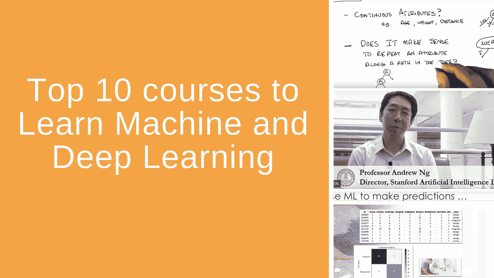
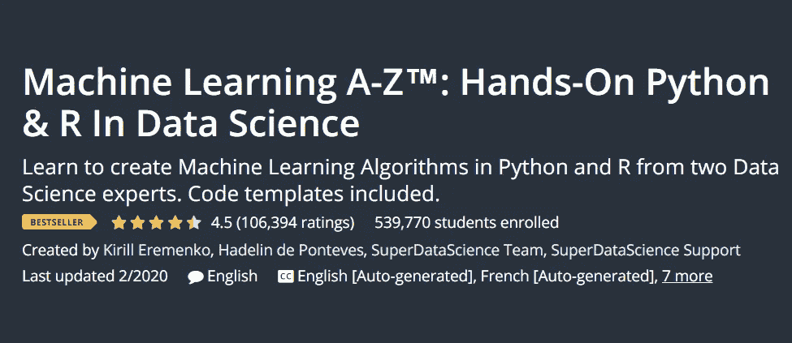

# 学习机器和深度学习的 10 大课程(2020)

> 原文：<https://towardsdatascience.com/top-10-courses-to-learn-machine-and-deep-learning-2020-7cc2d9c3bae3?source=collection_archive---------26----------------------->

# 机器学习课程——终极清单

你知道我开始学机器学习的时候希望拥有什么吗？多合一机器学习课程。当时，要找到一门包含所有必要概念和算法的好课程真的很难。所以我们被迫在网上搜索，阅读研究论文，买书。

幸运的是，情况不再是这样了。现在我们的情况正好相反。外面有那么多课程。我应该如何知道哪一个是好的，这包括我需要学习的所有东西。所以我在这里整理了一份最受欢迎和教授得最好的课程清单。

大部分我都有亲身经历，我强烈推荐所有的。我认识的每一个机器学习工程师或数据科学家都建议他们中的一个或多个。所以不要再往前看了。好了，我们开始吧。

# [1)斯坦福大学(Coursera)的机器学习](https://click.linksynergy.com/deeplink?id=r24KwW5qbBo&mid=40328&murl=https%3A%2F%2Fwww.coursera.org%2Flearn%2Fmachine-learning)

斯坦福大学的这门课程被许多人认为是最好的机器学习课程。它是由吴恩达亲自教授的(对于那些不认识他的人，他是斯坦福大学教授、Coursera 的联合创始人、谷歌大脑的联合创始人和百度的副总裁)，它涵盖了你需要知道的所有基础知识。此外，它的评分高达 4.9 分(满分 5 分)。

该材料是完全独立的，适合初学者，因为它教你线性代数和微积分的基本原理以及监督学习。我能想到的一个缺点是，它使用 Octave(Matlab 的开源版本)而不是 Python 和 R，因为它真的希望你专注于算法而不是编程。

费用:免费审核，如果你想要证书，79 美元

完成时间:76 小时

评分:4.9/5

教学大纲:

*   一元线性回归
*   线性代数评论
*   多元线性回归
*   Octave/Matlab 教程
*   逻辑回归
*   正规化
*   神经网络:表示
*   神经网络:学习
*   应用机器学习的建议
*   机器学习系统设计
*   支持向量机
*   降维
*   异常检测
*   推荐系统
*   大规模机器学习
*   应用示例:照片 OCR

# [2)Deep Learning . ai(Coursera)深度学习专业化](https://click.linksynergy.com/deeplink?id=r24KwW5qbBo&mid=40328&murl=https%3A%2F%2Fwww.coursera.org%2Fspecializations%2Fdeep-learning)

这是一门由吴恩达教授的课程，也被认为是深度学习领域的佼佼者。你看到这里的模式了吗？它实际上由 5 门不同的课程组成，它将让你清楚地了解最重要的神经网络架构。说真的，如果你对 DL 感兴趣，不要再看了。

它利用 Python 和 TensorFlow 库(可能需要了解一些背景知识),让您有机会处理自然语言处理、计算机视觉、医疗保健等现实生活中的问题。

费用:免费审核，认证费 49 美元/月

完成时间:3 个月(11 小时/周)

评分:4.8/5

教学大纲:

*   神经网络和深度学习
*   改进神经网络:超参数调整、正则化和优化
*   构建机器学习项目
*   卷积神经网络
*   序列模型

# [3)高级机器学习专业化(Coursera)](https://click.linksynergy.com/deeplink?id=r24KwW5qbBo&mid=40328&murl=https%3A%2F%2Fwww.coursera.org%2Fspecializations%2Faml)

高级机器学习专业由国立研究大学高等经济学院提供，由顶级 Kaggle 机器学习实践者和 CERN 科学家组织和教授，包括 7 门不同的课程，涵盖强化学习和自然语言处理等更高级的主题。你可能需要更多的数学知识和对 ML 基本概念的理解，但是优秀的教学和有趣的环境会弥补你的不足。我强烈推荐它。

费用:免费审核，认证费 49 美元/月

完成时间:8-10 个月(每周 6-10 小时)

评分:4.6/10

教学大纲:

*   深度学习简介
*   如何赢得数据科学竞赛:向顶级 Kagglers 学习
*   机器学习的贝叶斯方法
*   实用强化学习
*   计算机视觉中的深度学习
*   自然语言处理
*   通过机器学习应对大型强子对撞机的挑战

# [4)佐治亚理工学院(Udacity)的机器学习](https://www.udacity.com/course/machine-learning--ud262)

如果你需要一个整体的方法和一个互动的环境，这就是你的课程。不得不承认，我还没见过比这更完整的课程。从有监督的学习到无监督的强化，你能想到的它都有。

它不会教你深度神经网络，但它会让你清楚地了解所有不同的 ML 算法，它们的优点，它们的缺点以及它们如何在现实世界中使用。此外，如果你是整个课程中非常短的视频和互动测验的粉丝，它对你来说是一个完美的匹配。

费用:免费

完成时间:4 个月

教学大纲:

*   监督学习
*   无监督学习
*   强化学习

> 【theaisummer.com关于机器学习和人工智能的更多教育内容和资源，请不要忘记查看我们的博客

# **[5)机器学习入门(Udacity)](https://www.udacity.com/course/intro-to-machine-learning--ud120)**

**这门入门课是由 Udacity 的联合创始人巴斯蒂安·特龙和数据科学研发总监凯蒂·马龙设计和教授的。它的主要受众是正在寻找 ML 入门课程的初学者。同样，如果你喜欢 Udacity 的环境(我个人也喜欢)，这是一个很好的入门选择。**

**费用:免费**

**完成时间:10 周**

**教学大纲:**

*   **欢迎来到机器学习**
*   **朴素贝叶斯**
*   **支持向量机**
*   **决策树**
*   **选择你自己的算法**
*   **数据集和问题**
*   **回归**
*   **极端值**
*   **使聚集**
*   **特征缩放**

# **[6)深度学习纳米度(Udacity)](https://www.udacity.com/course/deep-learning-nanodegree--nd101)**

**Udacity 的深度学习 Nanodegree 将教你从卷积网络到生成对抗网络的所有前沿 DL 算法。这是相当昂贵的，但也是唯一一个有 5 个不同动手项目的课程。您将构建一个狗品种分类器、一个人脸生成系统和一个情感分析模型，您还将学习如何在生产中部署它们。最棒的是，它是由真正的权威人士讲授的，如伊恩·古德菲勒、朱俊彦、巴斯蒂安·特龙和安德鲁·特拉斯克。**

**费用:1316 €**

**完成时间:4 个月**

**评级 4.6/5**

**教学大纲:**

*   **项目 1:预测自行车共享模式(梯度下降和神经网络)**
*   **项目 2:犬种分类器(CNN，AutoEncoders 和 PyTorch)**
*   **项目 3:制作电视剧本(RNN，LSTM 和嵌入)**
*   **项目 4:生成人脸(GAN)**
*   **项目 5:部署情感分析模型**

# **[7)机器学习由哥大(edX)](https://www.awin1.com/cread.php?awinmid=6798&awinaffid=683487&clickref=&p=%5B%5Bhttps%253A%252F%252Fwww.edx.org%252Fcourse%252Fmachine-learning%5D%5D)**

**我们列表中的下一个是 edX，由哥伦比亚大学提供。它需要大量的数学(线性代数和微积分)和编程(Python 或 Octave)知识，所以如果我是初学者，我不会从这里开始。然而，如果更高级的学生想要发展对算法的数学理解，它可能是理想的。**

**这门课程的独特之处在于，它专注于机器学习的概率领域，涵盖了贝叶斯线性回归和隐马尔可夫模型等主题。**

**费用 **:** 免费审核，证书 227 美元**

**完成时间:12 周**

**教学大纲:**

*   **第一周:最大似然估计，线性回归，最小二乘法**
*   **第二周:岭回归，偏差-方差，贝叶斯法则，最大后验推断**
*   **第三周:贝叶斯线性回归，稀疏性，线性回归的子集选择**
*   **第四周:最近邻分类，贝氏分类器，线性分类器，感知器**
*   **第五周:逻辑回归，拉普拉斯近似，核方法，高斯过程**
*   **第 6 周:最大利润，支持向量机，树，随机森林，助推**
*   **第 7 周:聚类，k-均值，EM 算法，缺失数据**
*   **第八周:高斯混合，矩阵分解**
*   **第九周:非负矩阵分解，潜在因素模型，主成分分析和变异**
*   **第十周:马尔可夫模型，隐马尔可夫模型**
*   **第 11 周:连续状态空间模型，关联分析**
*   **第 12 周:模型选择，后续步骤**

# **[8)程序员实用深度学习，v3 ( by fast.ai)](http://course18.fast.ai/ml.html)**

**《程序员实用深度学习》是一个了不起的免费资源，面向有一些编码背景(但不太多)的人，包括各种笔记、作业和视频。它是围绕着给学生在这个领域的实践经验的想法而建立的，所以期待通过编码来实现。你甚至可以学习如何使用云上的 GPU 服务器来训练你的模型。相当酷。**

**费用:免费**

**完成时间:12 周(每周 8 小时)**

**教学大纲:**

*   **随机森林简介**
*   **随机森林深潜**
*   **性能、验证和模型解释**
*   **功能重要性。树解释程序**
*   **外推和 RF 从零开始**
*   **数据产品和实时编码**
*   **RF 从零开始和梯度下降**
*   **梯度下降和逻辑回归**
*   **正规化、学习率和 NLP**
*   **更多 NLP 和柱状数据**
*   **嵌入**
*   **完整的罗斯曼。伦理问题**

# **[9)机器学习 A-Z:数据科学领域的实践 Python&R](https://www.udemy.com/course/machinelearning/)**

****

**毫无疑问，这是 Udemy 上最受欢迎的人工智能课程，有 50 万学生注册。它是由数据科学家和外汇系统专家基里尔·叶列缅科和数据科学家哈德林·德·庞特维斯共同创建的。在这里，您可以使用 Python 和 r 中的代码模板对最重要的 ML 算法进行分析。**

**成本:199 €(但有折扣。在撰写本文时，价格为 13.99€)**

**完成时间:41 小时**

**教学大纲:**

*   **第 1 部分—数据预处理**
*   **第 2 部分—回归:简单线性回归、多元线性回归、多项式回归、支持向量回归、决策树回归、随机森林回归**
*   **第 3 部分—分类:逻辑回归、K-NN、SVM、核 SVM、朴素贝叶斯、决策树分类、随机森林分类**
*   **第 4 部分—聚类:K-均值，层次聚类**
*   **第 5 部分—关联规则学习:Apriori，Eclat**
*   **第 6 部分—强化学习:置信上限，汤普森抽样**
*   **第 7 部分—自然语言处理:自然语言处理的词袋模型和算法**
*   **第 8 部分—深度学习:人工神经网络、卷积神经网络**
*   **第 9 部分—降维:主成分分析、线性判别分析、核主成分分析**
*   **第 10 部分—模型选择和提升:k 倍交叉验证、参数调整、网格搜索、XGBoost**

# **[10) CS234 —斯坦福的强化学习](https://www.youtube.com/playlist?list=PLoROMvodv4rOSOPzutgyCTapiGlY2Nd8u)**

**名单上最难的课程，因为强化学习无疑要困难得多。但是如果你想深入其中，没有更好的方法了。事实上，这是斯坦福大学的真实录音讲座。所以你自己要做好成为斯坦福学生的准备。Emma Brunskill 教授使理解所有这些复杂的主题变得非常容易，并为您提供了关于 RL 系统和算法的精彩介绍。当然，你会发现很多数学方程和证明，但是涉及到强化学习的时候就没有办法了。**

**你可以在这里找到课程网站[和这个](http://web.stanford.edu/class/cs234/index.html) [Youtube 播放列表](https://www.youtube.com/watch?v=FgzM3zpZ55o&list=PLoROMvodv4rOSOPzutgyCTapiGlY2Nd8u&index=2&t=61s)中的视频讲座**

**费用:免费**

**完成时间:19 小时**

**教学大纲:**

*   **介绍**
*   **给定一个世界模型**
*   **无模型策略评估**
*   **无模型控制**
*   **价值函数逼近**
*   **CNN 和深度 Q 学习**
*   **模仿学习**
*   **政策梯度一**
*   **政策梯度二**
*   **政策梯度三和审查**
*   **快速强化学习**
*   **快速强化学习 2**
*   **快速强化学习 III**
*   **批量强化学习**
*   **蒙特卡罗树搜索**

**给你。机器和深度学习课程的终极清单。其中一些可能太先进，一些可能包含太多的数学，一些可能太贵，但每一个都保证教你在人工智能领域取得成功所需的一切。**

**老实说，你选择哪一个并不重要。都是一流的。重要的是选择一个并开始学习。**

> ****有关机器学习和人工智能的更多教育内容和资源，请不要不看我们的博客就离开**[**theaisummer.com**](https://theaisummer.com/)**

***原载于 2020 年 2 月 10 日 https://theaisummer.com***。****