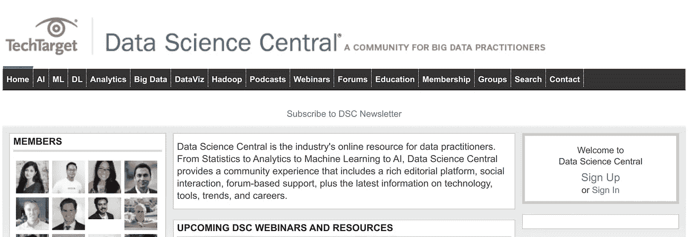
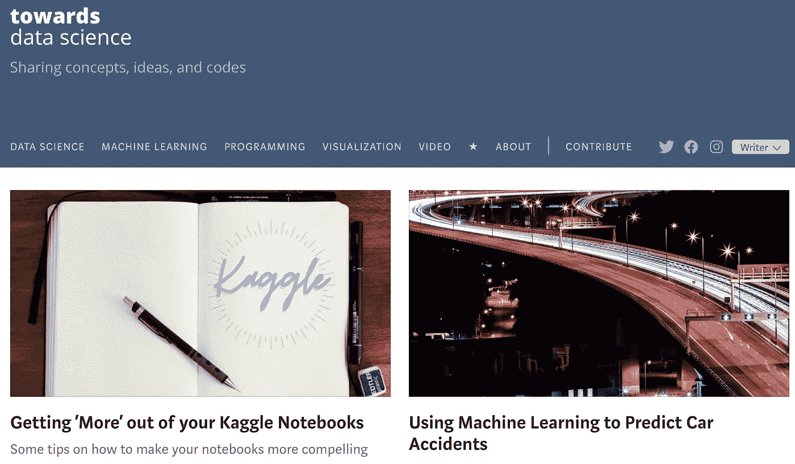
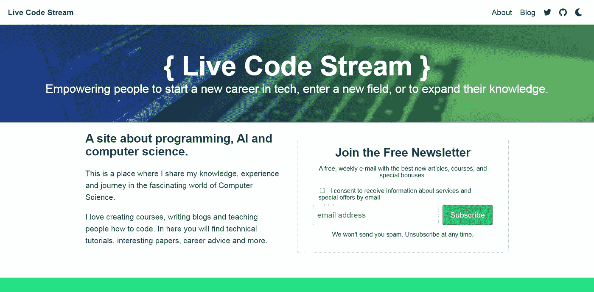
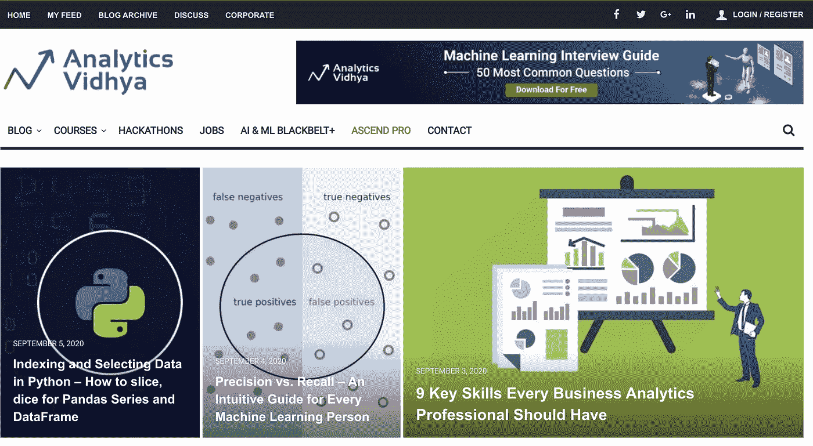
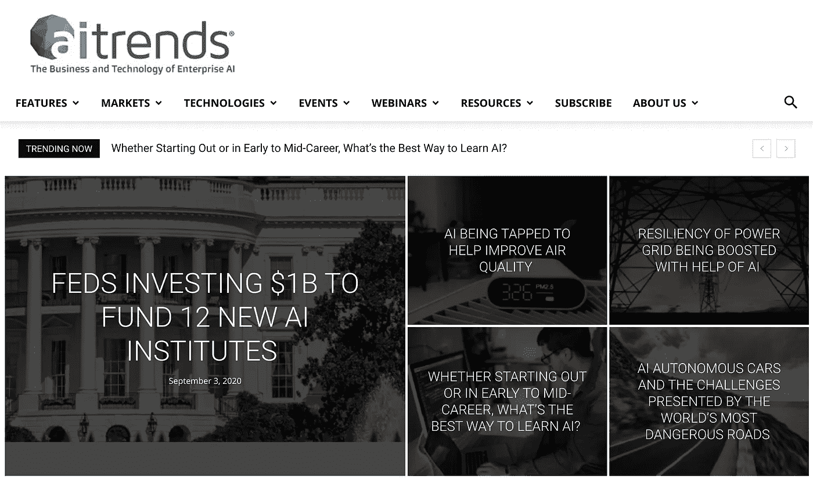
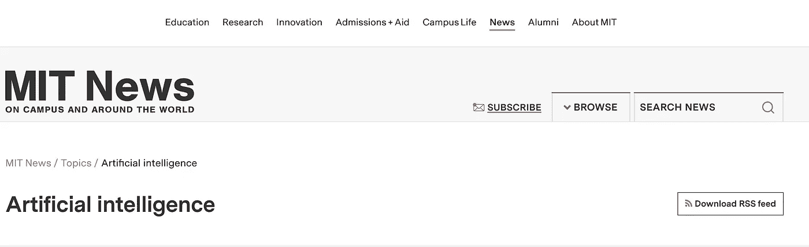
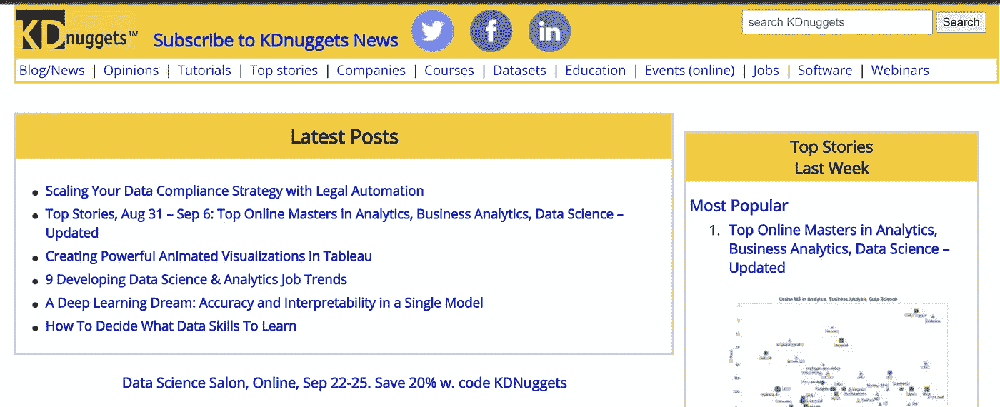
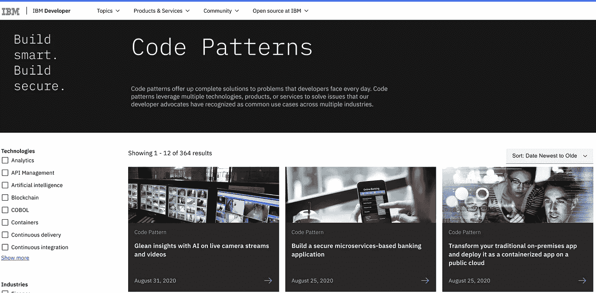
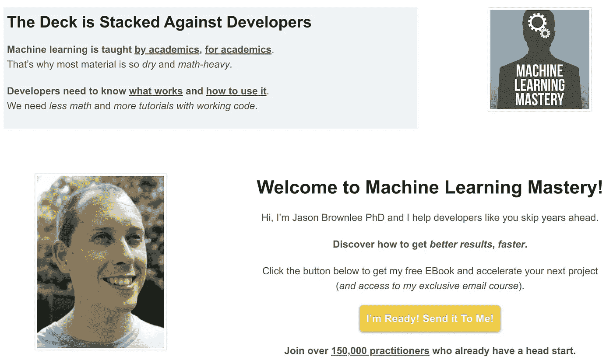

# 2020 年十大数据科学和人工智能博客

> 原文：<https://towardsdatascience.com/top-10-data-science-and-ai-blogs-in-2020-af7367d9a1f3?source=collection_archive---------24----------------------->

## 数据科学

## 2020 年的一些最佳数据科学和人工智能博客

在 [Unsplash](https://unsplash.com/s/photos/artificial-intelligence?utm_source=unsplash&utm_medium=referral&utm_content=creditCopyText) 上由 [Franck V.](https://unsplash.com/@franckinjapan?utm_source=unsplash&utm_medium=referral&utm_content=creditCopyText) 拍摄的照片

**数据科学和人工智能(AI)** 是将塑造这个宇宙未来的新兴领域。数据是公司或政府机构最重要的资产之一。它帮助我们根据过去的经验预测未来。

医学研究人员需要数据来发明治疗方法。气象分析师利用数据调查大气并预测天气状况。甚至，美国国家航空航天局向月球和火星发送任务仅仅是为了收集数据。

简而言之，我们被尚未探索的数据所包围。人工智能可能会帮助我们加快这些数据的收集和分析。

今天，我将分享我个人最喜欢的关于数据科学和人工智能的**博客。我定期阅读它们，以深入了解当前的研究情况和最佳实践。**

这份清单排名不分先后，都是很棒的读物！

(这不是一个赞助的帖子，所有列出的博客都是我最喜欢读的)

# 1- [数据科学中心](https://www.datasciencecentral.com/)

数据科学中心主页

数据科学中心是一个为对人工智能和数据科学感兴趣的人提供的平台。许多顶尖的研究人员和数据从业者都是这个社区的一部分。

人们经常通过博客、播客、网络研讨会和论坛来分享他们的知识。在这里，你甚至可以找到与商业智能、数据分析和统计相关的工作。

我强烈推荐你加入这个志趣相投的社区。请放心，如果您需要一些与数据科学项目相关的帮助，总会有人帮您的。

# 2- [走向数据科学](https://towardsdatascience.com/)

走向数据科学主页

这是一个由数据科学专业人士社区支持的博客。他们用它来与我们分享他们的想法和代码示例。

基本上，在**走向数据科学**上，您将获得专为数据科学受众设计的高质量内容。这意味着您将经常学习一些新概念和可行的技巧，以增强您的数据科学和机器学习技能。

如果您已经对 R、Python 和 JavaScript 等编程语言有所了解，那就太好了。这些语言主要被数据科学家用来执行复杂的计算。

我本人是这份流行媒体出版物的读者和作者，它在名单上，因为它是我每天阅读数据科学的 gotos 之一。

# 3- [实时码流](https://livecodestream.dev/)

实时代码流主页

几年前，我也很难找到关于数据科学、机器学习和人工智能的优质内容。如果您停留在某个地方，几乎没有任何可用的编码解决方案。

在经历了艰难的学习之后(例如，通过代码实验)，我最终决定创建这个博客。主要的想法是与你们分享我的数据科学和编程经验，使用要点教程和指南。

比如我以前发表过类似[使用 JavaScript 的人脸滤镜](https://livecodestream.dev/post/2020-07-12-detecting-face-features-and-applying-filters-with-javascript/)和[不用深度学习找车道](https://livecodestream.dev/post/2020-05-12-finding-lanes-without-deep-learning/)的文章。

# 4- [分析 Vidhya](https://www.analyticsvidhya.com/)

分析 Vidhya 主页

Analytics Vidhya 始终被列为数据科学学生的最佳学习点之一。它就像一个一站式商店，提供免费和付费课程、论坛和博客。它甚至使公司能够通过组织竞争来雇用顶尖人才。

我认为 Analytics Vidhya 适合数据科学学习者，无论他们是刚刚起步还是已经有一些专业经验。

如果你在寻找机器学习或数据科学方面的工作，那么我建议你参加他们的黑客马拉松。它将帮助你建立一个对吸引潜在客户非常重要的投资组合。

# 5- [人工智能趋势](https://www.aitrends.com/)

人工智能趋势主页

顾名思义，AI trends 专注于报道与人工智能相关的话题和新闻。这可能有助于你为即将到来的项目获得灵感。

它的编辑人员包括一些人工智能领域最优秀的人才。所以，这意味着书签**人工智能趋势**一定会让你了解最新的发展。

# 6- [麻省理工学院人工智能新闻](https://news.mit.edu/topic/artificial-intelligence2)

麻省理工学院主页人工智能新闻

麻省理工学院无疑是领先的技术研究机构。他们在自己的网站上为人工智能爱好者专门开辟了一个完整的版块。

他们不时分享关于机器如何学习和改善我们生活的研究材料。像能够推理日常行为的[机器学习模型](https://news.mit.edu/2020/toward-machine-learning-that-can-reason-about-everyday-actions-0831)和[帮助自动驾驶汽车看到拐角](https://news.mit.edu/2019/helping-autonomous-vehicles-see-around-corners-1028)这样的文章表明了智能系统的能力。

# 7- [KDnuggets](https://www.kdnuggets.com/)

KDnuggets 主页

自 1997 年以来，KDnuggets 一直在发表关于人工智能、机器学习和数据科学的文章。在数据科学家和程序员中，这是一个非常有名的资源。

它还有不同的部分，管理员在那里显示与社区相关的在线课程、网络研讨会、活动和工作的链接。

# 8- [IBM 开发人员代码模式](https://developer.ibm.com/patterns/)

IBM 开发人员代码模式主页

开发人工智能程序是一项非常复杂和耗时的任务。作为一名程序员，我们经常陷入困难的编码挑战中，这减缓了我们的进度。

这就是为什么 IBM 主动创建了一个名为**代码模式**的平台来解决开发人员普遍面临的问题。他们写了关于机器学习模型、数据可视化、语音识别以及与编程世界相关的一切的最佳实践。

# 9- [机器学习掌握度](https://machinelearningmastery.com/)

机器学习大师主页

杰森·布朗利是这个关于机器学习的博客的幕后黑手。在撰写本文时，他已经发表了 967 篇博文。它告诉我们他对这个领域的一致性和熟悉程度。

我个人通过他的循序渐进指南学到了很多新的机器学习概念。

杰森还出版了 19 本与机器学习和深度学习相关的电子书。他的一些电子书是为初学者设计的，而另一些是为更高级的学习者设计的。

# 10- [数据波](https://www.datanami.com/)

Datanami 主页

Datanami 发布关于人工智能、数据科学和高级分析的新闻。关注这个网站意味着你将定期了解世界是如何利用人工智能和数据科学的。

这是由 Tabor Communications 管理的众多网站之一。他们的团队由来自科技行业的专业人士组成，他们通过这个平台发表了自己的想法和观点。

优质内容是 Datanami 的第一要务。这意味着你永远不会在他们的网站上看到任何无用的材料。如果你对新兴技术感兴趣，那么 Datanami 可能是一个很好的资源。

# 结论

没有数据，就不可能做出明智的决策。数据科学家是那些分析过去信息并创建人工智能系统可以遵循的程序的人。

由于这个市场仍在发展中，所以新人有很多机会被雇佣。但是，在此之前，拥有良好的人工智能和数据科学知识将非常有益。

所以，我强烈推荐你收藏这些**最佳数据科学和人工智能博客**。