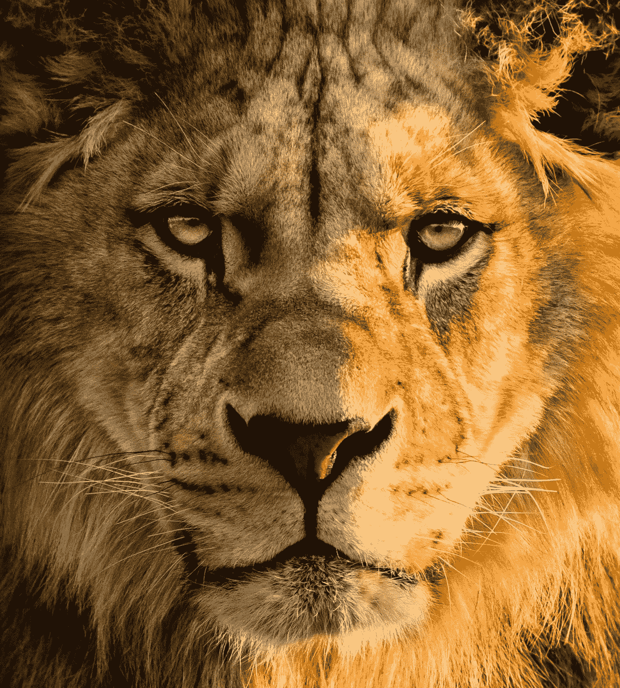
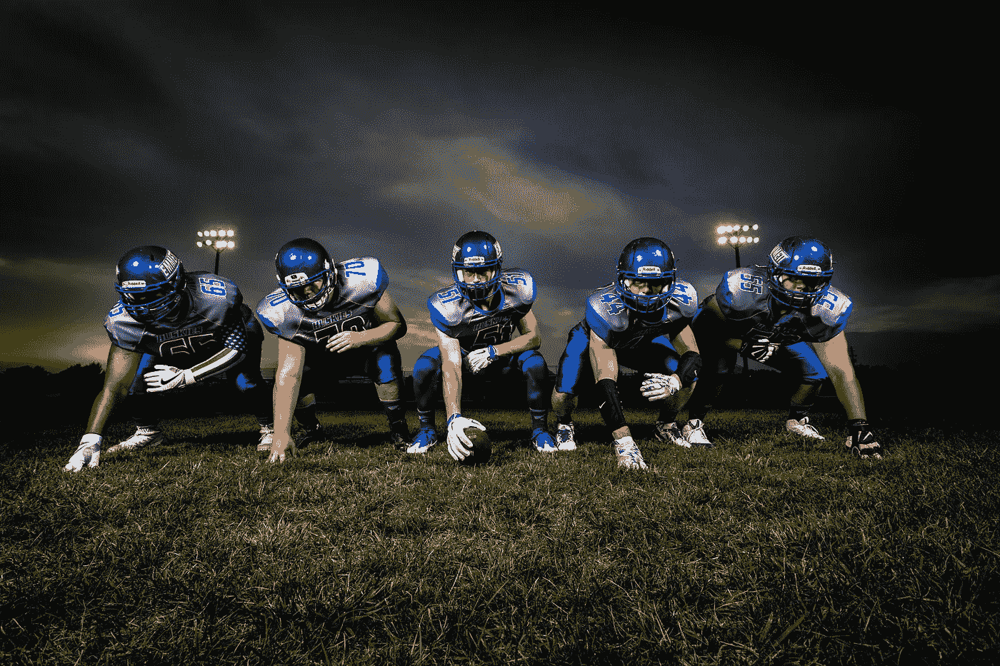
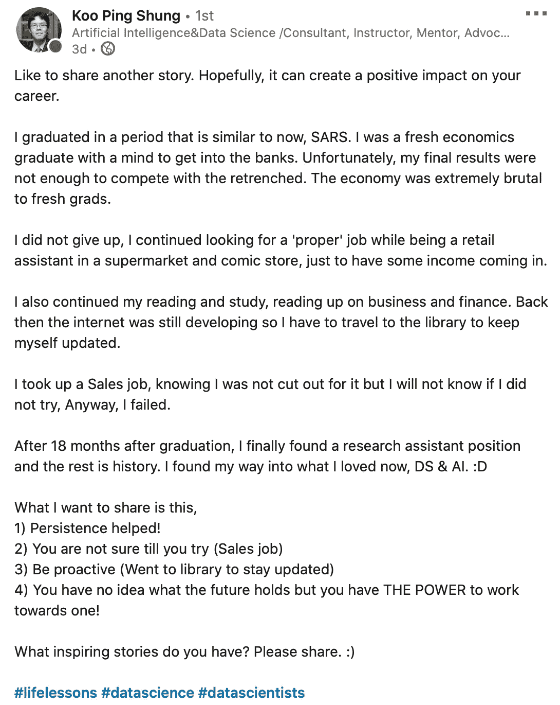

# 2020 年你应该关注的 10 大数据科学领导者

> 原文：<https://towardsdatascience.com/top-10-data-science-leaders-you-should-follow-in-2020-28ff75776ca7?source=collection_archive---------5----------------------->

## 如果你是一名数据科学家

[(来源)](https://unsplash.com/photos/pF4iSe6NVkI)

在我的数据科学生涯中，甚至在生活中，有伟大的导师可以学习是一个巨大的幸事。

我仍然记得大学最后一年我决定从物理学 [**过渡到数据科学**](/my-journey-from-physics-into-data-science-5d578d0f9aa6) 的决定性时刻。

这一跳……很吓人。

自我怀疑是真实的。恐惧是真实的。

信不信由你，我就像其他有抱负的数据科学家一样，通过学习在线课程、阅读相关教科书和加入 [Kaggle](https://www.kaggle.com/admond1994) 开始。

但我还是觉得少了点什么。

在那段时间里，我一直在自学，但并没有真正理解 ***数据科学在现实世界中是如何“工作”的，以及如何成为一名伟大的数据科学家。***

> 我觉得我需要一些指导。我需要向导师学习。

这是我开始在 LinkedIn 上向**数据科学领导者**学习的时候，这对我的学习之旅有很大的帮助，甚至推动了我的数据科学职业生涯，达到了我从未想象过的程度，有丰富的学习机会。

事实上，他们是我通过在 LinkedIn 和 Medium 上分享我的经验、知识甚至错误来回馈数据科学社区的原因。

如果你一直在关注我的文章，我在一年前分享了第一份数据科学领导者名单**，这份名单绝非详尽无遗，因此我在此基础上撰写了这篇文章。**

****如果你在数据科学领域，我强烈建议你关注这些巨头**——我将在下面的部分列出这些巨头——并成为我们数据科学社区的一员，向最优秀的人学习并分享你的经验和知识。**

**相信我，向这些巨人学习可能会成为你一生中做出的改变人生的决定之一(至少对我来说)。**

**说够了…让我们开始吧！**

# **2020 年你应该关注的 10 大数据科学领导者**

****

**[(来源)](https://www.pexels.com/photo/football-players-in-blue-jersey-lined-under-grey-white-cloudy-sky-during-sunset-186076/)**

## **[1。卡西·科济尔科夫](https://www.linkedin.com/in/cassie-kozyrkov-9531919/)**

**[卡西·科兹尔科夫](https://medium.com/u/2fccb851bb5e?source=post_page-----28ff75776ca7--------------------------------)至少可以说是一个传奇。句号。**

**她目前在谷歌担任首席决策科学家，也是统计学、数据科学和人工智能交叉领域的专家。**

**就我个人而言，我认为她是真正的*一种罕见的拥有深厚技术专长的人，同时也有能力将事情分解成简单的想法让人们理解。***

***她在机器学习、人工智能和数据科学领域的思想领导力和想法从未让我感到惊讶，因为它们总是给我新的视角和知识，而我不知道这些是从其他地方学到的。***

> ***我的朋友，这就是向他人(也就是导师)学习的力量。***

***如果你有兴趣向凯西学习——我强烈推荐——看看她在 [Linkedin](https://www.linkedin.com/in/cassie-kozyrkov-9531919/) 、 [Medium](https://medium.com/@kozyrkov) 、 [Twitter](https://twitter.com/quaesita?ref_src=twsrc%5Egoogle%7Ctwcamp%5Eserp%7Ctwgr%5Eauthor) 和 [YouTube](https://www.youtube.com/channel/UCbOX--VOebPe-MMRkatFRxw) 上的帖子、文章和视频。***

***事实上，是她启发了我写这篇文章——数据科学家 解释的 [**P 值——看了她关于 P 值**](/p-values-explained-by-data-scientist-f40a746cfc8)的[分享！](https://www.youtube.com/watch?v=9jW9G8MO4PQ&t=114s)***

***什么是 p 值？(作者:凯西·科济尔科夫)***

## ***[2。本·泰勒](https://www.linkedin.com/in/bentaylordata/)***

***Ben 是我的一个好朋友，我们第一次见面是在 LinkedIn 上，当时正在讨论某些数据科学话题。***

***他是人工智能领域的资深思想领袖，拥有超过 16 年的机器学习经验。***

***他目前在 [DataRobot 工作，担任首席人工智能宣传员](https://www.datarobot.com/blog/bringing-ai-to-life-with-unstructured-data-zeff-has-joined-datarobot/)——是的，如果你想了解更多关于人工智能的知识并了解该领域的最新趋势，他是必去的人。***

***本——在我看来——是人工智能领域迄今为止最敏锐的头脑之一，他不断地揭开这个领域中一些常见误解的神秘面纱，目标是使人工智能的使用民主化。***

***如果你在求职过程中使用公司要求的[T3视频面试…](https://www.hirevue.com)***

***你猜怎么着？***

***Ben 是数据科学团队的领导者，开发了第一个视频面试预测引擎，名为 HireVue Insights，以及许多其他人工智能产品！***

## ***[3。数据传输](https://www.linkedin.com/in/dat-tran-a1602320/)***

***如果你在 LinkedIn 上的数据科学社区中很活跃，我相信你对[**Dat Tran**](https://www.linkedin.com/in/dat-tran-a1602320/)**很熟悉，因为他不断地向公众分享最新的技术和深度学习更新，并提供了许多很好的建议。*****

*****如果你还是不知道他是谁。帮你自己一个忙。看看他在 [Linkedin](https://www.linkedin.com/in/dat-tran-a1602320/) 和 [Medium](https://medium.com/@datitran) 上的分享吧！*****

*****[Dat Tran](https://medium.com/u/4ff6d2f67626?source=post_page-----28ff75776ca7--------------------------------) 目前正在领导 Axel Springer AI，这是欧洲最大的数字出版社 Axel Springer SE 的人工智能部门，旨在让 Axel Springer 内部的每个人都可以访问 AI，从而推动创新，重点关注[计算机视觉](https://machinelearningmastery.com/what-is-computer-vision/)和 [NLP](/your-guide-to-natural-language-processing-nlp-48ea2511f6e1) 问题。*****

*****顺便说一句，他也是该领域著名的主题演讲人和导师，为数据科学界提供了广泛的帮助。*****

## *****[4。凯文·陈](https://www.linkedin.com/in/kevinidea/)*****

*****当我刚开始从事数据科学时，Kevin 是我在 LinkedIn 上通过分享我们的想法和相互学习而结识的首批数据科学家之一。*****

*****他在各种科技创业公司工作的广泛经验以及在开发信贷和风险模型方面的深厚专业知识进一步证明了我为什么如此喜欢他的分享。*****

*****此外，他关于在现实世界环境中成为一名伟大的数据科学家的建议——无论是技术性的还是非技术性的——对我的学习之旅非常实用和有帮助，因为我们会继续一起成长。*****

*****听从他的建议，你就会明白我的意思。😄*****

## *****[5。何塞·马西亚尔·波尔蒂利亚](https://www.linkedin.com/in/jmportilla/)*****

*****如果你曾经上过 Udemy 上的数据科学课程，我相信这个名字对你来说听起来很熟悉。*****

*****你看。*****

*****当我第一次开始我的数据科学之旅时，我不是通过阅读教科书开始的，我不是通过向 Kaggle 学习开始的。*****

*****相反，我开始参加这个在线课程，由 Jose Marcial 教授的[**Python for Data Science and Machine Learning boot camp**](https://bit.ly/python-for-data-science-and-machine-learning-bootcamp)**，这给了我一个强大的基础，并让我对数据科学和机器学习有了更好的理解。*******

*******他是我迄今为止见过的最好的课程创建者和指导者之一，他的课程简单易懂，最重要的是，对你开始学习很实用！*******

*******如果你是数据科学的初学者，想更好地了解这个领域及其应用，那么可以看看他的[课程](http://bit.ly/python-for-data-science-and-machine-learning-bootcamp)。*******

## *******[6。古平顺](https://www.linkedin.com/in/koopingshung/)*******

*******Koo Ping Shung 绝对是数据科学和人工智能领域的巨头之一。*******

*******从他作为一名应届经济学毕业生的卑微起步，到成为数据科学培训、指导和咨询方面的专家，[帮助公司建立内部数据科学能力](http://www.datasciencerex.com)，是如此鼓舞人心！*******

**************

*******[鼓舞人心的故事](https://www.linkedin.com/posts/koopingshung_lifelessons-datascience-datascientists-activity-6678611935359049728-iG1-)作者[古平雄](https://medium.com/u/71f58a3cb5e8?source=post_page-----28ff75776ca7--------------------------------)*******

*******更有趣的是，他还是新加坡最大、最活跃的数据科学聚会组织之一[**Data Science SG**](https://www.meetup.com/DataScience-SG-Singapore/)**的联合创始人。*********

*******我们的目标是教育公众对数据科学有什么期望，数据科学家的工作真正包括什么，并帮助企业了解他们如何从数据科学中受益。*******

*******我个人去过几次不同主题的聚会，也和这个领域的专业人士交流过。毫无疑问，这是有史以来最好的聚会，因为每个人都很热情，都渴望一起学习和成长。*******

## *******[7。莱克斯·弗里德曼](https://www.linkedin.com/in/lexfridman/)*******

*******[Lex Fridman](https://medium.com/u/119b8eb57f8e?source=post_page-----28ff75776ca7--------------------------------) 是麻省理工学院的一名研究科学家，致力于以人为中心的人工智能和深度学习方法，以实现自动驾驶汽车的共享自主。*******

*******更令人瞠目结舌的是，他之前做过**播客，既做过**乔·罗根**([part 1](https://www.youtube.com/watch?v=j5FOumrXyww)&[part 2](https://www.youtube.com/watch?v=ikMmkHzlTpk))的嘉宾，也做过主持人([人工智能](https://lexfridman.com/ai/)播客，例如 [**埃隆·马斯克**](https://www.youtube.com/watch?v=dEv99vxKjVI&list=PLrAXtmErZgOdP_8GztsuKi9nrraNbKKp4) )。*********

*****埃隆·马斯克:特斯拉自动驾驶| [人工智能(AI)播客](https://www.youtube.com/watch?v=dEv99vxKjVI&list=PLrAXtmErZgOdP_8GztsuKi9nrraNbKKp4)*****

*****如果你想更多地了解人类行为和人工智能之间的互动，或者你想站在人工智能技术和应用的最前沿，请查看他的[播客](https://lexfridman.com/ai/)、 [YouTube 频道](https://www.youtube.com/channel/UCSHZKyawb77ixDdsGog4iWA)，当然，还有他的 [LinkedIn 帖子](https://www.linkedin.com/in/lexfridman/)，在那里他分享了关于人工智能的有意义的见解。*****

*****就我个人而言，我觉得他的播客和 Linkedin 帖子非常有见地，尤其是关于人工智能的演变及其与人类行为的有趣联系。*****

## *****[8。克里斯汀·凯尔勒](https://www.linkedin.com/in/kristen-kehrer-datamovesme/)*****

*****目前[克里斯汀·克雷尔](https://medium.com/u/8be51bb10c2f?source=post_page-----28ff75776ca7--------------------------------)是加州大学伯克利分校的数据科学讲师，也是[T5【数据打动我 的创始人。](https://datamovesme.com)*****

*****自 2010 年以来，Kristen 一直在多个行业提供创新和可行的机器学习解决方案，包括公用事业、医疗保健和电子商务。*****

*****在我的整个数据科学职业生涯中，Kristen 一直是我学习的榜样/导师，她在 SQL 和分析领域拥有丰富的经验和知识。*****

*****特别是，我喜欢她和其他杰出的数据科学家之间的讨论，如 LinkedIn 上的 [Favio Vázquez](https://medium.com/u/e8ec6fa4d7d4?source=post_page-----28ff75776ca7--------------------------------) ，最重要的是，播客采访——数据科学的人类——与[**Kate strach Nyi**](https://www.linkedin.com/in/kate-strachnyi-data/)！*****

*****您可能已经意识到，LinkedIn 上的数据科学社区是一个紧密联系的社区，我们在这里相互交流，共同分享和学习。*****

## *****[9。Srivatsan Srinivasan](https://www.linkedin.com/in/srivatsan-srinivasan-b8131b/)*****

*****Srivatsan 目前是 Cognizant 的首席数据科学家/架构师。*****

*****他在构建复杂的分析管道、针对极其复杂的业务流程的机器学习模型以及帮助公司实现数据和分析空间转型方面的经验，无疑提高了我对大数据、云和人工智能等许多领域的理解。*****

*****在 LinkedIn 上阅读他的 [**见解深刻的帖子一直是最有收获的学习活动之一，让我不断了解最新的人工智能技术和数据科学领域的最佳实践。**](https://www.linkedin.com/in/srivatsan-srinivasan-b8131b/detail/recent-activity/shares/)*****

*****看看他的帖子，你就知道我的意思了。我知道你会喜欢它们的。😅*****

## *****10。大卫·兰格*****

*****只要你在 LinkedIn 上寻找数据科学帖子(或一般内容)来学习，你可能已经认识大卫了。*****

*****除了担任 Schedulicity 的分析副总裁之外，他还以其作为讲师、博客作者和 YouTuber 的出色数据科学教学而闻名。*****

> *****我的愿景是一个充满懂数据的专业人士的世界。大卫·兰格*****

*****他大力提倡 20%的分析推动 80%的投资回报率。*****

*****就我个人而言，我从他[在 LinkedIn](https://www.linkedin.com/in/davelanger/detail/recent-activity/shares/) 上的分享中学到了很多，我要说他绝对是数据科学领域最杰出的教育家之一。*****

# *****最后的想法*****

**********

*****[(来源)](https://www.pexels.com/photo/silhouette-photography-of-group-of-people-jumping-during-golden-time-1000445/)*****

*****感谢您的阅读。*****

*****这里有一长串的数据科学领导者需要遵循，不是吗？*****

*****相信我。*****

*****与自学相比，向走过这条道路的导师学习将会节省你大量的时间。更好的是，你将掌握数据科学的**知识(技术&软技能)**，以及如何**成为一名伟大的数据科学家**。*****

*****当然，这里的数据科学领导者名单绝非详尽无遗。这些只是我开始数据科学之旅以来一直关注和学习的一些顶级数据科学领导者。*****

*****我希望他们的分享对你有深刻的见解和帮助。*****

> *******⭐在下面评论，如果你知道我们应该关注的其他数据科学领导者！👇🏻*******

*****受到他们贡献的启发，我正在通过分享我的知识和经验来回馈数据科学社区，希望能够帮助更多有抱负的数据科学家。*****

*****最终，作为数据科学社区的一员，我们在这里，并将永远在这里分享、帮助、学习和共同成长。*****

*****这就是一个社区的意义所在。*****

*****我希望您喜欢阅读这篇文章，并期待您成为数据科学社区的一员。*****

*****记住，不断学习，永不停止进步。*****

*****一如既往，如果您有任何问题或意见，请随时在下面留下您的反馈，或者您可以随时通过 [LinkedIn](https://www.linkedin.com/in/admond1994/) 联系我。在那之前，下一篇文章再见！😄*****

# *****关于作者*****

*****[**Admond Lee**](https://www.linkedin.com/in/admond1994/) 目前是东南亚排名第一的商业银行 API 平台 [**Staq**](https://www.trystaq.com) **—** 的联合创始人/首席技术官。*****

*****想要获得免费的每周数据科学和创业见解吗？*****

*****你可以在 [LinkedIn](https://www.linkedin.com/in/admond1994/) 、 [Medium](https://medium.com/@admond1994) 、 [Twitter](https://twitter.com/admond1994) 、[脸书](https://www.facebook.com/admond1994)上和他联系。*****

***** [## 阿德蒙德·李

### 让每个人都能接触到数据科学。Admond 正在通过先进的社交分析和机器学习，利用可操作的见解帮助公司和数字营销机构实现营销投资回报。

www.admondlee.com](https://www.admondlee.com/)*****