# 十大 dplyr 函数—简化数据分析

> 原文：<https://towardsdatascience.com/top-10-dplyr-functions-data-analysis-made-easy-23fc67f158d5?source=collection_archive---------40----------------------->

## Dplyr 比熊猫更轻松，更干净。你敢换吗？

在过去的几年里，我一直是 Python 的粉丝。这种语言对于数据科学来说非常优秀，作为一种通用的语言使得数据科学的非数据科学部分变得更加容易。但是在数据探索和准备领域，R 的`dplyr`能打败 Python 的`pandas`吗？是的，可以。


照片由[斯科特·格雷厄姆](https://unsplash.com/@sctgrhm?utm_source=unsplash&utm_medium=referral&utm_content=creditCopyText)在 [Unsplash](https://unsplash.com/s/photos/analysis?utm_source=unsplash&utm_medium=referral&utm_content=creditCopyText) 上拍摄

今天我们来看看如何使用 10 个最常见的`dplyr`功能。这还不是该软件包所能提供的全部，请参考[此链接](https://dplyr.tidyverse.org/reference/index.html)获取完整列表。我们将使用 [Gapminder](https://cran.r-project.org/web/packages/gapminder/README.html) 数据集进行整个分析，该数据集可直接在 r

以下是如何导入我们今天需要的所有包:

```
library(dplyr)
library(gapminder)
```

让我们从下一节开始探索。

# 挑选

当我们想要选择一列或多列时，使用 select 命令。可以把它想象成 SQL 中的一个`SELECT`语句，在这里我们可以只挑选感兴趣的列，而不去碰其他的列。

这是使用`select`的第一种方法——列出我们想要保留的所有列:

```
gapminder %>% 
  select(country, year, lifeExp)
```

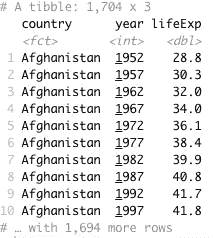

作者图片

另一种方法是通过指定我们想要删除的列——用`-`前缀完成:

```
gapminder %>% 
  select(-continent)
```

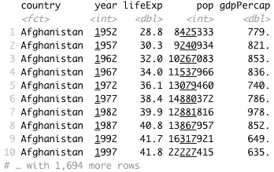

作者图片

# 过滤器

filter 命令相当于 SQL 中的`WHERE`关键字，因为我们只能获取感兴趣的子集。使用该命令有多种方式，如下所示。

让我们只保留 1952 年的那些行:

```
gapminder %>% 
  filter(year == 1952)
```


作者图片

让我们添加另一个过滤器—年份仍然是 1952 年，但我们只需要克罗地亚的数据:

```
gapminder %>%
  filter(year == 1952, country == 'Croatia')
```

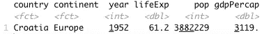

作者图片

那太好了，但是我们如何通过多年来过滤。这里`%in%`操作符派上了用场:

```
gapminder %>%
  filter(year %in% c(1952, 1957), country == 'Croatia')
```

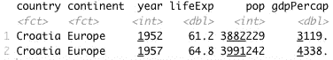

作者图片

# 安排

`arrange`运算符用于按单个列对数据进行排序，可以是升序，也可以是降序。默认情况下，升序排序。它相当于 SQL 中的`ORDER BY`关键字。

让我们按人口升序对 Gapminder 数据集进行排序:

```
gapminder %>% 
  arrange(pop)
```

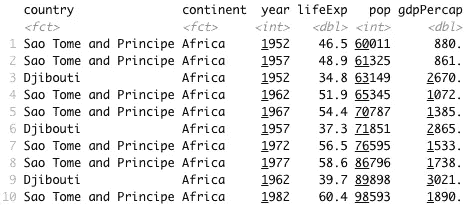

作者图片

让我们按照降序来做同样的事情:

```
gapminder %>% 
  arrange(desc(pop))
```

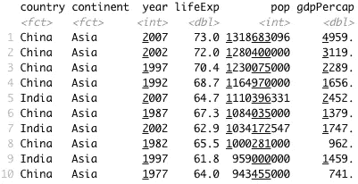

作者图片

# 明显的

该运算符用于查找给定属性的唯一元素。它不需要任何进一步的澄清，所以让我们直接进入代码。

下面是我们如何在数据集中看到独特的大陆:

```
gapminder %>% 
  distinct(continent)
```

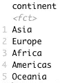

作者图片

# 使突变

`mutate`操作符用于创建新列。在此操作过程中，所有其他列保持不变。

让我们用人口乘以人均 GDP 来计算一个国家的 GDP:

```
gapminder %>%
  mutate(totalGdp = pop * gdpPercap)
```

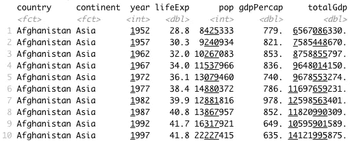

作者图片

# 使变形

这个操作符与`mutate`几乎相同，唯一的区别是`transmute`不保留其他属性——只保留新的属性。

我们将再次使用它来计算总 GDP，然后将结果与`mutate`运算符进行比较:

```
gapminder %>%
  transmute(totalGdp = pop * gdpPercap)
```

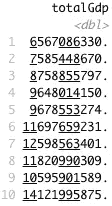

作者图片

正如所承诺的，只显示了新的`totalGdp`列。

# 重新命名

顾名思义，这个操作符用于重命名。注意语法，因为我们必须首先指定新名称。

让我们重新命名几个列——life exp 到*寿命预期*和 *pop* 到*人口*:

```
gapminder %>% 
  rename(lifeExpectancy = lifeExp, population = pop)
```

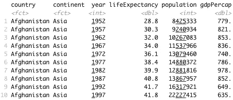

作者图片

# 总结

`summarize`或`summarise`操作符对于在数据集上创建汇总统计非常有用。如果不执行分组操作，结果将是单个值。

例如，假设我们想要找出总体平均预期寿命:

```
gapminder %>% 
  summarize(meanLifeExp = mean(lifeExp))
```

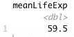

作者图片

如果我们想的话，我们可以联系其他运营商，比如说在 2007 年找到平均预期寿命:

```
gapminder %>% 
  filter(year == 2007) %>% 
  summarize(meanLifeExp = mean(lifeExp))
```

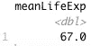

作者图片

这很好，但是`summarize`在用于分组操作时最有用。接下来我们来讨论这些。

# group_by

我们可以使用分组操作符来充分利用前面讨论过的操作符的潜力，比如`summarize`。这个相当于 SQL 中的`GROUP_BY`关键字，所以您可能已经很熟悉了。

假设我们想要找出每个大陆的平均预期寿命，如果没有分组运算符，这是不可能的:

```
gapminder %>% 
  group_by(continent) %>% 
  summarize(meanLifeExp = mean(lifeExp))
```

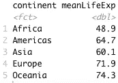

作者图片

我们可以将多个操作符链接在一起，并在多个列上执行分组。例如，让我们看看如何找到每个洲的平均预期寿命，并进一步按年份分组(仅 2002 年和 2007 年):

```
gapminder %>% 
  filter(year %in% c(2002, 2007)) %>% 
  group_by(continent, year) %>% 
  summarize(meanLifeExp = mean(lifeExp))
```

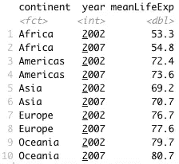

作者图片

# if_else

这不是你的传统操作符，因为我们在其他操作符中使用它，比如`mutate`。它让我们无需编写多行代码就可以执行矢量化的 if-else 语句。

让我们看看如何按洲和年份(仅 2002 年和 2007 年)分组并计算平均预期寿命，然后创建另一个列，如果平均预期寿命大于 70，则该列的值为“Y ”,否则为“N ”:

```
gapminder %>% 
  filter(year %in% c(2002, 2007)) %>% 
  group_by(continent, year) %>% 
  summarize(meanLifeExp = mean(lifeExp)) %>% 
  mutate(meanLifeExpOver70 = if_else(meanLifeExp > 70, 'Y', 'N'))
```

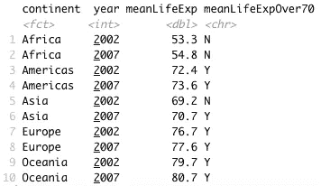

作者图片

# 离别赠言

一天下来，在`dplyr`完成的任何事情都可以在`pandas`完成。但是你不得不承认—`dplyr`做起来如此轻松，而且用了一种更简单、更干净的方式。两者之间的比较是另一个时间的潜在主题，所以让我知道你是否对此感兴趣。

此外，让我知道你更喜欢哪一个，为什么——尽量保持你的观点不偏不倚。

[**加入我的私人邮件列表，获取更多有用的见解。**](https://mailchi.mp/46a3d2989d9b/bdssubscribe)

喜欢这篇文章吗？成为 [*中等会员*](https://medium.com/@radecicdario/membership) *继续无限制学习。如果你使用下面的链接，我会收到你的一部分会员费，不需要你额外付费。*

[](https://medium.com/@radecicdario/membership) [## 通过我的推荐链接加入 Medium-Dario rade ci

### 作为一个媒体会员，你的会员费的一部分会给你阅读的作家，你可以完全接触到每一个故事…

medium.com](https://medium.com/@radecicdario/membership) 

*原载于 2020 年 10 月 26 日*[*https://www.betterdatascience.com*](https://www.betterdatascience.com/top-10-dplyr-functions-data-analysis-made-easy/)*。*