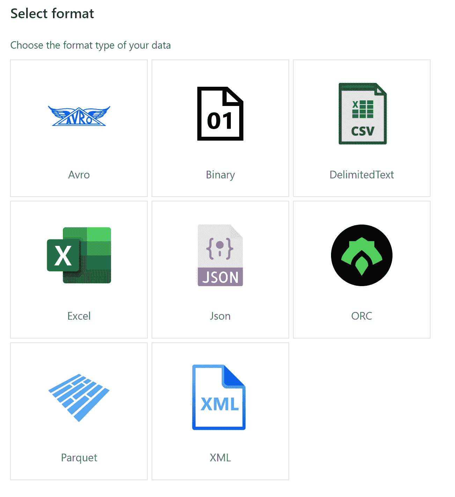

# Azure Synapse 分析工作区的十大功能

> 原文：<https://towardsdatascience.com/top-10-features-in-azure-synapse-analytics-workspace-ec4618a7fa69?source=collection_archive---------23----------------------->

## 让我们来分解 Azure Synapse Analytics 的不同组件

作者图片

# **TLDR**

*   *什么是 Azure Synapse Analytics*

*十大特色*

*   *SQL 池*
*   *复印作业*
*   *数据流*
*   *管道*
*   *SQL 脚本*
*   *火花笔记本*
*   *从存储器快速读取数据*
*   *运行 ML 项目*
*   *可视化*
*   *访问控制*

## 什么是 Azure Synapse Analytics

它是一个端到端的数据平台，将数据仓库、可视化、数据科学和 ETL / ELT 流程全部结合在一个地方。在这篇博客中，我将列出一些使 Azure Synapse Analytics 成为一个非常强大的工具的顶级功能。

图片来自 [Azure Synapse Analytics](https://docs.microsoft.com/en-us/azure/synapse-analytics/sql-data-warehouse/sql-data-warehouse-overview-what-is#key-component-of-a-big-data-solution)

# **1。SQL 池(数据仓库)**

如果你在 Azure 门户中键入“Azure SQL 数据仓库”，Azure Synapse 就会出现。这是 Synapse 之前 Azure 产品中以前的数据仓库的名称。就 Azure Synapse 是什么而言，这可能会造成一点混乱。Azure Synapse 不仅仅是数据仓库，它还有数据仓库以及上图中显示的其他几个组件。数据仓库被称为 SQL 池。使用 SQL Pool，您可以加载事实表或维度表。您还可以随时选择增加计算以获得更好的性能，以及暂停 SQL 池。

# **2。复印作业**

现在我们知道 Azure Synapse 包含数据仓库，我们需要将数据放入数据仓库。这是通过编排工具完成的。您可以从工作区内的多个连接器中的任何一个创建复制作业。看看下面的连接器。这些是你可能在 Azure Data Factory 中见过的连接器。

作者视频。来自[微软复制活动](https://docs.microsoft.com/en-us/azure/data-factory/copy-activity-overview)的文档

您还可以从多种格式中复制数据:

*作者图片*

# **3。数据流**

这可能是我在 Azure Synapse 中最喜欢的功能，因为它降低了清理数据的障碍。我非常支持让事情变得更容易完成(我认为每个人都应该成为:D)。数据流将 SQL 带到您的家门口，能够执行常见的任务，如连接、联合、查找、选择、过滤、排序、更改等等。所有代码都很少甚至没有。

*作者图片*

它还能让您很好地了解数据清理过程。看看下面的例子。

*作者图片*

# **4。管道**

一旦创建了拷贝作业或数据流。你可以通过管道来运行它。这使您有机会通过添加触发器来调度作业，从而自动化该过程。

*作者图片*

或者

向管道中添加其他活动，如 Spark 作业、Azure 函数、存储过程、机器学习或条件(If、then、ForEach 等)。

*作者图片*

# **5。编写 SQL 脚本**

在 SQL 脚本下，您可以编写自己熟悉的 SQL 语句。它可以灵活地连接到 Synapse 工作区之外的外部数据源，例如 Hadoop、Azure Data Lake Store 或 Azure Blog Storage。您还可以连接到公共数据集。看看下面的例子

 [## 使用 SQL on-demand(预览版)在 Azure Synapse Studio(预览版)中分析 Azure 开放数据集…

### 在本教程中，您将学习如何通过使用……组合不同的 Azure Open 数据集来执行探索性数据分析

docs.microsoft.com](https://docs.microsoft.com/en-us/azure/synapse-analytics/sql/tutorial-data-analyst) 

**可视化您的 SQL 输出**

在 SQL 查询的结果窗口中，您可以通过将视图菜单从表格更改为图表来可视化结果。这为您提供了自定义结果的选项，例如，我在下面运行的查询让我可以选择以折线图的形式查看我的结果，我还可以随意编辑图例并为其添加标签。完成后，我可以将图表保存为图像，以便在 Azure Synapse 之外进一步使用。

*作者图片*

# **6。一本闪闪发光的笔记本**

你可以连接不同风格的 PySpark(Python)，Spark(Scala)，。Net Spark (C#)和 Spark SQL。有了这些选项，您可以在同一个笔记本中用任何语言无缝地编写代码。

参见下面的示例，其中

1.  用 PySpark (Python)连接一个 ADLS **csv** 文件
2.  用 PySpark 创建一个临时视图
3.  然后使用 SparkSQL 读取临时视图
4.  这为您提供了更多选择，例如:

*   按特定列排序
*   创建一个图表(类似于 SQL 脚本)

5.再往下，我用 Spark(Scala)连接到一个 SQL 池

*作者图片*

Azure Synapse 笔记本最大的特点之一就是可以灵活地使用任何语言来完成工作。具有不同技能的人可以在示例笔记本中轻松协作。

# 7。从 Azure Data Lake 商店快速阅读(ADLS)

ADLS 是 Azure Synapse 的默认存储单元，它基本上就像一个文件浏览器，能够保存不同格式的数据。它也有助于快速预览数据，使用 Azure Synapse，您可以右键单击文件，执行一些方便的选项，如:

*   选择前 100 行
*   预览数据
*   用 Spark 将数据读入笔记本
*   将数据读入 SQL 表
*   创建数据集
*   创建数据流

*作者图片*

拥有这些选项就像拥有热键或键盘快捷键，因为它们加快了数据摄取过程。

# **8。运行机器学习项目**

机器学习可以通过 Apache Spark MLlib 在 Azure Synapse 中使用(参见示例链接)。你可以导入你喜欢的 ML 包，比如 Matplotlib，Pandas，Numpy 等等。您还可以选择通过 Azure Machine Learning Studio 创建您的 ML 模型，并通过我在特性 4 中提到的管道接收它。

 [## 使用 Apache Spark ml lib-Azure Synapse Analytics 构建机器学习应用程序

### 在本文中，您将学习如何使用 Apache Spark MLlib 创建一个机器学习应用程序，该应用程序执行简单的…

docs.microsoft.com](https://docs.microsoft.com/en-us/azure/synapse-analytics/spark/apache-spark-machine-learning-mllib-notebook) 

# **9。可视化**

在 Azure Synapse 中，您还可以链接您的 Power BI 工作区。这允许您将数据导入 Power BI，以创建报告和响应性仪表板。

*作者图片—* 来自 Azure GitHub 的数据集 [Repo](https://github.com/kromerm/adfdataflowdocs/blob/master/sampledata/small_radio_json.json)

# **10。访问控制**

对于我上面提到的所有功能，权限对于维护职责分离至关重要。在 Azure Synapse 中，您可以基于您的角色分配权限。有 3 个角色:工作区管理员、SQL 管理员和 Apache Spark 管理员。

*作者图片*

更多详情请点击下面的链接

 [## 教程:Azure Synapse 分析入门-使用 Power BI - Azure 可视化工作区数据…

### 在本教程中，您将学习如何创建一个 Power BI 工作区，链接您的 Azure Synapse 工作区，并创建一个…

docs.microsoft.com](https://docs.microsoft.com/en-us/azure/synapse-analytics/get-started-visualize-power-bi) 

# 结论

Azure Synapse 拥有大量功能，无论您是数据分析师、数据科学家、数据工程师还是所有这些角色的混合体。在我即将发表的文章中，我希望你能和我一起探索这些特性。