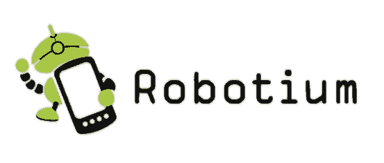
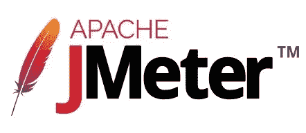
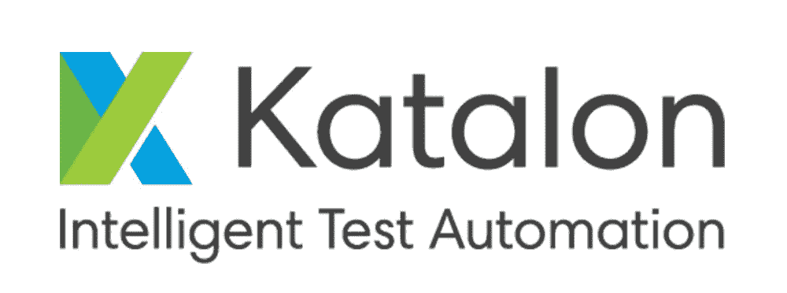
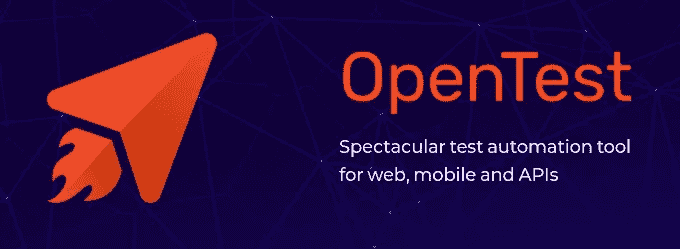

# 十大免费自动化测试工具，让您的生活更轻松

> 原文：<https://towardsdatascience.com/top-10-free-automation-software-that-will-make-your-life-easier-63217e670447?source=collection_archive---------2----------------------->

今天，我们需要一切都快而又快捷，所以这就是为什么有那么多工具可以帮助你更快地实现目标。

[NeONBRAND](https://unsplash.com/@neonbrand?utm_source=unsplash&utm_medium=referral&utm_content=creditCopyText) 在 [Unsplash](https://unsplash.com/?utm_source=unsplash&utm_medium=referral&utm_content=creditCopyText) 上的原始照片

我整理了一份 10 大自动化工具的清单，可以帮助你更快地完成工作。这个列表包含了不同的测试工具，这些工具被用于自动化/手动测试、单元测试、性能、web、移动等领域。

比所有那些能帮到你的自动化工具更好的是，它们可以免费使用( [**开源**](https://medium.com/@lazar.gugleta/open-source-why-give-something-for-free-f0f15199e3a9) )。

让我们直接投入进去吧！

# 硒

[Selenium](https://www.selenium.dev/) 使用[Chrome 的 Web 驱动程序](https://chromedriver.chromium.org/)来测试命令和处理网页以获得你需要的数据。它与几乎所有可用的编程语言兼容，并为您提供了各种各样的命令和选项，您可以对其进行操作。

这是我最喜欢的，我已经写了很多次了。我将它与 [Python](https://medium.com/swlh/why-is-python-so-powerful-today-190b4661ab) 和 [Web Scraping](/everything-you-need-to-know-about-web-scraping-6541b241f27e) 结合起来，以获得可能的最佳结果。
如果你想了解更多关于 Selenium 及其功能的信息，请查看:[Selenium 的 25 大功能，它们将使你成为网络抓取专家](/top-25-selenium-functions-that-will-make-you-pro-in-web-scraping-5c937e027244)。

另外，如果你想要更高级的用法，请查看:[如何用 Python 制作分析工具](/how-to-make-an-analysis-tool-using-python-c3e4477b6d8)。

[链接](https://www.google.com/search?q=selenium&sxsrf=ALeKk00mlAuILp2b26p24ISqPa76rSjwcA:1583520363074&source=lnms&tbm=isch&sa=X&ved=2ahUKEwiu7vCFwYboAhUE3aQKHSCmDAUQ_AUoAXoECBcQAw&biw=1745&bih=887#imgrc=SIe1_PQts0i7HM)到图像

# 美味的汤

[美汤](https://www.crummy.com/software/BeautifulSoup/bs4/doc/)是一个 python 库，用于从 HTML 和 XML 文件中提取数据。它创建了数据解析树以便于获取数据。

继 Selenium 之后，这也是我的最爱之一，仅仅是因为它的易用性和强大性。

这里还有一个美汤用法的例子:[如何用 Python](/how-to-save-money-with-python-8bfd7e627d13) 省钱。

[将](https://www.google.com/search?q=beautiful+soup&sxsrf=ALeKk03Jmk62aHh7LS4Yb11wZZ7WKged5A:1583520411057&source=lnms&tbm=isch&sa=X&ved=2ahUKEwjmyuGcwYboAhU7wAIHHXCJDj8Q_AUoAXoECBgQAw&biw=1745&bih=887#imgrc=wJQhVp8uVr0pUM)链接到图像

# 机器人工厂

Robotium 是一款免费软件，可以让你测试基于 Android 的应用程序。这是一个测试自动化框架，它支持许多不同的测试领域，包括灰盒 UI 测试、系统测试，以及对本地和混合 android 应用程序的用户接受度测试。

从他们的 GitHub [库](https://github.com/RobotiumTech/robotium)中:

> R obotium 是一个 Android 测试自动化框架，完全支持本地和混合应用程序。Robotium 使得为 Android 应用程序编写强大且健壮的自动黑盒 UI 测试变得容易。在 Robotium 的支持下，测试用例开发人员可以编写功能、系统和用户验收测试场景，跨越多个 Android 活动。

[将](https://www.google.com/search?q=robotium&sxsrf=ALeKk00BjQ19ir7eVNygDTEpxnJqdv1nhA:1583520479191&source=lnms&tbm=isch&sa=X&ved=2ahUKEwitiqC9wYboAhVJuqQKHT8dDbkQ_AUoAXoECA8QAw&biw=1745&bih=887#imgrc=OltuQSuxW3kl0M)链接到图像

# 瓦特尔

Watir 是一个免费的 Ruby 库，可以让你进行自动化测试，比如点击、填写表格等。

Name 是一个首字母缩写词，来自于应用程序 uby。

从他们的[网站](http://watir.com/):

> 用于自动化测试的开源 Ruby 库。Watir 与浏览器的交互方式和人们一样:点击链接、填写表格和验证文本。

[将](https://www.google.com/search?q=watir&sxsrf=ALeKk02kZlAP6g7DBPXHVq3-B7Jq6-OLZQ:1583520495294&source=lnms&tbm=isch&sa=X&ved=2ahUKEwj06fbEwYboAhXQCuwKHdzmBJ4Q_AUoAXoECBcQAw&biw=1745&bih=887#imgrc=LvQuUbI1jCc_tM)链接到图像

# 阿帕奇 JMeter

Apache JMeter 是一个免费使用的 Java 桌面应用程序，主要用于 web 应用程序负载测试。它还支持有限的功能和单元测试。

它有许多不同的选项，如动态报告、可移植性、强大的测试 IDE，并支持不同类型的应用程序、shell 脚本、Java 对象和数据库。

从他们的[网站](https://jmeter.apache.org/):

> **Apache JMeter** 应用程序是开源软件，一个 100%纯 Java 应用程序，旨在加载测试功能行为和测量性能。它最初是为测试 Web 应用程序而设计的，但后来扩展到了其他测试功能。
> 
> Apache JMeter 可用于测试静态和动态资源、Web 动态应用程序的性能。
> 可用于模拟一台服务器、一组服务器、网络或对象上的重负载，以测试其强度或分析不同负载类型下的整体性能。

这里还有一个教程列表，可以帮助您开始使用 JMeter:

*   [分布式测试](https://jmeter.apache.org/usermanual/jmeter_distributed_testing_step_by_step.html)
*   [记录测试](https://jmeter.apache.org/usermanual/jmeter_proxy_step_by_step.html)
*   [JUnit 采样器](https://jmeter.apache.org/usermanual/junitsampler_tutorial.html)
*   [访问测井取样器](https://jmeter.apache.org/usermanual/jmeter_accesslog_sampler_step_by_step.html)
*   [扩展 JMeter](https://jmeter.apache.org/usermanual/jmeter_tutorial.html)

[将](https://www.google.com/search?q=jmeter&tbm=isch&chips=q:jmeter,g_1:logo:rAL3MfuB-gE%3D&hl=en&ved=2ahUKEwi6pc3RwYboAhVP0YUKHVdEDGMQ4lYoAHoECAEQFQ&biw=1732&bih=887#imgrc=52qG8jjhYk46NM)链接到图像

# 卡塔隆

Katalon 是用于 web 和移动自动化测试的开源软件。它非常简单，支持跨平台使用。除此之外，它有惊人的 JIRA 实现。

从他们的[网站](https://www.katalon.com/):

> Katalon 帮助您快速生成跨平台的自动化测试。
> 将自动化测试无缝集成到您的 CI/CD 管道中。
> 利用 Katalon TestOps 提供集中的报告和质量洞察。

[将](https://www.google.com/search?q=katalon&sxsrf=ALeKk00N6C_kQv1qF5iUyszo6gu4piqwmA:1583520549927&source=lnms&tbm=isch&sa=X&ved=2ahUKEwipvP3ewYboAhXI0qQKHSojCAYQ_AUoAXoECBIQAw&biw=1745&bih=887#imgrc=_H65Ncj1K5qnJM)链接到图像

# 专家

Maven 是一个用于 Java 项目自动化测试的免费工具。
我自己也经常使用 Maven，我不得不说这是一款相当不错的软件。

从他们的[网站](http://maven.apache.org/):

> Maven 基本上是一个开源的构建自动化工具，主要用于 java 项目。我们有可供测试的 maven 插件。插件提供的“surefire:test”目标与软件管理生命周期的测试阶段相关联。

[将](https://www.google.com/search?q=maven&sxsrf=ALeKk00HPXxk4FIzrvifHOv-Y0XmM0J_Zg:1583520571665&source=lnms&tbm=isch&sa=X&ved=2ahUKEwiRn6zpwYboAhVOiqQKHeGkBH8Q_AUoAXoECBAQAw&biw=1745&bih=887#imgrc=qHIauwHPXEruTM)链接到图像

# 硒机器人

这是一个用于 Android 应用程序和移动网络的免费自动化框架。它支持扩展和并行测试。

Selendroid 是一个用于 Android 和 web 应用程序的免费自动化框架。【Selendroid 很酷的一点是它支持并行测试和伸缩。

从他们的[网站](http://selendroid.io/):

> elendroid 是一个测试自动化框架，它驱动了 Android 本地和混合应用程序(apps)以及移动 web 的 UI。测试是使用 Selenium 2 客户端 API 编写的——就是这样！

[将](https://www.google.com/search?q=selendroid&sxsrf=ALeKk003Pg42joQmiw6-Ai5iiXtpeI3Hmg:1583520585753&source=lnms&tbm=isch&sa=X&ved=2ahUKEwiIlIjwwYboAhXDGuwKHV0gBgcQ_AUoAXoECAsQAw&biw=1745&bih=887#imgrc=imeNbN_qpE59rM)链接到图像

# Linux 桌面测试项目

LDTP 是一个免费工具，主要针对各种语言的 GUI 测试( [Python](http://ldtp.freedesktop.org/user-doc/index.html) 、 [Java](http://ldtp.freedesktop.org/javadoc/) 、 [Ruby、Perl、C#、VB.NET、PowerShell](http://ldtp.freedesktop.org/user-doc/index.html) 、 [Clojure](https://github.com/RedHatQE/gnome.ldtp) )

从他们的[网站](https://ldtp.freedesktop.org/wiki/):

> GNU/Linux 桌面(GUI 应用程序)测试项目(GNU LDTP)旨在开发高质量的测试自动化框架和尖端工具，用于测试和改进 GNU/Linux 或 Solaris 桌面。它使用**可访问性**库通过应用程序的用户界面进行发现。

[链接](https://www.freedesktop.org/wiki/logo.png)到图像

# 开放测试

OpenTest 是一款免费的 web、移动应用和 API 工具。

从他们的[网站](https://getopentest.org/):

> OpenTest 是一个面向 web 应用程序、移动应用程序和 API 的免费开源功能测试自动化框架，为可伸缩性和可扩展性而构建，重点是支持主流测试自动化实践。OpenTest 是一个功能强大的工具，几乎不需要任何编码技能，几乎可以处理任何类型的功能测试自动化项目。

[将](https://www.google.com/search?q=opentest++logo&sxsrf=ALeKk01ohhZZlRPmmAu2ADhEmtgBFSLEMQ:1583520636331&source=lnms&tbm=isch&sa=X&ved=2ahUKEwjrhJeIwoboAhUFsaQKHSFXCH0Q_AUoAXoECAoQAw&biw=1745&bih=887#imgrc=MVwMHz0OXP9dsM)链接到图像

# 临终遗言

还有很多工具，我没有在这里介绍，但是这些工具对我来说非常重要。

我希望你喜欢这 10 个免费自动化测试工具的列表，并关注我获得更多！

**感谢阅读！**

查看我的**其他文章**并关注我的[媒体](https://medium.com/@lazar.gugleta)

当我有新文章发表时，请在 Twitter 上关注我