# 2020 年最受欢迎的 10 种编程语言

> 原文：<https://towardsdatascience.com/top-10-in-demand-programming-languages-to-learn-in-2020-4462eb7d8d3e?source=collection_archive---------0----------------------->

## 权威指南

## Python，JavaScript，Java，C#，C，C++，PHP，Swift，Go，Ruby

大约有 600 种编程语言。编程语言的需求和受欢迎程度每年都在波动。此外，新的编程语言也带来了吸引人的特性。

那么，**应该学习哪种编程语言呢？学习一门新的编程语言总是对你的时间和智力的投资。如果你是一个经验丰富的开发人员或者已经知道几种编程语言，你可以学习一种合适的现代语言。最近，我写了一篇博客，列出了七种值得学习的现代编程语言:**

 [## 现在要学习的 7 种现代编程语言

### Rust、Go、Kotlin、TypeScript、Swift、Dart、Julia 如何促进您的职业发展并提高您的软件开发技能

towardsdatascience.com](/top-7-modern-programming-language-to-learn-now-156863bd1eec) 

但是如果你在 2020 年开始你的编程生涯，或者学习你的第一或第二种编程语言，那么**学习主流和成熟的编程语言之一**是明智的。这里我将根据以下标准列出编程语言:

*   已经**成为软件开发行业的主流并牢牢确立了地位**。
*   **在知名编程语言排名网站中排名第一的**。
*   **受欢迎程度正在上升或保持稳定**而不是急剧下降。
*   他们有大量的库、框架、工具支持，并且有一个庞大的社区。
*   他们在就业市场上要求高薪。

此外，我将总结编程语言以及**历史背景、关键特性和主要用例**。

# 1.计算机编程语言

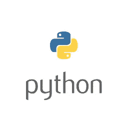

当吉多·范·罗苏姆在 20 世纪 90 年代开发 Python 作为他的副业时，没有人想到它有一天会成为最流行的编程语言。考虑到所有公认的排名和行业趋势，我将 Python 作为整体上的头号编程语言。

Python 并没有像 Java 或 C/C++那样迅速流行起来。另外，Python 不是一种破坏性的编程语言。但是从一开始， **Python 就专注于开发者体验**并试图降低编程的门槛，这样学校的孩子们也可以编写产品级的代码。

2008 年，Python 经历了一次大规模的检修和改进，代价是通过引入 Python 3 引入了重大的突破性变化。

今天，Python 无处不在，并被用于许多软件开发领域，而且没有放缓的迹象。

**3 个关键特性:**

*   Python 的 USP 是它的语言设计。它高效、优雅、简单，但功能强大。
*   Python 与 C/C++进行了一流的集成，可以无缝地将 CPU 繁重的任务卸载给 C/C++。
*   Python 有一个非常活跃的社区和支持。

**人气:**

在过去的几年里，Python 的需求有了巨大的增长，而且没有减缓的迹象。编程语言排名网站 PYPL 将 Python 列为 2019 年受欢迎程度相当高的头号编程语言:

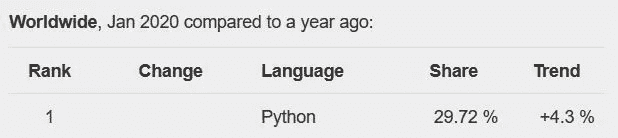

来源: [PYPL](http://pypl.github.io/PYPL.html)

此外，根据 GitHub repositories 的贡献，Python 已经超过 Java，成为第二大最受欢迎的语言:

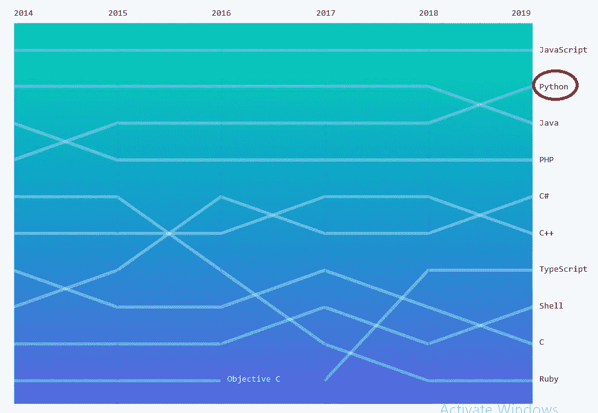

来源:[八月](https://octoverse.github.com/)

另外，StackOverflow 开发者调查将 Python 列为第二大最受欢迎的编程语言(第四大最受欢迎的技术):

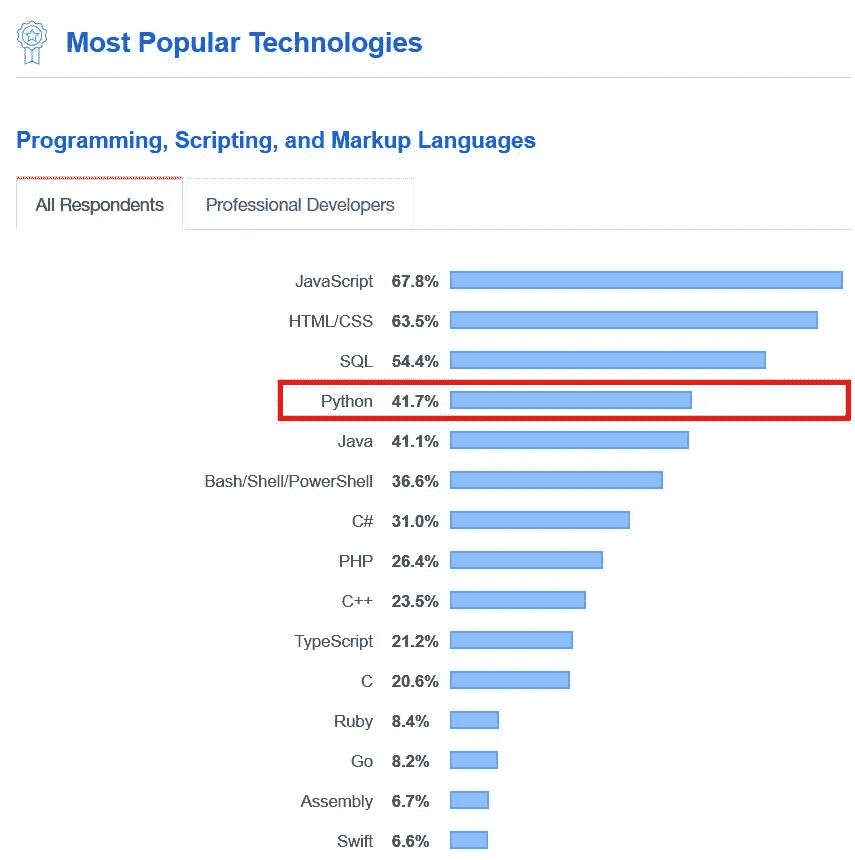

来源: [StackOverflow 开发者调查，2019](https://insights.stackoverflow.com/survey/2019)

另一个编程语言排名网站 TIOBE 将 Python 列为第三大最受欢迎的语言，去年有了巨大的进步:

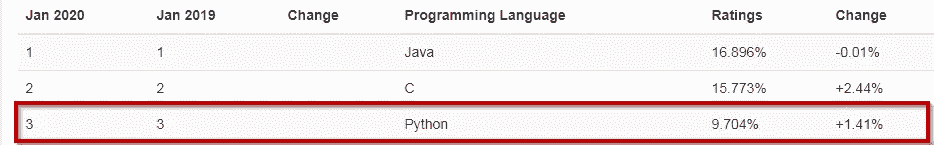

来源: [TIOBE](https://www.tiobe.com/tiobe-index/)

根据 GitHub Octoverse 的数据，Python 仍然有机会在今年的排名中进一步上升，因为 Python 去年增长了 50%:

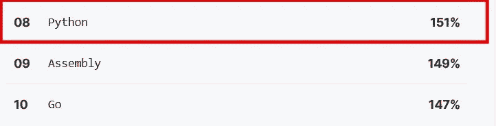

来源:[十月](https://octoverse.github.com/)

StackOverflow 开发者调查将 Python 列为第二受欢迎的编程语言:

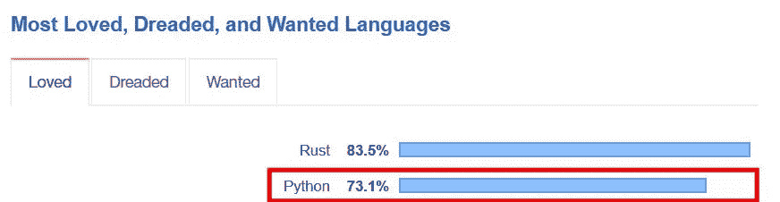

来源: [StackOverflow 开发者调查，2019](https://insights.stackoverflow.com/survey/2019)

大多数较老的主流编程语言都有稳定或向下的牵引力。此外，Python 是一个例外，在过去的五年中，它有着越来越强的上升趋势，这一点从 Google trends 中可以清楚地看出:

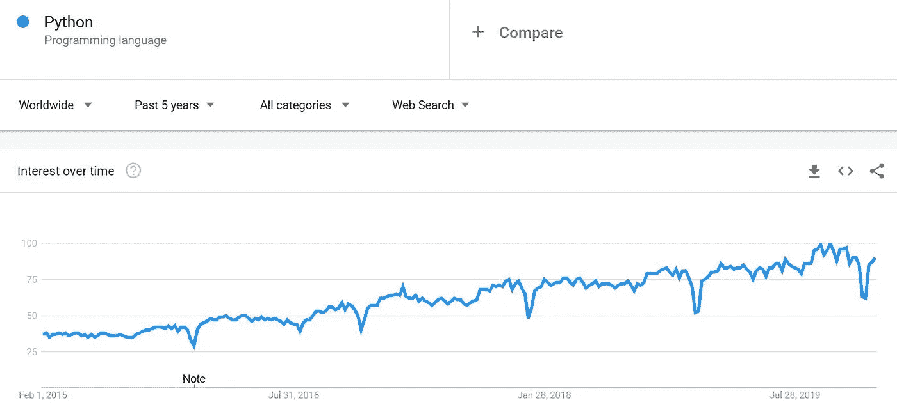

来源:[谷歌趋势](https://trends.google.com)

**就业市场:**

据 Indeed 报道，Python 是美国就业市场上需求最大的编程语言，2020 年 1 月最高 74 K 职位发布。此外，Python 以 12 万美元的年薪排名第三。

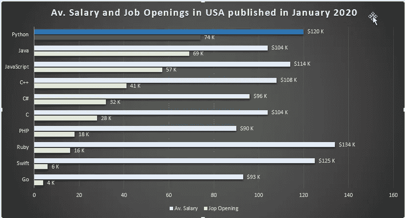

来源:[的确](https://www.indeed.com/)

另外，StackOverflow 开发人员调查显示，与其他主流编程语言相比，Python 开发人员的经验相对较少，但薪水却很高:

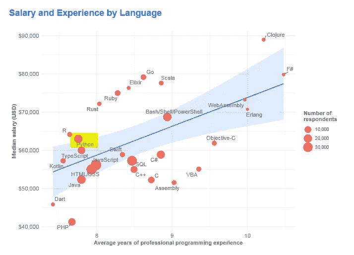

来源: [StackOverflow 开发者调查，2019](https://insights.stackoverflow.com/survey/2019)

**主要使用案例:**

*   数据科学
*   数据分析
*   人工智能，深度学习
*   企业应用
*   Web 开发

# 2.Java Script 语言

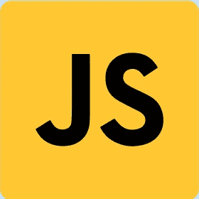

在第一次浏览器大战期间，网景公司指派**布伦丹·艾希**为其浏览器**开发一种新的编程语言。Brendan Eich** 只用了十天就开发出了最初的原型，剩下的就是历史了**。由于 JavaScript 糟糕的语言设计和缺乏特性，软件开发人员在早期经常嘲笑它。**

多年来，JavaScript 已经发展成为一种多范式、高级的动态编程语言。JavaScript 的第一次重大突破出现在 2009 年，当时 Ryan Dahl 发布了跨平台 JavaScript 运行时 Node.js 并使 JavaScript 能够在服务器端运行。

JavaScript 的另一个巨大突破发生在 2010 年左右，当时谷歌发布了一个基于 JavaScript 的网络开发框架 AngularJS。

今天，JavaScript 是全球使用最广泛的编程语言之一，几乎可以在任何地方运行:浏览器、服务器、移动设备、云、容器、微控制器。

**3 个关键特性:**

*   JavaScript 是浏览器编程中无可争议的王者。
*   得益于 Node.js，JavaScript 提供了**事件驱动编程**，特别适合 **I/O 繁重的任务**。
*   JavaScript 在过去几年里经历了大规模的现代化和彻底改革，特别是在 2015 年、2016 年和以后。

**人气:**

JavaScript 是排名最靠前的编程语言之一，因为它在所有平台上无处不在的使用和大量采用。

根据 GitHub repositories 的贡献，Octoverse 已经连续五年将 JavaScript 列为头号编程语言:

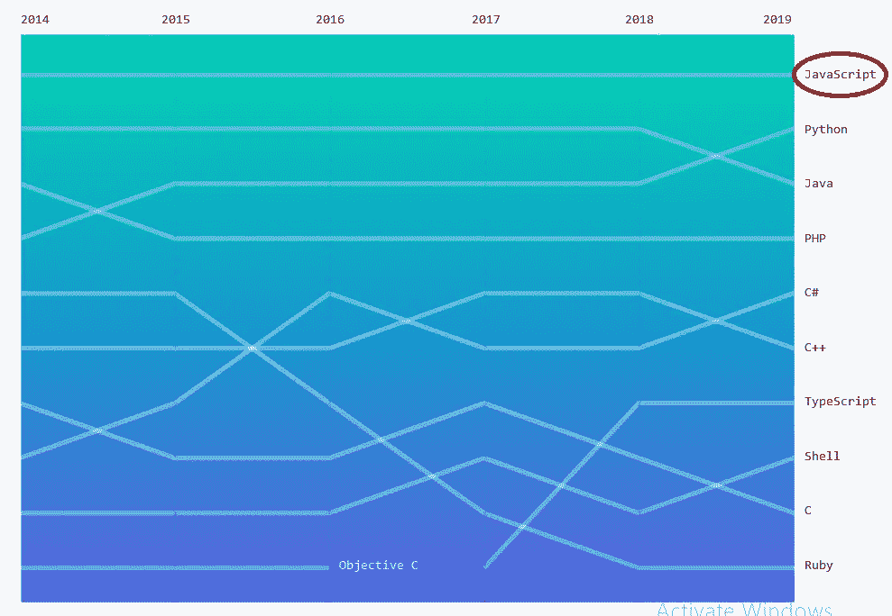

来源: [Octoverse](https://octoverse.github.com/)

此外，StackOverflow 开发者调查 2019 将 JavaScript 列为最受欢迎的编程语言和技术:

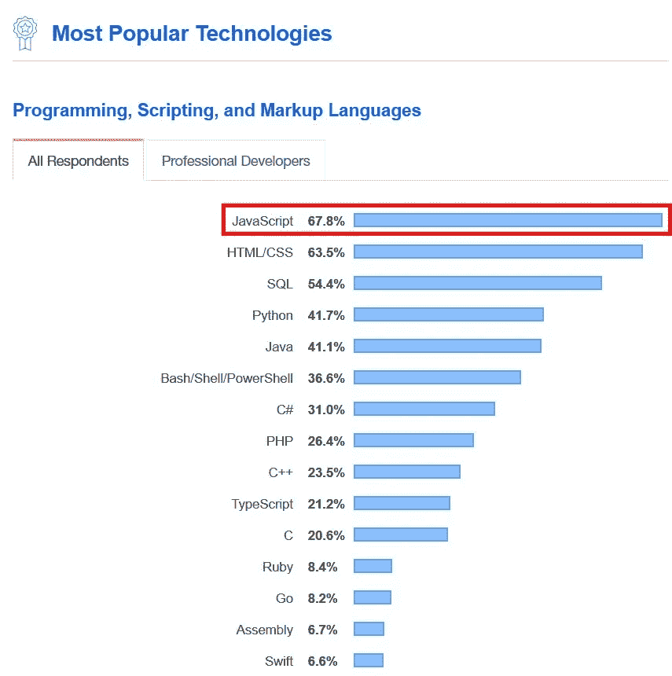

来源: [StackOverflow 开发者调查，2019](https://insights.stackoverflow.com/survey/2019)

另一个编程语言流行网站 PYPL 将 JavaScript 列为第三大流行编程语言:

来源: [PYPL](http://pypl.github.io/PYPL.html)

编程语言流行网站 TIOBE 将 JavaScript 列为第七大最流行的编程语言:

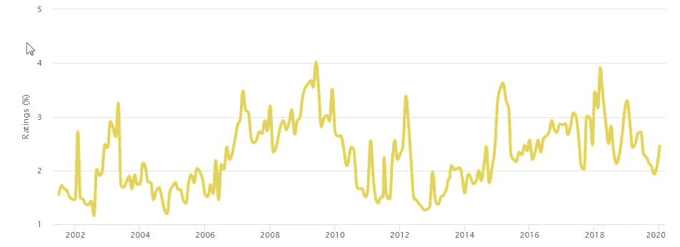

来源: [TIOBE](https://www.tiobe.com/tiobe-index/)

根据 StackOverflow 开发人员调查，JavaScript 一度被开发人员视为可怕的编程语言，也是第 11 大最受欢迎的编程语言:

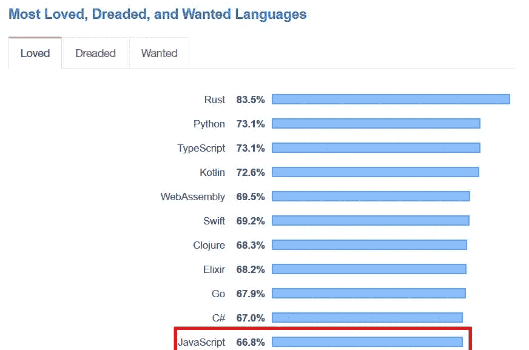

来源: [StackOverflow 开发者调查，2019](https://insights.stackoverflow.com/survey/2019)

JavaScript 的趋势相对稳定，如 Google Trends 所示:

来源:[谷歌趋势](https://trends.google.com)

**就业市场:**

在美国的就业市场上，Indeed 将 JavaScript 列为第三大需求最大的编程语言，2020 年 1 月发布了 57 K 份工作。JavaScript 平均年薪为 11.4 万美元，在薪酬方面排名第四:

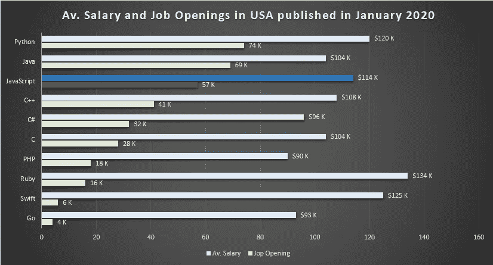

来源:[的确](https://www.indeed.com/)

另外，StackOverflow 开发人员调查显示，JavaScript 开发人员可以凭借相对较低的经验获得中等收入:

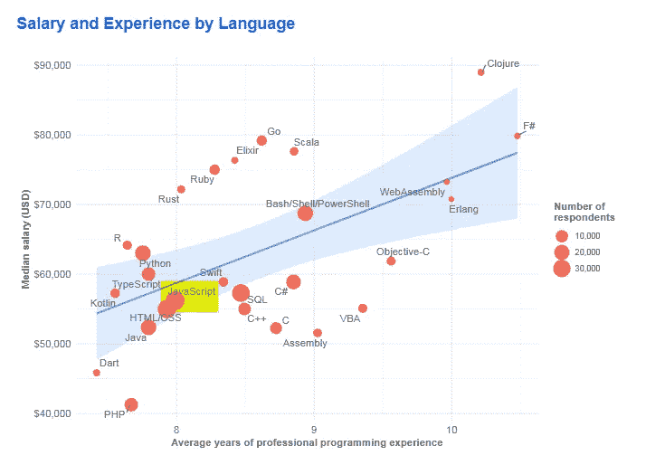

来源: [StackOverflow 开发者调查，2019](https://insights.stackoverflow.com/survey/2019)

**主要使用案例:**

*   Web 开发
*   后端开发
*   移动应用程序开发
*   无服务器计算
*   浏览器游戏开发

# 3.Java 语言(一种计算机语言，尤用于创建网站)

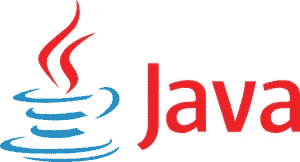

Java 是迄今为止最具颠覆性的编程语言之一。在 90 年代，商业应用程序主要是使用 C++开发的，c++相当复杂并且依赖于平台。詹姆斯·高斯林和他在 Sun 的团队通过提供一种更简单的、面向对象的、支持多线程编程的解释型编程语言，降低了开发商业应用程序的门槛。

Java 通过开发 Java 虚拟机(JVM)实现了平台无关性，从开发者那里抽象出底层操作系统，给出了第一个“**一次编写，随处运行**”的编程语言。此外，JVM 提供了代垃圾收集，它管理对象的生命周期。

近年来，Java 失去了一些市场，让位于对开发人员高度友好的现代语言和其他语言的兴起，特别是 Python、JavaScript。此外，JVM 由于其庞大的体积而不是云友好的。甲骨文最近对 JDK 征收高额许可费，这将进一步削弱 Java 的受欢迎程度。

幸运的是，Java 正在努力克服它的缺点，并通过 GraalVM 计划使 Java 适合云计算。此外，在 OpenJDK 中，有一个免费的替代专有的 Oracle JDK。

Java 仍然是企业的头号编程语言。

**3 个关键特性:**

*   Java 提供了一种**强大的、功能丰富的、多范例的、解释性的**编程语言，具有适中的学习曲线和较高的开发人员生产率。
*   Java 是严格向后兼容的，这是商业应用程序的一个关键要求。
*   Java 的运行时 JVM 是软件工程的杰作，也是业界最好的虚拟机之一。

**人气:**

发布五年后，Java 成为第三大最受欢迎的编程语言，并在接下来的二十年里一直保持在前三名。以下是流行的 TIOBE 排名中 Java 的长期历史:

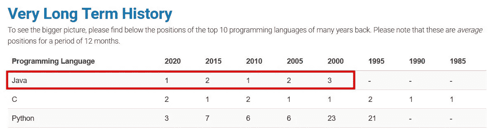

来源: [TIOBE](https://www.tiobe.com/tiobe-index/)

根据 TIOBE 的说法，Java 的受欢迎程度在过去几年有所下降，但它仍然是最受欢迎的编程语言，如下所示:

来源: [TIOBE](https://www.tiobe.com/tiobe-index/)

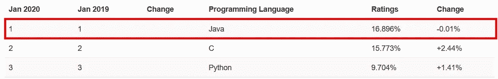

来源: [TIOBE](https://www.tiobe.com/tiobe-index/)

根据 GitHub repository 的贡献，Java 在 2014-2018 年期间排名第一，去年才下滑到第三位:

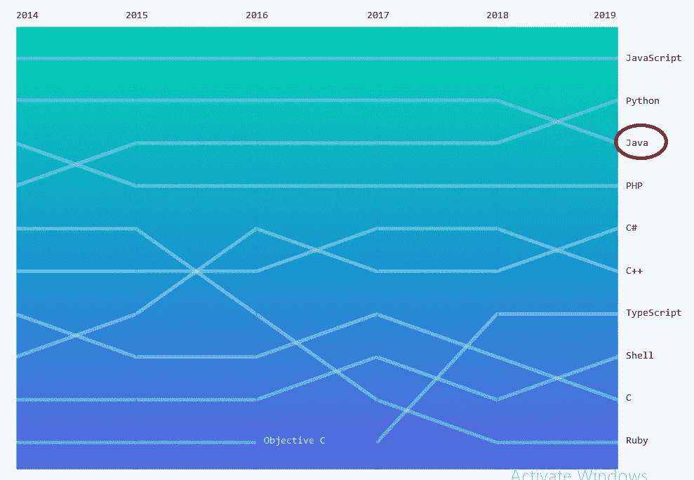

来源:[十月](https://octoverse.github.com/)

另一个流行编程语言排名网站 PYPL 将 Java 列为第二大流行编程语言:

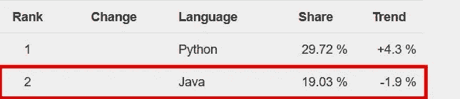

来源: [PYPL](http://pypl.github.io/PYPL.html)

StackOverflow 开发者调查也将 Java 排在前列，仅被 JavaScript 和 Python 编程语言取代:

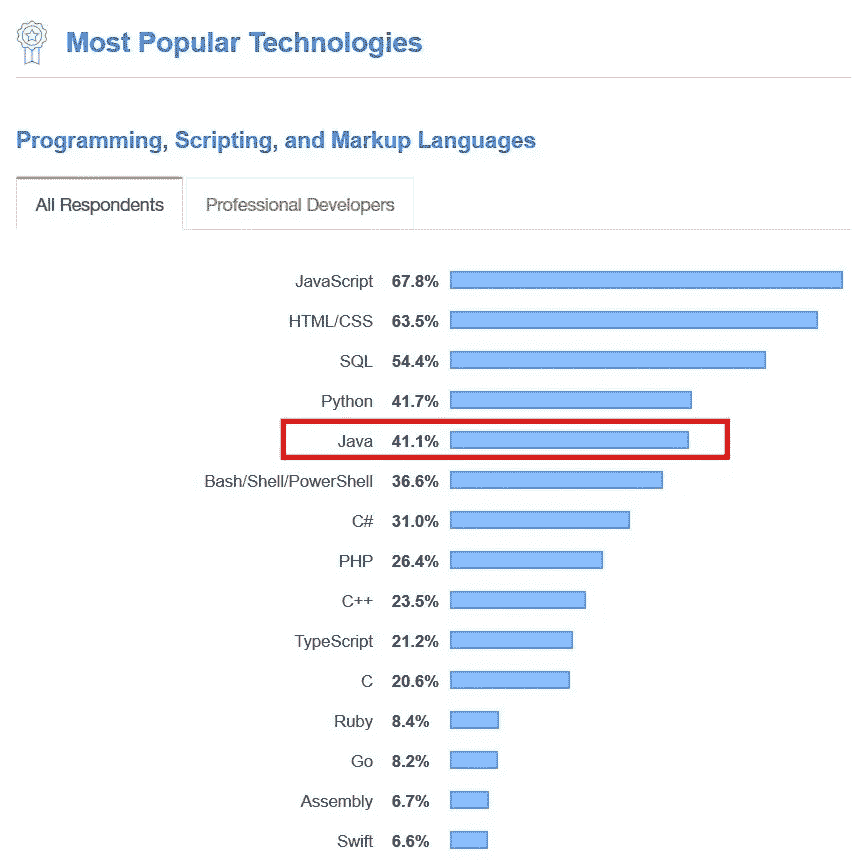

来源: [StackOverflow 开发者调查，2019](https://insights.stackoverflow.com/survey/2019)

根据 Google trends，Java 在过去的五年中不断失去吸引力:

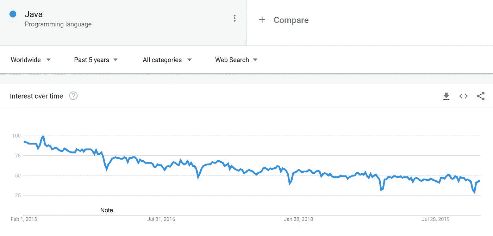

来源:[谷歌趋势](https://trends.google.com)

**就业市场:**

据 Indeed 称，Java 是美国第二大需求最大的编程语言，2020 年 1 月有 69 K 个职位空缺。此外，Java 开发人员的年薪排名第六(10.4 万美元):

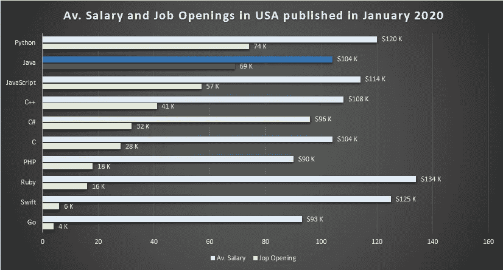

来源:[确实](https://www.indeed.com/)

根据 stack overflow Developers survey 2019，Java 在几年的经验后提供了适中的工资:

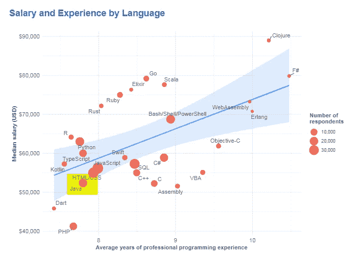

来源: [StackOverflow 开发者调查，2019](https://insights.stackoverflow.com/survey/2019)

**主要使用案例:**

*   企业应用开发
*   Android 应用程序开发
*   大数据
*   Web 开发

# 4.C#

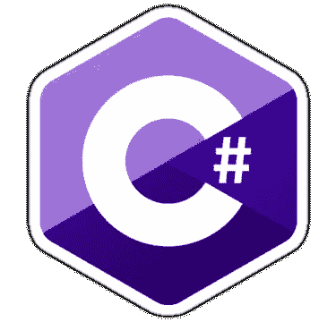

2000 年，科技巨头微软决定创建他们的面向对象 C 语言，如编程语言 C#作为他们**的一部分。NET** initiative，它将被管理(运行在类似 Java 的虚拟机上)。经验丰富的语言设计师**安德斯·海尔斯伯格**设计了 C#作为微软**公共语言倡议(CLI)** 平台的一部分，在这个平台上，许多其他语言(主要是微软的语言)被编译成一种中间格式，在一个名为**公共语言运行时(CLR)** 的运行时上运行。

在早期，C#被批评为对 Java 的模仿。但是后来，两种语言都产生了分歧。此外，微软对 C#编译器/运行时的许可并不总是明确的。虽然微软目前没有在微软开放规范项目下实施其专利，但它可能会改变。

如今，C#是一种多范例编程语言，广泛应用于 Windows 平台、iOS/Android 平台(多亏了 **Xamarin** )和 Linux 平台。

**3 个关键特性:**

*   **安德斯·海尔斯伯格**出色地将 C#带出 Java 的阴影，并赋予了自己的身份。
*   在微软的支持下，C#已经在业界存在了 20 年，拥有庞大的库和框架生态系统。
*   像 Java 一样，C#也是独立于平台的(感谢 CLR ),可以在 Windows、Linux 和移动设备上运行。

**人气:**

流行语言排名网站 TIOBE 在 2020 年 1 月以巨大的收益排名第五:

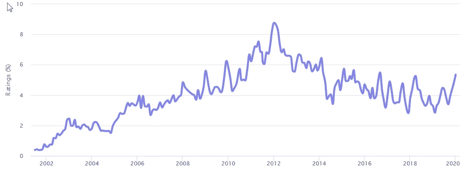

来源: [TIOBE](https://www.tiobe.com/tiobe-index/)

此外，Octoverse 将 C#列为 GitHub repositories 贡献的第五大流行编程语言:

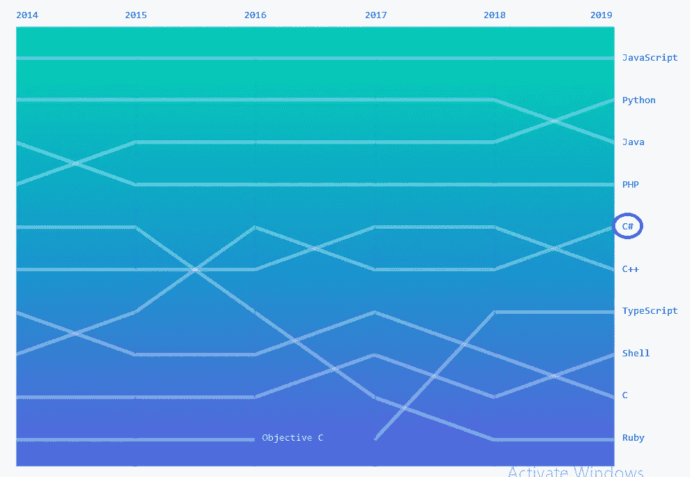

来源:[十月](https://octoverse.github.com/)

StackOverflow 开发者调查将 C#列为第四大最受欢迎的语言(2019 年第七大最受欢迎的技术:

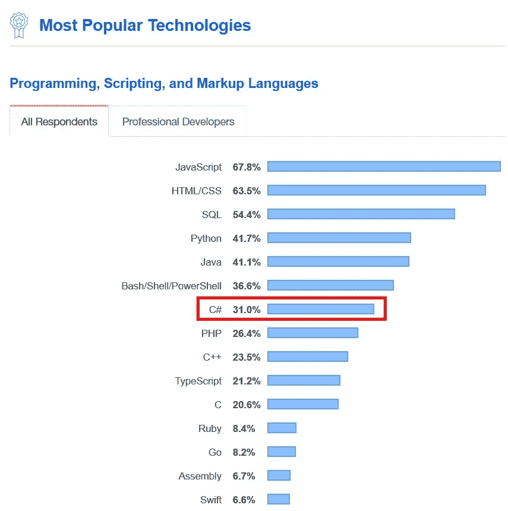

来源: [StackOverflow 开发者调查，2019](https://insights.stackoverflow.com/survey/2019)

有趣的是，StackOverflow 开发者调查将 C#列为第十大最受欢迎的编程语言(远远高于 Java):

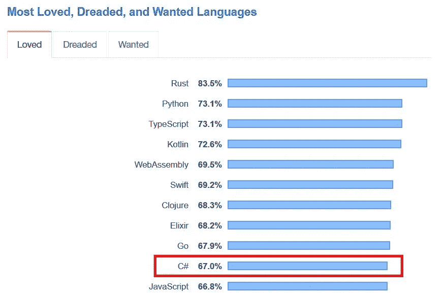

来源: [StackOverflow 开发者调查，2019](https://insights.stackoverflow.com/survey/2019)

从 Google trends 可以清楚地看到，C#在过去几年里并没有被大肆宣传，如下所示:

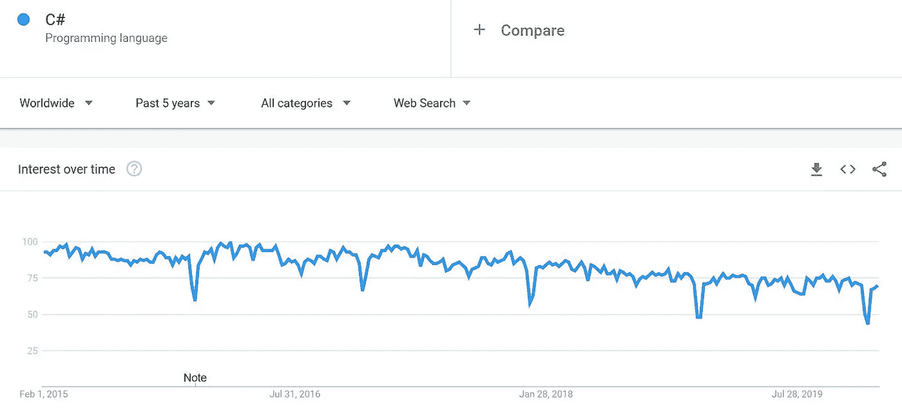

来源:[谷歌趋势](https://trends.google.com)

**就业市场:**

Indeed 为美国的 C#开发人员发布了 32，000 个职位空缺，使 C#成为该榜单中第五大最苛刻的编程语言。C#年薪 96 K 美元，在该榜单中排名第八:

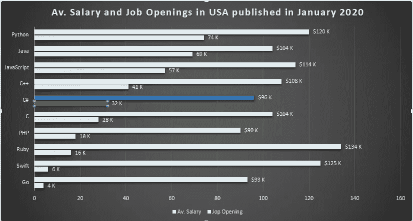

来源:[确实](https://www.indeed.com/)

StackOverflow 开发人员调查显示，就全球平均工资而言，C#高于 Java(尽管经验更丰富):

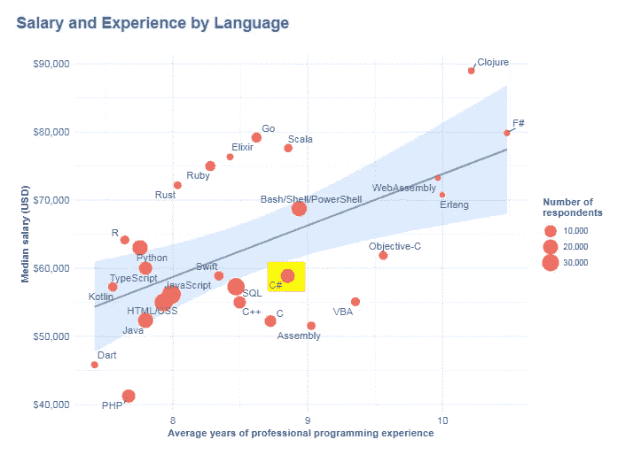

来源: [StackOverflow 开发者调查，2019](https://insights.stackoverflow.com/survey/2019)

**主要使用案例:**

*   服务器端编程
*   应用程序开发
*   Web 开发
*   游戏开发
*   用于 Windows 平台的软件

# 5.C

在 20 世纪 60 年代和 70 年代，CPU 的每个周期和内存的每个字节都非常昂贵。贝尔实验室工程师丹尼斯·里奇(Dennis Ritchie)在 1969 年至 1973 年间开发了一种过程化的通用编程语言，直接编译成机器语言。C 编程提供低级内存访问，并对底层硬件进行完全控制。

多年来，C 成为最常用的编程语言之一。此外，C 可以说是历史上最具颠覆性和影响力的编程语言，几乎影响了这个列表中的所有其他语言。

虽然 C 经常因其意外的复杂性、不安全的编程和缺乏特性而受到批评。此外，C 是平台相关的，即 C 代码是不可移植的。但是如果你想充分利用你的硬件，那么 C/C++或者 Rust 是你唯一的选择。

**3 个关键特性:**

*   由于 C 提供了低级内存访问并编译成机器指令，所以它是速度最快、功能最强大的编程语言之一。
*   c 提供了对底层硬件的完全控制。
*   c 是“该语言的编程语言”之一，也就是说，许多其他编程语言如 Ruby、PHP、Python 等的编译器都是用 c 编写的。

**人气:**

c 语言是这个列表中最古老的编程语言，已经统治这个行业 47 年了。从 TIOBE 的长期排名历史中可以清楚地看出，c 语言在编程语言流行度排名中的统治地位超过了任何其他语言:

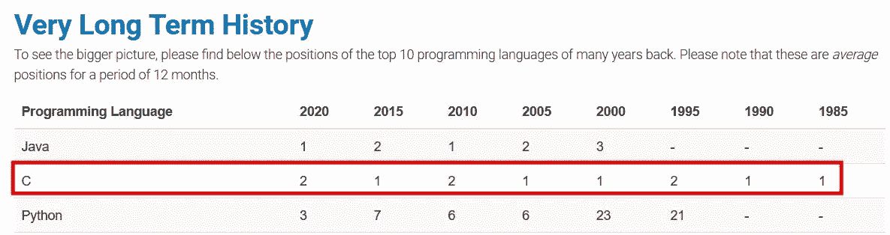

来源: [TIOBE](https://www.tiobe.com/tiobe-index/)

根据 TIOBE 排名，C 是 2019 年第二大最受欢迎的语言，人气增长巨大:

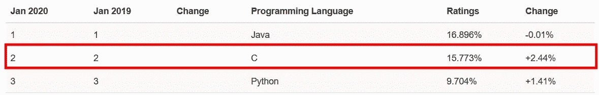

来源: [TIOBE](https://www.tiobe.com/tiobe-index/)

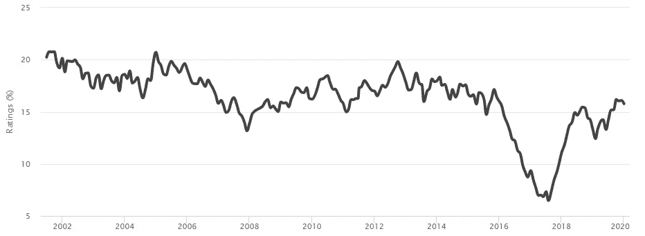

来源: [TIOBE](https://www.tiobe.com/tiobe-index/)

根据 GitHub 资源库的贡献，Octoverse 还将 C 语言列为第九大最受欢迎的语言:

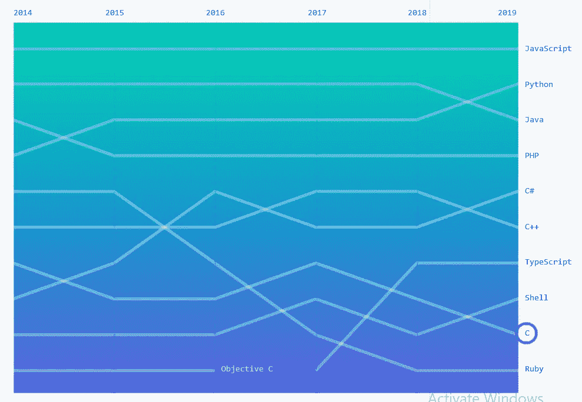

来源: [Octoverse](https://octoverse.github.com/)

StackOverflow 开发者调查也将 C 语言排在第 12 位(考虑编程语言的第 8 位):

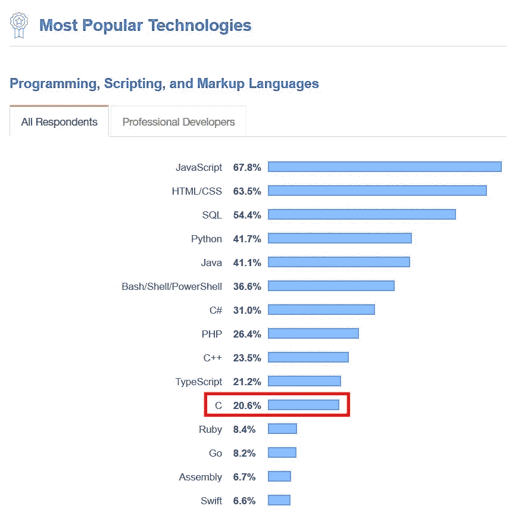

来源: [StackOverflow 开发者调查，2019](https://insights.stackoverflow.com/survey/2019)

在过去的五年里，Google trending 也显示了对 C 语言相对稳定的兴趣。

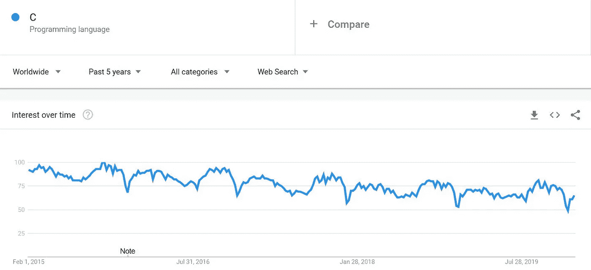

来源:[谷歌趋势](https://trends.google.com)

**就业市场:**

根据 Indeed 的数据，在美国有 28000 个 C 开发人员的职位空缺，这使得 C 成为第六大最苛刻的编程语言。薪资方面，C 以 Java(104K)排名第 6:

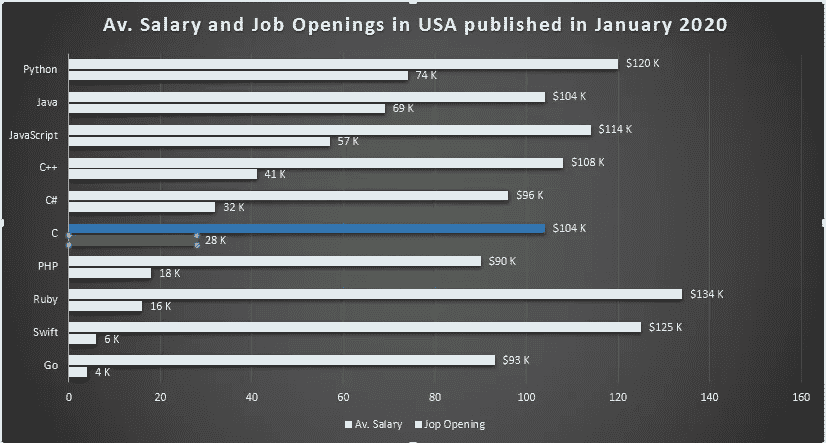

来源:[的确](https://www.indeed.com/)

StackOverflow 开发人员调查显示，与 Java、Python 等相比，C 语言开发人员可以获得平均工资，但需要更长的时间才能达到这一水平:

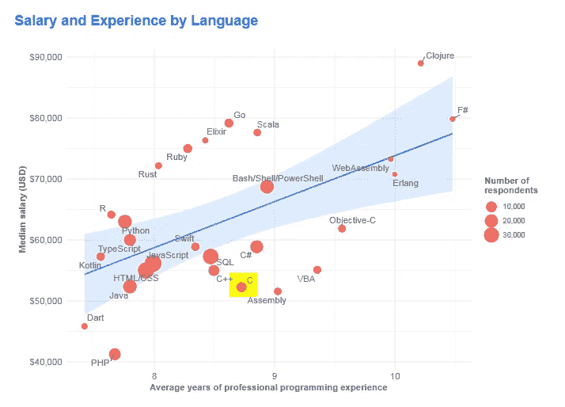

来源: [StackOverflow 开发者调查，2019](https://insights.stackoverflow.com/survey/2019#salary)

**主要使用案例:**

*   系统程序设计
*   游戏开发
*   物联网和实时系统
*   机器学习，深度学习
*   嵌入式系统

# 6.C++

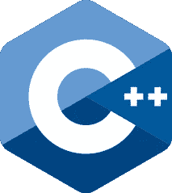

20 世纪 70 年代，比雅尼·斯特劳斯特鲁普和丹尼斯·里奇(C 语言的创造者)一起在贝尔实验室工作。深受 C 语言的影响，他首先创建了 C++作为 C 语言的扩展，增加了面向对象的特性。随着时间的推移，C++已经发展成为一种多范例、通用的编程语言。和 C 一样，C++也提供低级内存访问，并直接编译成机器指令。

**C++也提供了对硬件的完全控制，但代价是意外的复杂性**，并且不提供对内存安全和并发安全的语言级支持。此外，C++提供了太多的功能，是最复杂的编程语言之一。

由于所有这些因素及其平台依赖性，在 21 世纪初，C++在企业软件开发和大数据领域的受欢迎程度已经输给了 Java。

随着 GPU、容器化、云计算的兴起，C++越来越受欢迎，因为它可以快速适应硬件或生态系统的变化。

今天，C++是业界最重要和使用最广泛的编程语言之一。

**3 个关键特性:**

*   像 Java 一样，C++也随着硬件或生态系统的变化而不断更新和适应自己。
*   C++还提供了对底层硬件的完全控制，可以在任何平台上运行，并利用任何种类的硬件，GPU、TPU、容器、云、移动设备或微控制器。
*   C++非常快，在性能关键和资源受限的系统中大量使用。

**人气:**

C++是该列表中第二古老的编程语言，在 TIOBE 编程语言排名中排名第四:

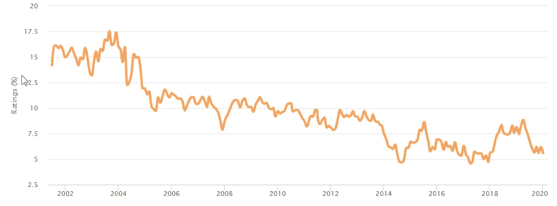

来源: [TIOBE](https://www.tiobe.com/tiobe-index/)

根据 GitHub repository 的贡献，Octoverse 将 C++排在第 6 位:

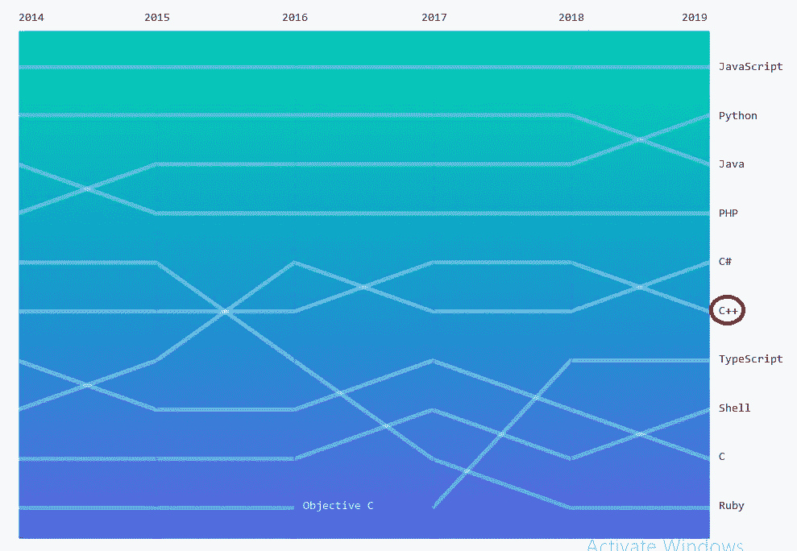

来源:[八月](https://octoverse.github.com/)

此外，2019 年 StackOverflow 开发者调查将 C++列为第 9 大最受欢迎的技术(第 6 大最受欢迎的语言):

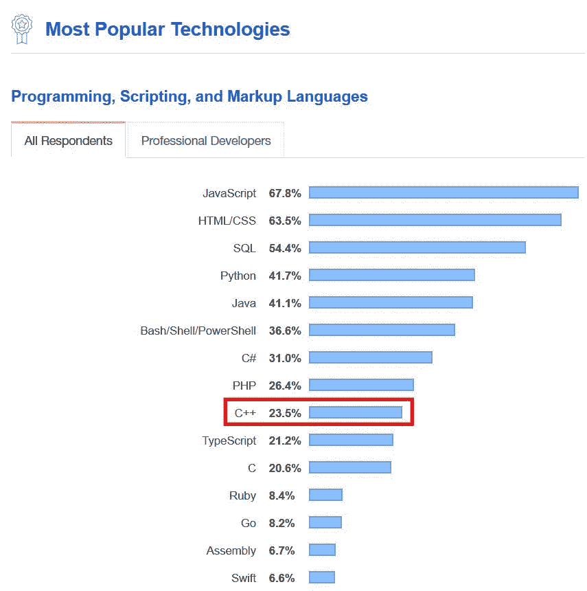

来源: [StackOverflow 开发者调查，2019](https://insights.stackoverflow.com/survey/2019)

尽管 C++面临着来自 Rust 或 Go 等现代编程语言的激烈竞争，但在过去的五年中，它仍然引起了稳定的兴趣:

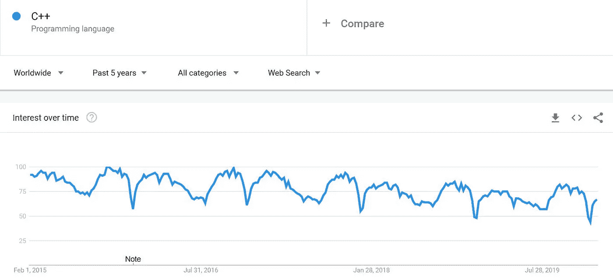

**就业市场:**

事实上，C++已经以 41，000 的招聘量被列为第四大最苛刻的编程语言。此外，C++开发人员每年收入 10.8 万美元，排名第五:

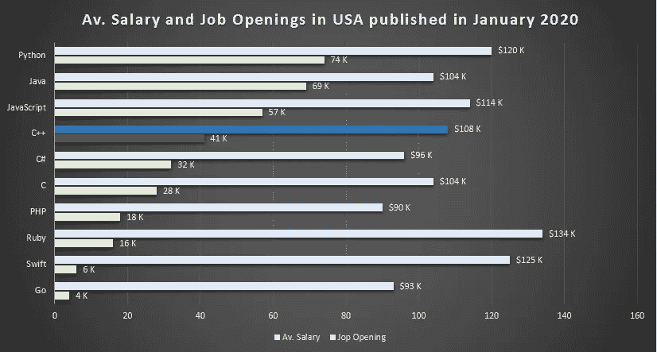

来源:[确实](https://www.indeed.com/)

StackOverflow 开发人员调查显示，与 Java 相比，C++开发人员可以获得更高的工资，尽管他们的经验更长:

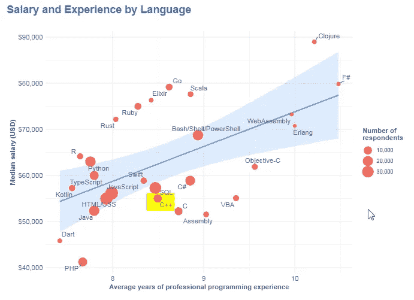

来源: [StackOverflow 开发者调查，2019](https://insights.stackoverflow.com/survey/2019#salary)

**主要使用案例:**

*   系统程序设计
*   游戏开发
*   物联网和实时系统
*   机器学习，深度学习
*   嵌入式系统、分布式系统

# 7.服务器端编程语言（Professional Hypertext Preprocessor 的缩写）

像 Python 一样，PHP 是另一种编程语言，是由一个开发者在 90 年代作为一个附带项目开发的。软件工程师拉斯马斯·勒德尔夫最初创建了 PHP，作为一套用 C 语言编写的公共网关接口二进制文件来创建动态网络应用程序。后来，更多的功能被添加到 PHP 产品中，它有机地演变成一种成熟的编程语言。

目前，PHP 是一种通用的动态编程语言，主要用于开发服务器端的 Web 应用程序。

随着基于 JavaScript 的客户端 Web 应用程序开发的兴起，PHP 正在失去吸引力和受欢迎程度，PHP 已经过了它的全盛时期。与普遍的看法相反，PHP 不会很快消亡，尽管它的受欢迎程度会逐渐降低。

**3 个关键特性:**

*   PHP 是一种高效的服务器端 Web 开发编程语言。
*   在过去的 35 年里，PHP 被用于 Web 开发，市场上有许多成功且稳定的 PHP 开发框架。
*   许多大公司都在使用 PHP(脸书，WordPress)，这为它带来了极好的工具支持。

**人气:**

编程语言排名网站 TIOBE 在 2020 年 1 月将 PHP 列为第八大最受欢迎的编程语言。虽然 PHP 的长期排名历史表明，PHP 已经过了它的全盛时期，正在慢慢失去它的吸引力:

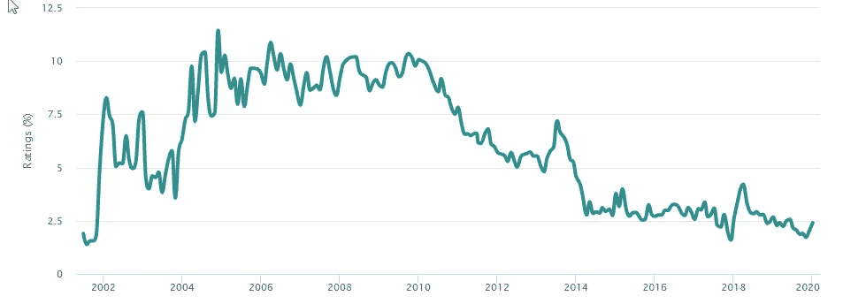

来源: [TIOBE](https://www.tiobe.com/tiobe-index/)

Octoverse 将 PHP 列为 GitHub repositories 贡献的第四大最受欢迎的编程语言:

来源:[八月](https://octoverse.github.com/)

根据 2019 年 StackOverflow 开发者调查，PHP 是第五大最受欢迎的编程语言(第八大最受欢迎的技术):

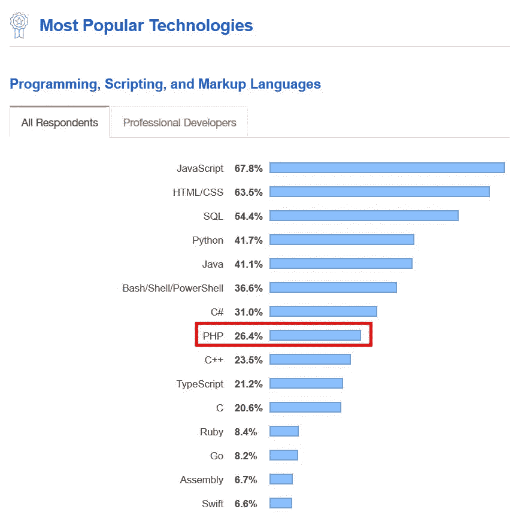

来源: [StackOverflow 开发者调查，2019](https://insights.stackoverflow.com/survey/2019)

尽管 PHP 仍然是使用最广泛的编程语言之一，但它的趋势正在慢慢下降，这一点从 Google Trends 中可以清楚地看出:

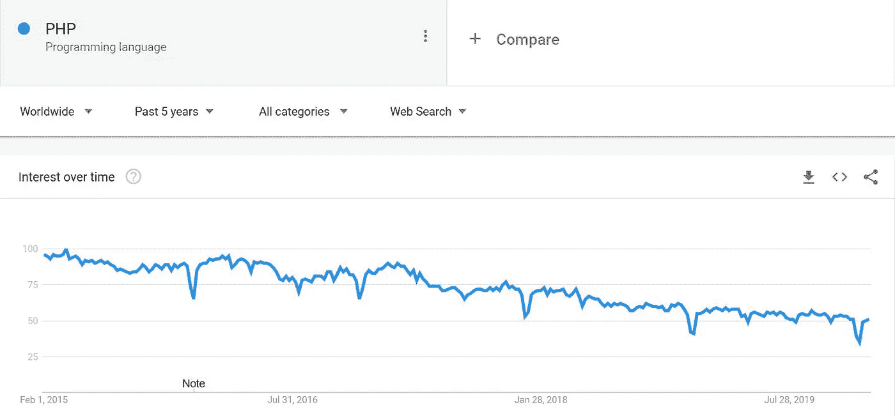

来源:[谷歌趋势](https://trends.google.com)

**就业市场:**

2020 年 1 月，求职网站的确将 PHP 列为美国就业市场第七大需求编程语言，有 18 K 个职位。此外，PHP 开发人员可以期待一份合理的薪水(9 万美元)，这使他们在这一类别中排名第十:

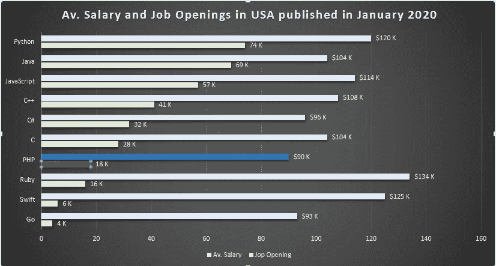

来源:[确实](https://www.indeed.com/)

StackOverflow 开发者调查显示 PHP 是 2019 年收入最低的编程语言:

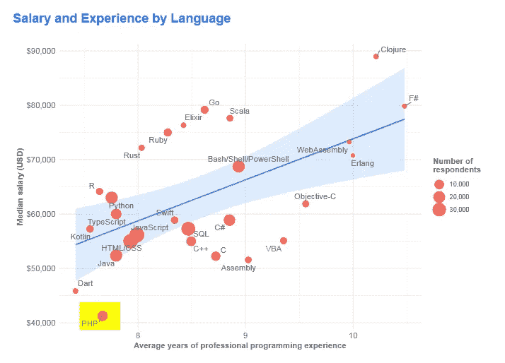

来源: [StackOverflow 开发者调查，2019](https://insights.stackoverflow.com/survey/2019#salary)

**主要使用案例:**

*   服务器端 Web 应用程序开发
*   开发 CMS 系统
*   独立 Web 应用程序开发。

# 8.迅速发生的

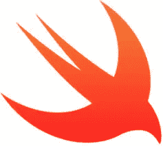

Swift 是同时出现在我的列表中的仅有的两种编程语言之一:“****”**。由克里斯·拉特纳领导的一组苹果工程师开发了一种新的编程语言 Swift，主要用于取代 Mac 和 iOS 平台上的 Objective-C。**

**它是一种**多范例、通用、编译的编程语言，也提供了高开发效率**。Swift 支持 **LLVM** (开发者为**克里斯·拉特纳**)编译器工具链，如 C/C++，Rust。**

**Swift 与 Objective-C 代码库具有出色的互操作性，并且已经成为 iOS 应用程序开发的主要编程语言。作为一种编译过的强大语言，Swift 在其他领域也越来越受欢迎。**

****3 主要特点:****

*   **Swift 的主要 USP 之一是其语言设计。在 Apple 生态系统中，它提供了比 Objective-C 更高效、更好的替代方案，具有更简单、简洁、干净的语法和开发人员工效学特性。**
*   **Swift 还提供了现代程序语言的特性:空安全。此外，它还提供了避免“末日金字塔”的句法优势**
*   **作为一种编译语言，Swift 和 C++一样快。它在系统编程和其他领域也越来越受欢迎。**

****人气:****

**像其他现代编程语言一样，Swift 在开发人员中非常受欢迎，在最受欢迎语言排行榜中排名第六:**

**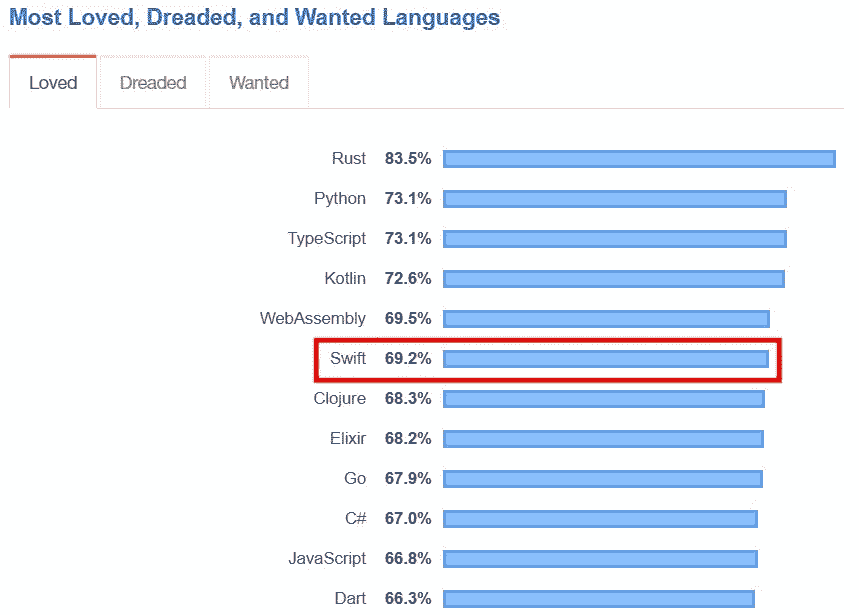**

**Swift 在其第一个稳定版本发布仅 5 年后，就进入了 TIOBE index 最受欢迎编程语言排行榜的前 10 名:**

**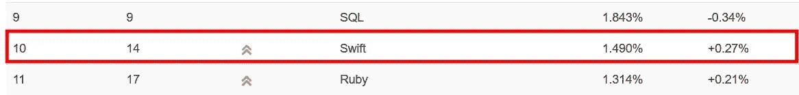**

**来源: [TIOBE](https://www.tiobe.com/tiobe-index/)**

**另一个流行编程语言排名网站 PYPL 将 Swift 列为第九大流行编程语言:**

****

**来源: [PYPL](http://pypl.github.io/PYPL.html)**

**StackOverflow 开发者调查将 Swift 列为第 15 大最受欢迎的技术(第 12 大最受欢迎的编程语言):**

**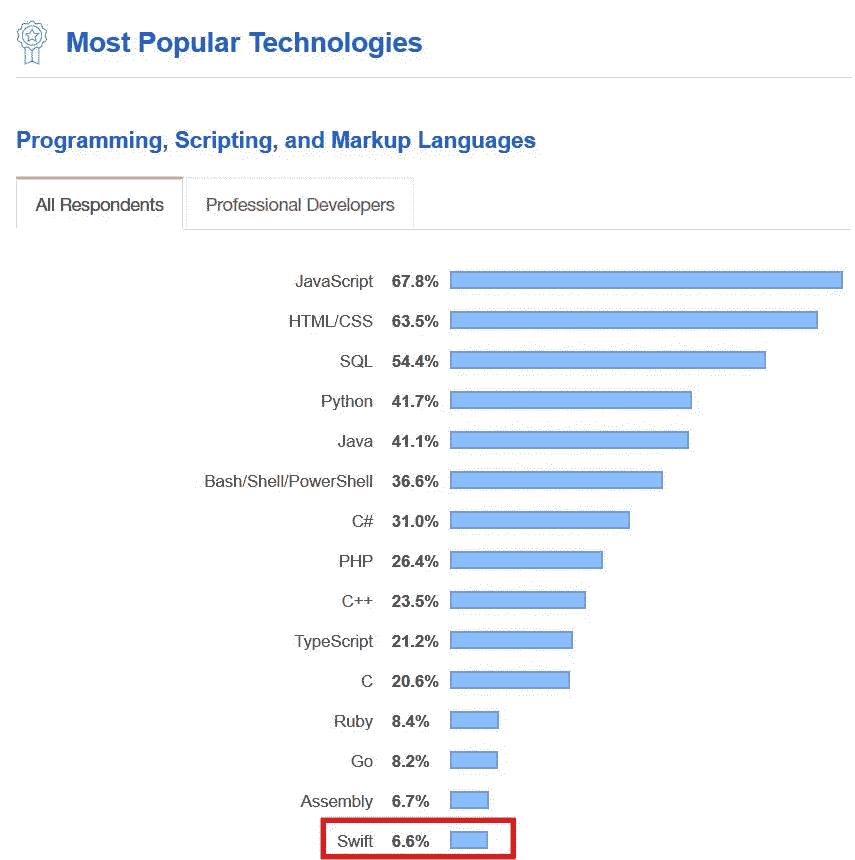**

**来源: [StackOverflow 开发者调查，2019](https://insights.stackoverflow.com/survey/2019)**

**Google trends 还显示 Swift 的受欢迎程度急剧上升:**

****

**来源:[谷歌趋势](https://trends.google.com)**

****就业市场:****

**事实上，Swift 在美国排名第九，有 6000 个职位空缺。在薪酬方面，Indeed 以 12.5 万美元的年薪位列 Swift 第二:**

**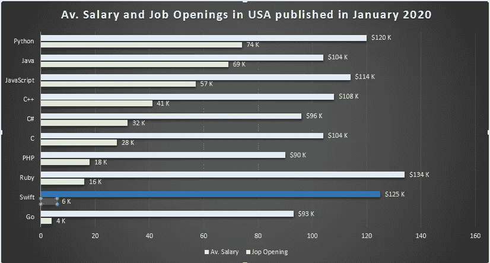**

**来源:[的确](https://www.indeed.com/)**

**StackOverflow 开发人员调查还显示，与 Objective-C 相比，Swift 开发人员可以凭借相对较少的经验获得高薪:**

**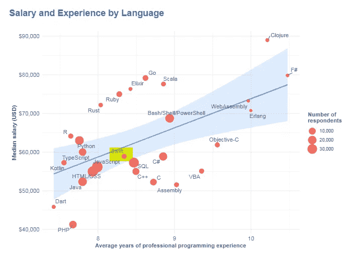**

**来源: [StackOverflow 开发者调查，2019](https://insights.stackoverflow.com/survey/2019#salary)**

****主要使用案例:****

*   **iOS 应用程序开发**
*   **系统程序设计**
*   **客户端开发(通过 WebAssembly)**
*   **深度学习**
*   **物联网**

# **9.去**

****

**和 Swift 一样，Go 也是过去十年中排名第二的编程语言。此外，与 Swift 一样，Go 也是由一家科技巨头创建的。**

**在过去的十年里，谷歌沮丧地发现，现有的编程语言无法承受谷歌看似无限的硬件和人力资源。比如编译 Google 的 C++代码库就花了半个小时。此外，他们想用新语言解决开发规模问题。**

**谷歌的著名软件工程师**罗布·派克** (UTF-8)和**肯·汤普森** (UNIX 操作系统)创造了一种新的、实用的、易学的、高度可扩展的系统编程语言 Go，并于 2012 年发布。 **Go 有一个运行时和垃圾收集器(几兆)，但是这个运行时打包在生成的可执行文件**中。**

**虽然 Go 有点功能贫血，但它已经迅速成为主流编程语言。**

****3 个关键特性:****

*   **Go 拥有对并发的语言级支持。它通过 Goroutine(轻量级绿色线程)和 Channel 提供了基于 CSP 的消息传递并发性。**
*   **Go 最大的 USP 就是它的语言设计和简洁。它成功地结合了 Python 的简单性和高效性以及 c 的强大功能。**
*   **Go 嵌入了垃圾收集器(虽然没有 JVM 垃圾收集器成熟)。Go 开发者可以用安全的 Java，Python 写系统编程。**

****人气:****

**和 Swift 一样，Go 的受欢迎程度也直线上升。**

**在几乎所有比较网站的流行编程语言中，Go 排名都很高，已经超过了很多现有的语言。这是 2020 年 1 月的 TIOBE 指数排名，Go 排名第 14 位:**

****

**来源: [TIOBE](https://www.tiobe.com/tiobe-index/)**

**StackOverflow 开发者调查 2019 也将 Go 列为第 13 大最受欢迎的技术(第 10 大最受欢迎的编程语言):**

**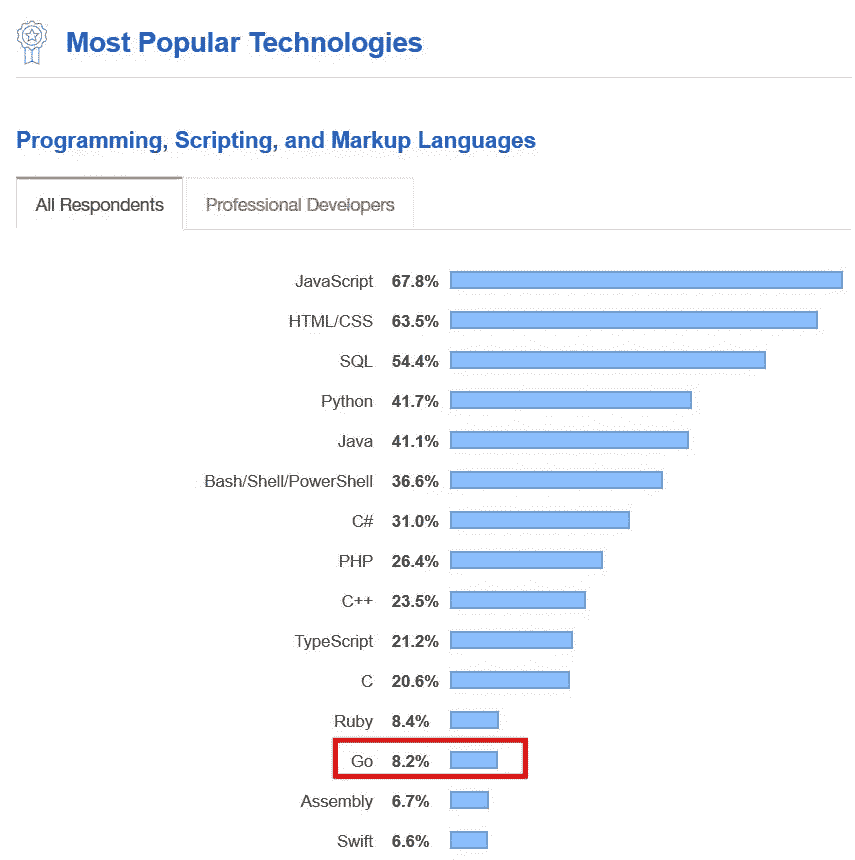**

**来源: [StackOverflow 开发者调查，2019](https://insights.stackoverflow.com/survey/2019)**

**根据 Stackoverflow 的调查，Go 是第九大最受欢迎的编程语言:**

**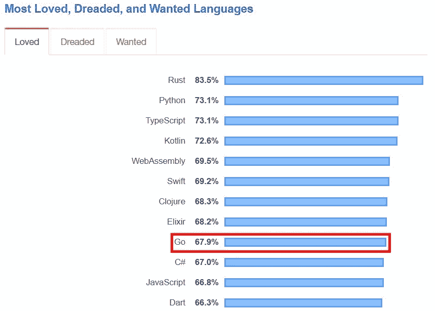**

**来源: [StackOverflow 开发者调查，2019](https://insights.stackoverflow.com/survey/2019)**

**根据 GitHub Octoverse 的数据，Go 也是十大发展最快的语言之一:**

****

**来源: [Octoverse](https://octoverse.github.com/)**

**围棋越来越受欢迎也反映在谷歌趋势中，谷歌趋势显示过去五年围棋的吸引力越来越大:**

**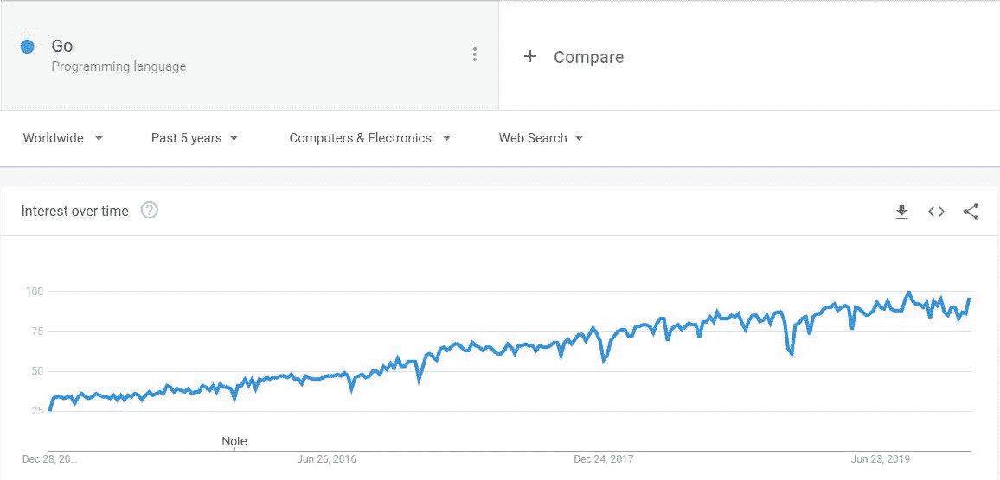**

**来源:[谷歌趋势](https://trends.google.com)**

****就业市场:****

**Indeed 将 Go 列为第十大最苛刻的语言，2020 年 1 月将有 4 K 个空缺。在薪酬方面，Go 排名第 9 位:**

**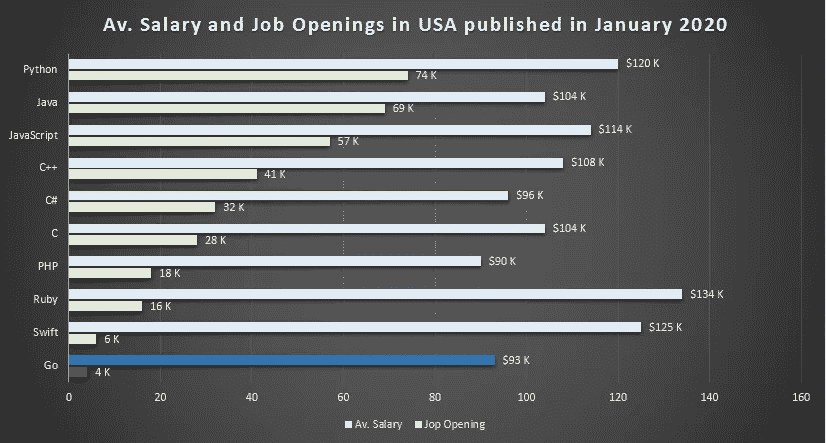**

**来源:[的确](https://www.indeed.com/)**

**2019 年 StackOverflow 开发者调查显示，Go 是收入最高的编程语言之一:**

**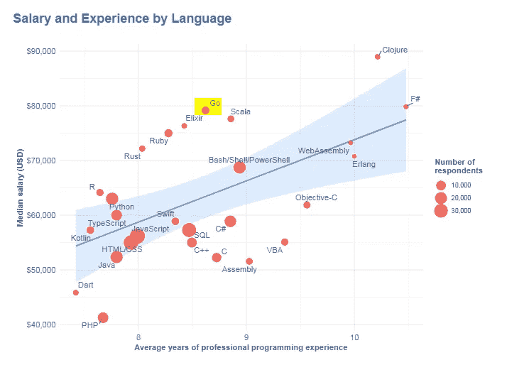**

**来源: [StackOverflow 开发者调查，2019](https://insights.stackoverflow.com/survey/2019#salary)**

****主要使用案例:****

*   **系统程序设计**
*   **无服务器计算**
*   **商业应用**
*   **云原生开发**
*   **物联网**

# **10.红宝石**

****

**Ruby 是这个列表中第三种由个人开发者在 20 世纪 90 年代开发的编程语言。日本计算机科学家**松本幸宏**创造了 Ruby 作为一种“面向对象的脚本语言”,并于 1995 年发布。**

**Ruby 后来发展成为一种解释的、动态类型的、高级的、多范例的通用编程语言。Ruby 是用 C 实现的，提供垃圾收集。**

**像 Python 一样，Ruby 非常关注开发人员的生产力和开发人员的快乐。虽然 Ruby 不是一种被大肆宣传的语言，但对于新开发人员来说，它是一种优秀的语言，学习曲线很平坦。**

****3 个关键特性:****

*   **Ruby 成功地结合了编程语言的一些最佳特性:动态、面向对象、函数式、垃圾收集和简洁。**
*   **尽管 Ruby 本身没有破坏性，但它的 Web 开发框架 **Ruby on Rails** 可能是最具破坏性和影响力的服务器端 Web 开发框架。**
*   **Ruby 被一些最大的软件项目所使用，比如 Twitter、GitHub、Airbnb，并且拥有优秀的工具和框架支持。**

****人气:****

**TIOBE 在 2020 年 1 月将 Ruby 列为第 11 大最受欢迎的编程语言，这是一个非常积极的举动:**

********

**来源: [TIOBE](https://www.tiobe.com/tiobe-index/)**

**Octoverse 还将 Ruby 列为 GitHub repositories 贡献的 2019 年第十大最受欢迎的编程语言:**

**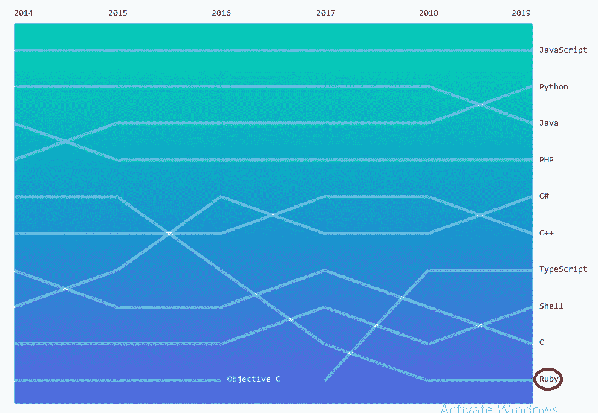**

**来源:[十月](https://octoverse.github.com/)**

**StackOverflow 开发者调查 2019 将 Ruby 列为第 9 大最受欢迎的编程语言(第 12 大最受欢迎的技术):**

**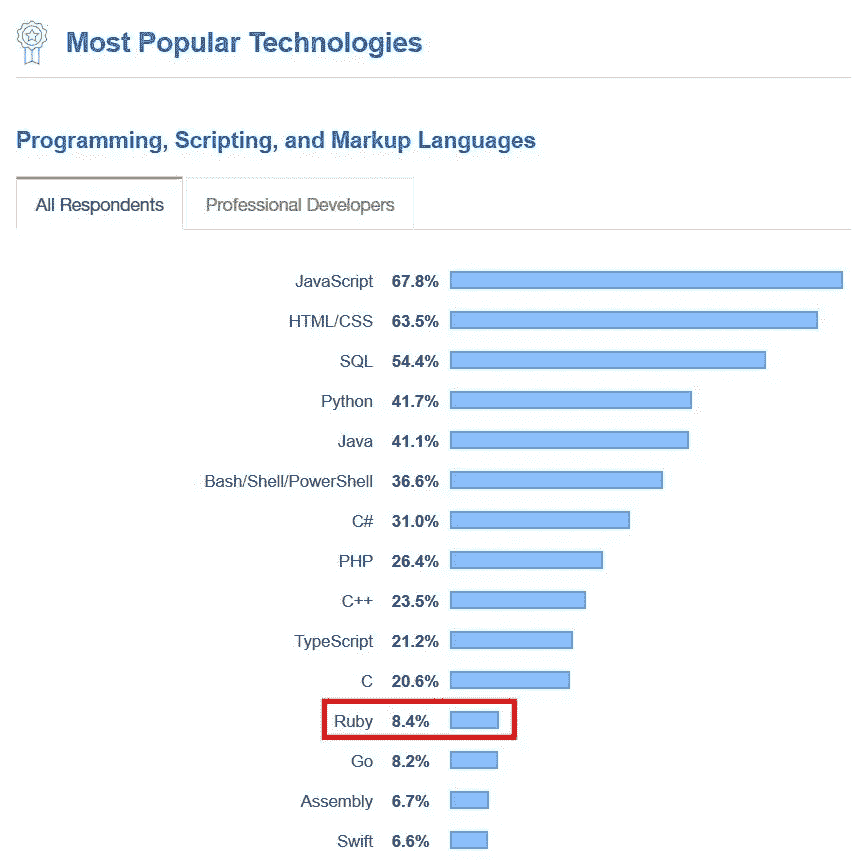**

**来源: [StackOverflow 开发者调查，2019](https://insights.stackoverflow.com/survey/2019)**

**近年来，Ruby 并没有成为一种被大肆宣传的语言，但根据 Google 的趋势，它仍然保持着它的吸引力:**

**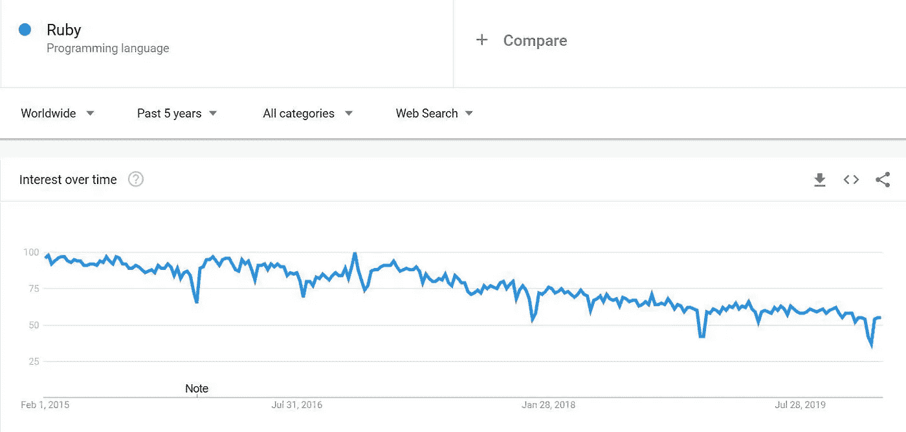**

**来源:[谷歌趋势](https://trends.google.com)**

****就业市场:****

**在美国的就业市场上，Ruby 开发人员可以拿高薪，而且排名第一。此外，Indeed 在 2020 年 1 月发布了针对 Ruby 开发人员的 16 K 个职位空缺，这使得 Ruby 在最苛刻的编程语言中排名第八。**

**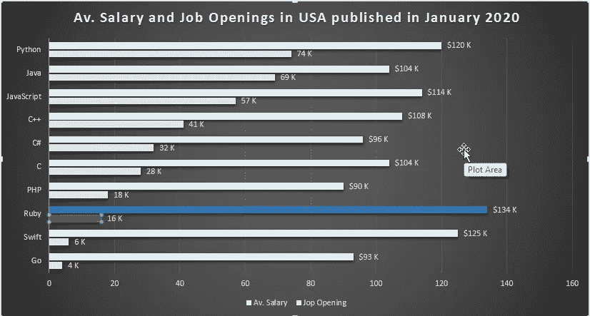**

**来源:[的确](https://www.indeed.com/)**

**stack overflow developer survey 2019 也表明，Ruby 开发人员可以在相对较低的经验下获得高薪:**

**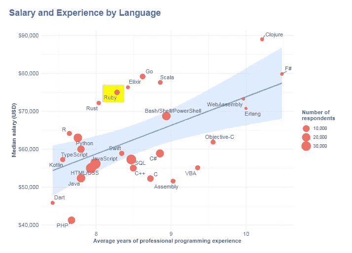**

**来源: [StackOverflow 开发者调查，2019](https://insights.stackoverflow.com/survey/2019#salary)**

# **类似文章:**

** [## 现在要学习的 7 种现代编程语言

### Rust、Go、Kotlin、TypeScript、Swift、Dart、Julia 如何促进您的职业发展并提高您的软件开发技能

towardsdatascience.com](/top-7-modern-programming-language-to-learn-now-156863bd1eec)  [## 关于 2021 年软件发展趋势的 21 个预测

### 云、边缘、容器、量子、区块链、AI、深度学习、批处理、流媒体、数据库、编程、软件……

towardsdatascience.com](/21-predictions-about-the-software-development-trends-in-2021-600bfa048be)  [## 2020 年前端开发的五大热门 JavaScript 框架

### 为前端开发人员、求职者和其他人提供的顶级 JavaScript 框架的深入分析和排名

medium.com](https://medium.com/@md.kamaruzzaman/top-5-in-demand-javascript-frameworks-for-front-end-development-in-2020-a59c4340d082)**