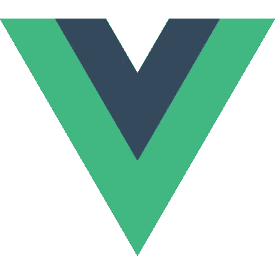

# 2020 年要学习的十大 JavaScript 框架

> 原文：<https://towardsdatascience.com/top-10-javascript-frameworks-to-learn-in-2020-a0b83ed3211b?source=collection_archive---------1----------------------->

## 现代 JavaScript 开发中最重要的 JavaScript 框架的精选列表

照片由 Md Kamaruzzaman 拍摄

JavaScript 是最流行的编程语言之一，也是网络的通用语言。在我之前的一篇文章中，我将 JavaScript 列为仅次于 Python 的第二大需求编程语言**:**

 [## 2020 年最受欢迎的 10 种编程语言

### 针对求职者和新开发人员的顶级编程语言的深入分析和排名

towardsdatascience.com](/top-10-in-demand-programming-languages-to-learn-in-2020-4462eb7d8d3e) 

> 无论是想开发前端 web 应用还是后端 Web 应用，JavaScript 无处不在。有许多优秀的 JavaScript 框架，而新的 JavaScript 框架几乎每天都在出现。

如果你想在 JavaScript 开发领域开始你的职业生涯，或者如果你是一个有经验的 JavaScript 开发人员，现在想提升你的技术技能，那么你应该学习哪个框架？这里我根据以下标准列出了最重要的 JavaScript 框架:

*   **流行**基于可靠的网站( [GitHub](http://github.com/) ，[JavaScript 的状态](https://stateofjs.com/)， [NPM 趋势](https://www.npmtrends.com/)，[谷歌趋势](https://trends.google.com))。
*   **在社区和行业中成为主流并已确立**。
*   一个庞大而充满活力的社区支持他们。
*   仍然很强大，不会像 jQuery 或 AngularJS 那样逐渐消失。

此外，我将包括前端和后端开发的框架。

我在这个列表中添加了纯 JavaScript 框架，除了 **React** 和 **Node.js** 。React 是一个只实现视图层的库。但实际上，React 核心库是整个 React 生态系统的一部分，包括其他 React 库(如 React 路由器)和第三方库。此外，像“[**【JavaScript 的状态】**](https://2019.stateofjs.com/front-end-frameworks/) ”和“ [**栈溢出开发者调查**](https://insights.stackoverflow.com/survey/2019#development-environments-and-tools) ”这样的知名网站已经将 React 列入 Web 框架类别。我还觉得，如果不包括最基本的 Web 框架/库，我只能给出 JavaScript 前景的一部分。此外， **Node.js** 是 JavaScript 运行时，而不是框架。但是 Node.js 提供了一个完整的基于 JavaScript 的后端开发生态系统，很多排名(例如“[**Stack Overflow Developer Survey**](https://insights.stackoverflow.com/survey/2019#development-environments-and-tools)”)通常会将 Node.js 与 Ruby on Rails、Django、PHP Laravel 放在后端框架类别中。我知道一些纯粹主义者可能不喜欢它，我会得到反弹，将 React 和 Node.js 包括在这个列表中。**但是为了描绘 JavaScript 领域的全貌，我有意识地选择将 React 和 Node.js 放在这个列表中**。

# 1.反应

React 并不是最早的颠覆性的基于 JavaScript 的 Web 框架。但它是最具颠覆性和影响力的基于 JavaScript 的网络框架。乔丹·沃克和一群脸书的工程师在 2013 年创建了 React，这是一个基于组件的 Web 框架，具有单向数据流，永远改变了前端 Web 开发。它还引入了许多其他概念，如**函数式、声明式编程**、**不可变状态、**，这在前端开发中并不常见。React 的另一个突破是引入了虚拟 DOM，它提供了更好的用户体验和性能增益。

今天，React 是迄今为止最占主导地位的 Web 框架,没有很快下滑的迹象。

## 5 个主要特点:

*   React 是最不个性化的框架之一，React-Core 只是视图层的一个基于组件的库。
*   React 有这样的口号:“**学一次，写哪里。”**软件工程师可以使用 React 开发 Web (React)、移动 App (React Native)、桌面 App(electronic)、后端开发(用 Node.js)。
*   React 提供了一流的服务器端**渲染(SSR)和出色的 SEO 支持**。
*   科技巨头脸书的需求推动了发展。好的一面是，React 的功能经过了 T4 26 亿脸书用户的考验。
*   React 也在不断完善自己，最近推出了 **React-Fiber** (并发性更好) **React hook** (样板代码更少)**悬疑**(渲染效果更好)。

## 人气:

React 每周有 800 万次下载，是目前下载量最大的前端 JavaScript 框架。此外，过去五年的 NPM 趋势表明，React 是前端框架中的明显赢家，远远领先于其他框架:

来源: [NPM 趋势](https://www.npmtrends.com/)

它是 GitHub 中排名第二的 JavaScript 框架，拥有第二多的贡献者:

来源: [GitHub](https://github.com/)

“JavaScript 现状”调查将 React 放在满意度和认知度的首位:

来源:[JavaScript 的状态，2019](https://2019.stateofjs.com/front-end-frameworks/)

2019 年 StackOverflow 开发者调查将 React 列为 Web 开发中第二大使用框架:

来源: [StackOverflow 开发者调查，2019](https://insights.stackoverflow.com/survey/2019#most-popular-technologies)

它也是 2019 年最受欢迎的前端框架:

来源: [StackOverflow 开发者调查，2019](https://insights.stackoverflow.com/survey/2019#most-loved-dreaded-and-wanted)

# 2.节点. js

尽管在服务器端开发中有过几次使用 JavaScript 的尝试，但都不是很受欢迎。2009 年， **Ryan Dahl** 创建了**异步、事件驱动的服务器端 JavaScript runtime Node.js** 并将 JavaScript 带入了**后端开发**的未知领域。Ryan Dahl 使用了流行的 **JavaScript 引擎 V8 和 C++库**。从那以后，Node.js 和 JavaScript 的受欢迎程度直线上升。凭借**节点包管理器 NPM** 和无数的框架/库，Node.js 已经超越了许多其他成熟的服务器端框架。由于其异步事件驱动的特性和轻量级的快速运行时，Node.js 特别适合 I/O 繁重的应用程序，如 Web、IoT、无服务器。

今天，Node.js 不是一个框架，而是服务器端 JavaScript 开发的整个生态系统。凭借许多创新(如 NPM、模块系统)，Node.js 是改进 JavaScript 作为编程语言并增加 JavaScript 受欢迎程度的主要驱动力之一。

## 5 个主要特点:

*   Node.js 是一个**异步、事件驱动的** JavaScript 框架，用于构建可伸缩的网络应用。
*   Node.js 是一个**跨平台**，将 Java 的“一次编写，随处运行”提升到了一个新的高度。它可以在 Windows、Linux、macOS、iOS、Android 和许多其他平台上运行。
*   由于其相对较小的尺寸和较快的启动速度，Node.js 大量用于**无服务器计算**。
*   Node.js 由 OpenJS 基金会运营，是一个开源框架，不受一家科技公司的控制。今天，几乎所有的科技巨头(IBM、微软、网飞)都在使用和支持 Node.js
*   它原生支持 JavaScript 和所有其他**“编译成 JS”语言，如 TypeScript、CoffeeScript、Dart** 。Node.js 还支持 Web 的下一个巨大事物: **WebAssembly** 。

## 人气:

虽然 Node.js 是排名第三的 JavaScript 项目，但它在 GitHub 中拥有最多的贡献者:

来源: [GitHub](https://github.com/)

StackOverflow 开发者调查 2019 将 Node.js 放在了其他框架类别的首位:

来源: [StackOverflow 开发者调查，2019](https://insights.stackoverflow.com/survey/2019#most-loved-dreaded-and-wanted)

此外，2019 年 Stack Overflow 开发者调查将 Node.js 列为第六大最受欢迎的框架:

来源: [StackOverflow 开发者调查，2019](https://insights.stackoverflow.com/survey/2019#most-loved-dreaded-and-wanted)

从过去十年的 Google 趋势数据来看，很明显 Node.js 已经超越了其他流行的服务器端框架，如 PHP Laravel、Django 和 ASP.NET。

来源:[谷歌趋势](https://trends.google.com/)

# 3.vue . j

在网络框架得到大型科技公司支持的今天， **Vue.js 是一个例外**。2014 年，前谷歌工程师**尤雨溪**决定结合 AngularJS (视图层)和 React (虚拟 DOM)的**优点，创建 Vue.js。今天，Vue.js 是最受欢迎的基于 JavaScript 的 Web 框架之一。尤雨溪的关键设计目标之一是降低基于 JavaScript 的前端开发的门槛。Vue.js 是最简单的前端框架之一，开发人员可以在其中轻松编写 SPA 应用程序。**

开发者可以使用 Vue.js 作为一个端到端的框架，包括路由、状态管理(如 Angular ),或者仅仅作为一个视图层(如 React)。它还提供了类似双向数据绑定的角度，以及类似使用虚拟 DOM 渲染的额外反应。

## 5 个主要特点:

*   Vue.js 提供了**渐进式**应用程序开发，是同类文档中最好的。如果您有一个大型的遗留 JavaScript 代码库，那么您可以使用 Vue.js 逐步更新您的代码库。
*   Vue.js 既作为自以为是的端到端框架**工作，也作为具有状态管理的视图层**。
*   它提供了反应式**双向数据绑定(如 Angular)和虚拟 DOM、事件源(如 React)** 。
*   Vue.js 对 JavaScript 和 TypeScript 的支持**是一样的。**
*   Vue.js 在即将到来的 **Vue.js 3.0** 中正在经历重大的检修和改进。

## 人气:

Vue.js 是最明星的 GitHub 项目，如下图:

来源: [GitHub](https://github.com/)

Vue.js 最近在行业中的采用率很高，这从 NPM 的高下载量和 Angular 的追赶上来看是显而易见的:

来源: [NPM 趋势](https://www.npmtrends.com/)

根据 2019 年 StackOverflow 开发者调查，Vue.js 在所有 Web 框架中排名第 7:

来源: [StackOverflow 开发者调查，2019](https://insights.stackoverflow.com/survey/2019#most-loved-dreaded-and-wanted)

此外，StackOverflow 开发者调查 2019 将 Vue.js 列为第二大最受欢迎的 Web 框架:

来源: [StackOverflow 开发者调查，2019](https://insights.stackoverflow.com/survey/2019#most-loved-dreaded-and-wanted)

“JavaScript 现状”调查将 Vue.js 列为第二大热门网站:

来源:[JavaScript 的状态，2019](https://2019.stateofjs.com/front-end-frameworks/)

# 4.有角的

在 **AngularJS** ，谷歌在 2010 年创建了最早的基于 JavaScript 的前端框架。但一旦脸书发布 React，它就暴露了 AngularJS 的设计缺陷，它很快成为一个过时的框架。因此，谷歌团队创建了一个全新的**SPA 框架，并于 2016 年发布了 Angular** 。Angular 和 AngularJS 虽然名称相似，但实际上是两种不同的框架。与 React 不同，它是一个**端到端框架**，提供开发企业级 Web 应用所需的一切“开箱即用”支持。此外，Angular 是第一个包含 TypeScript 的重要框架，并在 TypeScript 的流行中发挥了相当大的作用。

如今，Angular 在宣传和兴趣方面落后于 React、Vue.js 或 Svelte。但是它是一个经过验证的可靠的企业级框架，将会在未来几年内出现在社区中。

## 5 个主要特点:

*   Angular.js 是一个端到端的框架，支持开发企业应用。在 Angular CLI 中，它拥有 JavaScript 领域中最好的命令行工具之一。
*   使用 TypeScript 并将模板从样式和业务逻辑中分离出来，它特别适合于企业级大型代码库。
*   t 天生就是最安全的前端框架，具有像 DOM 清理这样的内置特性。
*   尽管谷歌没有像脸书支持 React 那样支持 Angular，但它仍然投入了足够的资源，以使 Angular 仍然是一个有吸引力的创新框架。最近它增加了**惰性装载，差异装载来改善模块**的装载时间。
*   在 Angular 9 中，它发布了一个新的渲染引擎 Ivy，以改善启动时间、响应时间，并减少包的大小。

## 人气:

如果我们考虑 GitHub stars，那么它是第四大流行的 JavaScript 框架，如下所示:

来源: [GitHub](https://github.com/)

Angular 通过在行业中的大规模采用弥补了其缺乏人气，因为它在 NPM 下载量方面领先于非常受欢迎的 Vue.js:

来源: [NPM 趋势](https://www.npmtrends.com/)

StackOverflow 开发者调查 2019 将 Angular 排在所有 Web 框架的第三位:

来源: [StackOverflow 开发者调查，2019](https://insights.stackoverflow.com/survey/2019#most-loved-dreaded-and-wanted)

根据 2019 年“JavaScript 现状”调查，Angular 在认知度方面排名第二:

来源:[JavaScript 的状态，2019](https://2019.stateofjs.com/front-end-frameworks/)

# 5.表达

当 Node.js 在 2009 年出现时， **TJ Holowaychuk** 已经基于**极简网络框架 Sinatra** 创建了 Express.js。它是一个开发 Web 应用程序和 REST API 的极简 Web 框架。也不那么固执己见，速度非常快。许多其他基于 JavaScript 的 Web 框架都是基于 Express 的。

今天，Express.js 无疑是最受欢迎的基于 JavaScript 的 Web 应用程序框架。

## 5 个主要特点:

*   Express.js 几乎是默认的 JavaScript 服务器端框架。
*   Express 是一个完整的应用框架，包括中间件、路由和模板。
*   Express 支持 MVC 模式，View 系统支持 14 个以上的模板引擎。
*   它还提供可靠的路由。
*   Express 还支持内容协商。

## 人气:

它是最流行的基于 JavaScript 的后端框架，GitHub stars 证明了这一点:

来源: [GitHub](https://github.com/)

凭借每周超过 1000 万次的下载量，Express.js 是目前下载量最大的 JavaScript 框架:

来源: [NPM 趋势](https://www.npmtrends.com/)

“JavaScript 现状”调查已经连续三年(2017、2018、2019)将 Express.js 列为顶级 JavaScript 服务器端框架:

来源:[JavaScript 的状态，2019](https://2019.stateofjs.com/back-end/)

2019 年 StackOverflow 开发者调查将 Express 列为 2019 年第五大最受欢迎的 Web 框架和最受欢迎的 JavaScript 后端框架:

来源: [StackOverflow 开发者调查，2019](https://insights.stackoverflow.com/survey/2019#most-popular-technologies)

# 6.Next.js

React 是一个非常非个性化的框架，其中 React-Core 只提供视图层。总是需要一个基于 React 的端到端的、固执己见的框架。蒂姆·诺特肯斯和一群来自荷兰公司 **Zeit** 的软件工程师在 React 和 Node.js 的基础上创建了 Next.js 作为一个**端到端的、更高级别的网络框架。Next.js 为 Web、桌面和移动设备提供了服务器呈现的和静态的网站。**

## 5 个主要特点:

*   Next.js 建立在两个最流行和久经考验的 JavaScript 框架之上:React 和 Node.js。
*   它还提供了“**一次构建，随处运行，**”，即 Next.js 可以在 Web、移动和桌面上运行。
*   Next.js 提供了出色的**服务器端渲染，以及出色的 SEO 支持和快速启动**。
*   它提供自动代码分割和基于文件系统的路由。
*   它还支持易于使用的数据获取和内置的 CSS 支持。

## 人气:

就 GitHub stars 而言，它是第六大最受欢迎的 JavaScript 框架和第二大最受欢迎的 JavaScript 后端框架:

来源: [GitHub](https://github.com/)

Next.js 的受欢迎程度在过去几年里直线上升，下载量的增加就说明了这一点:

来源: [NPM 趋势](https://www.npmtrends.com/)

根据《JavaScript 现状》2019，Next.js 连续两年(2018，2019)作为第二最满意的 JavaScript 后端框架:

来源:[JavaScript 的状态，2019](https://2019.stateofjs.com/front-end-frameworks/)

# 7.流星

2012 年，一群工程师已经创建了 **Meteor，作为一个基于 Node.js 的同构、开源的全栈 JavaScript 框架**，它还支持为 Web、移动、桌面平台构建端到端的应用程序，并与 React、Vue.js、Angular、Svelte 等流行的前端框架很好地集成。它还是一个“**电池内置**”框架，为企业级应用程序开发提供“开箱即用”的支持。

## 5 个主要特点:

*   Meteor 是一个全栈**框架**来开发完整的栈:前端到后端。
*   对于前端开发，它有自己的**模板引擎**。但开发者可以将 Meteor 与其他流行的前端框架一起使用，如 **Angular、React、Vue.js 或 Svelte** 。
*   它是一个**跨平台框架**，可以为 Web、移动和桌面开发应用程序。
*   Meteor 已经集成了 JavaScript 栈，这使得不同的集成技术(例如 MongoDB 数据库、React 前端)变得非常容易。
*   它是一个**同构平台**，在客户端和服务器端共享相同的 API。

## 人气:

根据 GitHub 星级的数量，它是第七大最受欢迎的 JavaScript 框架:

来源: [GitHub](https://github.com/)

“JavaScript 现状”调查将 Meteor 列为第七大最受欢迎的 JavaScript 框架，尽管其受欢迎程度正在下降:

来源:[JavaScript 的状态，2019](https://2019.stateofjs.com/front-end-frameworks/)

# 8.苗条的

2016 年，卫报软件工程师 **Rich Harris** 有了**的突破性想法，开发了一个没有框架特定运行时的 JavaScript 框架**，并发布了 Svelte。这个想法是使用 **Svelte 编译器**，它将特定于框架的代码编译成普通的 JavaScript、HTML、CSS，并将编译后的代码呈现给浏览器。尽管这个概念在软件开发中并不新鲜，但在前端开发中却是未知的领域。Svelte 的另一个重要贡献是增加了**对反应性的一流支持，从而在没有虚拟 DOM 的情况下实现更快、更好的性能**。今天，它可以说是最热门的前端框架，在业界有着巨大的吸引力和兴趣。

## 5 个主要特点:

*   它是一个编译时框架，不需要任何特定于框架的运行时。在所有框架中，它拥有最小的**包大小**。
*   Svelte 通过反应式编程执行 DOM 渲染，这在大多数情况下比虚拟 DOM 快。因此，Svelte 是所有框架中渲染速度最快的。
*   **Svelte 和 React-Core 一样只是一个视图层**，是一个非个性化的框架。
*   Svelte 同时支持客户端和服务器端渲染，具有出色的 SEO 支持。
*   开发人员可以使用 Svelte 开发 Web 应用程序、跨平台移动应用程序开发或桌面应用程序开发。

## 人气:

Svelte 自 2018 年第二版发布以来才开始流行，在 GitHub 星级中排名第八:

来源: [GitHub](https://github.com/)

在过去的几年里，Svelte 在业内的认养人数越来越多，这从 NPM 趋势中可以明显看出:

来源: [NPM 趋势](https://www.npmtrends.com/)

社区和行业对 Svelte 表现出了很高的兴趣，这一点从“JavaScript 的现状”调查中可以明显看出，Svelte 在兴趣方面排名第一:

来源:[JavaScript 的状态，2019](https://2019.stateofjs.com/front-end-frameworks/)

# 9.寇阿相思树

在 2013 年，由 TJ Holowaychuk 领导的 Express.js 的核心成员已经创建了 Koa 作为一个轻量级的、现代的、富有表现力的、健壮的中间件框架，用于 Web 应用和 API。Koa 是非常模块化的，只有很小的核心，没有中间件。然而，中间件可以作为独立的模块使用。

## 5 个主要特点:

*   Koa 有一个轻量级的、更小的内核，没有现成的中间件包。
*   Koa 有一个**高度模块化的架构**，并提供可插拔的中间件模块。
*   Koa 以类似堆栈的方式支持**级联中间件**，允许下游执行动作，而上游操纵响应。
*   Koa 使用了 **async/await 来代替回调**，并且支持更干净、更有表现力的代码以及更好的错误处理。
*   性能方面，**胜过 Express.js** 。

## 人气:

Koa 也是一个非常受欢迎的基于 JavaScript 的后端框架，在 GitHub 星级中排名第九:

来源: [GitHub](https://github.com/)

Koa 在行业中也大量使用，这从每周的高下载量可以明显看出:

来源: [NPM 趋势](https://www.npmtrends.com/)

JavaScript 调查将 Koa 列为最令人满意的 JavaScript 后端框架的第五名:

来源:[JavaScript 的状态，2019](https://2019.stateofjs.com/front-end-frameworks/)

# 10.Ember.js

受 **Ruby on Rails** 原则“**约定优于配置”的启发，来自 **Apple** 的**耶胡达·卡茨在 2012 年**创建了 Ember.js 作为一个非常固执己见的端到端框架。Ember.js** 是一个严格向后兼容的框架，从一开始就没有引入重大的突破性变化。当那个时代的其他框架(Backbone.js，AngularJS)越来越不受欢迎时，Ember.js 仍然提供了一个可靠的、高效的框架来满足现代前端开发的需要。

## 5 个主要特点:

*   端到端的自以为是的内聚框架关注于"**约定胜于配置。"**
*   Ember 得到了 LinkedIn、雅虎等几家科技巨头的支持，而不是一家科技巨头。因此，**它不是由一家公司的需求驱动的**。
*   Ember 的**数据库**是最好的一次访问多个数据源的数据，建立异步关系。
*   在 **Ember CLI** 中，它拥有所有 JavaScript 框架中最好的 CLI，有助于搭建和生成所有具有正确结构的必要代码，包括所有依赖项。
*   在其最新版本 **Ember Octane** 中，它引入了 **HTML 优先和组件优先方法，改进了对状态管理和反应性的支持**。

## 人气:

Ember.js 是 JavaScript 框架中排名第十的 GitHub 项目:

来源: [GitHub](https://github.com/)

Ember.js 最近受到了业界越来越多的关注，每周下载量超过 10 万次:

来源: [NPM 趋势](https://www.npmtrends.com/)

根据“JavaScript 现状”调查，Ember.js 在知名度方面排名第四:

来源:[JavaScript 的状态，2019](https://2019.stateofjs.com/front-end-frameworks/)

# 类似文章:

 [## 2021 年十大热门 Web 开发框架

### 针对企业和开发人员的顶级 web 开发框架的深入分析和排名

towardsdatascience.com](/top-10-in-demand-web-development-frameworks-in-2021-8a5b668be0d6)  [## 2020 年最受欢迎的 10 种编程语言

### 针对求职者和新开发人员的顶级编程语言的深入分析和排名

towardsdatascience.com](/top-10-in-demand-programming-languages-to-learn-in-2020-4462eb7d8d3e)  [## 现在要学习的 7 种现代编程语言

### Rust、Go、Kotlin、TypeScript、Swift、Dart、Julia 如何促进您的职业发展并提高您的软件开发技能

towardsdatascience.com](/top-7-modern-programming-language-to-learn-now-156863bd1eec)