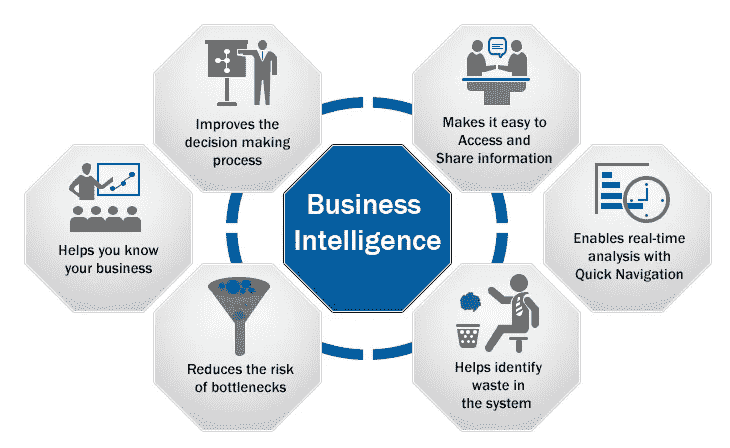
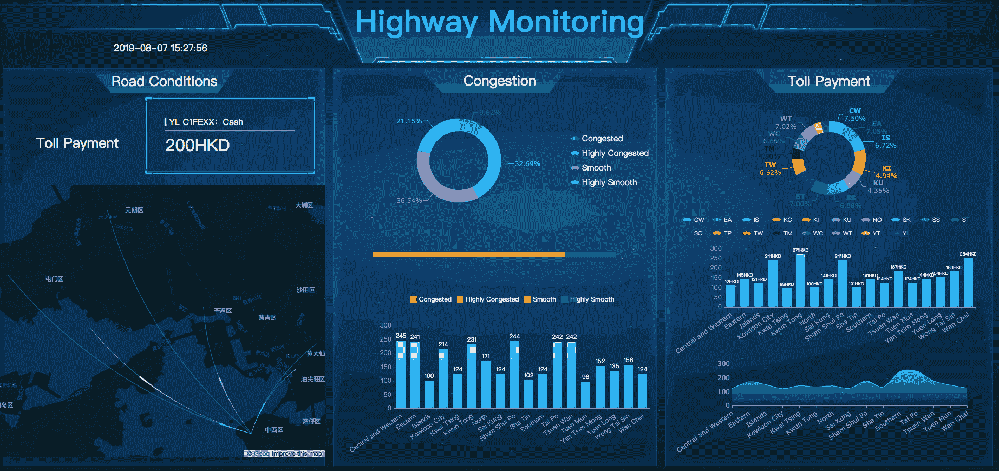
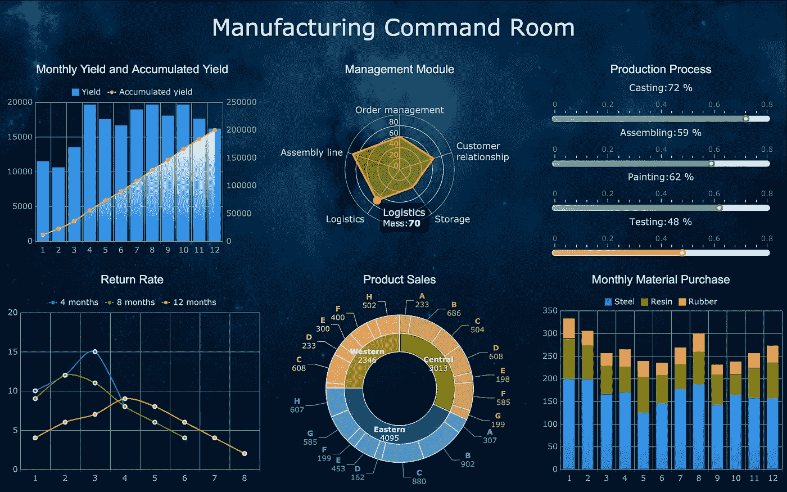
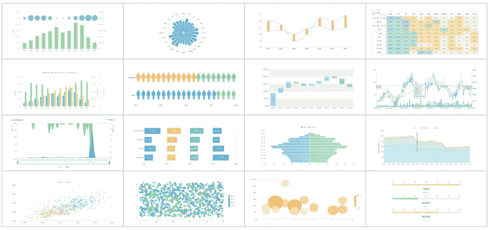
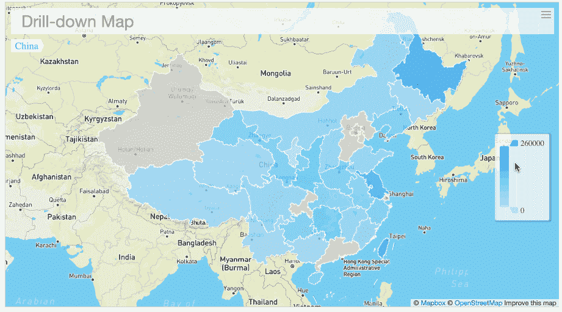
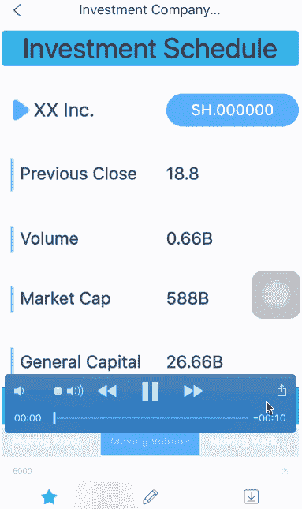

# 2020 年商务智能工具的 10 大关键特性

> 原文：<https://towardsdatascience.com/top-10-key-features-of-bi-tools-in-2020-fd02c1dd4c71?source=collection_archive---------14----------------------->

## 你知道商业智能能解决什么问题，什么样的 BI 工具才算好的吗？

如今，商业智能市场正在升温。投资界和 IT 界都在密切关注大数据和商业智能。但是你知道 BI 工具能解决什么问题，什么样的 BI 工具才算是好的吗？

图片来源:[https://www . exist bi . com/articles/business-intelligence-systems-and-data-mining/](https://www.existbi.com/articles/business-intelligence-systems-and-data-mining/)

根据对 Gartner 分析和商业智能平台魔力象限评估标准的研究，我总结了 [BI 工具](/5-most-popular-business-intelligence-bi-tools-in-2019-4e060b98039a)的 10 大关键特性，供您参考。

总体而言，随着用户的数据来源变得更加广泛，他们对 BI 的偏好也在发生变化。他们更喜欢自助式开发、交互式仪表盘和自助式数据探索。说白了，用户越来越希望自己做数据分析，而不必找 it 部门支持。

# 1.BI 平台的管理、安全性和架构

**好的 BI 工具可以实现平台安全，管理平台用户，监控访问和使用，优化性能，支持不同操作系统的运行，保证系统的高可用性和灾难恢复。**

BI 平台作为企业信息化的一部分，有很多理由做单独的管理和容灾。一方面，政府、互联网公司、大型企业都非常重视信息化建设，要求单独维护。另一方面，BI 系统也逐渐成为企业管理决策的支撑，发挥着越来越大的作用。企业需要 BI 系统全天提供稳定的服务。

# 2.元数据管理

用户可以集中管理元数据，包括元数据的搜索、提取、处理、存储、共享和对外发布。

这里的元数据集中于业务分析所需的维度、指标、层次、度量和其他数据。还包括一些经过处理的数据，比如 KPI、个人销量、单品销量等数据。同时，系统支持管理员将用户处理和存储的元数据与连接到 BI 平台的底层数据关联和集成。

# 3.分析仪表板

**借助可视化探索操作和嵌入式高级地理空间分析，创建高度互动的仪表盘和内容。**

分析仪表板也可以理解为交互式图表组件，如常见的条形图、折线图、散点图等。，以及高级矩形树形图、多层圆环图、行政地理图、自定义地图、热图、流程图等。这里的重点是这些图表要内置在 BI 工具中，同时它支持业务人员简单的拖拽实现图表展示。从目前来看，这个趋势还是比较明显的。

用 [FineReport](https://www.finereport.com/en/?utm_source=medium&utm_medium=media&utm_campaign=blog&utm_term=Top%2010%20Key%20Features%20of%20BI%20Tools%20in%C2%A02020) 制作的高速公路监控仪表盘

用 [FineReport](https://www.finereport.com/en/?utm_source=medium&utm_medium=media&utm_campaign=blog&utm_term=Top%2010%20Key%20Features%20of%20BI%20Tools%20in%C2%A02020) 制作的制造业仪表盘

# 4.交互式视觉探索

**使用一系列常用和特殊图表探索和分析数据。**

这些常规图表主要是饼状图、折线图等。，而特殊图表指的是特殊的视觉效果，如热图、流程图、矩形树图、GIS 地理信息图等。当然，除了图表的丰富和美观，还需要注意交互操作。

用 [FineReport](https://www.finereport.com/en/?utm_source=medium&utm_medium=media&utm_campaign=blog&utm_term=Top%2010%20Key%20Features%20of%20BI%20Tools%20in%C2%A02020) 制作的下钻图

> 如果你想了解更多的图表类型，这篇文章供你参考: [*数据可视化中前 16 种图表类型*](/top-16-types-of-chart-in-data-visualization-196a76b54b62) 。

# **5。支持移动显示**

**用户可以将 BI 工具的分析内容发布到移动终端设备上，并可以利用移动设备自身的功能实现触摸操作、照片、视频、定位等。双页的。**

移动商务智能是目前商务智能市场的一大亮点。不同的公司有不同的需求。有人关注多个操作系统，比如 Android 和 IOS 版本，必须同步支持。有些人注重功能和交互效果，如移动设备上的数据采集、图像和视频采集、定位、联动和钻孔。但是请大家多注意移动终端的安全，移动 BI 一定要保证企业数据的安全。

用 [FineReport](https://www.finereport.com/en/?utm_source=medium&utm_medium=media&utm_campaign=blog&utm_term=Top%2010%20Key%20Features%20of%20BI%20Tools%20in%C2%A02020) 制作的移动仪表盘

# 6.嵌入分析内容

**支持 BI 分析页面与业务流程或业务系统的无缝集成，支持在业务软件中直接创建和修改分析内容，支持 BI 平台的管理。**

BI 分析内容的无缝嵌入主要考虑几个方面。首先是实现单点登录，即用户不必先登录业务系统，再重新登录 BI 系统，系统自动完成多平台认证。二是权限整合。BI 平台必须提供一个集成解决方案，允许用户在业务软件界面查看权限内的 BI 分析内容。第三是 UI 集成。作为嵌入到业务系统中的组件的一部分，BI 平台本身应该具有轻松修改 UI 的能力，以便将嵌入式 BI 接口集成到业务系统中。

# 7.嵌入式高级分析

**用户可以轻松使用 BI 平台内置的高级分析功能，也可以导入和集成外部开发的高级分析模型。**

通俗的理解，BI 平台自带高级分析模型和算法模型，允许用户拖动数据，自动运行模型得出结论。从目前市面上的 BI 产品策略来看，大部分 BI 产品尚未支持嵌入式高级分析，少数支持与 R 语言集成。常见的场景是用户自己开发算法模型或者多年积累的高级分析模型，然后将分析模型处理的数据连接到 BI 系统进行可视化分析和展示。也就是 BI 工具还是为了数据分析和图形显示。

# 8.自助数据准备

**用户自己拖拽不同来源的数据，创建分析模型，然后系统通过智能分析和自动关联，自动处理数据，包括结构化数据和非结构化数据。**

自助数据准备本质上是让 BI 系统自动处理数据之间的逻辑关联。目前很多 BI 工具很难做到这一点，但是市面上类似 FineReport 这样的 BI 报表工具却开辟了新的解决方案。除了自动关联和转义数据，还可以手动设置关联。同时，在 IT 人员初步处理完数据后，业务人员可以通过 SPA 螺旋分析功能再次处理数据。

# 9.发布和共享分析内容

**允许用户通过各种文件输出类型和分发方式发布和操作 BI 分析内容。**

用户可以通过商业智能平台分享商业智能分析的内容和决策。总之我做的 BI 分析页面可以分享给别人，我也可以编辑修改别人分享的内容，我们可以互相交流。这里最大的价值是 BI 分析的重用。即你所做的 BI 分析数据和结论可以共享，你自己的分析模型也可以共享，提高企业员工的协作效率。

# 10.易用性和可视化

**易于管理和部署 BI 平台，创建和共享 BI 分析，易于可视化数据。**

BI 软件的专业性和易用性是很难平衡的两个方面。BI 软件的易用性必须考虑到业务人员的软件操作水平和这方面可接受的培训成本。我认为易用性更多的是提供操作提示和更容易的交互。然而，仍然需要进行必要的培训。毕竟数据分析本身就是一个专业的事情，需要相应的技能。

# 最后

在商业智能领域的研究和实践中，越来越多的管理者期望通过实施数据分析项目和购买商业智能软件来解决企业管理和决策中遇到的困难。一些公司从数据共享、数据分析和业务预测三个层面进行探索。更多的时候，他们适应企业的实际运作，进行业务调整。

还有的更注重企业的管理，走分析、运营、战略三个阶段。这就造成了对商业智能需求的根本差异。我们不一定要改变公司管理业务的方式。相反，我们使用合适的 BI 软件来使管理更有效，使决策更科学。

# 您可能也会对…感兴趣

[*2019 年你不能错过的 9 款数据可视化工具*](/9-data-visualization-tools-that-you-cannot-miss-in-2019-3ff23222a927)

[*让你的数据报告脱颖而出的指南*](/a-guide-to-making-your-data-reporting-stand-out-cccd3b99e293)

[*6 种数据分析方法帮你做出出色的财务报表*](/6-data-analysis-methods-to-help-you-make-great-financial-statements-2bd573a19b17)