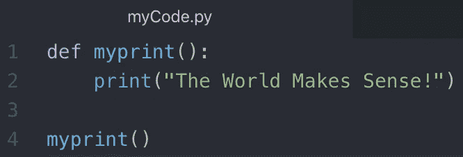
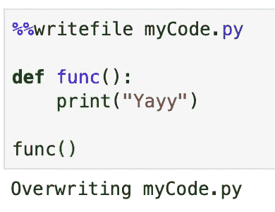
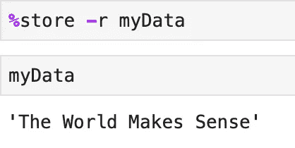

# Python 中提高生产力的 10 大神奇命令

> 原文：<https://towardsdatascience.com/top-10-magic-commands-in-python-to-boost-your-productivity-1acac061c7a9?source=collection_archive---------4----------------------->

## jupyter 笔记本中重要 IPython 魔术命令的实现


Artem Maltsev 在 [Unsplash](https://unsplash.com?utm_source=medium&utm_medium=referral) 上拍摄的照片

Python 不仅是最通用的编程语言，而且在集成新特性时也是最灵活的。也就是说，魔术命令是 python shell 中添加的重要特性之一。

**python 中的魔法命令到底是什么？**

魔术命令是在普通 python 代码上添加的增强功能，这些命令是由 IPython 内核提供的。

> 这些神奇的命令通常以“**%”**字符为前缀

添加这些命令主要是为了解决我们面临的常见问题，同时也为您的代码提供了一些快捷方式。

有两种神奇的命令可供使用— %前缀和%%前缀

> % prefix 表示命令在单行代码上操作，而%% prefix 允许命令在整个单元上操作。

以下是在 jupyter notebook 中执行的魔法命令及其实现列表。

# 运行外部文件

当我们尝试在 jupyter 笔记本中运行一些代码片段时，我们希望运行位于某个目录中的外部代码文件。

%run 允许您从 jupyter 笔记本运行任何外部 python 文件



上面的文件 myCode.py 包含一个简单的脚本，它输出上述语句。


如果我们指定包含%run 命令路径的文件名，它将执行该文件。

> 注意:%run 也允许执行外部 jupyter 笔记本。

# 代码执行时间

有没有想过你的手机运行需要多长时间？


照片由[卢克·切瑟](https://unsplash.com/@lukechesser?utm_source=medium&utm_medium=referral)在 [Unsplash](https://unsplash.com?utm_source=medium&utm_medium=referral) 上拍摄

时间魔术命令允许跟踪你的细胞的总执行。

> 因为我们将在这里处理整个单元格，所以我们将在 time 关键字前使用%%作为前缀。


上面的单元格包括一个随机计算的 for 循环。%%time 有助于获得运行 for 循环所需的执行时间。

# 将内容复制到外部文件

大多数时候，您会觉得需要直接从 jupyter 笔记本中将内容添加到 python 脚本或文本文件中。

您可以通过在代码前添加 writefile 命令来直接导出单元格内容，而不是复制所有内容并创建新文件。

> 请注意命令前的双%,它表示将导出单元格的全部内容。



因为我已经创建了包含一些内容的文件，所以它显示“Overwriting myCode.py ”,指定它将用上面图像中显示的内容覆盖我的原始内容。

# 显示外部文件的内容

通常你会觉得需要从外部文件中复制几行代码到你的代码中。%pycat 允许您显示任何目录中任何文件的内容，而不是获取文件并打开它进行复制的漫长过程。


它将外部文件的所有内容显示为输出。就其应用而言，它可以被认为是%writefile 的反向。


克里斯·利维拉尼在 [Unsplash](https://unsplash.com?utm_source=medium&utm_medium=referral) 上的照片

抓紧了！大量令人惊奇的命令仍有待探索。

# 列出所有变量

这个神奇的命令显示了整个笔记本中使用的所有变量。

下面是 3 个变量——2 个字符串和 1 个整数。如果我们运行 **%who，**，它将列出我们已经定义的所有 3 个变量。

```
a = "hello"
b = "Good Morning"
c = 1
```


上面的代码显示了所有变量，不管它们的数据类型如何。


为了显示特定的数据类型变量，我们需要在 magic 命令后传递数据类型。上面的代码将所有 string 数据类型变量显示为其输出。

# 在笔记本之间共享变量


由[凯利·西克玛](https://unsplash.com/@kellysikkema?utm_source=medium&utm_medium=referral)在 [Unsplash](https://unsplash.com?utm_source=medium&utm_medium=referral) 上拍摄的照片

这个神奇的命令允许你在不同的 jupyter 笔记本之间共享任何变量。您需要用 magic 命令传递原始变量。

要检索变量，您需要传递带有'-r '参数的相同命令。

这是第一个笔记本的样子


检索这些数据所需的代码写在另一个笔记本上。



这可能是在不同笔记本之间共享任何数据类型的数据的最简单方式。

# 执行 html 脚本

%% html 允许我们在单元格中编写 html 代码。该单元格现在将充当 html 编辑器，输出该单元格的 html。

下面的代码包含一个用 html 创建的简单表格。您可以注意到显示预期表格的 html 输出。

```
%%html
<html>
<body>
<table>
        <tr> 
            <th>Name</th> 
            <th>Country</th> 
            <th>Age</th> 
        </tr> 
        <tr> 
            <td>Sid</td> 
            <td>India</td> 
            <td>22</td> 
        </tr>
        <tr> 
            <td>Dave</td> 
            <td>UK</td> 
            <td>28</td> 
        </tr>
</table>
</body>
</html>
```


提示:您可以使用类似于 HTML magic command 的%%js magic command 在单元格中运行 Javascript 代码。

# 显示 Matplotlib 图形

**% matplotlib inline**magic 命令是最流行的命令。这个命令允许 Jupyter notebook 在笔记本中显示 matplotlib 图形。此命令为您的 jupyter 笔记本激活 matplotlib 交互式支持。

```
import random
import matplotlib.pyplot as plt
%matplotlib inline
```

我们导入了一些解释命令功能所需的库。

我们现在将创建两个随机列表来绘制图表

```
a = []
b = []
for i in range(10):
    a.append(random.randint(0,10))
    b.append(random.randint(0,10))
```

现在我们将绘制数据的散点图。

```
plt.scatter(a,b)
```


%matplotlib inline magic 命令允许您在 jupyter 笔记本中可视化图形。

# 设置环境变量

这个神奇的命令允许你做 3 件事——列出所有的环境变量，获取特定环境变量的值，并为变量设置一个值。


没有参数的%env 将列出所有的环境变量。


带有单个参数的%env 将返回指定参数的值。

**'%env 变量值'**将为指定的变量名设置值。

# 对象详细信息

%pinfo 提供了与其一起传递的对象的详细信息。它是类似于**的物体吗？**功能。

在下面的代码片段中，我传递了一个简单的字符串' a '和%pinfo，以获得关于它的详细信息。

```
a = "The World Makes Sense!"
%pinfo a
```


从上面的输出中，%pinfo 提供了关于 string 对象的所有信息。


亚历克斯·纪尧姆在 [Unsplash](https://unsplash.com?utm_source=medium&utm_medium=referral) 上的照片

> 使用' **%lsmagic** '命令可以找到所有的魔法命令列表。

```
%lsmagic
```


这些是我的 10 大神奇命令，可以帮助你提高工作效率，节省时间。

希望你喜欢！