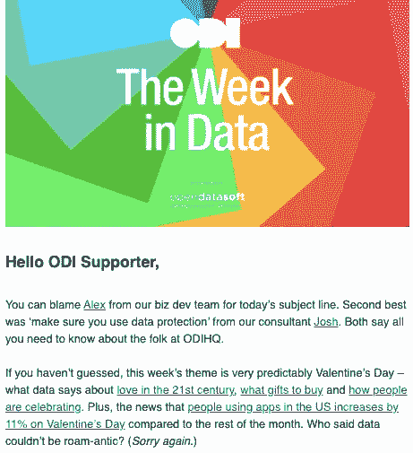
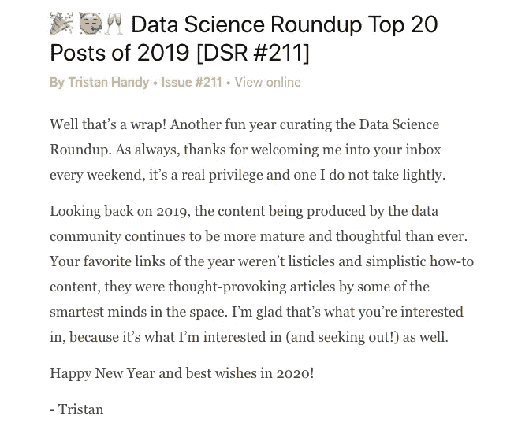
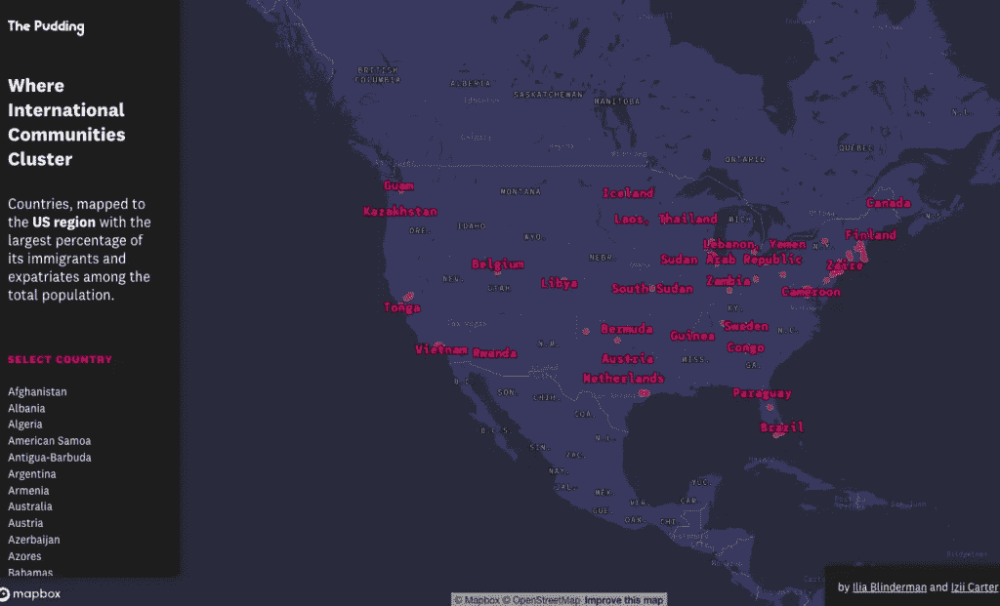
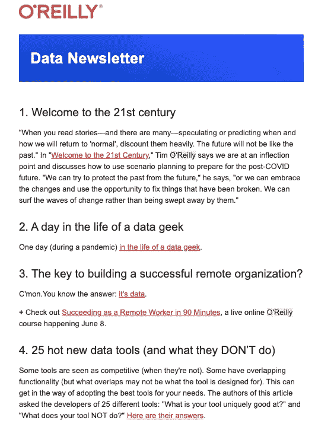
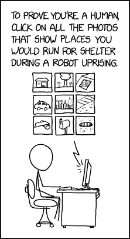

# 数据科学十大时事通讯

> 原文：<https://towardsdatascience.com/top-10-newsletters-in-data-science-7b8942f1530e?source=collection_archive---------16----------------------->

## 你认为报纸和时事通讯哪个先出现？

来源: [Unsplash](https://unsplash.com/photos/fb7yNPbT0l8)

我为什么要问？不是为了确定哪个更好，而是为了强调**简讯**是最古老的和最新的*知识传播媒介。*

> 时事通讯起源于古罗马，最初是为一群人提供的手写信息，后来转变成面向更广泛受众的报纸。

为特定利益群体管理知识的文化在线下和线上媒体中仍然很受欢迎——无论是通过报纸的周日杂志还是免费的周日版。

报纸和时事通讯的一个共同点是，它能帮助你适应一天的工作。它用新鲜的想法触发头脑，此外，阅读的行为有助于你集中注意力。

作为数据领域的专业人士，我们的工作要求我们不仅要了解生态系统中正在发生的事情，还要不断向我们的知识库添加新的工具和技术。

此外，吸引我们的不仅仅是尖端人工智能技术的发明，还有人类商业和生活中的应用，同意吗？

那么，在哪里可以找到这样的信息呢？🤔

尤其是现在— **信息过载的年代**？好吧，这就是时事通讯帮助我们的地方！

订阅数据科学简讯，每天或每周将精选信息发送到您的收件箱，这是一个很好的起点。为了缩小你的搜索范围，这里有一个十大时事通讯的列表。

**附言**如果你坚持到最后，我们会有两个惊喜！🤩

## 在今天的新闻中

# [TLDR](https://www.tldrnewsletter.com/)

《TLDR》是一份每日时事通讯，因其字节大小的技术、科学和编码信息而广受欢迎。

由技术爱好者**李丹**管理，这份时事通讯是任何数据科学爱好者的必读之作。李将时事通讯分为如下几个清晰的部分:

*   每日更新
*   大型科技和创业公司
*   科学和未来技术
*   程序设计和数据科学

这篇时事通讯最好的部分是在每个故事链接下面给出的简明摘要。查看最新一期[这里](https://www.tldrnewsletter.com/latest)订阅[这里](https://www.tldrnewsletter.com/)。

# [CB insight](https://www.cbinsights.com/newsletter)

这份简讯可以作为您获取以下所有最新消息的电子邮件:

*   技术趋势
*   风险资本
*   创业公司

…所有这些都有强大的数据点、研究和合理的趋势图作为后盾。他们的网站上充满了疯狂的评论，所以去看看，并在这里订阅。

# [数据中的一周](https://theodi.org/knowledge-opinion/the-week-in-data/)

如果您想了解全球各地发生的最佳数据事件，也想享受参加这些讲座的折扣，本新闻通讯将为您提供有关数据和技术新动态的所有有趣新闻。

它是由 ODI(开放数据倡议)策划的，ODI 于 2012 年由 web 和 AI 的发明者[蒂姆·伯纳斯·李爵士](https://theodi.org/person/sir-tim-berners-lee/)和[奈杰尔·沙德博尔特爵士](https://theodi.org/person/sir-nigel-shadbolt/)发起，旨在向所有人展示开放数据的价值。点击[这里](https://theodi.org/knowledge-opinion/the-week-in-data/)可以订阅。

来源:数据中的 T [he 周截图](https://theodi.org/knowledge-opinion/the-week-in-data/)情人节版

# 内部数据科学

# [数据科学综述](http://roundup.fishtownanalytics.com/)

这篇时事通讯中友好的第一人称的声音让读者感觉好像是特里斯坦·汉迪在亲自和我们讨论本周的热门数据博客文章。这绝对是我们的最爱之一🧡订阅简讯[这里](http://roundup.fishtownanalytics.com/)。

点击查看他的 2019 年前 20 篇文章综述。

来源:[数据科学综述](http://roundup.fishtownanalytics.com/)时事通讯的片段

# [重要](https://us13.campaign-archive.com/home/?u=67bd06787e84d73db24fb0aa5&id=6c9d98ff2c)

这篇时事通讯有一个有趣的格式，有助于揭开人工智能的神秘面纱。这封信的作者杰克·克拉克(Jack Clark)也是 open . ai(open . ai)的主管，他的写作风格非常自然。*“为什么那很重要”*部分给出了对版本中每一件作品的理解和作者的观点。

最有趣的部分是简讯的最后一部分，一个**科技故事**，这是一个有趣的故事，由科技和人工智能的一些相关主题编织而成。查看其档案部分，并在此订阅。

# [布丁](https://pudding.cool/)

如果不添加一个好的数据可视化时事通讯，我们的列表将是不完整的！

让这份简讯脱颖而出的是，它的每一版都是一个有趣的数据故事，具有美丽而强大的可视化效果。他们称这些故事为视觉散文。查看到目前为止创作的所有视觉散文[这里](https://pudding.cool/archives/)订阅信[这里](https://www.pudding.cool/)。

来源:布丁的数据可视化故事之一。

# 新技术和资源

# [数据科学周刊](https://www.datascienceweekly.org/newsletters)

这份时事通讯充满了新的知识。它包含数据科学领域的有用文章、视频、指南和工作。对于刚接触数据生态系统并希望了解更多信息的人来说，这篇新闻简报是一个很好的起点。订阅它[这里](https://www.datascienceweekly.org/newsletters)。

P . S .。他们为有抱负的数据科学家提供了一些非常有用的资源，帮助他们踏上征程。点击查看它们。

# [数据是复数](https://tinyletter.com/data-is-plural)

每周[杰里米·辛格](https://www.jsvine.com/)都会在你的收件箱里发送一些最有趣的公开数据集，让你大吃一惊。他们一定会提示你内心的数据分析师，从他的列表里挑一个，自己去分析。你可以在这里订阅时事通讯。

> 点击[这里](https://docs.google.com/spreadsheets/d/1wZhPLMCHKJvwOkP4juclhjFgqIY8fQFMemwKL2c64vk/edit)或者你也可以查看其 GitHub repo 的所有存档问题[这里](https://github.com/data-is-plural/newsletter-archive)来访问迄今为止精选的数据集的完整列表。

# [数据药剂](https://dataelixir.com/)

这份时事通讯是每周一次的对数据世界的学习和见解，内容简洁，不太多。它包含以下几个部分:

*   工具和技术
*   数据即
*   会议和活动

查看档案[这里](https://dataelixir.com/newsletters/)点击[这里](https://dataelixir.com/)订阅。

# [奥莱利数据通讯](https://www.oreilly.com/data/newsletter.html)

是的，这是同一个 O'Reilly，它出版了数据科学领域的书籍，他们的时事通讯也同样不错，内容丰富。他们也有单独的人工智能时事通讯，只关注人工智能新闻和资源。您可以在此查看样本简讯[并在此](https://www.oreilly.com/emails/newsletters/#)订阅[。](https://www.oreilly.com/data/newsletter.html)

来源:奥赖利数据通讯的一个片段

现在是揭开惊喜的时候了！🥁

特别提到我们一直以来最喜欢的时事通讯[等等，但是为什么](https://waitbutwhy.com/archive)和 [xkcd](https://xkcd.com/archive/) 。

这两个简讯几乎总能让您喜笑颜开，并促使您从不同的角度进行思考，这有时是应对我们富有创造力和多功能的数据科学领域的挑战所必需的。

这篇文章最初发表在 Atlan 的[人类数据](https://humansofdata.atlan.com/2020/06/top-10-newsletters-in-data-science/)上。

来源:[xkcd 的机器学习验证码](https://xkcd.com/2228/)

**参考文献**

1.  [时事通讯、报纸和小册子](https://www.eolss.net/Sample-Chapters/C04/E6-33-01-05.pdf)
2.  [维基百科时事通讯](https://en.wikipedia.org/wiki/Newsletter)