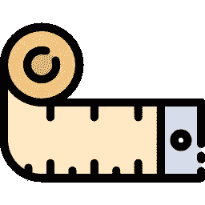

# 每个人都必须知道的 10 大 OpenCV 函数

> 原文：<https://towardsdatascience.com/top-10-opencv-functions-everyone-has-to-know-about-945f33de8f6f?source=collection_archive---------12----------------------->

## 我们来看一下 OpenCV 库，它同时用于计算机图形和视觉。

计算机视觉和计算机图形学现在真的很受欢迎，因为它们与人工智能有很大的联系，它们的主要共同点是它们使用同一个库 **OpenCV** 以便从数字图像或视频(CV)或生成图像(CG)中执行高级理解。

这就是为什么今天我们要来看看这个为计算机科学的这些大领域提供燃料的同一个库，看看有哪些功能可以让你受益匪浅！


原创图片由[创作](https://www.freepik.com/creativeart)

在我们进入 OpenCV 的强大功能之前，让我们看一下计算机视觉、图形和 OpenCV 的定义，以便更好地理解我们在这里做什么。

# 计算机视觉

计算机视觉是一个跨学科领域，研究如何让计算机获得对数字图像或视频的高级理解。从工程的角度来看，它寻求将人类视觉系统可以完成的任务自动化。

# 电脑图形图像

计算机图形学是计算机科学的一个分支，它研究在计算机的帮助下生成图像。今天，计算机图形是数码摄影、电影、视频游戏、手机和计算机显示器以及许多专业应用的核心技术。

# OpenCV

OpenCV(开源计算机视觉库)是一个开源的计算机视觉和机器学习软件库。OpenCV 旨在为计算机视觉应用提供一个公共基础设施，并加速机器感知在商业产品中的应用。

该库提供了处理和分析图像内容的工具，包括识别数字照片中的对象(如人脸和人物、文本等。)，跟踪物体的运动，转换图像，应用机器学习方法，识别各种图像中的共同元素。

一旦我们解决了这个问题，我们就可以从我个人选择的 10 大功能开始。(用 Python 编写的函数代码)


# imread/imshow

这个功能必须是第一位的，因为它是用图像开始你的项目的关键。从这个函数的名字就可以猜到，它加载了一个 BGR(蓝绿色红色)格式的图像。

```
import cv2
import matplotlib.pyplot as plotimage = cv2.imread('data.png') #load image
plot.imshow(image) #show image
```


# CVT 颜色

加载图像后，还可以使用 cvtColor 中的不同标志将其转换为不同的配色方案。

```
cv2.cvtColor(image,cv2.COLOR_BGR2RGB)
```

下面是 cvtColor 的一些其他标志:COLOR_BGR2GRAY、COLOR_BGR2HSV、COLOR_BGR2YUV 等。
这是双向的，所以比如 COLOR_YUV2BGR 也是可以的。


# 调整大小

有时你只需要一个不同大小的图片，这就是你需要的功能。

```
cv2.resize(image, dimension, interpolation = cv2.INTER_AREA)
```

它获取原始图像，并使用 dimension 创建一个新图像。尺寸定义为:

```
dimension = (width, height)
```

插值是它对图片重新采样的方式，在我的具体例子中，它使用**INTER _ AREA**——使用像素区域关系重新采样，还有更多类似的方式

1.  **INTER_NEAREST:** 最近邻插值
2.  **INTER_LINEAR:** 双线性插值
3.  **INTER _ CUBIC:**4×4 像素邻域上的双三次插值
4.  **INTER _ LANCZOS 4:**[8×8 邻域上的 lanc zos 插值](https://scc.ustc.edu.cn/zlsc/sugon/intel/ipp/ipp_manual/IPPI/ippi_appendices/ippi_appB_LanczosInterpolation.htm)



# 拆分/合并

每张图片有 3 个通道，如果我们想将它们分割成单独的图像，我们可以使用**分割**功能。

```
(channel_b, channel_g, channel_r) = cv2.split(img)
```

如果图像是 BGR 格式，它会将每个通道分成你定义的三个变量。

在你已经分割了频道并且你想要将它们合并在一起，你使用**合并**。

```
cv2.merge(channel_b, channel_g, channel_r)
```


# vconcat/hconcat

使用`vconcat()`、`hconcat()`纵向和横向连接(组合)图像。`v`表示垂直，`h`表示水平。

```
cv2**.**vconcat([image1, image2])
cv2**.h**concat([image1, image2])
```


# 1/0

如果您想要在所有三维空间用 1 或 0 填充图像(Mat ),因为 Mat 需要彩色图像的 3 个层/维度。

```
size = 200, 200, 3
m = np.zeros(size, dtype=np.uint8)
n = np.ones(size, dtype=np.uint8)
```

作为一个额外的功能，我想在这里补充一点，那就是转置功能。

# 移项

如果我们有一个要转置的定义好的矩阵 mat，我们要做的就是对它使用这个函数:

```
import numpy as np  
mat = np.array([[1, 2, 3], [4, 5, 6]])  
mat_transpose = mat.transpose()
print(mat_tranpose)
```

我们得到输出:

```
[[1 4]  
 [2 5]  
 [3 6]]
#original input
[[1, 2, 3]
 [4, 5, 6]]
```

> 我们完了！

# 后续步骤

这主要是针对初学者的，但是下一次我们将看看 OpenCV 更高级的特性。

在此之前， [**跟我**](https://medium.com/@lazar.gugleta) 求更！😎

**感谢阅读！**

[](https://medium.com/@lazar.gugleta)

查看我的**其他文章**并关注我的[媒体](https://medium.com/@lazar.gugleta)

[](https://twitter.com/intent/user?screen_name=LazarGugleta)

当我发布一篇新文章时，请在 Twitter 上关注我