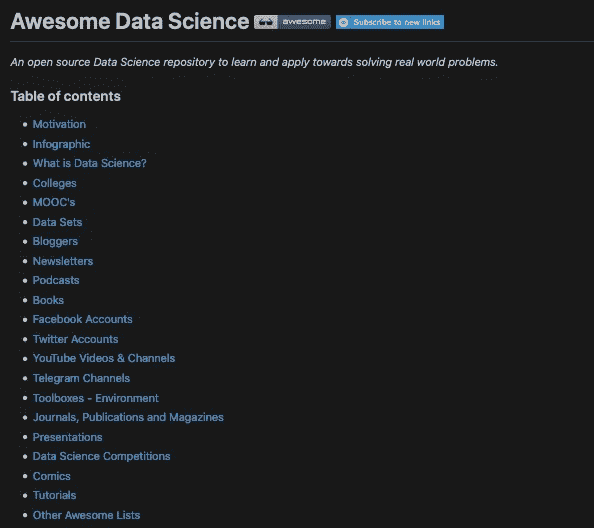
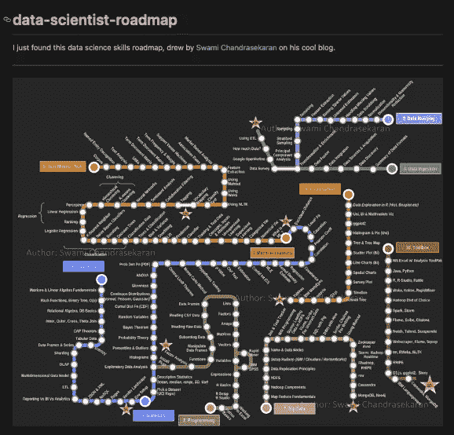
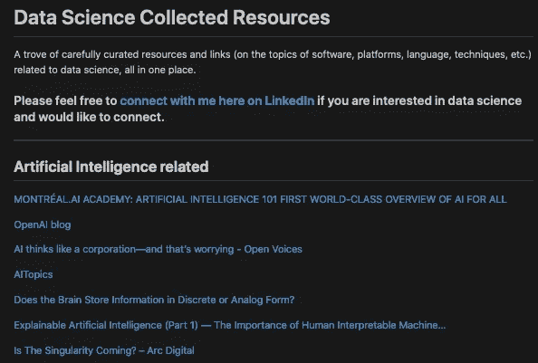
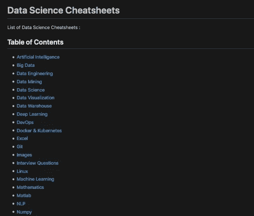
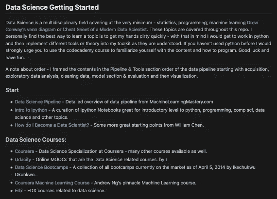
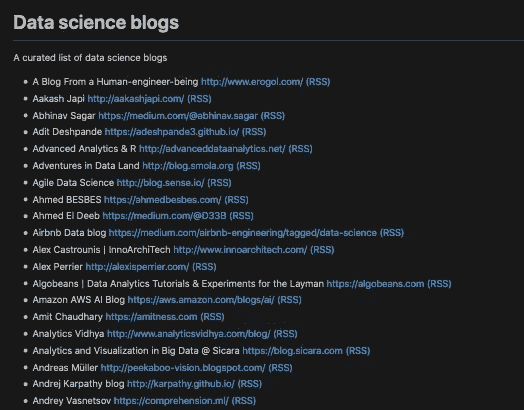
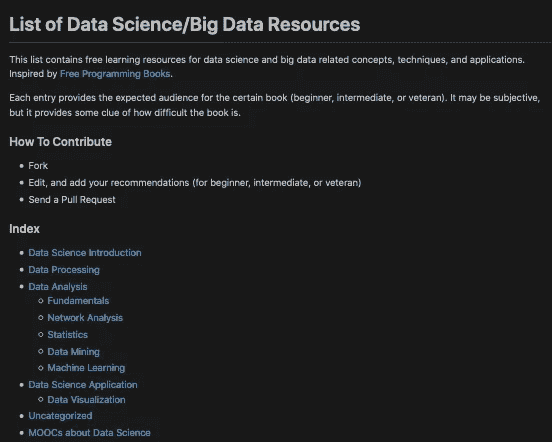
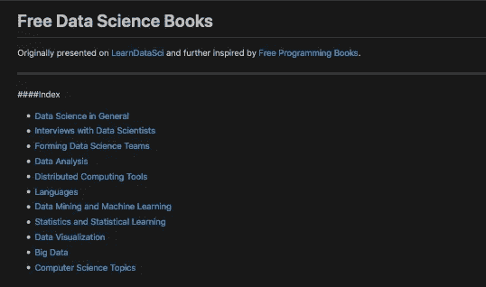
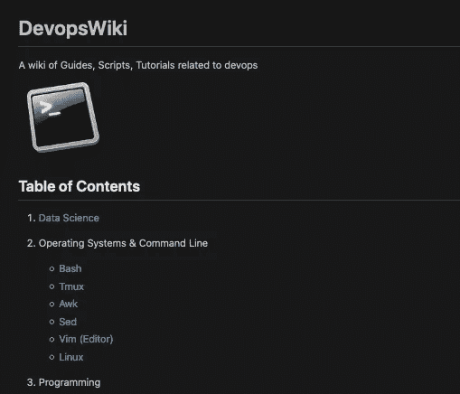

# 了解数据科学的十大热门 GitHub 存储库。

> 原文：<https://towardsdatascience.com/top-10-popular-github-repositories-to-learn-about-data-science-4acc7b99c44?source=collection_archive---------7----------------------->

## 数据科学

## 以下是 GitHub 上一些关于数据科学的最佳资源。

照片由[吴镇男·大卫](https://unsplash.com/@drckangelo?utm_source=medium&utm_medium=referral)在 [Unsplash](https://unsplash.com?utm_source=medium&utm_medium=referral) 拍摄

itHub 是一个来自世界各地的程序员共享代码的平台。这是一个协作、学习、培养技能等等的地方。但是 GitHub 不仅仅是一个分享代码的地方，它还是一个分享资源的地方。

## Github 中的数据科学

自创建以来，GitHub 一直被认为是软件工程师的居所。但随着数据呈指数级增长，Python 和 JavaScript 等语言变得流行，GitHub 已经成为数据科学爱好者和专业人士的巨大社区。

随之而来的是，出现了大量主题为“机器学习”、“自然语言处理”、“计算机视觉”的知识库，最突出的是 python 库“Scikit-learn”和“TensorFlow”，这是两种流行的用于数据科学的 Python 工具。GitHub 中数据科学的兴起催生了许多免费资源，帮助成千上万的数据爱好者了解数据科学。

## DIY 数据科学

这些免费资源隐藏在金色的 GitHub 仓库中，收集了大量与数据科学相关的资源。任何你能想到的，都在那里。寻找学习数据科学的学院、在线课程(MOOC)、网站、数据集、时事通讯、播客、书籍等。

因此，与其为互联网上过多的在线课程付费，为什么不去 GitHub 创建自己的数据科学课程呢？关于白手起家的数据科学家如何从对编程一无所知到在大型科技公司工作的故事数不胜数。那个人也可以是你！

所以在这篇文章中，我将与你分享这些资源。不分先后听。现在就来看看下面吧！

# 目录

1.  一般
2.  路线图
3.  备忘单
4.  博客
5.  书
6.  编程；编排

# 1.[牛逼的数据科学](https://github.com/academic/awesome-datascience)

作者:[法提赫·阿克图尔克](https://medium.com/u/ce8a2a92f776?source=post_page-----4acc7b99c44--------------------------------)，[侯赛因·梅尔特](https://github.com/hmert) & [奥斯曼·温古尔](https://github.com/o)，[雷杰普·埃罗尔](https://github.com/erolrecep)。

这本书无疑是关于数据科学的最佳资源集。它几乎涵盖了学习数据科学的所有方面，从解释为什么学习数据科学的动机方面开始。然后是视觉信息图，帮助初学者理解数据科学的整个途径。剩下的就是数据集、博客、播客、书籍、比赛等资源。

这份报告对那些数据科学新手非常有帮助，肯定有助于缓解学习曲线。

# 2.[数据-科学家-路线图](https://github.com/MrMimic/data-scientist-roadmap)

作者: [MrMimic](https://github.com/MrMimic)

数据科学路线图 [Swami Chandrasekaran](http://nirvacana.com/thoughts/2013/07/08/becoming-a-data-scientist/)

这个报告的灵感来自 Swami Chandrasekaran 的数据科学技能路线图。它包含成为一名数据科学家所需的全部内容，从基础知识、统计学、编程到机器学习、数据可视化和数据管理。还有一个存放数据科学家在工作中使用的工具的文件夹。

如果你想了解成为数据科学家的历程，这份报告正适合你。

# 3.[数据科学最佳资源](https://github.com/tirthajyoti/Data-science-best-resources/blob/master/README.md)

作者: [Tirthajyoti Sarkar](https://medium.com/u/cb9d97d4b61a?source=post_page-----4acc7b99c44--------------------------------)

正如 readme.md 中提到的，这个 repo 是一个精心策划的资源和链接(关于软件、平台、语言、技术等主题)的宝库。)与数据科学相关的，都在一个地方。它有各种各样的资源——人工智能文章、亚马逊网络服务、博客、书籍、文章、MOOCs、可视化、神经网络、云计算、REST API、时间序列等等。

这个回购是为那些寻找与数据科学相关的各种主题的有趣文章的人准备的。

# 4.[数据科学备忘单](https://github.com/abhat222/Data-Science--Cheat-Sheet)

由: [Asif Bhat](https://github.com/abhat222)

正如 repo 的名字所暗示的，这个 repo 包含了所有数据科学的备忘单。备忘单对于初学者来说是非常好的，可以让他们以直观的方式进入一个主题，并对他们正在钻研的主题有所了解。这些小抄包括 AI、大数据、数据角力、Git、面试问题、机器学习、Numpy 等主题。

这是为那些寻找数据科学小抄的人准备的。

# 5. [Ds-cheatsheets](https://github.com/FavioVazquez/ds-cheatsheets)

作者:[法维奥·安德烈·巴斯克斯](https://github.com/FavioVazquez)

这是另一个回购，其中包含大量数据科学备忘单。与之前的回购相比，这是一个较小的列表，但在您的数据科学资源库中有更多可用的备忘单也无妨。然而，这个回购有一些有趣的备忘单，涉及商业科学、R、SQL、数据可视化等主题。

这个回购是为每个人谁是寻找数据科学的小抄。

# 6.[数据科学资源](https://github.com/jonathan-bower/DataScienceResources)

作者: [jb](https://github.com/jonathan-bower)

这个回购开始时是创作者的资源宝库，但在意识到数据科学变得如此流行后，它最终成为数据科学主题和高质量资源的精选列表。

最初的目标是涵盖数据科学的技术方面，如编程、数据管道和工具以及机器学习。但是，由于数据科学正在世界各地的企业中实施，因此也涵盖了数据科学团队、用例以及职业道路等主题。

这个回购是为那些希望学习数据科学和利用给定的职业资源规划未来职业生涯的人准备的。

# 7.[数据科学博客](https://github.com/rushter/data-science-blogs)

作者: [Artem Golubin](https://medium.com/u/476518bf49f5?source=post_page-----4acc7b99c44--------------------------------)

这个报告包含了大量的数据科学博客，供你了解数据科学的一切。为了便于导航，列表按字母顺序排列，链接就在博客标题的旁边。数据科学博客是解释、建议、技巧和诀窍以及端到端教程和项目的绝佳选择。一些著名的博客包括 Analytics Vidhya、Data Science Dojo Blog、Drew Conway、FastML 等。

对于那些希望发现数据科学内容的伟大博客的人，请查看此回购。

# 8.[免费数据科学书籍](https://github.com/chaconnewu/free-data-science-books)

作者:[吴语](https://medium.com/u/ea29788b774a?source=post_page-----4acc7b99c44--------------------------------)

本报告包含学习数据科学和大数据的免费资源。它首先介绍什么是数据科学，然后是数据处理和数据分析、统计学、机器学习，最后是数据科学的应用。这个回购的一个好处是，每个资源旁边都有初级、中级和资深标签，确保你根据自己的水平学习。

这个回购是为那些寻找免费数据科学资源和数据科学速成班。

# **9。** [自由数据科学学习](https://github.com/LearnDataSci/free-data-science-learning)

作者:[学数据 Sci](https://www.learndatasci.com/)

这个回购包含一个免费数据科学书籍的列表。学习数据科学的书籍是令人惊奇的，因为你在做“如何做”之前学习它们为什么，这对于像数据科学这样复杂的主题是很重要的。每个链接都会把你带到这些书的 pdf 文件，你可以开始免费阅读它们。

这个回购是为那些寻找关于数据科学的免费书籍。

# 10.[数据-科学-维基](https://github.com/Leo-G/Data-Science-Wiki)

作者:[伦纳德](https://github.com/Leo-G)

这个报告是 DevOps 指南、脚本和教程的列表。有一个类别是从初学者到高级水平的数据科学、Python 编程、Linux 教程、git、代码编辑器和机器学习。这些教程以文章、youtube 视频、在线课程等形式出现。

这个回购更多的是面向希望学习如何编码的数据科学爱好者。

# 行动计划

西蒙·米加杰在 [Unsplash](https://unsplash.com?utm_source=medium&utm_medium=referral) 上拍摄的照片

itHub 存储库就像是宝贵资源的宝库，可以启动您的数据科学之旅。有了上面大量的免费资源，你就可以用自己的课程学习数据科学了。

有了这些回复，你可以通过备忘单更多地了解什么是数据科学，找到我们的哪些编程语言是重要的，找到你最喜欢的 YouTuber，关注分享丰富帖子的 Twitter 帐户，找到一本为你提供知识并培养你的技能的书。

所以，在你的浏览器中把这些资源加入书签，或者把它们保存在你的笔记中，当你需要它们的时候就可以参考它们。或者像上面的数据科学家一样，制定自己学习数据科学的路线图。

## 保持动力

您还可以创建自己的 GitHub repo 和 commit 网站、书籍和教程，帮助您了解这个多学科领域的更多信息。学习过程中的一个重要部分是记录你的进步，因为这会让你更有动力和灵感。同样，参加像#100DaysofMlcode 这样的挑战也能让你保持热情。

## 投资组合

这会让你有一个作品集，你可以向你周围的人展示，并增加你的工作前景。在这个文件夹中，你可以展示你用上述资源完成的项目，并突出你的技能。

所以，现在就在 GitHub 上记录下你的进步，并与世界分享吧！

感谢你阅读这篇文章，我希望它对你有用。注意安全。

## 如果您对学习数据科学感兴趣，请查看“超学习”数据科学系列！

 [## 如何“超级学习”数据科学—第 1 部分

### 这是一个简短的指南，基于《超学习》一书，应用于数据科学

medium.com](https://medium.com/better-programming/how-to-ultralearn-data-science-part-1-92e143b7257b) 

## 查看其他文章，了解更多关于数据科学的知识。

 [## 互联网上 20 大免费数据科学、ML 和 AI MOOCs

### 以下是关于数据科学、机器学习、深度学习和人工智能的最佳在线课程列表

towardsdatascience.com](/top-20-free-data-science-ml-and-ai-moocs-on-the-internet-4036bd0aac12)  [## 机器学习和数据科学的 20 大网站

### 这里是我列出的最好的 ML 和数据科学网站，可以提供有价值的资源和新闻。

medium.com](https://medium.com/swlh/top-20-websites-for-machine-learning-and-data-science-d0b113130068)  [## 开始数据科学之旅的最佳书籍

### 这是你从头开始学习数据科学应该读的书。

towardsdatascience.com](/the-best-book-to-start-your-data-science-journey-f457b0994160)  [## 数据科学 20 大播客

### 面向数据爱好者的最佳数据科学播客列表。

towardsdatascience.com](/top-20-podcasts-for-data-science-83dc9e07448e) 

# 联系人

如果你想了解我的最新文章[，请通过媒体](https://medium.com/@benthecoder07)关注我。

其他联系方式:

*   [领英](https://www.linkedin.com/in/benthecoder/)
*   [推特](https://twitter.com/benthecoder1)
*   [GitHub](https://github.com/benthecoder)
*   [Reddit](https://www.reddit.com/user/benthecoderX)

注意安全！