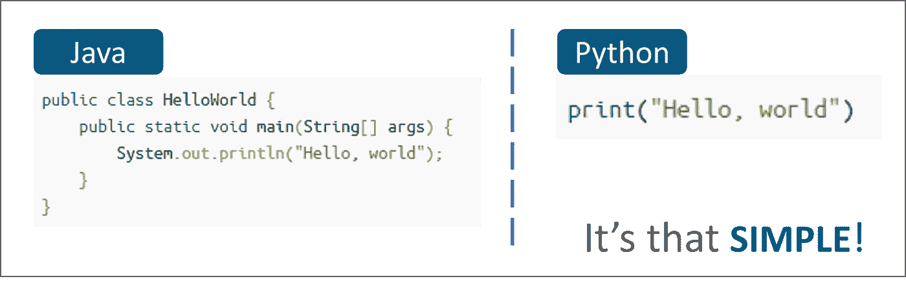
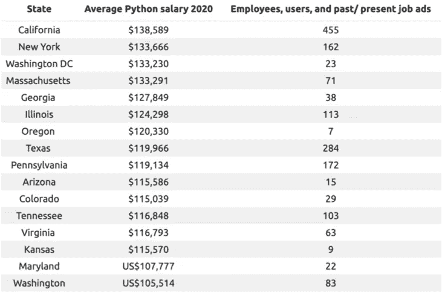
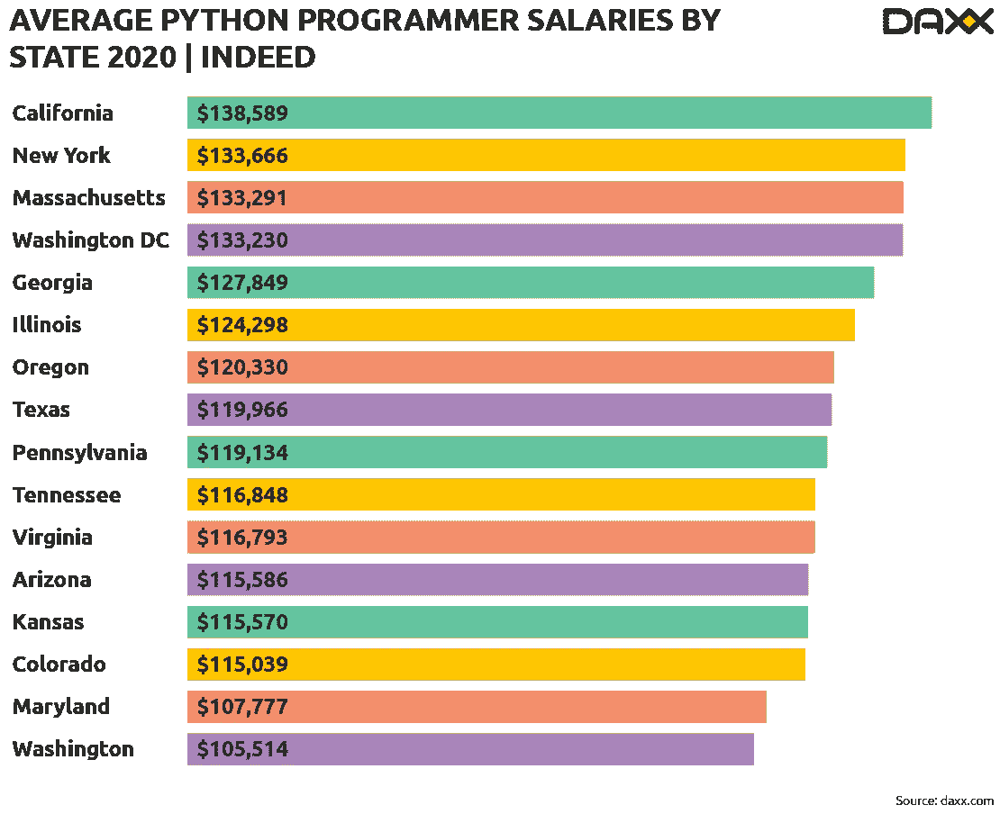

# 作为数据科学家，你需要学习 Python 的 7 大理由

> 原文：<https://towardsdatascience.com/top-10-reasons-why-you-need-to-learn-python-as-a-data-scientist-e3d26539ec00?source=collection_archive---------6----------------------->

## Python 给数据科学家带来的好处

在 [Unsplash](https://unsplash.com?utm_source=medium&utm_medium=referral) 上由 [Hitesh Choudhary](https://unsplash.com/@hiteshchoudhary?utm_source=medium&utm_medium=referral) 拍摄的照片

作为一名新的数据科学家，你知道你的道路从你需要学习的编程语言开始。在所有可供选择的语言中，Python 是最受所有数据科学家欢迎的语言。在这篇文章中，我将讲述 Python 流行背后的 7 个原因，这将帮助你理解为什么程序员喜欢它。

# 1.简单

Python 是开始您的旅程最简单的语言之一。此外，它的简单性不会限制您的功能可能性。

是什么赋予 Python 如此的灵活性？有多种因素:

*   Python 是一种免费的开源语言
*   这是一个高级编程
*   Python 被解读
*   它有一个庞大的社区

另外，Python 写起来速度很快。只需比较这两个用 Java 和 Python 编写的例子:

[Java vs Python 对比](https://www.edureka.co/blog/10-reasons-why-you-should-learn-python)

这个简单的例子展示了如何从 Python 中获益。您只需要编写 1 行代码，而不是输入 3 行代码。想象一下，在更复杂的任务中你可以节省多少时间。

# 1.可量测性

Python 是一种扩展速度非常快的编程语言。在所有可用的语言中，Python 是伸缩性的领导者。这意味着 Python 有越来越多的可能性。

> Python 的灵活性对于应用程序开发中的任何问题都非常有用

随着新的更新即将到来，任何问题都可以很容易地解决。说 Python 为新手提供了最好的选择，因为有很多方法来决定同一个问题。

即使你有一个懂 c++设计模式的非 Python 程序员团队，就开发和验证代码正确性所需的时间而言，Python 也更适合他们。

它发生得很快，因为你没有花时间去寻找内存泄漏，编译或分段错误。

# 2.库和框架

由于它的流行，Python 有数百个不同的库和框架，这对你的开发过程是一个很好的补充。它们节省了大量手动时间，可以轻松替换整个解决方案。

作为一名数据科学家，你会发现许多这些库将专注于数据分析和机器学习。此外，还有对大数据的巨大支持。我认为应该有一个强有力的理由来解释为什么你需要把 Python 作为你的第一语言。

下面给出了其中的一些库:

*   [**熊猫**](https://www.geeksforgeeks.org/introduction-to-pandas-in-python/)

这是伟大的数据分析和数据处理。Pandas 提供数据操作控制。

*   [**NumPy**](https://www.geeksforgeeks.org/numpy-in-python-set-1-introduction/)

NumPy 是一个免费的数值计算库。它提供了高级数学函数和数据操作。

*   [SciPy](https://www.geeksforgeeks.org/data-analysis-with-scipy/)

这个图书馆与科学和技术计算有关。SciPy 可用于数据优化和修改、代数、特殊函数等。

# 3.Web 开发

为了让你的开发过程尽可能的简单，学习 Python 吧。有很多 Django 和 Flask 库和框架可以让你的编码更有效率并加快你的工作。

如果你比较 PHP 和 Python，你会发现同样的任务可以通过 PHP 在几个小时的代码内创建。但是使用 Python，只需要几分钟。看看 Reddit 网站就知道了——它是用 Python 创建的。

以下是 Pythons 开发的全栈框架:

*   姜戈
*   金字塔
*   Web2py
*   涡轮齿轮

以下是 Pythons 开发的微框架:

*   瓶
*   瓶子
*   樱桃派
*   紧抱

此外，您可能需要考虑一个替代框架:

*   龙卷风

# 4.巨大的社区

正如我之前提到的，Python 有一个强大的社区。你可能认为这不应该是你选择 Python 的主要原因之一。但事实恰恰相反。

如果你得不到其他专家的支持，你的学习之路会很艰难。这就是为什么你应该知道这不会发生在你的 Python 学习过程中。

以下是一些 Python 社区的列表:

## 官方 Python 有用链接:

官方教程:[http://docs.python.org/tutorial/](http://docs.python.org/tutorial/)
语言参考:[http://docs.python.org/reference/](http://docs.python.org/reference/)

## 每日新闻和互动

巨蟒日报:[http://www.pythonware.com/daily/](http://www.pythonware.com/daily/)
星球巨蟒:[http://planet.python.org/](http://planet.python.org/)

**视频教程:**[http://showmedo.com/videotutorials/python](http://showmedo.com/videotutorials/python)

**事实**:[http://www.ibiblio.org/swaroopch/byteofpython/read/](http://www.ibiblio.org/swaroopch/byteofpython/read/)

## 团体

**Irc 节点**:【http://www.python.org/community/irc/】T2
stack overflow:[http://stackoverflow.com/questions/tagged/python?排序=最新的](http://stackoverflow.com/questions/tagged/python?sort=newest)

# 5.自动化

使用 PYunit 这样的 Python 自动化框架有很多好处:

*   不需要安装额外的模块。它们和盒子一起送来的
*   即使你没有 Python 背景，你也会发现使用 Unittest 非常舒服。它是衍生的，工作原理类似于其他的 xUnit 框架。
*   你可以用一种更直接的方式来运行单个实验。你应该简单地在终端上指出名字。输出也很紧凑，这使得该结构在执行测试用例时具有适应性。
*   测试报告在几毫秒内生成。

## 用于测试自动化的 5 个 Python 框架:

1.  [机器人框架](https://robotframework.org/)

2.[单元测试](https://docs.python.org/3/library/unittest.html)

[3。Pytest](https://docs.pytest.org/en/latest/)

[4。行为](https://behave.readthedocs.io/en/latest/)

[5。生菜](http://lettuce.it/)

# 6.就业和增长

Python 是一种独特的语言，具有强大的增长能力，并为数据科学家提供了多种职业机会。如果你学习 Python，你可以考虑将来可能想转行的多个额外工作:

*   Python 开发者
*   生产部经理
*   教师
*   财务顾问
*   数据记者

# 7.薪水

如果你正在寻找高薪机会，Python 为你提供了大量选择。看看这些数据:

2020 年各州 Python 开发人员的平均工资

2020 年各州 Python 开发人员的平均工资 [Daxx](https://www.daxx.com/blog/development-trends/python-developer-salary-usa)

# 结论

Python 是任何数据科学家的基础。选择这种功能强大的编程语言有很多原因，所以主要原因是什么取决于你。你一定要考虑 Python，因为它的可能性和正在进行的改进，这将帮助你构建惊人的产品和帮助企业。