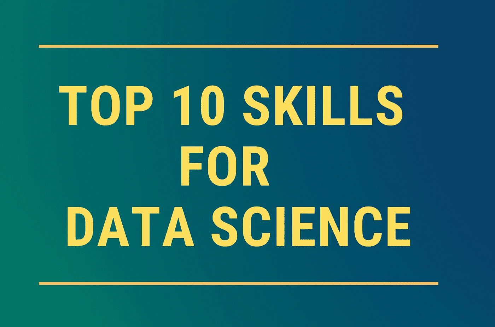

# 数据科学家的十大技能

> 原文：<https://towardsdatascience.com/top-10-skills-for-a-data-scientist-in-2020-2b8e6122a742?source=collection_archive---------0----------------------->

## 那会让你在数据部工作。

用加仑的咖啡清理收件箱，欢迎回到研磨！😀

寒假的时候，我列了一个我想写的故事的清单，这是我最兴奋的一个！因为我也努力学习一些数据科学的技能。作为数据领域的人，你最终会阅读和了解很多很多东西。

根据我的理解，数据科学总是关于组合最适合完成工作的工具。它是关于从数据中提取知识来回答一个特定的问题。对我来说，简单地说，数据科学是一种力量，它允许企业和利益相关者做出明智的决策，并用数据解决问题。

现在，不是每个技术专家都对其他技能充满热情，但她会对自己工作领域的技能感到兴奋。数据科学家的一些技能也是如此。随着我们在新的一年里为新的技术趋势和更重大的挑战做好准备，我们必须夯实我们的基础。

排名不分先后，让我们一起来了解一下 2020 年数据科学家的*10 大技能！*

# 1.概率与统计

数据科学是关于使用资本流程、算法或系统从数据中提取知识、见解并做出明智的决策。在这种情况下，进行推断、估计或预测是数据科学的重要组成部分。

借助于统计方法的概率有助于为进一步的分析作出估计。统计学主要依赖于概率论。简单来说，两者是交织在一起的。

## 数据科学的概率统计能做什么？

1.  探索和了解更多关于数据的信息
2.  确定两个变量之间可能存在的潜在关系或依赖关系
3.  根据以前的数据趋势预测未来趋势或预测漂移
4.  确定数据的模式或动机
5.  发现数据中的异常

特别是对于数据驱动的公司，利益相关者依赖数据进行决策和数据模型的设计/评估，概率和统计是数据科学不可或缺的一部分。

# 2.多元微积分和线性代数

大多数机器学习，总是数据科学模型，是建立在几个预测器或未知变量的基础上的。多元微积分的知识对于建立机器学习模型是很重要的。以下是在数据科学领域工作时您可能会熟悉的一些数学主题:

1.  导数和梯度
2.  阶跃函数、Sigmoid 函数、Logit 函数、ReLU(校正线性单位)函数
3.  成本函数(最重要)
4.  功能绘图
5.  函数的最小值和最大值
6.  标量、矢量、矩阵和张量函数

## 摘要

*数据科学线性代数:*矩阵代数与特征值

*数据科学的微积分:*导数和梯度

*从零开始梯度下降:*从零开始实现神经网络

# 3.编程、软件包和软件

当然啦！数据科学本质上是关于编程的。数据科学编程技能汇集了将原始数据转化为可操作见解所需的所有基本技能。虽然编程语言的选择没有特定的规则，但是 Python 和 R 是最受欢迎的。

我不是一个对编程语言偏好或平台有宗教信仰的人。数据科学家选择一种编程语言来满足手头问题陈述的需要。然而，Python 似乎已经成为最接近数据科学通用语言的东西。

点击阅读更多关于*十大数据科学 Python 库* [的信息。](/top-10-python-libraries-for-data-science-cd82294ec266)

排名不分先后，以下是可供数据科学选择的编程语言和软件包列表:

1.  计算机编程语言
2.  稀有
3.  结构化查询语言
4.  Java 语言(一种计算机语言，尤用于创建网站)
5.  朱莉娅
6.  斯卡拉
7.  矩阵实验室
8.  TensorFlow(非常适合 Python 中的数据科学)

我不是在写*你能用数据科学中的编程技能做什么*😛

从这里往下的一切都是关于编码的。数据科学，没有熟悉的编码经验或知识，可能有点难。因此，我更喜欢先提高我的 Python 技能，阅读关于我将从事的项目的文献，然后开始构建代码。

# 4.数据争论

通常，企业获取或接收的数据还没有准备好进行建模。因此，理解并知道如何处理数据中的缺陷是非常必要的。

数据争论是你为进一步分析准备数据的过程；将原始数据从一种形式转换和映射到另一种形式，以便为洞察做好数据准备。对于数据角力，你基本上是获取数据，结合相关领域，然后清洗数据。

## 对于数据科学的数据争论，你能做什么？

1.  通过从多个渠道收集数据，揭示数据中隐藏的深层情报
2.  及时向业务和数据分析师提供可操作数据的非常准确的表示
3.  减少处理时间、响应时间，以及收集和组织难以处理的数据并加以利用的时间
4.  使数据科学家能够将更多精力放在数据分析上，而不是清理部分
5.  将数据驱动的决策流程引向由准确数据支持的方向

# 5.数据库管理

对我来说，数据科学家是不同的人，是所有插孔的主人。他们必须知道数学、统计学、编程、数据管理、可视化，以及不是“全栈”数据科学家的东西。

正如我前面提到的，80%的工作是准备在行业环境中处理的数据。由于要处理大量的数据，数据科学家知道如何管理这些数据是至关重要的。

数据库管理本质上由一组可以编辑、索引和操作数据库的程序组成。DBMS 接受来自应用程序的数据请求，并指示操作系统提供特定的所需数据。在大型系统中，DBMS 帮助用户在任何给定的时间点存储和检索数据。

## 对于数据科学的数据库管理，您能做些什么？

1.  定义、检索和管理数据库中的数据
2.  操作数据本身、数据格式、字段名称、记录结构和文件结构
3.  定义写入、验证和测试数据的规则
4.  在数据库的记录级上操作
5.  支持多用户环境并行访问和操作数据

一些流行的数据库管理系统包括:MySQL、SQL Server、Oracle、IBM DB2、PostgreSQL 和 NoSQL 数据库(MongoDB、CouchDB、DynamoDB、HBase、Neo4j、Cassandra、Redis)

# 6.数据可视化

数据可视化必然意味着什么？对我来说，它是从所考虑的数据中发现的图形表示。可视化有效地沟通和引导探索的结论。

我本质上是一个数据可视化的人。它给了我从数据中构思故事和创建综合演示的能力。数据可视化是更重要的技能之一，因为它不仅仅是表示最终结果，还包括了解和学习数据及其脆弱性。

形象地描绘事物总是更好；真正的价值是众所周知的。当我创建一个可视化，我肯定会得到有意义的信息，这可能是令人惊讶的，因为它拥有影响系统的力量。

直方图、条形图、饼图、散点图、折线图、时间序列、关系图、热图、地理图、三维图以及一长串可用于数据的可视化效果。更详细的名单，请点击这里访问[。](https://www.tableau.com/learn/articles/data-visualization)

## 数据可视化能为数据科学做些什么？

1.  为强大的洞察力绘制数据(当然！😀)
2.  确定未知变量之间的关系
3.  可视化需要关注或改进的区域
4.  识别影响客户行为的因素
5.  了解哪些产品应该放在哪里
6.  显示来自新闻、联系、网站、社交媒体的趋势
7.  可视化大量信息
8.  客户报告、员工绩效、季度销售图
9.  设计针对用户群的营销策略

*一些流行的数据可视化工具包括:* Tableau、PowerBI、QlikView、Google Analytics(用于 Web)、MS Excel、Plotly、Fusion Charts、SAS

# 7.机器学习/深度学习

如果你在一家管理和操作大量数据的公司工作，在那里决策过程是以数据为中心的，可能需要的技能是机器学习。ML 是数据科学生态系统的一个子集，就像统计或概率一样，有助于数据建模和获得结果。

数据科学的机器学习包括对 ML 至关重要的算法；k 近邻，随机森林，朴素贝叶斯，回归模型。PyTorch、TensorFlow、Keras 也发现了它在数据科学的机器学习中的可用性

## 数据科学的机器学习能做什么？

1.  欺诈和风险检测与管理
2.  医疗保健(蓬勃发展的数据科学领域之一！遗传学、基因组学、图像分析)
3.  航线规划
4.  自动垃圾邮件过滤
5.  面部和声音识别系统
6.  改进的交互式语音应答(IVR)
7.  全面的语言和文档识别和翻译

# 8.云计算

数据科学实践通常包括使用云计算产品和服务来帮助数据专业人员访问管理和处理数据所需的资源。[[customerthink.com](http://customerthink.com/top-cloud-computing-products-and-services-used-by-data-scientists/)数据科学家的日常工作通常包括分析和可视化存储在云中的数据。

你可能已经读到过数据科学和云计算携手并进，这通常是因为云计算帮助数据科学家使用 AWS、Azure、Google Cloud 等平台，这些平台提供了对数据库、框架、编程语言和运营工具的访问。

鉴于工具和平台的规模和可用性，熟悉数据科学包括与大量数据的交互这一事实，理解云和云计算的概念对于数据科学家来说不仅是相关的，而且是关键的技能。

## 对于数据科学，云计算能做什么？

1.  数据采集
2.  解析、管理、争论、转换、分析和净化数据
3.  数据挖掘[探索性数据分析(EDA)，汇总统计，…]
4.  验证和测试预测模型、推荐系统和此类模型
5.  调整数据变量并优化模型性能

一些流行的数据科学云平台包括亚马逊网络服务、Windows Azure、谷歌云或 IBM 云。不久前，我还读到有人正在试验[阿里云](https://us.alibabacloud.com)，这让我觉得很有趣。

# 9.微软优越试算表

我们知道 MS Excel 可能是最好和最流行的数据处理工具之一。我们可能会听到，“*嘿，你收到老板发来的 Excel 了吗？*等等，我们不是在讨论数据科学的技能吗？Excel？我一直想知道一定有什么简单的方法来管理数据。随着时间的推移，探索 Excel 的数据管理，我意识到，Excel 是:

1.  2D 数据最佳编辑
2.  高级数据分析的基础平台
3.  获得与 Python 中正在运行的 Excel 表的实时连接
4.  你可以做任何你想做的事情，无论何时，只要你愿意，你可以保存任意多的版本
5.  数据操作相对容易

今天，大多数非技术人员经常使用 Excel 作为数据库的替代品。这可能是一种错误的用法，因为它在某种程度上缺乏版本控制、准确性、可再现性或可维护性。然而，Excel 所能做的也有些令人惊讶！

## 用 Excel 做数据科学可以做什么？

1.  命名和创建范围
2.  过滤、排序、合并、整理数据
3.  创建数据透视表和图表
4.  visual Basic for Applications(VBA)[如果你还不知道，可以谷歌一下。这是一个 MS Excel 的超级能力，这个空间不会公正地解释它。VBA 是 Excel 的编程语言，它允许你运行循环，宏，如果..else]
5.  清除数据:删除重复值**，**在绝对、混合和相对之间改变引用
6.  在成千上万的记录中查找所需的数据

# 10.DevOps

我一直听说并相信数据科学是为那些懂数学、统计学、算法和数据管理的人准备的。不久前，我遇到了一个在核心 DevOps 领域拥有 6 年以上经验的人，他正在寻找数据科学方面的职业转变。好奇的我想知道 DevOps 是否以及如何成为数据科学的一部分。我对 DevOps 知之甚少(实际上是一无所知)，但有一点是肯定的:DevOps 对数据科学的重要性日益增加。

DevOps 是一套结合软件开发和 IT 运营的方法，旨在缩短开发生命周期，并提供高质量的不间断交付。

DevOps 团队与开发团队紧密合作，有效地管理应用程序的生命周期。数据转换要求数据科学团队与 DevOps 紧密协作。DevOps 团队预计将提供高度可用的 Apache Hadoop、Apache Kafka、Apache Spark 和 Apache Airflow 集群来处理数据提取和转换。

## DevOps 可以为数据科学做些什么？

1.  调配、配置、扩展和管理数据集群
2.  通过持续集成、部署和监控数据来管理信息基础架构
3.  创建脚本，为各种环境自动提供和配置基础。

感谢您的阅读！我希望你喜欢这篇文章。请务必告诉我，在您的数据科学之旅中，您期待学习或探索什么技能？

数据帐篷快乐！

*免责声明:本文表达的观点仅代表我个人，不代表严格的观点。*

# 了解你的作者

拉什是芝加哥伊利诺伊大学的研究生。她喜欢将数据可视化，并创造有见地的故事。她是用户体验分析师和顾问、技术演讲者和博客作者。