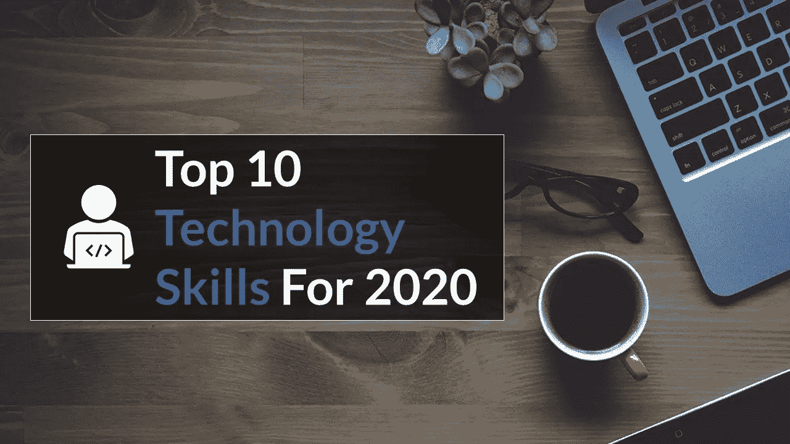

# 2020 年十大技术技能

> 原文：<https://towardsdatascience.com/top-10-technology-skills-for-2020-9eac27e0839c?source=collection_archive---------5----------------------->

来源:[freephotoc](https://pixabay.com/users/freephotocc-2275370/)，via [pixabay](https://pixabay.com/photos/notebook-laptop-macbook-conceptual-1280538/)

## 重塑和重新定义工作场所的技能

根据来自麦肯锡的[研究](https://www.mckinsey.com/global-themes/future-of-organizations-and-work/what-the-future-of-work-will-mean-for-jobs-skills-and-wages)，随着技术的快速进步，到 2030 年[将近三分之一的美国工人将需要](https://www.cnbc.com/2017/11/29/one-third-of-us-workers-could-be-jobless-by-2030-due-to-automation.html)寻找新的工作。这些进步意味着员工需要不断学习新技能。

听着，归根结底，我对几件事充满热情:优质啤酒(开玩笑的，但说真的，你可以把你当地的 IPAs 寄给我)、领导力和管理、经济学和消费者行为、企业家精神和初创企业，最后是技术和小工具。技术是最突出的，因为我全职管理 ABBYY Software 的[全球过程智能](https://abbyy.com/timeline)部门的产品营销。我对技术的热情意味着是的！我手腕上有一个智能小玩意儿，家里有声控恒温器和其他漂亮的智能设备。技术趋势变化如此之快，新的“酷东西”发展如此之快，这让我不断阅读文章，观看 CES 2020 live 的片段，渴望了解“下一步是什么？”。谈论所有与技术相关的事情，接着我之前关于 2020 年 10 大技术趋势的文章，我想讨论 2020 年及以后的 10 大趋势技术技能。

 [## 2020 年十大技术趋势

### 改变我们思考和工作方式的策略和事物

towardsdatascience.com](/top-10-technology-trends-for-2020-4a179fdd53b1) 

你知道利害关系在变，我也知道。我不认为这些顶级技能会让你感到惊讶，但它们值得在你的下一次管理或领导会议上提及。对技术的需求，尤其是对拥有高级技术技能的工人的需求正在飞速增长。随着企业内大规模中断的发生，组织需要以全新、创新的方式做出响应。这意味着重新思考我们如何对待劳动力技能和人才管理。许多公司正在投入更多的资源来招募、雇佣和培养合适的人才，以保持竞争力。毫无疑问，这意味着愿意花时间开发先进技术技能的员工可能在未来 12 个月内获得企业中一些最受欢迎的角色。

在 [Unsplash](https://unsplash.com?utm_source=medium&utm_medium=referral) 上由 [Austin Distel](https://unsplash.com/@austindistel?utm_source=medium&utm_medium=referral) 拍摄的照片

根据招聘软件公司 iCIMS 的 [2019 年报告，2016 年组织平均需要 55 天来填补一个技术职位。2019 年，这一数字跃升至 66 天。根据该报告，这些空缺职位每天每个空缺会造成约 680 美元的收入损失。这些技术工作的供给很少，需求却很大！你具备获得这些职位的技能吗？](https://cdn31.icims.com/icims3/prod/pdf/misc/2019-Benchmark-on-Hiring-Tech-Talent.pdf)

## 2016-2019 年越来越受欢迎的十大技术技能

当在 Udemy 上查看最热门的技能趋势时，数据显示在过去的 3 年中，已经出现了向人工智能和数据科学技能学习的转变。这是有意义的，因为 2020 年的许多顶级技术趋势包括超自动化、自主事物和人工智能安全等。(如果你还没有读过这些技术，我建议你至少从上面链接的文章中了解完整的列表。)

根据 Udemy 的数据，从 2016 年到 2019 年，这是过去 3 年里越来越受欢迎的 10 大技术技能。

1.  张量流
2.  聊天机器人
3.  微软 Azure —架构
4.  OpenCV(计算机视觉/人工智能)
5.  神经网络
6.  LPIC- Linux
7.  以太坊(区块链)
8.  Splunk(数据)
9.  开源地理信息系统软件
10.  科特林

**排名基于 2019 年 Udemy.com 的最高消费。资料来源:2020 年 Udemy 数据。*

TensorFlow、OpenCV 和神经网络是数据科学家今天正在利用的基础技能，对于理解和开发人工智能应用程序和平台至关重要。

开源机器学习和神经网络处理越来越受欢迎的人工智能(AI)创新背后的沉重负担。这些数字技术席卷了世界，可以在各行各业看到。

## 2020 年十大最受欢迎的技术技能

当 Udemy 查看学习平台网站上 2020 年最受欢迎的技能时，也有类似的趋势。

技能缺口困扰着全球的组织，这 10 项技能是必备的。商业领袖正在努力填补这些工作角色。

如果你想在今年进行 IT 技能投资或开始新的职业生涯，这些是你要考虑的领域。在分析了超过 4000 万用户的数据后，Udemy 发现人们正在学习的最受欢迎的技术技能是编程语言 Python。

总体而言，该报告指出，人们对学习人工智能(AI)和数据科学有着巨大的兴趣，但对网络开发框架(React，Angular)、云计算和其他 IT 认证(AWS，CompTIA)以及 Docker 的需求也在不断增长。

1.  **Python** —一种用于软件开发、基础设施管理和数据分析的编程语言。Python 的设计理念强调代码的可读性，并大量使用空白。
2.  **React (web)** —一个用于构建用户界面的 JavaScript 库。它由脸书和一个由个人开发者和公司组成的社区维护。React 可以用作开发单页面或移动应用程序的基础。
3.  **Angular** —基于 JavaScript 的开源前端 web 框架。它由谷歌的 Angular 团队和一个由个人和公司组成的社区维护。Angular 是由构建 AngularJS 的同一个团队完全重写的。
4.  **机器学习**——算法和统计模型的科学研究。它被视为人工智能的一个子集
5.  Docker —一个开源平台，用于创建称为容器的软件包。容器是相互隔离的，捆绑了它们自己的软件、库和配置文件。
6.  Django —一个基于 Python 的免费开源 web 框架。Django 的主要目标是简化复杂的、数据库驱动的网站的创建。
7.  **CompTIA** —一家专业技术机构，拥有从入门级到专家级的四个 IT 认证系列。它被认为是 It 行业的顶级行业协会之一。
8.  **亚马逊 AWS** —AWS 向个人、公司和政府提供随需应变的云计算平台和 API，采用计量付费的方式。AWS 认证验证了云专业知识。
9.  **深度学习** —一类基于人工神经网络的机器学习。学习可以是有监督的、半监督的或无监督的。
10.  **React Native (mobile)** —由脸书创建的开源移动应用框架，用于开发 Android、iOS、Web 和通用 Windows 平台的应用。

**排名基于 2019 年 Udemy.com 最高消费。资料来源:2020 年 Udemy 数据。*

## 2020 年十大新兴技术技能

虽然有很多技能对 2020 年的技术成功至关重要，但今年及以后还会出现一些技术技能。

1.  Gatsby.js(网络框架)
2.  AWS 大数据
3.  反应钩
4.  微软 Azure 架构
5.  Next.js (web 框架)
6.  阿帕奇气流(数据处理)
7.  SwiftUI(苹果应用程序)
8.  数字过程自动化
9.  ESP32(物联网)
10.  量子计算

**数据基于 2018 年零消耗但 2019 年在 Udemy 上激增的技能。资料来源:2020 年 Udemy 数据。*

2020 年十大新兴技术技能包括网络开发、量子计算和物联网(IoT)。

Udemy 分析了目前超过 4000 万人正在该平台上学习的新兴技能，并发现 Gatsby.js，一种新的 web 开发框架工具，正在迅速被采用。越来越受欢迎的其他 web 开发工具包括 React Hooks、Next.js 和 SwiftUI，这是一种用于苹果应用程序的用户界面工具。全新的技能出现在新兴技术技能清单上，包括量子计算和 ESP32，用于物联网的发展。

## 数字化的转变即将到来——对数字化技能的需求至关重要

这些榜单展示了企业兴趣的转变，也反映了我们日益数字化的世界。你为数字化企业做好准备了吗？

这些 2020 年十大技术技能和其他有趣的见解来自 Udemy for Business 的 [2020 年工作场所学习趋势报告:未来的技能](https://business.udemy.com/resources/5-workplace-learning-trends-2020/) (48 页，PDF，选择加入)。该报告强调了您的组织在 2020 年将需要的未来技能，以及您如何为这个新的十年准备您的员工。

## 如果你喜欢这篇文章，你可能也会喜欢其他的阅读！：

 [## 2020 年十大人工智能趋势

### 人工智能在工作场所的兴起支持和维持了数字化劳动力，这是一个明显的趋势…

towardsdatascience.com](/top-10-ai-trends-for-2020-d6294cfee2bd)  [## 2020 年十大技术趋势

### 改变我们思考和工作方式的策略和事物

towardsdatascience.com](/top-10-technology-trends-for-2020-4a179fdd53b1)  [## 数据挖掘的 5 个误区

### 什么是数据挖掘？

towardsdatascience.com](/5-myths-of-data-mining-70d49f0abd18)  [## 你的团队中有数据英雄吗？

### 商业分析和商业智能

towardsdatascience.com](/do-you-have-a-data-hero-on-your-team-e4ddc318926e) 

**RYAN M. RAIKER，MBA //** Ryan Raiker 是 [ABBYY](http://www.abbyy.com/) 的高级产品营销经理，ABBYY 是一家业务流程和数字智商解决方案的全球供应商。作为常驻的“流程智商人员”，Ryan 在流程发现、分析、监控和预测/说明性分析、业务战略管理、业务发展方面拥有专业知识，专注于帮助公司了解其业务流程并从中获得价值。他获得了威得恩大学的工商管理硕士学位、商业分析/信息学学士学位和运营管理辅修学位，并继续在该大学担任兼职教授。