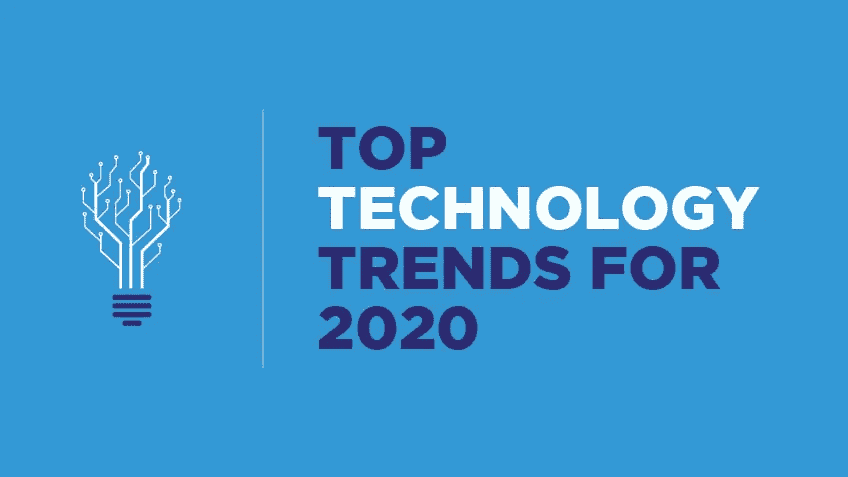
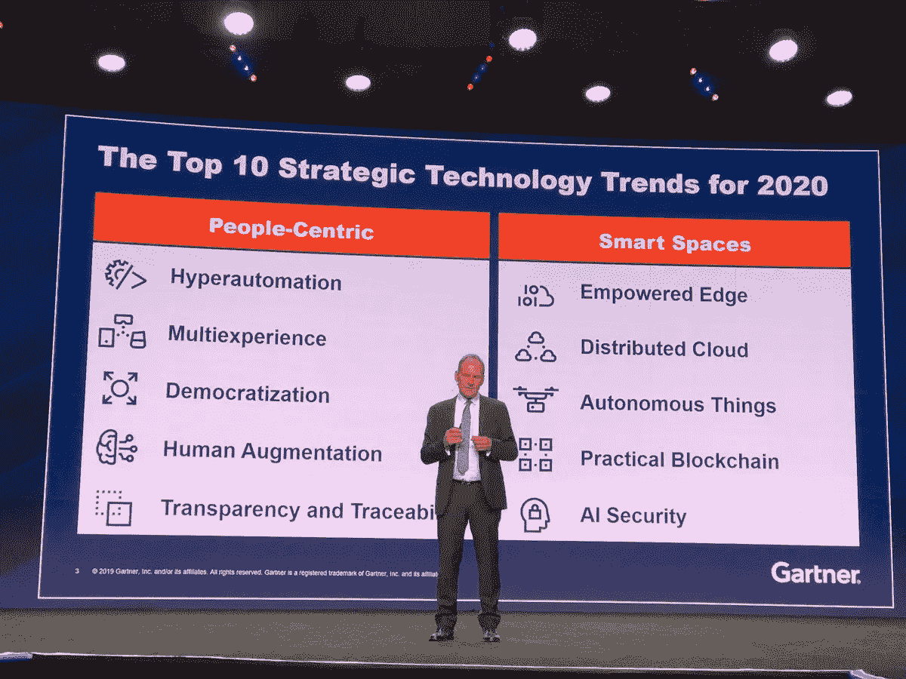
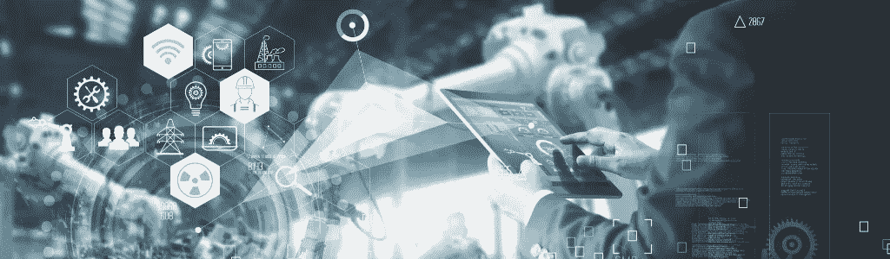
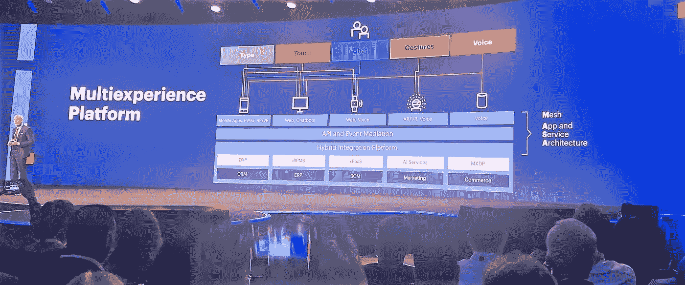
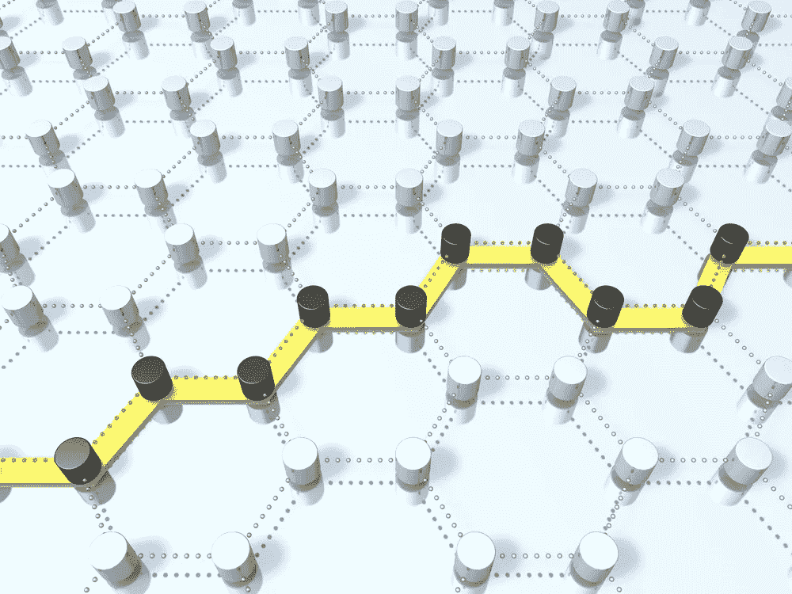
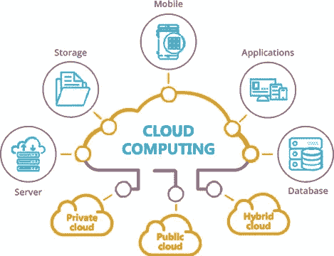

# 2020 年十大技术趋势

> 原文：<https://towardsdatascience.com/top-10-technology-trends-for-2020-4a179fdd53b1?source=collection_archive---------2----------------------->

## 改变我们思考和工作方式的策略和事物

20 世纪 60 年代的电视节目如《杰森一家》预言 21 世纪将充满会飞的汽车，空中机器人将成为我们日常生活的一部分。2015 年 10 月 21 日标志着马蒂·小飞侠(迈克尔·J·福克斯饰)在 1989 年的经典《回到未来第二部》续集中旅行到的时间点。他发现的未来已经抓住了数百万人的想象力——相反，今天，我们生活在一个由直播、智能手机和社交网络主导的世界，而不是飞行汽车或悬浮板([也许，因为这真的是悬浮板吗？](https://amzn.to/36yiYFf))。

[来源](https://media.giphy.com/media/m2zMSkeuE7xmw/giphy.gif)

在短短的 10 年时间里，或者更短的时间内，像[优步](https://www.uber.com/invite/6jrv6ue)、 [Lyft](https://www.lyft.com/invite/RYANRAIKERMEDIUM) 、 [DoorDash](https://drd.sh/PSBIQB/) 、 [AirBnB](https://www.airbnb.com/c/ryanr16001?currency=USD) 等服务应用已经产生了数百万用户，几乎每个人的智能手机上都可以找到它们。像 Siri 和 Alexa 这样的个人助理已经进入了我们的很多生活。任何人如果说世界在过去十年没有改变，那就太天真了。这种技术的发展和变化可能会持续到下一个十年甚至更久。

是咆哮 20 的宝贝！在新千年开始时，信息技术对 2000 年问题深感忧虑……“哦，不，是零和时钟！”当时钟在 2000 年敲响 12 点时，iPhone、Twitter、脸书、4k、5G 以及我们今天知道的所有其他有趣的东西都不存在。那么，随着新十年的开始，会发生什么呢？

你更感兴趣的是你需要学习哪些技能来跟上 2020 年的技术趋势？

 [## 2020 年十大技术技能

### 重塑和重新定义工作场所的技能

towardsdatascience.com](/top-10-technology-skills-for-2020-9eac27e0839c) 

2020 年将带来许多改变游戏规则的技术趋势，我们将会接受(或者已经接受)。虽然有些东西已经存在，并且在现代企业中很常见，但其他新技术是彻底改变我们生活、工作和社交方式的“首选”。随着我们所了解和喜爱的现代技术随着新的用例甚至更新的应用而发展，我们将开始看到新的优势和机会。

2019 年 10 月的 [Gartner IT 研讨会/Xpo](https://www.gartner.com/en/conferences/na/symposium-us) 上公布了 2020 年十大技术趋势。Gartner 预测，2020 年的关键战略技术趋势包括两个主要领域:以人为中心和智能空间。

[来源](https://blog.waylay.io/hyper-automation-is-the-number-one-gartner-technology-trend-of-2020-what-does-it-mean-for-iot/)

## **高度自动化**

高度自动化将任务自动化提升到了一个新的水平。它是人工智能(AI)和机器学习(ML)等先进技术的应用，以比传统自动化能力更具影响力的方式自动化流程(不仅仅是任务)。它结合了多种机器学习、打包软件和自动化工具来交付工作。高度自动化需要工具的组合来帮助支持复制人类参与任务的部分。这一趋势始于机器人流程自动化(RPA ),但将随着流程智能、内容智能、人工智能、OCR 和其他创新技术的结合而增长。

[来源](https://blogs.gartner.com/jason-wong/files/2019/10/multiexperience.jpg)

## **多重体验**

多重体验处理从二维屏幕和键盘界面到更加动态、多模态的界面世界的巨大转变，我们沉浸在交互技术中，它围绕着我们。Multi-experience 目前专注于使用增强现实、虚拟现实、混合现实、多通道人机界面和传感技术的沉浸式体验。

人工智能对话平台改变了人们与数字世界互动的方式。除了对话，虚拟现实(VR)、增强现实(AR)和混合现实(MR)正在改变人们对数字世界的看法。这种感知和互动的综合转变将带来未来的多感官和多模态体验。在未来十年，这种趋势将成为所谓的环境体验。

[来源](https://thehill.com/event/281098-the-democratization-of-technology-a-discussion-on-the-accessibility-of-innovation)

## **技术的民主化**

技术民主化指的是技术的获取继续快速变得对更多的人更容易。

技术的民主化意味着让人们无需大量或昂贵的培训就能轻松获得技术或商业专业知识。随着公民开发者的兴起，这一点已经得到了广泛的认可。过去，自动化是由 IT 部门管理和部署的，但随着数字工人的出现，机器人流程自动化的出现改变了这一状况。我们现在看到新一代的公民开发人员，如业务分析师，他们更接近业务挑战，可以对数字工作者进行编程和自动化，以帮助他们完成工作。这一趋势将集中在四个关键领域:应用开发、数据和分析、设计和知识。根据 Gartner 的说法，这些工具可能是为“生成合成训练数据而设计的，这有助于解决 ML 模型开发的重大障碍。”

新技术和改进的用户体验将使技术行业之外的人能够获得和使用技术产品和服务。

安迪·凯利在 [Unsplash](https://unsplash.com?utm_source=medium&utm_medium=referral) 上的照片

## **人类隆胸**

人类增强探索技术如何被用来提供认知和身体的改善，作为人类体验不可分割的一部分。这种增强利用技术来提高人类的身体和认知能力。像波士顿动力公司这样的公司已经开发了各种各样的人类增强设备，可以在工厂或战场上使用。

我们已经看到智能设备和智能可穿戴设备的激增。新的应用包括使用这些可穿戴设备来提高采矿业工人的安全。在零售和旅游等其他行业，可穿戴设备可以用来提高员工生产率和增强人类能力。

[来源](https://www.allthingssupplychain.com/supply-chain-transparency-more-than-just-traceability/)

## 透明度和可追溯性

越来越多的消费者意识到他们的个人信息是有价值的，并要求控制。许多人认识到保护和管理个人数据的风险越来越大。除此之外，政府正在实施严格的立法来确保他们这样做。透明度和可追溯性是支持这些数字道德和隐私需求的关键要素。

未来几年，世界各地可能会颁布更多类似于欧盟通用数据保护法规(GDPR)的立法。

随着越来越多的组织部署人工智能，并利用机器学习代替人类做出决定，这是一个令人担忧的进一步原因。对可解释的人工智能和人工智能治理的需求不断发展。这一趋势要求关注信任的这些关键要素:正直、开放、负责、能力和一致性。

[来源](https://upload.wikimedia.org/wikipedia/commons/b/bf/Edge_computing_infrastructure.png)

## **被授权的边缘**

边缘计算是一种计算拓扑，在这种拓扑中，信息处理、内容收集和交付更靠近信息的来源、存储库和消费者。这允许减少延迟，并且允许这些边缘设备上的某种程度的自治。边缘计算诞生于物联网系统向嵌入式物联网世界提供断开连接或分布式功能的需求。

据 Gartner 的 Brian Burke 称:“随着边缘设备拥有越来越复杂和专业的计算资源以及更多的数据存储，边缘计算将成为几乎所有行业和使用案例的主导因素。包括机器人、无人机、自动驾驶汽车和操作系统在内的复杂边缘设备将加速这一转变”。

这将扩大设备作为智能空间基础的作用，并将关键应用和服务移至更靠近使用它们的人和设备。

[来源](https://www.networksunlimited.com/cloud-computing-trends-for-2019/)

## 分布式云

分布式云是云转变的方式。大多数人认为云是独立于位置的——它就在那里；它就在上面的某个地方。但是现在有了分布式云，这些数据中心的物理位置变得越来越重要。解决法规问题和延迟问题等诸如此类的问题变得越来越重要。

云现在扩展了它的领域并成为分布式云，这是将公共云服务分发到不同的位置，而原始公共云提供商承担服务的运营、治理、更新和发展的责任。这代表着大多数公共云服务的集中化模式的重大转变，并将引领云计算的新时代。

[来源](https://insights.thirdrepublic.com/autonomous-things-what-they-why-matter-today/)

## **更自主的东西**

自主事物是使用人工智能来自动化先前由人类执行的功能的物理设备。目前最容易识别的自主事物形式是机器人、无人机、自主车辆和电器。这些东西的自动化超越了僵化的编程模型所提供的自动化，它们利用人工智能来交付高级行为，这些行为与环境和人的交互更加自然。

随着技术能力的提高，监管允许和社会接受度的增长，更多自主的东西将被部署在不受控制的公共空间。

照片由[思想目录](https://unsplash.com/@thoughtcatalog?utm_source=medium&utm_medium=referral)在 [Unsplash](https://unsplash.com?utm_source=medium&utm_medium=referral) 上拍摄

## **加密货币和实用区块链**

认识到“实用区块链”在这里很重要:虽然区块链已经出现了几年，但由于技术上的一些技术和管理问题，它的商业部署一直很慢。区块链有可能通过实现信任、提供透明度和实现跨商业生态系统的价值交换来重塑行业，有可能降低成本、减少交易结算时间并改善现金流和材料的流动。

报告指出，区块链具有潜力的另一个领域是身份管理。智能合约可以被编程到区块链中，事件可以触发动作；例如，当收到货物时，付款被释放。然而，Gartner 的 Brian Burke 表示，由于一系列技术问题，包括较差的可扩展性和互操作性，区块链在企业部署方面仍不成熟。“尽管面临这些挑战，但巨大的中断和创收潜力意味着组织应该开始评估区块链，即使他们预计不会在短期内积极采用这些技术，”他说。

随着人工智能和物联网等互补技术开始集成，区块链将看到企业的巨大增长。

照片由 [Denys Nevozhai](https://unsplash.com/@dnevozhai?utm_source=medium&utm_medium=referral) 在 [Unsplash](https://unsplash.com?utm_source=medium&utm_medium=referral) 上拍摄

## **AI 安全**

超自动化等不断发展的技术已经表明，真正的数字化转型正在改变商业世界。然而，这些技术也通过潜在的新攻击点产生了安全漏洞。未来的人工智能安全将有 3 个关键的视角:1)保护人工智能驱动的系统，安全的人工智能训练数据，以及训练有素的管道和机器学习模型；2)利用人工智能来增强安全防御，并利用机器学习来理解模式，发现攻击并自动化部分网络安全流程；3)预测攻击者对 AI 的负面使用——识别这些攻击并防御它们。

克里斯多夫·伯恩斯在 [Unsplash](https://unsplash.com?utm_source=medium&utm_medium=referral) 上拍摄的照片

2020 年为企业领导者带来了巨大的机遇和挑战。重要的是要永远记住，拥抱变化和采用新的技术和趋势将保证您的组织在市场上保持竞争力。毫无疑问，抵制变革会让你的公司落后。那些专注于真正的数字化转型的人将会发展他们的业务。你有足够的勇气去执行这些将重塑未来的趋势吗？

Gartner 的完整报告【2020 年战略技术趋势，可在此下载(需要注册)[。](https://www.gartner.com/en/doc/432920-top-10-strategic-technology-trends-for-2020)

# 如果你喜欢这篇文章，你可能也会喜欢其他的阅读！：

 [## 2020 年十大人工智能趋势

### 人工智能在工作场所的兴起支持和维持了数字化劳动力，这是一个明显的趋势…

towardsdatascience.com](/top-10-ai-trends-for-2020-d6294cfee2bd)  [## 2020 年十大技术技能

### 重塑和重新定义工作场所的技能

towardsdatascience.com](/top-10-technology-skills-for-2020-9eac27e0839c)  [## 数字化员工在工作场所的贡献将增长 50%

### 人机协作——混合劳动力是成功企业的新常态。

medium.com](https://medium.com/@ryraiker/digital-workers-contributions-in-the-workplace-to-grow-by-50-e26335b43836)  [## 数据挖掘的 5 个误区

### 什么是数据挖掘？

towardsdatascience.com](/5-myths-of-data-mining-70d49f0abd18)  [## 你的团队中有数据英雄吗？

### 商业分析和商业智能

towardsdatascience.com](/do-you-have-a-data-hero-on-your-team-e4ddc318926e) 

**RYAN M. RAIKER，MBA //** Ryan Raiker 是 [ABBYY](http://www.abbyy.com/) 的高级产品营销经理，ABBYY 是一家业务流程和数字智商解决方案的全球供应商。作为常驻的“流程智商人员”，Ryan 在流程发现、分析、监控和预测/说明性分析、业务战略管理、业务发展方面拥有专业知识，专注于帮助公司了解其业务流程并从中获得价值。他获得了威得恩大学的工商管理硕士学位、商业分析/信息学学士学位和运营管理辅修学位，并继续在该大学担任兼职教授。

**充分披露:**本文中包含的一些链接是附属链接，这意味着您无需支付额外费用，如果您点击并购买或注册一项服务，我可能会收到佣金。

## 会员链接:

1.  [首次乘车可获得 5 美元的 Lyft 积分！](https://www.lyft.com/invite/RYANRAIKERMEDIUM)
2.  [使用代码“6jrv6ue”，您的前 3 次优步骑行每次可获得 2.00 美元的优惠。](https://www.uber.com/invite/6jrv6ue)
3.  [在 DoorDash 上，您的前 3 笔订单每笔可获得 5.00 美元的折扣。](https://drd.sh/PSBIQB/)
4.  [首次使用 airbnb 旅行可获得 55 美元的优惠。](https://www.airbnb.com/c/ryanr16001?currency=USD)