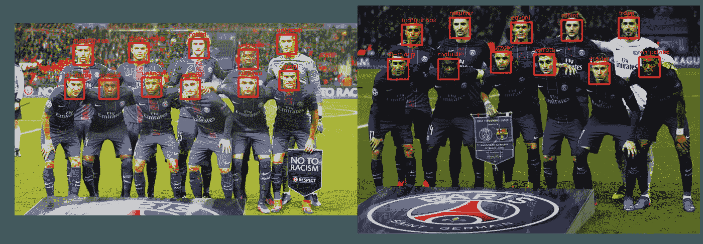

# Github 上的十大趋势数据科学项目

> 原文：<https://towardsdatascience.com/top-10-trending-data-science-projects-on-github-ec1d4d4119f?source=collection_archive---------15----------------------->

## 少数几个 GitHub 存储库通过它们的各种项目突出了数据科学的能力。

在 [Unsplash](https://unsplash.com/s/photos/projects?utm_source=unsplash&utm_medium=referral&utm_content=creditCopyText) 上由 [Austin Distel](https://unsplash.com/@austindistel?utm_source=unsplash&utm_medium=referral&utm_content=creditCopyText) 拍摄的照片

> 数据科学领域带来了各种科学工具、流程、算法和从结构化和非结构化数据中提取知识的系统，用于识别其中有意义的模式。

**数据科学**是一个快速增长的行业，目前**是这十年来最令人向往的领域之一**。这就转化为成千上万拥有不同水平的[**数据科学相关技能的人**](/top-12-data-science-skills-to-learn-in-2020-5f635d7d98bf) 积极尝试进入数据科学的世界。如果你也热衷于了解数据科学所能提供的东西，并希望获得新的技能来增加你的投资组合，那么不要再犹豫了。

在整篇文章中，我们将浏览一些 GitHub 存储库，这些存储库突出了数据科学的能力，以及它们针对一系列用例的各种项目。像这样的开源项目非常适合研究数据科学的各个方面，同时让您可以选择修补它们，这样一旦您有信心，您就可以构建自己的项目。

> 数据真正推动了我们所做的一切。
> 
> ——杰夫·韦纳

 [## Github 上的 10 个流行数据科学资源

### 一些顶级的 GitHub 库将教你所有关于数据科学的知识。

towardsdatascience.com](/10-popular-data-science-resources-on-github-7ae288ff4a75)  [## GitHub 上十大热门 Python 项目

### 像这样的 GitHub 项目是人们创造力和才华的完美展示

towardsdatascience.com](/top-10-trending-python-projects-on-github-fb852cd58262) 

# Github 上的顶级数据科学项目

[**GitHub**](https://github.com/) 无疑是让你熟悉开源代码的最好地方之一，不仅是数据科学，还有任何技术。作为一个相当广泛的领域， [**数据科学充满了各种工具**](/best-data-science-tools-for-data-scientists-75be64144a88) **、框架、技术和算法**来从数据中提取有见地的知识。

本节涵盖的项目在描绘数据科学如何部署在各行各业以及您如何轻松从中获取所需信息方面做了令人惊叹的工作。但是在深入研究这个之前，**先看看 12 个适合初学者和专家的数据科学项目想法。**

 [## 12 个适合初学者和专家的酷数据科学项目创意

### “到目前为止，您已经完成了多少个数据科学项目？”

towardsdatascience.com](/12-cool-data-science-projects-ideas-for-beginners-and-experts-fc75b5498e03) 

# 1.艾伯特

*   **GitHub 链接:**【https://github.com/brightmart/albert_zh】T4
*   **星星:** 2.9k
*   分叉者: 582

**Lite BERT(变压器的双向编码器表示)的缩写，** ALBERT 是一款**轻量级 BERT** ，旨在通过克服满量程 BERT 的内存限制来实现更好的性能。ALBERT 通过使用比常规 BERT 少得多的参数来做到这一点。

虽然**谷歌的 BERT** 允许任何人高精度地训练自己的模型，但 **ALBERT 已经领先**一步，只用 10%的参数就实现了更高的性能产出。伯特和阿尔伯特都**允许你在 **GPU 或 TPU** 上训练你的模型**。如果您的任何任务需要与一个**NLP 一起工作，我们强烈建议您让 ALBERT 尝试一下，亲自看看性能的提高。**

# **2.秘密集会的看守人**

****

**来源:[平铺器](https://github.com/nuno-faria/tiler)**

*   ****GitHub 链接:**https://github.com/nuno-faria/tiler**
*   ****星星:** 4.4k**
*   **分叉者: 247**

**如果你喜欢艺术项目，我们建议给 Tiler 一个机会。Tiler 是一个**有趣而令人兴奋的开源项目**，它使用 Python 构建而成**允许任何人创建有趣而独特的图像**。这个项目的工作方式是**为你提供一系列不同颜色的形状**，这些形状可以以不同的角度旋转来创建更复杂的图像。您所要做的就是将您想要平铺的图像作为参数传递，让 Tiler 发挥它的魔力。Tiler 还有一系列其他参数，您可以使用它们来微调您的最终图像。**

**Tiler 提供了许多不同种类的开箱即用的形状，如波浪、十字绣、圆形、乐高、心形等等，并且有多种颜色。Tiler 的设计考虑到了灵活性，因为它可以让用户创建自己的各种颜色的瓷砖，如果他们觉得特别有创意的话。**

# **3.PLM Papers——预训练语言模型研究论文集**

*   ****GitHub 链接:**【https://github.com/thunlp/PLMpapers **
*   ****星辰:** 2k**
*   **分叉者: 280**

**这个数据科学 GitHub repo 专注于**为一系列问题提供各种预训练模型**。对于门外汉来说，预先训练的模型是迁移学习的生命线，人们可以使用其他人的模型，只需稍加修改，就可以解决类似的问题。**

**预训练模型对于将训练成本保持在最低水平至关重要**，因为它们可以帮助您不需要在任何专用训练硬件(GPU)上花费时间，同时还可以帮助您减少总花费时间。****

**repo 是一百多个模型的研究论文的家园，可以帮助你更深入地理解问题及其建议的解决方案。repo 还包含一个信息图来表示这些 PLM 之间的关系。**

# **4.TubeMQ**

*   ****GitHub 链接:**[https://github.com/Tencent/TubeMQ](https://github.com/Tencent/TubeMQ)**
*   ****星星:** 2k**
*   ****分叉者:** 392**

**如果你曾经对**大公司如何实时地将数据从一个站点转移到另一个站点**感兴趣，这个项目也许能让你一窥其中的秘密。TubeMQ 是一个企业级分布式消息队列(MQ)系统，它在大约一年前开源，现在被 Apache Software Foundation 采用，旨在提供高性能存储和传输海量数据。**

**TubeMQ 可以帮助组织在保持完全可伸缩性的同时，在吞吐量、延迟、稳定性、性能和成本方面提供几个关键优势,从而占据上风。**该项目的其他显著特性**包括功能丰富的仪表盘、认证和授权、对大数据和流媒体生态系统的支持、与 TCP 和 SSL 等传输协议兼容、高效的推拉式消费模式等等。**

# **5.深度隐私**

*   ****GitHub 链接:**https://github.com/hukkelas/DeepPrivacy**
*   ****星星:** 919**
*   ****分叉者:** 131**

**现代世界与互联网紧密相连，在这里，**这个词已经失去了意义，现在只是一个神话。你使用的每一个应用程序或服务都在某种程度上跟踪你的一举一动，在你提出要求之前，为你提供更好的服务和建议。****

****DeepPrivacy 就是这样一个 GitHub 项目，旨在自动匿名化图像中的人脸。DeepPrivacy 使用 [**生成对抗网络(GAN)**](https://en.wikipedia.org/wiki/Generative_adversarial_network) 通过使用包围盒识别敏感区域和稀疏姿态信息在各种场景下引导网络来实现人脸匿名化。该项目使用同类最佳的检测模型，[**Mask-R-CNN**](https://arxiv.org/abs/1703.06870)**用于生成稀疏姿态信息， [**DSFD**](https://arxiv.org/abs/1810.10220) 用于人脸识别。如果你有兴趣研究 DeepPrivacy 的研究论文，你也可以通过 GitHub repo 来完成。******

********

****来源: [Github 深度隐私](https://medium.com/r?url=https%3A%2F%2Fgithub.com%2Fhukkelas%2FDeepPrivacy)****

# ****6.DeepCTR****

*   ******GitHub 链接:**https://github.com/shenweichen/DeepCTR****
*   ******星辰:** 752****
*   ****分叉者: 222****

****这个数据科学项目是通过预测用户的**点击率(CTR)** 来解决向用户提供正确推荐或搜索结果这一主要问题的重要一步。DeepCTR 项目提供了对许多易于使用、模块化和可扩展的深度学习模型的访问，这些模型具有许多核心组件层，您可以使用它们来构建定制模型。许多受支持的模型包括:****

******●** DeepFM****

****●基于产品的神经网络****

****●深度和交叉网络****

****●深度兴趣网络****

****● FLEN****

****● FGCNN****

****●卷积点击预测模型****

****虽然 DeepCTR 的这个变体可能因为其 **TensorFlow** 实现而看起来并不适合每个人，但是还有 DeepCTR-Torch，它使用了这个项目的 [PyTorch](/reasons-to-choose-pytorch-for-deep-learning-c087e031eaca) 实现。****

# ******7。人脸识别******

*   ******GitHub 链接:**[https://GitHub . com/Alex attia/Data-Science-Projects/tree/master/face recognition](https://github.com/alexattia/Data-Science-Projects/tree/master/FaceRecognition)****
*   ******星辰:** 308****
*   ****分叉者: 260****

****面部识别工具可以与来自一个人的图像的面部数据一起使用，以分析和提取许多关键信息，如**性别、年龄、**等等。利用最新技术的现代工具可以从视频和图像中识别人脸。 **Alexandre Attia 的**现代人脸识别工具利用深度学习，由 [**梯度方向直方图方法**](http://lear.inrialpes.fr/people/triggs/pubs/Dalal-cvpr05.pdf) **提供支持。**该人脸识别工具使用的更详细的步骤列表包括:****

****●使用 HOG 算法在图像中查找面部，以获得面部结构的基本表示****

****●剪切、旋转、缩放等变换，使眼睛和嘴巴居中****

****●使用深度学习和经过训练的神经网络对检测到的面部进行编码****

****●最后，使用分类器(LVM 或任何其他)在数据库中找到与测试图像最匹配的人****

********

****来源: [Github 人脸识别](https://github.com/alexattia/Data-Science-Projects/tree/master/FaceRecognition)****

# ****8.**墨西哥政府报告文本分析******

*   ******GitHub 链接:**[https://GitHub . com/PhantomInsights/Mexican-government-report](https://github.com/PhantomInsights/mexican-government-report)****
*   ******星星:** 455****
*   ****分叉者: 69****

******使用 Python** 构建，这个项目提供了一个关于[**【NLP】**](/python-libraries-for-natural-language-processing-be0e5a35dd64)**系统如何为文本挖掘工作的实践经验。该项目已经由墨西哥政府在 2019 **报告中进行了**演示，并包括许多从报告中清晰提取文本并在以后可视化的活动。**********

**为了实现这一点，该项目使用了多个 [Python 库](/best-python-libraries-for-machine-learning-and-deep-learning-b0bd40c7e8c)。每个库的简要说明如下:**

**● **PyPDF2:** 一个高度可定制的库，用于可靠地从 PDF 中提取干净的文本**

**● **空间:**现实世界中自然语言处理工作负载的高速库**

**● **NumPy:** 为项目提供必要的计算能力**

**● **pandas:** 用于从数据集中提取和分析有价值的见解**

**● **matplotlib:** 用于创建令人惊叹且富有洞察力的数据可视化**

**● **seaborn:** 用于更精确地控制用 matplotlib 构建的图形和绘图**

**● **geopandas:** 用于处理空间数据库和绘制视觉上吸引人的地理地图**

# **9.**提绳器****

****

**来源: [Github 字符串筛选器](https://github.com/fireeye/stringsifter)**

*   ****GitHub 链接:**[https://github.com/fireeye/stringsifter](https://github.com/fireeye/stringsifter)**
*   ****星星:** 415**
*   **分叉者: 64**

**这个数据科学项目**的目标是应用安全**，其目标用户主要是恶意软件分析师和网络安全专家。StringSifter 项目利用 Python 中的 strings 程序和[机器学习](/machine-learning-books-you-must-read-in-2020-d6e0620b34d7)的能力，使得在各种大小的程序二进制文件中找到一系列隐藏的字符串变得更加容易。**

**这些隐藏的字符串经常被恶意使用，通过将它们作为 StringSifter 程序的输入，几乎可以毫不费力地找到它们。一旦列表被输入到程序中，它就会深入地筛选二进制文件，并向分析人员报告任何相关的发现。作为一款**易于使用的工具，**安全专家可以毫不费力地将 StringSifter 集成到他们现有的恶意软件分析堆栈中。用户还可以选择将 StringSifter 与 Docker 映像一起使用，因为所有必需的命令行实用程序都是现成的。**

# ****10。IMDb 电影分级预测系统****

*   ****GitHub 链接:**[https://GitHub . com/Alex attia/Data-Science-Projects/tree/master/projectmovierting](https://github.com/alexattia/Data-Science-Projects/tree/master/ProjectMovieRating)**
*   ****星星:** 308**
*   ****分叉者:** 260**

**这个列表中的另一个项目来自为我们带来人脸识别项目的开发者，这个评级预测系统试图在电影上映前预测电影在**的电影评级。在机器学习的支持下，ProjectMovieRating 项目试图通过以下三个部分来实现这一点:****

****● **第 1 部分:**它试图解析来自 IMDb 和目标电影数字网站的数据，如演员信息、奖项、导演、类型、预算等****

****● **第 2 部分:**然后，它试图分析数据，以识别第 1 部分中变量之间的任何相关性。****

****● **第三部分:**在最后一步，该项目使用机器学习算法 Random Forests 来预测电影的 IMDb 评分****

**** [## 机器学习算法之旅

### 阅读机器学习算法的介绍性列表

towardsdatascience.com](/a-tour-of-machine-learning-algorithms-466b8bf75c0a)**** 

# ****结论****

****数据科学已经成为一个竞争非常激烈的领域，需要不断了解最新和最好的技术才能完成工作。要想在竞争中保持领先，你需要提高自己的水平。理论教育固然很好，但如果你不把这些知识用于解决现实世界的问题，这些知识对你就没有任何用处。****

****在这篇文章中，我们试图涵盖 GitHub 上的一系列数据科学项目，这些项目涉及一些有趣且受欢迎的主题，试图为多个领域中一些具有挑战性的现实问题提供有效的解决方案。我们祈祷这些项目会激发你涉足数据科学，创造你自己版本的解决方案，或者可能是一个有趣的项目？****

> *******注:*** *为了消除各种各样的问题，我想提醒你一个事实，这篇文章仅代表我想分享的个人观点，你有权不同意它。*****

****如果你有更多的建议，我很想听听。****

# ****更多有趣的读物****

****我希望这篇文章对你有用！以下是一些有趣的读物，希望你也喜欢****

**** [## 2020 年你必须使用的最好的 Python IDEs 和代码编辑器

### 具有显著特性的顶级 Python IDEs 和代码编辑器

towardsdatascience.com](/best-python-ides-and-code-editors-you-must-use-in-2020-2303a53db24)  [## 2020 年必读的数据科学书籍

### 看看吧，你为什么要读它们？

towardsdatascience.com](/data-science-books-you-must-read-in-2020-1f30daace1cb)  [## 给 Python 开发者的 10 个很酷的 Python 项目想法

### 您可以使用 Python 构建的有趣想法和项目列表

towardsdatascience.com](/10-cool-python-project-ideas-for-python-developers-7953047e203)  [## 2020 年必读的 Python 书籍

### 看看吧，你为什么要读它们？

towardsdatascience.com](/python-books-you-must-read-in-2020-a0fc33798bb)  [## 你必须知道的 12 项 Python 开发者技能

### Python 开发人员必备的顶级技能

towardsdatascience.com](/top-12-python-developer-skills-you-must-need-to-know-9e2b6c7fc6c)  [## 面向所有人的顶级谷歌人工智能工具

### 使用谷歌人工智能中心将想法变为现实

towardsdatascience.com](/top-google-ai-tools-for-everyone-60346ab7e08)  [## 2020 年人工智能工程师的顶级编程语言

### 从几种编程语言中，人工智能工程师和科学家可以挑选出适合他们需要的语言

towardsdatascience.com](/top-programming-languages-for-ai-engineers-in-2020-33a9f16a80b0) 

> ***关于作者***
> 
> ***克莱尔 D*** *。在*[***digital ogy***](https://digitalogy.co/)***—****是一个内容制作者和营销人员，这是一个技术采购和定制匹配市场，根据全球各地的特定需求，将人们与预先筛选的&顶尖开发人员和设计师联系起来。与我连线上* [***中***](https://medium.com/@harish_6956)**[***Linkedin***](https://www.linkedin.com/in/claire-d-costa-a0379419b/)***&***[***推特***](https://twitter.com/ClaireDCosta2) ***。*********