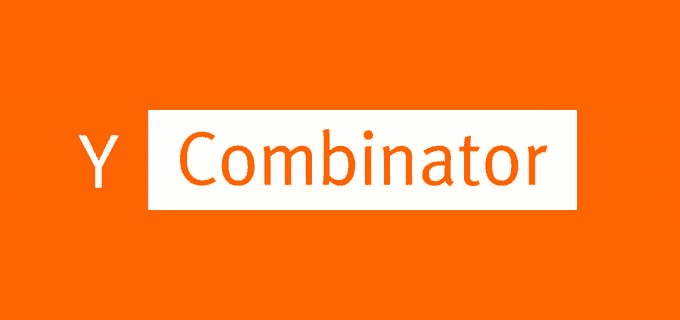
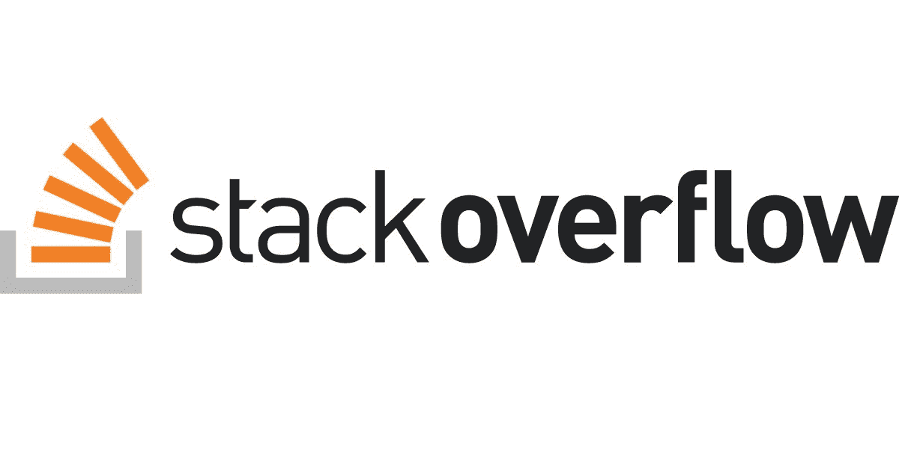
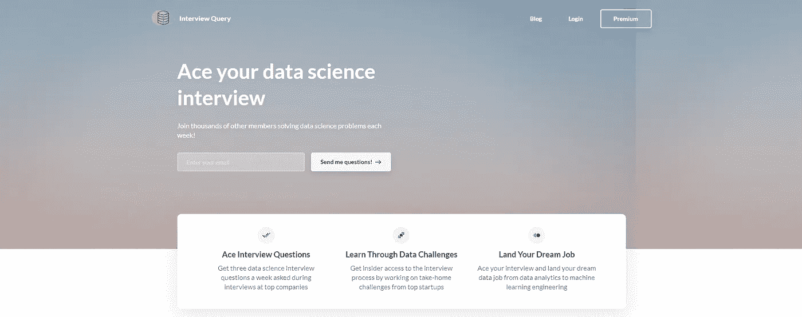
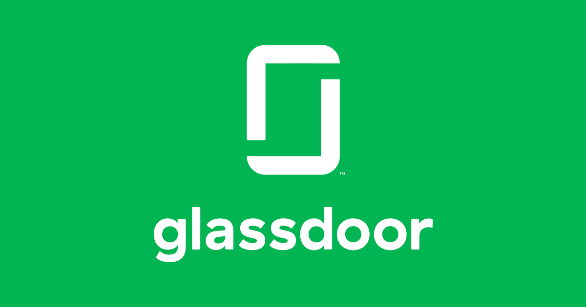
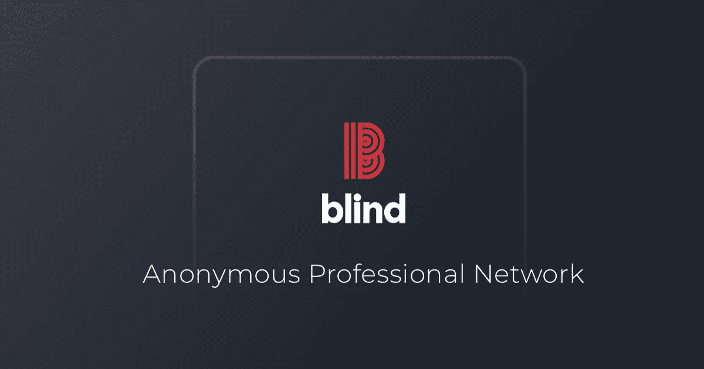

# 寻找数据科学工作的 10 大网站和资源

> 原文：<https://towardsdatascience.com/top-10-websites-resources-for-your-data-science-job-hunt-988cfe62a3c5?source=collection_archive---------19----------------------->

## 利用这些资源让你的求职更上一层楼

克里斯多佛·萨丁纳在 [Unsplash](https://unsplash.com/s/photos/overlooking-city?utm_source=unsplash&utm_medium=referral&utm_content=creditCopyText) 上的照片

我知道许多人因为冠状病毒而被解雇，并且正在寻找工作。在过去的几年里，我和我的朋友们发现了一些惊人的资源，它们真的对我的求职很有帮助。下面是几个求职板、论坛和网站，你可以在找实习或全职工作时加以利用！

这篇文章有两个部分: [**求职板**](#819c) 和 [**面试准备**](#c069) **资源**。*我强烈建议你特别利用面试准备资源！*

# 工作公告板

## 1.y 组合公司(YC)

***网站链接*** [***此处***](https://www.workatastartup.com/) ***。***

Y Combinator 是世界上最大的种子加速器之一，已经投资了一些非常成熟的科技公司，如 Stripe、Airbnb 和 DoorDash。他们也有一个[求职平台](https://www.workatastartup.com/)，可以帮你联系到 400 多家由 YC 资助的创业公司。

## 2.天使列表

***网站链接*** [***此处***](https://angel.co/) ***。***

AngelList 是为创业公司提供投资和招聘的最大平台之一。像 LinkedIn 一样，你可以创建自己的个人资料，填写自己的信息，并获得一些创业职位。我发现，如果你在寻找较小的创业公司(1-10 人)，这个网站特别好。

## 3.超狗 io

***网站链接*** [***此处***](https://underdog.io/) ***。***

超狗 io 主页

《超狗》的独特之处在于，它只在纽约、旧金山和洛杉矶等少数几个城市提供创业职位。也就是说，他们专注于保持招聘信息的高质量，他们有大量顶级科技初创公司，如 Instacart、Lever 和 Airtable。

## 4.StackOverflow

***网站链接*** [***此处***](https://stackoverflow.com/jobs) ***。***

StackOverflow 是最大的编程和工程问答网站之一。碰巧他们也有一个就业委员会！这不仅是数据科学家的绝佳去处，也是软件工程师和开发人员的绝佳去处。

# 面试准备

## 5.Leetcode

***网站链接*** [***此处***](https://leetcode.com/) ***。***

Leetcode 类似于 HackeRank 和 InterviewBit，是一个可以通过完成编码挑战来练习编码技能的网站。这是复习排序算法和 SQL 的好地方。他们还增加了一个新功能，你可以在那里练习模拟面试！总的来说，我强烈建议你用这个来帮助你准备技术面试。

## 6.面试查询

***网站链接*** [***此处***](https://www.interviewquery.com/) ***。***

我想我会分享这个网站，因为它是一个非常新的和独特的资源。你可以把它想象成 Leetcode，但它是专门为数据科学家设计的。它有一个巨大的技术问题库，您可以使用它来帮助准备您的数据科学工作。如果您注册，他们会在每周一、周三和周五向您发送一个数据科学问题。如果这还不够，你还可以支付一个高级帐户。

## 7.助推启动法

***网站链接*** [***此处***](https://jumpstart.me/forum/all) ***。***

Jumpstart 是一个非常好的资源，我最近才通过一个朋友看到它。你可以把它想象成 Reddit，但是是为了技术工作。虽然主要用作论坛，但他们也有自己的工作板，并有一个充满各种技术活动的日历，你可以报名参加！

## 8.玻璃门

***网站链接*** [***此处***](https://www.glassdoor.ca/Interview/index.htm) ***。***

是的，我知道 Glassdoor 是一个工作板。但就我个人而言，我从来没有真正把它用于那个目的。相反，我喜欢用它的独特功能，如查看公司评论和为众多公司面试提问的能力。如果你申请的是你从未听说过的公司，利用这一点，知道你将进入什么样的公司。如果你想更好地了解一家公司的面试过程，这也是一个很好的资源。

## 9.屋顶积雪

***网站链接*** [***此处***](https://www.rooftopslushie.com/) ***。***

屋顶雪泥在保持匿名的意义上类似于玻璃门，但是它的用途是非常不同的。这是一个很好的资源，你可以向专业人士提问，而不必担心暴露自己。同时，专业人士能够提供诚实的答案，因为他们的身份也是匿名的。你也可以用它来获得员工推荐、简历评论、工作面试建议等等。

## 10.盲目的

***网站链接*** [***此处***](https://www.teamblind.com/) ***。***

与 Rooftop Slushie 类似，Blind 是一个由专业人士组成的匿名网络，在这里你可以提出问题，接受建议，了解工作、公司和行业。

# 奖金

*   这里有 [**超过 100 个数据科学家面试问题和答案**](/over-100-data-scientist-interview-questions-and-answers-c5a66186769a) 你可以用来准备！
*   需要复习吗？经历一个 [**20 分钟的数据科学速成班**](http://20 Minute Data Science Crash Course for 2020)
*   为你的投资组合寻找项目？下面是你可以完成并炫耀的 [**14 个数据科学项目**](/14-data-science-projects-to-do-during-your-14-day-quarantine-8bd60d1e55e1) ！

# 感谢阅读！

如果你喜欢我的工作，想支持我…

1.  支持我的最好方式是在**媒体**这里[跟随我](https://medium.com/@terenceshin)。
2.  成为第一批在**Twitter**T2 上关注我的人之一。*我会在这里发布很多更新和有趣的东西！*
3.  此外，成为第一批订阅我的新 **YouTube 频道** [这里](https://www.youtube.com/channel/UCmy1ox7bo7zsLlDo8pOEEhA?view_as=subscriber)！*目前还没有视频，但即将推出！*
4.  在 **LinkedIn** 这里[关注我](https://www.linkedin.com/in/terenceshin/)。
5.  在我的**邮箱列表** [这里](https://forms.gle/UGdTom9G6aFGHzPD9)报名。
6.  查看我的网站，[【terenceshin.com】T21](https://terenceshin.com/)。