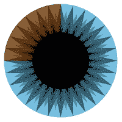
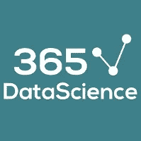
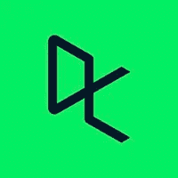

# 学习数据科学的 13 大 YouTube 渠道

> 原文：<https://towardsdatascience.com/top-13-youtube-channels-to-learn-data-science-a9883e280441?source=collection_archive---------21----------------------->

## YouTube 上的信息频道，可获取**吨关于数据科学的信息视频**

来自 [Pexels](https://www.pexels.com/photo/mokup-smartphone-technology-phone-34407/?utm_content=attributionCopyText&utm_medium=referral&utm_source=pexels) 的【freestocks.org】T2 的照片

> 数据科学是让数据变得有用的学科。

YouTube 不需要太多的介绍，我们相信你们都知道它在所有年龄段的人群中有多受欢迎。YouTube 不仅是一个巨大的娱乐宝库，也是一个同样重要的教育来源。不可否认，从 YouTube 学习最棒的一点是，获取大量教育视频不需要任何费用。

**数据科学**和许多其他类似的领域起初可能会令人望而生畏，但有了 YouTube，你可以轻松访问大量关于大量主题的教育和教学视频，包括数据科学。这篇文章背后的目标是向您介绍 YouTube 上的一系列信息频道，这些频道揭开了数据科学的复杂概念，以便您可以按照自己的节奏学习。但是在深入研究这个之前，**先看看**

**一些有趣的数据科学文章—**

 [## 2020 年必读的数据科学书籍

### 看看吧，你为什么要读它们？

towardsdatascience.com](/data-science-books-you-must-read-in-2020-1f30daace1cb)  [## 2020 年最佳数据科学博客

### 最值得信赖和享有盛誉的来源，让您了解数据科学领域的最新动态。

towardsdatascience.com](/best-data-science-blogs-to-follow-in-2020-d03044169eb4)  [## Github 上的 10 个流行数据科学资源

### 一些顶级的 GitHub 库将教你所有关于数据科学的知识。

towardsdatascience.com](/10-popular-data-science-resources-on-github-7ae288ff4a75) 

# 顶级数据科学 YouTube 频道

> 数据科学领域带来了各种科学工具、流程、算法和从结构化和非结构化数据中提取知识的系统，用于识别其中有意义的模式。

人人都爱 YouTube，对吧？但是，访问几乎成千上万的关于数据科学的信息视频，不仅涵盖基础知识，还涵盖该领域的最新进展，这难道不是很有趣吗？

在**大规模在线开放课程(mooc)**的时代，YouTube 是一个强大的平台，可以找到你的问题的答案，否则这些问题就不会出现在课程视频中。同时帮你省钱。

我们猜测到现在为止，你对这些频道的了解已经相当兴奋了，很公平，让我们不要再浪费时间，继续关注 YouTube 上专注于数据科学的频道列表。

# 1.3 蓝色 1 棕色

来源:[3 蓝色 1 棕色](https://www.youtube.com/channel/UCYO_jab_esuFRV4b17AJtAw)

*   **自:**2015 年 3 月 4 日
*   **创作者:**格兰特·桑德森
*   **浏览量:**165573366
*   用户数:322 万
*   **Youtube 链接:**[https://www.youtube.com/channel/UCYO_jab_esuFRV4b17AJtAw](https://www.youtube.com/channel/UCYO_jab_esuFRV4b17AJtAw)

**3Blue1Brown** 是格兰特·桑德森 **于 2015 年 3 月**创建的一个相当有趣的频道**，该频道**主要致力于以娱乐的方式**教授数学。**

你可能想知道为什么我们把这个频道包括在我们的列表中。嗯，这有两个原因。**首先是**，他在自己的频道上讲述了大量与数据科学领域相关的话题。这些主题包括神经网络、线性代数、傅立叶变换、微积分等。

**其次，**你在他的视频中看到的那些令人惊叹的可视化效果都是由**一个用 Python 编写的名为 [**manim**](https://github.com/3b1b/manim) 的动画引擎**创造的，这是格兰特自己创造的。3Blue1Brown 频道有超过 **100 次上传**，总计**1.65 亿次观看**。

通过他的频道，你会意识到可视化在格兰特的视频中扮演了多么重要的角色，以及 manim 库可以多么漂亮地用来创建一些光滑的视觉效果。

# 2.freeCodeCamp.org

来源:[freeCodeCamp.org](https://www.youtube.com/c/Freecodecamp/featured)

*   **自:**2014 年 12 月 17 日
*   **创作者:**昆西·拉森
*   **浏览量:**127751078
*   **订户:**272 万
*   **Youtube 链接:**[https://www.youtube.com/c/Freecodecamp/featured](https://www.youtube.com/c/Freecodecamp/featured)
*   **网址:**[https://www.freecodecamp.org/](https://www.freecodecamp.org/)

**由昆西·拉森于 2014 年 12 月**创建的**自由代码营**是一个**的非营利组织**，其使命是让人们能够编码并帮助他人。freeCodeCamp 更像是一个面向课程的频道，由一群知识渊博的人运营，他们有很强的编程背景。他们的 YouTube 频道提供各种主题的信息视频，如**数据结构、JavaScript、Python、数据科学、机器学习、** [**Node.js**](https://blog.digitalogy.co/node-js-interview-questions-and-answers/) ，迄今为止已有超过**1.27 亿次总浏览量**。

freeCodeCamp 的频道有超过 1100 个视频，其中相当大一部分是至少超过一个小时的内容和代码课程。你也可以**访问他们的网站**获取超过 6000 份关于编程和道德黑客的教程。

# **3。send ex**

来源:[send ex](https://www.youtube.com/c/sentdex/featured)

*   自:2012 年 12 月 17 日
*   创作者:哈里森·金斯利
*   **浏览人数:**87960317
*   用户数:974 千
*   **Youtube 链接:**https://www.youtube.com/c/sentdex/features
*   **网址:**[https://pythonprogramming.net/](https://pythonprogramming.net/)

**由 Harrison Kinsley 于 2012 年 12 月创建**，**send ex**涵盖了 [**机器学习**](https://blog.digitalogy.co/best-and-free-online-machine-learning-courses/) ， [**自然语言处理**](/python-libraries-for-natural-language-processing-be0e5a35dd64) ，**数据分析与可视化，以及一些带有树莓 Pi 项目的机器人项目**。

哈里森简化各种主题的清晰和解释性风格使 Sentdex 成为 YouTube 上最好的数据科学频道之一。该频道拥有超过 **1200 个视频和超过 8700 万次观看**。Harrison 对 Python 的热爱可以在他的频道上看到，因为他用 Python 讲述了大量编程主题。

他还经营着一个名为 **Python 编程教程**的网站，在那里你可以找到一个非常详细的 Python 项目的健康**集合，并看到事情是如何工作的。如果你对一个更高级的话题感兴趣，比如说神经网络，Harrison 已经**写了一本关于它的书**，名为《Python 中从头开始的**神经网络**。**

**一些与 Python 相关的有趣文章—**

 [## 2020 年你必须使用的最好的 Python IDEs 和代码编辑器

### 具有显著特性的顶级 Python IDEs 和代码编辑器

towardsdatascience.com](/best-python-ides-and-code-editors-you-must-use-in-2020-2303a53db24)  [## 给 Python 开发者的 10 个很酷的 Python 项目想法

### 您可以使用 Python 构建的有趣想法和项目列表

towardsdatascience.com](/10-cool-python-project-ideas-for-python-developers-7953047e203)  [## 2020 年必读的 Python 书籍

### 看看吧，你为什么要读它们？

towardsdatascience.com](/python-books-you-must-read-in-2020-a0fc33798bb) 

# 4.科里·斯查费

来源:科里·斯查费

*   自:2006 年 6 月 1 日
*   创作者:科里·斯查费
*   观点:47336678
*   用户数:661 千
*   **Youtube:**[https://www.youtube.com/c/Coreyms/featured](https://www.youtube.com/c/Coreyms/featured)
*   **网址:**[http://coreyms.com/](http://coreyms.com/)

科里·斯查费的 YouTube 频道主要围绕对现代程序员和研究人员至关重要的编程工具展开，包括编程的基本概念。科里频道上的视频已经获得了超过 4700 万的点击量，并且还在增加。该频道的**涵盖了一系列主题**，如**编程基础知识、Linux 教程、** [**SQL 教程**](https://www.w3schools.com/sql/) **、**[**Django**](https://www.djangoproject.com/)**等等。**

对于对数据科学感兴趣的个人，Corey 为您提供了视频播放列表，主题包括 [**【熊猫】**](https://pandas.pydata.org/)[**Matplotlib**](https://matplotlib.org/)，以及一系列入门视频 [**Python**](https://www.python.org/) 。无论您是专业环境中的编程老手，还是学习该技术的初学者，Corey 都提供了考虑到每个人技能水平的教育内容。

# 5.**蒂姆的技术**

来源:[蒂姆科技](https://www.youtube.com/c/TechWithTim/featured)

*   **自:**2014 年 4 月 23 日
*   创作者:蒂姆·鲁斯卡
*   观点:32827834
*   用户数量:466K
*   **Youtube 链接:**[https://www.youtube.com/c/TechWithTim/featured](https://www.youtube.com/c/TechWithTim/featured)
*   **网址:**[https://www.techwithtim.net/](https://www.techwithtim.net/)

**由 Tim Ruscica 于 2014 年 4 月开始**，Tim 频道上的视频更多的是**侧重于 Python 编程**总体上有一些**游戏开发使用** [**PyGame**](https://www.pygame.org/news) 、**一些机器学习的教程、**[**JavaScript**](https://www.javascript.com/)搭配一些框架。随着超过 3200 万的总浏览量，蒂姆的频道有一些关于几个主题的很酷的项目，比如 Flappy Bird 游戏，人脸识别工具，Slack bot 等等。

Tim 也做过一些**长的编码直播流，范围**从可管理的 2 小时到更累人的 12 小时。你还会在**的频道上为新开发者找到一些重要的提示和建议**以及一些编程项目想法，还有一些关于 [**Golang**](https://blog.digitalogy.co/hire-flutter-developers-flutter-app-development-company/) 和 [**Flutter**](https://blog.digitalogy.co/hire-flutter-developers-flutter-app-development-company/) 的初学者友好教程。如果你喜欢 Tim 频道上的项目，你可以在他的 GitHub repo 上找到代码[**来跟进他的一些视频。**](https://github.com/techwithtim)

# 6. **Python 程序员**

来源:贾尔斯·麦克马伦

*   自:2008 年 8 月 16 日
*   创造者:贾尔斯·麦克马伦
*   浏览人数:7，440，604
*   用户数量:229 千
*   **Youtube 链接:**[https://www.youtube.com/c/FlickThrough/featured](https://www.youtube.com/c/FlickThrough/featured)

**Giles McMullen** 在**2008 年 8 月**创建了这个频道，以**激发世界对 Python** 的兴趣，并展示他对编程语言的热爱，因此被命名为 Python 程序员。这些年来，Giles 在他的频道上覆盖了各种主题的大量教程，从更基础的初学者教程，如**Python 编程基础到** **更高级的主题，如数据科学和机器学习。**

你可以**在 Giles 的数据科学和机器学习频道上找到一些免费课程**，这些课程基本上可以让你对这些学科的核心概念有一个很强的了解。除了涵盖教育主题，Giles 还有关于[流行 Python 库](/best-python-libraries-for-machine-learning-and-deep-learning-b0bd40c7e8c)的视频，如 **Pandas、** [**NumPy**](https://numpy.org/) **、**[**Scikit-learn**](https://scikit-learn.org/)**、**以及一些方便的技巧，向程序员介绍 Python 的所有技能，或者只是一般编程

# 7.**Josh Starmer 的 stat quest**

来源: [StatQuest](https://statquest.org/)

*   自 2011 年 5 月 24 日起
*   浏览人数:17551985
*   订户:371，000
*   **Youtube 链接:**[https://www.youtube.com/c/joshstarmer/featured](https://www.youtube.com/c/joshstarmer/featured)
*   **网址:**[https://statquest.org/](https://statquest.org/)

起初只是向同事解释复杂的统计技术，很快就变成了 Josh 的热情，后来变成了 StatQuest。 **StatQuest** 消除了人们在理解现代统计学和机器学习充满的复杂术语和方法时通常面临的挑战。

由 Josh Starmer 于 2011 年 5 月创建的 StatQuest 拥有超过 180 个视频，总计有**1700 万次观看**。在频道中，您会发现一些播放列表解释了**各种基本概念，如逻辑回归、线性回归、线性模型。**您也可以访问 [StatQuest 的网站](https://statquest.org/)来查找学习指南，其中包含详细信息，有助于更好地理解子主题，如 **AdaBoost、分类树和其他一些主题。**

# 8.克里斯·纳伊克

来源:[克里斯·纳伊克](https://www.youtube.com/user/krishnaik06/)

*   自:2012 年 2 月 11 日
*   创作者:克里斯·纳伊克
*   **观点:**14703650
*   订户:262，000 人
*   **Youtube 链接:**【https://www.youtube.com/user/krishnaik06/】T4

**创建于 2012 年 2 月，克里斯·纳伊克的**频道让你探索各种主题，不仅是数据科学，还有机器学习和深度学习。如果你是数据科学领域的初学者，我们强烈建议你**从播放列表部分**开始，特别是**“完整机器学习”播放列表**。该播放列表不仅会带你完成机器学习，还会教你 Python，因为整个播放列表都是围绕编程语言 Python 展开的。

一旦你访问该频道，你会发现许多播放列表专注于几个方面和主题，如解决面试问题，增强现实，深度学习，统计学，自然语言处理等等。就数字而言，在写这篇文章的时候，Krish 的频道有超过 750 个视频，总浏览量达 1400 万。

 [## 2020 年必读的机器学习书籍

### 看看吧，你为什么要读它们？

towardsdatascience.com](/machine-learning-books-you-must-read-in-2020-d6e0620b34d7) 

# 9.布兰登·福尔茨

来源:[布兰登·福尔茨](https://www.youtube.com/user/BCFoltz)

*   自:2011 年 8 月 11 日
*   创作者:布兰登·福尔茨
*   **浏览人数:**19404551
*   订户:222，000 人
*   **Youtube 链接:**[https://www.youtube.com/user/BCFoltz](https://www.youtube.com/user/BCFoltz)
*   **网址:**[https://www.bcfoltz.com/blog/](https://www.bcfoltz.com/blog/)

在访问 Brandon Foltz 的 YouTube 频道时，你会发现一排又一排的视频，涵盖了不同主题的完整课程，如统计学、运营管理、基础会计和管理科学。布兰登的频道创建于 2011 年 8 月，仅差一点就达到了 1950 万的总浏览量，超过 200 次上传**。**

Brandon 的频道特别注重让您全面了解数据科学数学和统计学的各种概念，如线性回归、非线性回归、逻辑回归、概率、模型构建等等。

# 10.**数据学校**

来源:凯文·马卡姆

*   **自:**2014 年 5 月**1 日**
*   创作者:凯文·马卡姆
*   **浏览量:**7664313
*   **订户:** 155K
*   **Youtube 链接:**[https://www.youtube.com/c/dataschool/featured](https://www.youtube.com/c/dataschool/featured)
*   **网址:**[https://www.dataschool.io/start/](https://www.dataschool.io/start/)

**凯文·马卡姆**于 2014 年 4 月**创办了这个频道，心中只有一个目标，那就是在数据科学世界及其看似神秘的众多概念的旅程中为绝对的初学者提供指导。在开始编写代码之前，Kevin 非常重视用足够的介绍性信息涵盖每个主题的整体。**

**除了数据科学之外，Kevin 还在他的频道上涵盖了几个主题，如机器学习、数据分析和流行的 Python 库，如 **Scikit-learn、**[**DP lyr**](https://cran.r-project.org/web/packages/dplyr/vignettes/dplyr.html)**和 Pandas。**凯文的频道有**超过 90 个视频，**总观看次数超过 750 万。**

# **11.365 数据科学**

****

**来源: [365 数据科学](https://365datascience.com/)**

*   ****自:**2017 年 8 月 7 日**
*   ****浏览次数:**4991339 次浏览**
*   ****订阅用户:** 142k**
*   ****Youtube 链接:**[https://www.youtube.com/channel/UCEBpSZhI1X8WaP-kY_2LLcg](https://www.youtube.com/channel/UCEBpSZhI1X8WaP-kY_2LLcg)**
*   ****网址:**[https://365datascience.com/](https://365datascience.com/)**

****365 数据科学**始于 2017 年 8 月，是一个电子学习频道，拥有**大量与数据科学**相关主题的教育视频。他们的频道有**接近 500 万的观看量**跨越超过 **160 个视频教程**，涉及各种主题，包括机器学习、深度学习、统计学、Python、SQL 和许多其他主题。**

**他们的 YouTube 频道上的培训材料已经以易懂的方式进行了解释，同时考虑到了初学者和老手。365 数据科学的 YouTube 频道补充了他们的网站，在那里你可以报名参加他们提供的数据科学课程，以更深入地了解这个主题。**

# **12.**数据营****

****

**来源:[数据营](https://www.datacamp.com/)**

*   ****自:**2014 年 3 月25 日**
*   ****浏览人数:**55426467**
*   ****订户:** 104K**
*   ****Youtube 链接:**[https://www.youtube.com/c/Datacamp/featured](https://www.youtube.com/c/Datacamp/featured)**
*   ****网址:**[https://www.datacamp.com/](https://www.datacamp.com/)**

**数据营(Data camp)是一个平台，你可以在这里报名参加一系列精心策划的课程，从现代数据科学、[机器学习、](/a-tour-of-machine-learning-algorithms-466b8bf75c0a)、统计学、[数据可视化、](https://blog.digitalogy.co/top-r-libraries-for-data-visualization/)、编程以及许多其他主题。他们的 YouTube 频道**创建于 2014 年 3 月**，接近 1200 个视频的大关，总浏览量**超过 5500 万。****

**在他们的频道上，你会发现关于数据科学的播客，这可以让你彻底了解什么是数据科学，以及它如何造福现代世界。他们还有一堆视频，教你如何开始使用[**R 和 Python 编程语言**](/python-vs-and-r-for-data-science-4a32580846a4) 来实现以数据科学为中心的目标。您还将学习数据操作和可视化技术。如果你对这些课程感兴趣，一定要去看看他们的网站。**

# **13.**数据科学道场****

****

**来源:[数据科学道场](https://datasciencedojo.com/)**

*   ****自:**2014 年 8 月 7 日**
*   ****浏览量:**3324718**
*   ****订户:** 62.8K**
*   ****Youtube 链接:**[https://www.youtube.com/user/DataScienceDojo/featured](https://www.youtube.com/user/DataScienceDojo/featured)**
*   ****网址:**【https://datasciencedojo.com/ **

> **Dojo 这个词源于日语，翻译过来就是沉浸式学习的地方。**

**数据科学 Dojo 旨在为所有对数据科学感兴趣的人提供类似的学习体验。**创建于 2014 年 8 月，**他们的 YouTube 频道至今已有**超过 300 万的浏览量**，他们的**上传数接近 250。****

**在他们的频道上，你会找到关于 Python 和 R 的教程视频，以及关于数据挖掘和 Azure Studio 机器学习的基础视频。虽然 Data Science Dojo 已经为远程学习或现场学习提供了预先计划的课程，这可能需要更严格的时间表，但您可以使用他们的 YouTube 频道，在最适合您的时间按照您自己的进度学习数据科学。**

** [## Github 上的 10 个流行数据科学资源

### 一些顶级的 GitHub 库将教你所有关于数据科学的知识。

towardsdatascience.com](/10-popular-data-science-resources-on-github-7ae288ff4a75)** 

# **结论**

**深入 YouTube 的无意义视频的兔子洞是相当容易的，但最终，它大多被证明是浪费时间。YouTube 不仅仅是一个随意播放视频的平台，它也是一个强大的媒体，可以播放大量的教育和知识视频。**

**[数据科学](/data-science-trends-for-2020-9b2ee27af499)正在彻底改变我们使用数据的方式。如果你渴望成为其中的一员并学习数据科学，我们强烈建议你将 YouTube 添加到你的有用资源列表中。我们写下这篇文章的唯一目标是让我们的观众了解 YouTube 上一些最受欢迎的专注于数据科学的频道。**

> *****注:*** *为了消除各种各样的问题，我想提醒你一个事实，这篇文章仅代表我想分享的个人观点，你有权不同意它。***

**如果你有更多的建议，我很想听听。**

# **更多有趣的读物**

**我希望这篇文章对你有用！以下是一些有趣的读物，希望你也喜欢**

** [## 12 个适合初学者和专家的酷数据科学项目创意

### “到目前为止，您已经完成了多少个数据科学项目？”

towardsdatascience.com](/12-cool-data-science-projects-ideas-for-beginners-and-experts-fc75b5498e03)  [## 2020 年要学习的 12 大数据科学技能

### 必须用这些数据科学技能提升自己的技能

towardsdatascience.com](/top-12-data-science-skills-to-learn-in-2020-5f635d7d98bf)  [## 面向所有人的顶级谷歌人工智能工具

### 使用谷歌人工智能中心将想法变为现实

towardsdatascience.com](/top-google-ai-tools-for-everyone-60346ab7e08)  [## 2020 年人工智能工程师的顶级编程语言

### 从几种编程语言中，人工智能工程师和科学家可以挑选出适合他们需要的语言

towardsdatascience.com](/top-programming-languages-for-ai-engineers-in-2020-33a9f16a80b0)  [## 面向数据科学的顶级 Python 库

### 面向数据科学的流行 Python 库概述

towardsdatascience.com](/top-python-libraries-for-data-science-c226dc74999b) 

> ***关于作者***
> 
> ***克莱尔 D*** *。在*[***digital ogy***](https://digitalogy.co/)***—****是一个内容制作者和营销人员，这是一个技术采购和定制匹配市场，根据全球各地的特定需求，将人们与预先筛选的&顶尖开发人员和设计师联系起来。与我连线上* [***中***](https://medium.com/@harish_6956)**[***Linkedin***](https://www.linkedin.com/in/claire-d-costa-a0379419b/)***&***[***推特***](https://twitter.com/ClaireDCosta2) ***。*******