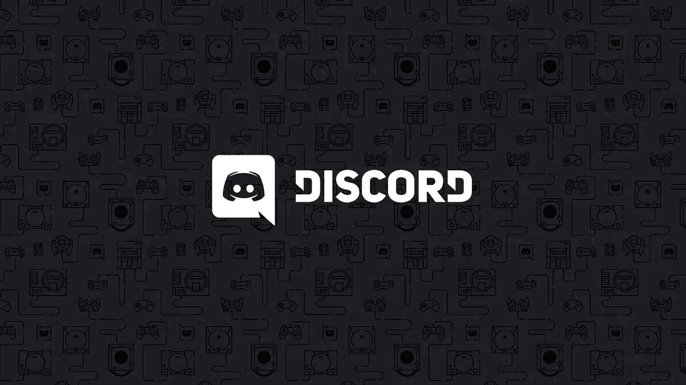

# 20 大数据科学不和谐服务器

> 原文：<https://towardsdatascience.com/top-20-data-science-discord-servers-to-join-in-2020-567b45738e9d?source=collection_archive---------5----------------------->

## 数据科学|不和谐

## 去见其他伟大的数据科学家，一起学习



Discordapp.com

如果你以前从未听说过[不和](https://medium.com/u/fddf6af2df19?source=post_page-----567b45738e9d--------------------------------)，那么你很可能不是一个游戏玩家。但这种情况即将改变。最初，Discord 被构建为一个实时社交平台，游戏玩家可以在这个平台上团结起来，互相交流。但现在,“不和谐”已经成为影响者、YouTubers、memers 以及基本上任何人与他们的社区联系的重要工具。

## 什么是不和谐

对我来说，我会说 Discord 是 Skype 和 Reddit、Telegram、Twitter 等社交平台的混合，但没有所有的噪音，加上它自己的独特功能和更干净、更快的用户界面。

> [不和谐音](https://discordapp.com/company)。说它现在有超过 2 . 5 亿的注册用户，比一年前的 1 . 3 亿有所增加，并且每天有 8 . 5 亿条信息被交换。聊了这么多。

虽然虚拟聚会现在有许多角落，人们可以谈论任何事情(从书籍到网飞的电视节目)，但似乎人工智能、机器学习和数据科学也进入了 Discord 服务器，数据科学爱好者和专家聚集在一起分享各种事情，从解决多变量微积分和从头制作神经网络到漫谈如何获得数据科学家的工作以及数据科学家在未来几十年将如何被机器学习取代。

## 如何使用它

如果你以前从未使用过不和谐，你不知道如何开始，不要担心。超级好用。

在这里注册 Discord [之后](https://discordapp.com/)，你可以加入不同的服务器，类似于使用自定义邀请链接的 slack channels，你将在本文后面的每个服务器下面看到。每台服务器代表一个社区，您可以直观地在它们之间切换。

在服务器内部，你会在服务器图标旁边看到一个标签列表(频道)，聊天在中间，服务器成员在最右边。你也可以选择不使用服务器与你的朋友进行私人对话。

想要更深入地了解如何使用 Discord，请看这个[视频](https://www.youtube.com/watch?v=LDVqruRsYtA)。

## 为什么使用不和谐

你可能会问，如果你对 Twitter 和 Reddit 感到舒适，为什么要开始使用这个神秘的紫色聊天平台呢？嗯，原因如下。

Discord 是一个开放式的平台，你可以提出各种各样的问题和询问，以满足你的好奇心。许多有影响力的人和 YouTubers，如 Ninja、Try Guys 和 Philip DeFranco 都喜欢使用 Discord，因为他们喜欢这个以社区为中心的平台和它提供的以隐私为中心的体验。

> Discords 的一些好处包括:
> 1。高度可定制—私人和公共频道、角色、颜色等
> 2。私人
> 3。面向聊天

Discord 是一个与人谈论你关心的事情的地方，你可以以任何方式与任何人交往，无论是进行辩论还是分享对模因和笑话的兴趣。

现在你已经了解了什么是 Discord，这里有一个 Discord 上的服务器列表，你可以在这里提出任何关于 AI、ML、数据科学等方面的问题。数据科学不是在公园里散步，你必须在学习如何编码的同时解决困难的统计和概率概念，更不用说你必须掌握的沟通技巧了。

不和谐是一个很好的地方，让你找到一个朝着同一目标努力的社区，它可以激励你超越自己的极限。

所以，今天就开始使用 discord，加入这些令人惊叹的数据科学服务器吧！

> 我写关于数据科学和人工智能的文章。如果你想在我发帖时得到通知，现在就订阅我的媒体简讯！
> 
> 如果你不是普通会员，可以考虑今天就订阅，只需 5 美元。你将直接支持我，你将获得大量的优秀作品！

# 服务器列表

```
· [General](#b21c)
  ∘ [1\. Science and Technology](#3679)
  ∘ [2\. Everything Hub](#d0e0)
· [Hacking Skills](#3ff8)
  ∘ [3\. Programming](#43c5)
  ∘ [4\. The Programming Hangout](#510e)
  ∘ [5\. The Programming Server](#d244)
  ∘ [6\. CS50](#5d21)
  ∘ [7\. The Coding Den](#de08)
  ∘ [8\. Python](#9f34)
  ∘ [9\. Planet: Code](#b680)
  ∘ [10\. CP Community](#cefe)
  ∘ [11\. #100DaysOfCode](#a947)
· [Data Science](#d063)
  ∘ [12\. Towards Data Science](#6d7b)
  ∘ [13\. Data Science](#2e0e)
  ∘ [14\. CS Dojo](#9051)
· [Projects/Tutorials](#41d1)
  ∘ [15\. Tech with Tim](#392c)
  ∘ [16\. Sentdex](#241e)
· [ML and AI](#4bae)
  ∘ [17\. /r/LearnMachineLearning](#e6ea)
  ∘ [18\. Fundamentals of ML](#0b35)
  ∘ [19\. Artificial Intelligence Community](#6ddd)
  ∘ [20\. TensorFlow](#99a9)
  ∘ [21\. Learn AI Together](#2573)
```

# 一般

数据科学是一个多学科领域，需要从流行病学到金融等各个领域的知识。因此，加入这些服务器将为你未来的努力提供不同种类的信息。

## 1.科学与技术

致力于科学探索和技术创新的社区！一个分享科学讨论、研究和会见对科学学术界感兴趣的新的和类似的个人的地方。

[](https://discord.gg/science) [## 加入科技不和谐服务器！

### 查看 Discord 上的科技社区—与 12，743 名其他成员一起闲逛，享受自由的声音和…

不和谐. gg](https://discord.gg/science) 

## 2.一切枢纽

名字说明了一切。这台服务器几乎拥有一切，从动物、运动、电影到技术和编程。

[](https://discord.gg/ecJcuGA) [## 加入一切枢纽不和服务器！

### 查看 Discord 上的 Everything Hub 社区-与 712 名其他成员一起玩，享受免费的语音和文本聊天。

不和谐. gg](https://discord.gg/ecJcuGA) 

# 黑客技能

数据科学涉及到大量的编码工作，提高编码技能的一种方法是提问(并从 StackOverflow 获得答案)。所有这些服务器都包含狂热的程序员和黑客，他们可以回答你向他们提出的任何问题。问吧！

## 3.编程；编排

围绕各种编程语言、操作系统以及硬件、安全性和低级编程的活跃社区。

[](https://discordapp.com/invite/010z0Kw1A9ql5c1Qe) [## 加入编程不和谐服务器！

### 查看 Discord 上的编程社区—与 11，404 名其他成员一起闲逛，享受免费的语音和文本聊天。

discordapp.com](https://discordapp.com/invite/010z0Kw1A9ql5c1Qe) 

## 4.节目常去的地方

面向编程的社区。TPH 为各类程序员留有一席之地，从完全的初学者到拥有 20 年经验的专家。

[](https://discord.gg/programming) [## 加入程序员的 Hangout Discord 服务器！

### 查看 Discord 上的程序员社区——与 41，211 名其他成员一起玩，享受自由之声…

不和谐. gg](https://discord.gg/programming) 

## 5.编程服务器

拥有数学、ML 和 AI、数据科学和网络安全渠道的编程服务器。初学者询问数据科学相关问题的地方。

[](https://discord.gg/zrrya7H) [## 加入编程服务器 Discord Server！

### 查看 Discord 上的编程服务器社区——与 874 名其他成员一起闲逛，享受免费语音和…

不和谐. gg](https://discord.gg/zrrya7H) 

## 6.CS50

计算机科学课程最受欢迎的介绍之一，现在在 Discord 上。跟上他们的最新课程，并与这里的聪明人保持联系！

[](https://discord.gg/E7AAncA) [## 加入 cs50 Discord 服务器！

### 在 Discord 上查看 cs50 社区—与 24，828 名其他成员一起闲逛，享受免费语音和文本聊天。

不和谐. gg](https://discord.gg/E7AAncA) 

## 7.编码室

一个可以自由向其他编码员/程序员寻求帮助的地方，或者任何与编码相关的问题。堆栈溢出和 r/coding /r/ programming 等子编辑之间的混搭。

[](https://discord.gg/code) [## 加入编码巢穴不和服务器！

### 你的代码需要帮助吗？想成为友好的编程社区的一员吗？如果是这样的话，TCD 是适合你的地方…

不和谐. gg](https://discord.gg/code) 

## 8.计算机编程语言

一个围绕 Python 编程语言的巨大社区，对那些希望学习该语言或提高技能的人以及那些希望帮助他人的人开放。

[](https://discord.gg/python) [## 加入 Python Discord 服务器！

### 专注于 Python 编程语言，我们相信任何人都可以学习编码，并致力于新手开发者…

不和谐. gg](https://discord.gg/python) 

## 9.星球:代码

针对特定编程语言问题的服务器，如 c、CPP、java、python、SQL 等。

[](https://discord.gg/MyRxEUG) [## 加入星球:代码不和谐服务器！

### 查看星球:不和谐代码社区——与 1，576 名其他成员一起玩，享受免费语音和文本聊天。

不和谐. gg](https://discord.gg/MyRxEUG) 

## 10. **CP 社区**

一个有竞争力的程序员社区，程序员在这里向代码团队提问。有一个初级题和数学的频道。

[](https://discord.gg/5tAk8V8) [## 加入 CP 社区 Discord 服务器！

### 在 Discord 上查看 CP 社区社区-与 12，992 名其他成员一起闲逛，享受免费语音和文本…

不和谐. gg](https://discord.gg/5tAk8V8) 

## 11.#100DaysOfCode

臭名昭著的#100 天代码，专注的程序员承诺每天编码 100 天，并发布在 twitter 上。在这个服务器上与其他热心的程序员联系！

[](https://discord.gg/p6WadTP) [## 加入#100DaysOfCode Discord 服务器！

### 查看 Discord 上的#100DaysOfCode 社区——与 720 名其他成员一起闲逛，享受免费的语音和文本聊天。

不和谐. gg](https://discord.gg/p6WadTP) 

# 数据科学

## 12.走向数据科学

一个由社区驱动、维护和管理的项目，不是 [TDS](https://medium.com/u/7e12c71dfa81?source=post_page-----567b45738e9d--------------------------------) 组的正式扩展。询问数据科学问题以及在整个学习过程中获取资源的绝佳服务器。

[](https://discordapp.com/invite/eaPVRW3) [## 加入数据共享 Discord 服务器！

### 查看 Discord 上的数据共享社区—与 1，666 名其他成员一起玩，享受免费语音和文本…

discordapp.com](https://discordapp.com/invite/eaPVRW3) 

## 13.数据科学

一个由数据科学专业人士和爱好者组成的社区。探索该领域的所有不同方面，从可视化和通信到数据工程和模型部署。无论你是学者、学生还是业余爱好者，我们都欢迎！

[](https://discordapp.com/invite/UYNaemm) [## 加入数据科学 Discord 服务器！

### 查看 Discord 上的数据科学社区—与 1，404 名其他成员一起闲逛，享受免费的语音和文本聊天。

discordapp.com](https://discordapp.com/invite/UYNaemm) 

## 14.CS 道场

CS Dojo 是一个知名的谈论编程相关东西的 YouTuber。加入他的大型社区，在那里讨论编程、游戏开发、网页开发、人工智能和人工智能、数据科学等。是制造出来的。

[](https://discord.gg/NTK2TrM) [## 加入 CS 道场 Discord 服务器！

### 查看 Discord 上的 CS Dojo 社区-与 4，667 名其他成员一起玩，享受免费的语音和文本聊天。

不和谐. gg](https://discord.gg/NTK2TrM) 

# 项目/教程

这些是 YouTubers 用户的服务器，他们为 Python，机器学习，神经网络等等的教程制作惊人的视频。有蒂姆和[森德克斯](https://www.youtube.com/user/sentdex)的 YouTubers】科技是特色。

## 15.蒂姆的技术

与 Tim 爱好者联系，在那里你可以提出问题、项目建议、python、pygame、机器学习和人工智能。

[](https://discord.gg/DphySVr) [## 加入蒂姆不和谐服务器的技术！

### 在 Discord 上查看 Tim 社区的技术-与 3，887 名其他成员一起闲逛，享受免费语音和文本…

不和谐. gg](https://discord.gg/DphySVr) 

## 16.Sentdex

Sentdex 的社区主要由 Python 程序员组成，但也欢迎其他人加入。#help 频道非常有用。

[](https://discord.gg/YA764TH) [## 加入 Sentdex Discord 服务器！

### 查看 Discord 上的 Sentdex 社区-与 23，279 名其他成员一起闲逛，享受免费的语音和文本聊天。

不和谐. gg](https://discord.gg/YA764TH) 

# ML 和 AI

这些服务器是为那些需要问机器学习和人工智能问题的人准备的。对这群想和你达成同样目标的人保持激励，并互相分享知识。

## 17./r/learn 机器学习

一个伟大的社区，所有人都是友好的 ML 爱好者，他们愿意帮助每个人，甚至是完全的初学者。还有臭名昭著的吴恩达机器学习课程和 fast.ai 深度学习课程的自习室。

 [## 加入/r/LearnMachineLearning Discord 服务器！

### 查看 Discord 上的/r/LearnMachineLearning 社区——与 6，910 名其他成员一起玩，享受自由的声音和…

不和谐. gg](https://discord.gg/R8Bcbf4) 

## 18.ML 基础

一个询问关于 ML 的一切的地方，从基本的线性回归到神经网络。

[](https://discord.gg/pQFXHK4) [## 加入基本面 ML 不和谐服务器！

### 在 Discord 上查看基础 ML 社区-与 154 个其他成员一起玩，享受免费语音和文本…

不和谐. gg](https://discord.gg/pQFXHK4) 

## 19.人工智能社区

一个人工智能爱好者的社区，主要渠道包括机器学习、语言处理、视觉和语音等。

[](https://discord.gg/HFVStFk) [## 加入人工智能社区 Discord 服务器！

### 查看 Discord 上的人工智能社区——与其他 432 名成员一起玩，享受免费的…

不和谐. gg](https://discord.gg/HFVStFk) 

## 20.[张量流](https://medium.com/u/b1d410cb9700?source=post_page-----567b45738e9d--------------------------------)

Tensorflow 是一个端到端的开源机器学习平台。如果您想开始使用 Tensorflow，请先加入此服务器。

[](https://discordapp.com/invite/7a8PCRh) [## 加入 TensorFlow Discord 服务器！

### 在 Discord 上查看 TensorFlow 社区—与 1，314 名其他成员一起闲逛，享受免费语音和文本聊天。

discordapp.com](https://discordapp.com/invite/7a8PCRh) 

## 21.一起学 AI

“一起学习人工智能”是一个非常不和谐的服务器，有近 4000 名人工智能爱好者共享论文，项目，kaggle 竞赛，课程等等。这对任何对人工智能感兴趣的人来说都是一个很好的补充，并且是学习人工智能社区的一部分。

[](https://discord.gg/learnaitogether) [## 加入一起学习 AI 不和谐服务器！

### 一起学习，提问，寻找 Kaggle 队友，分享你的项目，等等。都和 AI 有关！| 3,731…

不和谐. gg](https://discord.gg/learnaitogether) 

# 行动计划


由[马丁·杰恩伯格](https://unsplash.com/@martinjernberg?utm_source=medium&utm_medium=referral)在 [Unsplash](https://unsplash.com?utm_source=medium&utm_medium=referral) 上拍摄

iscord 服务器令人惊叹，你不仅可以拥有一个分享相同激情和目标的社区，还可以提出各种问题，并在瞬间得到答案。成为这样的社区的一部分很重要，因为数据科学真的很难独自学习。与教科书上的东西相比，其他人的见解和经验是至关重要的。

这是人们最纠结的数据科学的理论部分，尤其是在数学和编程方面。有一个友好和乐于助人的社区，你成为数据科学家的旅程会更顺利。

所以，如果你还没有不和谐，尝试一下。并且开始提问，也回答别人的问题，因为[提问](https://hbr.org/2010/02/learn-to-ask-better-questions)证明你确实在学习，而不是假装知道什么。

> “永远不要让恐惧阻止你问一些你不了解或不知道的问题。假装或表现得好像你知道是不明智的。”
> 
> 凯瑟琳·脉动者

感谢阅读这篇文章，我希望它启发你开始使用不和谐。

请在下面留下您想要分享的任何其他服务器的评论！

## 查看这些关于数据科学资源的文章。

[](/top-20-youtube-channels-for-data-science-in-2020-2ef4fb0d3d5) [## 2020 年你应该订阅的 25 大数据科学 YouTube 频道

### 以下是你应该关注的学习编程、机器学习和人工智能、数学和数据的最佳 YouTubers

towardsdatascience.com](/top-20-youtube-channels-for-data-science-in-2020-2ef4fb0d3d5) [](/top-20-free-data-science-ml-and-ai-moocs-on-the-internet-4036bd0aac12) [## 互联网上 20 大免费数据科学、ML 和 AI MOOCs

### 以下是关于数据科学、机器学习、深度学习和人工智能的最佳在线课程列表

towardsdatascience.com](/top-20-free-data-science-ml-and-ai-moocs-on-the-internet-4036bd0aac12) [](https://medium.com/swlh/top-20-websites-for-machine-learning-and-data-science-d0b113130068) [## 机器学习和数据科学的 20 大网站

### 这里是我列出的最好的 ML 和数据科学网站，可以提供有价值的资源和新闻。

medium.com](https://medium.com/swlh/top-20-websites-for-machine-learning-and-data-science-d0b113130068) [](/the-best-book-to-start-your-data-science-journey-f457b0994160) [## 开始数据科学之旅的最佳书籍

### 这是你从头开始学习数据科学应该读的书。

towardsdatascience.com](/the-best-book-to-start-your-data-science-journey-f457b0994160) [](/top-20-podcasts-for-data-science-83dc9e07448e) [## 数据科学 20 大播客

### 面向数据爱好者的最佳数据科学播客列表。

towardsdatascience.com](/top-20-podcasts-for-data-science-83dc9e07448e) 

# 联系人

如果你想了解我的最新文章[，请通过媒体](https://medium.com/@benthecoder07)关注我。

请关注我:

*   [领英](https://www.linkedin.com/in/benthecoder/)
*   [推特](https://twitter.com/benthecoder1)
*   [GitHub](https://github.com/abhinavsagar)
*   [Reddit](https://www.reddit.com/user/benthecoderX)

快乐的不和谐！