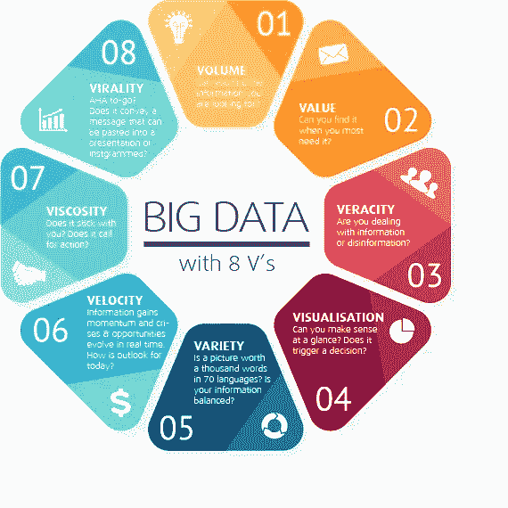

# 大数据和数据科学的 20 大最新研究问题

> 原文：<https://towardsdatascience.com/top-20-latest-research-problems-in-big-data-and-data-science-c6fb51e03136?source=collection_archive---------2----------------------->

## 5 类问题陈述、研究方法和研究实验室

尽管截至 2020 年，大数据已经成为运营的主流，但研究人员仍然可以解决一些潜在的问题或挑战。其中一些问题与数据科学领域重叠。在本文中，根据我的个人经验(考虑到我所在组织的知识产权)和这些领域的最新趋势，涵盖了大数据和数据科学结合中最有趣的 20 个最新研究问题[1，2]。这些问题涵盖在 ***5 个不同的类别下，*** 即

> 处理规模的核心大数据领域
> 
> 处理数据中的噪音和不确定性
> 
> 安全和隐私方面
> 
> 数据工程
> 
> 大数据和数据科学的交汇点
> 
> *本文还涵盖了解决特定问题的* ***研究方法*** *以及在这些领域开展工作的* ***顶级研究实验室*** *以供参考。*

我鼓励研究人员解决将对整个社会产生更大影响的应用研究问题。强调这一点的原因是，我们几乎没有分析 1%的可用数据。另一方面，我们每天都在产生[万亿字节的数据](https://www.datanami.com/2019/07/24/domos-latest-data-never-sleeps-infographic-just-how-much-data-are-we-generating-now/)。这些问题不是特定于某个领域的，而是可以跨领域应用的。

我先来介绍一下 ***大数据的 8v***(基于 [Elena](https://www.kdnuggets.com/2019/04/3-big-problems-big-data.html) 的一篇有趣文章)，即体量、价值、准确性、可视化、多样性、速度、粘性、病毒式。如果我们仔细观察图 1 中各个 V 的问题，它们引发了研究人员的兴趣点。即使它们是商业问题，也有潜在的研究问题。比如 02-Value:“最需要的时候能找到吗？”有资格分析可用数据，并在需要时给出上下文相关的答案。

图 1: 8V 大数据提供: [Elena](https://www.kdnuggets.com/2019/04/3-big-problems-big-data.html)

理解了大数据的 8V 之后，让我们来看看要解决的研究问题的细节。**通用大数据研究主题的台词是:**

*   **可扩展性—并行数据处理的可扩展架构**
*   **实时大数据分析—文本、图像和视频的流数据处理**
*   **用于大数据采用和分析的云计算平台—降低云中复杂分析的成本**
*   **安全和隐私问题**
*   **高效存储和转移**
*   **如何有效地对不确定性建模**
*   **图形数据库**
*   **用于大数据分析的量子计算**

> **接下来，让我涵盖上面提到的五个类别中的一些具体研究问题。**
> 
> **与**核心大数据区处理规模相关的问题:-****

1.  *****可扩展的并行数据处理架构:*****

**Hadoop 或 Spark 类环境用于离线或在线处理数据。行业正在寻找可扩展的架构来执行大数据的并行数据处理。近年来有了很大的进步，但是，还有巨大的潜力来提高性能。**

**2. ***在分布式云中处理实时视频分析:*****

**随着互联网的普及，甚至在发展中国家，视频已成为数据交换的常用媒介。在这方面，电信基础设施、运营商、物联网(IoT)的部署和闭路电视都发挥了作用。能否以低延迟和更高的准确性增强现有系统？一旦实时视频数据可用，问题是如何将数据传输到云，如何在边缘和分布式云中高效处理数据？**

**3. ***大规模高效图形处理:*****

**社交媒体分析就是这样一个需要高效图形处理的领域。图表数据库在大数据分析中的作用在参考文章[4]中有广泛介绍。大规模的有效图形处理仍然是一个迷人的问题。**

> ****处理数据中的噪声和不确定性的研究问题:-****

**4. ***近实时识别假新闻:*****

**随着假新闻像病毒一样以爆发式方式传播，实时、大规模地处理假新闻是一个非常紧迫的问题。这些数据可能来自 Twitter 或虚假网址或 WhatsApp。有时，它可能看起来像一个经过认证的来源，但仍然可能是假的，这使得解决问题更有趣。**

**5. ***大规模数据的降维方法:*****

**人们可以扩展现有的降维方法来处理大规模数据或提出新的方法。这也包括可视化方面。人们可以使用现有的开源贡献来开始并回馈开源。**

**6. ***在嘈杂环境和不完全数据下的训练/推理*** :**

**有时，人们可能得不到输入数据的完整分布，或者数据可能由于噪声环境而丢失。可以通过过采样、合成少数过采样技术(SMOTE)或使用生成式对抗网络(GANs)以有意义的方式扩充数据吗？增强有助于提高性能吗？如何训练和推断是需要解决的挑战。**

**7. ***处理大数据处理中的不确定性:*****

**有多种方法可以处理大数据处理中的不确定性[4]。这包括子主题，例如如何从低准确性、不完整/不精确的训练数据中学习。当数据量很大时，如何处理未标记数据的不确定性？我们可以尝试使用主动学习、分布式学习、深度学习和模糊逻辑理论来解决这些问题。**

> ****安全** **和隐私**【5】领域的研究问题:-**

**8. ***超大规模系统的异常检测:*****

**异常检测是一个非常标准的问题，但在大规模实时应用中却不是一个微不足道的问题。应用领域的范围包括医疗保健、电信和金融领域。**

**9. ***大规模系统中敏感领域的有效匿名*** *:***

**让我举一个医疗系统的例子。如果我们有一个胸部 x 光图像，它可能包含 PHR(个人健康记录)。在一个大规模的系统中，如何匿名敏感领域以接近实时地保护隐私？这也可以应用到其他领域，主要是为了保护隐私。**

**10. ***真实世界应用的安全联邦学习:*****

**联邦学习能够对分散数据进行模型训练。如果由于法规/隐私问题而无法共享数据，但仍然需要在本地构建模型，然后跨边界共享模型，则可以采用这种方法。我们是否还能让联合学习大规模运行，并通过标准的软件/硬件级别的安全性来确保它的安全性，这是下一个需要解决的挑战。感兴趣的研究人员可以从 UCB 的 RISELab 获得这方面的更多信息。**

**11. ***大数据上可扩展的隐私保护:*****

**大规模数据的隐私保护是一个具有挑战性的研究问题，因为其应用范围从文本、图像到视频不尽相同。国家/地区级别隐私法规的差异将使问题更难处理。**

> **与**数据工程**方面相关的研究问题**

**12. ***轻量级大数据分析即服务:*****

**一切提供即服务是行业的新趋势，如软件即服务(SaaS)。我们能否致力于提供轻量级大数据分析服务？**

**13. ***自动转换算法到 MapReduce 问题:*****

**MapReduce 是大数据中众所周知的编程模型。它不仅仅是一个 map 和 reduce 函数，还为应用程序提供了可伸缩性和容错性。但是直接支持 map-reduce 的算法并不多。我们能建立一个库来自动转换标准算法以支持 MapReduce 吗？**

**14. ***火花簇的自动化部署:*****

**最近 spark 集群的使用取得了很大的进步，但是它们还没有完全为自动化部署做好准备。这是另一个需要进一步探索的挑战性问题。**

> ****大数据与数据科学交叉的研究问题:-****

**15.**用较少的数据样本使模型学习的方法:****

**在过去的 10 年里，随着更多数据和计算能力的可用性，深度学习模型的复杂性增加了。一些研究人员自豪地声称，他们在深度学习中解决了一个有数百层的复杂问题。例如，图像分割可能需要 100 层网络来解决分割问题。然而，最近的趋势是，有人能用较少的相关数据和较少的复杂性解决同样的问题吗？这种想法背后的原因是在边缘设备上运行模型，而不仅仅是在使用 GPU/TPU 的云环境中。例如，在大数据上训练的深度学习模型可能需要部署在闭路电视/无人机中以供实时使用。这从根本上改变了解决复杂问题的方法。你可以在这个副题中解决挑战性的问题。**

**16.**神经机器翻译为本地语言:****

**人们可以使用谷歌翻译进行神经机器翻译(NMT)活动。然而，在政府的支持下，当地大学有很多研究用当地语言进行神经机器翻译。变压器双向编码器表示(BERT)的最新进展正在改变解决这些问题的方式。人们可以通过合作来解决现实世界的问题。**

**17.**处理现实世界应用的数据和模型漂移:****

**如果我们知道数据模式在变化，模型的性能会下降，我们需要对推理数据运行模型吗？甚至在将数据传递给模型之前，我们能识别数据分布中的漂移吗？如果一个人可以识别漂移，为什么要传递模型推断的数据，浪费计算能力。这是一个迫切需要在现实世界中大规模解决的研究问题。主动学习和在线学习是解决模型漂移问题的一些方法。**

**18.**在实时应用中处理深度学习模型的可解释性:****

**可解释的人工智能是最近的热门词汇。可解释性是可解释性的子集。机器/深度学习模型不再是黑箱模型。像决策树这样的模型很少是可以解释的。但是，如果复杂性增加，基础模型本身可能无法解释结果。我们可能需要依赖替代模型，如局部可解释模型不可知解释(LIME) / SHapley 附加解释(SHAP)来解释。这可以帮助决策者证明所产生结果的合理性。例如，拒绝贷款申请或将胸透归类为新冠肺炎阳性。可解释模型能处理大规模实时应用吗？**

**19.**构建上下文相关的大型系统:****

**构建大规模上下文相关系统是最新的趋势。有一些开源的努力来启动。然而，它需要大量的努力来收集正确的数据集，并建立上下文敏感的系统来提高搜索能力。如果你有搜索、知识图和自然语言处理(NLP)的背景，你可以在这个主题中选择一个研究问题。这适用于所有领域。**

**20.**构建基于大规模生成的会话系统(聊天机器人框架):****

**一个获得动力的特定领域是建立对话系统，如问答和聊天机器人生成系统。有很多聊天机器人框架可用。使它们具有生成性并在实时对话中准备摘要仍然是具有挑战性的问题。随着规模的扩大，问题的复杂性也在增加。这个领域正在进行大量的研究。这需要很好地理解自然语言处理和最新的进展，如来自变压器的双向编码器表示(BERT)，以扩大对话系统可以大规模解决的范围。**

# **研究方法:**

**希望你能从上面强调的主题中 ***用你的领域和技术专长*** 框出具体的问题。让我来推荐一种方法来解决这些问题。有些观点对研究人员来说可能是显而易见的，但是，为了让更多的读者感兴趣，让我来介绍一下这些观点:**

****确定你的核心优势**无论是在理论、实现、工具、安全，还是在特定领域。你可以在做研究的时候获得其他新技能。用合适的数据确定正确的研究问题差不多达到了里程碑的 50%。这可能与其他技术领域重叠，如物联网(IoT)、人工智能(AI)和云。你对研究的热情将决定你能在解决这个问题上坚持多久。趋势是跨部门的跨学科研究问题。因此，人们可以选择一个特定的领域来应用大数据和数据科学的技能。**

****文献调查**:我强烈建议只关注经认证的出版物，如 IEEE、ACM、Springer、Elsevier、Science direct 等……不要落入“国际期刊”的陷阱，这些出版物没有经过同行评议。请不要将文献调查仅限于 IEEE/ACM 论文。许多有趣的论文可以在 arxiv.org 的[和](https://arxiv.org/)[论文中找到，论文代码为](https://paperswithcode.com/)。人们需要根据入围的主题检查/跟踪行业和学术界的顶级研究实验室。这提供了最新的研究更新，并有助于确定需要填补的空白。**

****实验室生态系统**:创造良好的实验室环境，开展强有力的研究。这可以是在你的研究实验室里，与学术界的教授、博士后、博士、硕士和本科生在一起，或者与工业界的高级、初级研究人员在一起。拥有正确的伙伴关系是合作的关键，你也可以尝试虚拟团体。拥有良好的生态系统可以提高结果，因为一个人可以挑战其他人进一步改善结果的方法。**

****通过正确的途径发表:**正如文献调查中提到的，在正确的论坛上发表*研究论文*，在那里你将收到来自世界各地专家的同行评议。在这个过程中，我们可能会遭到拒绝。然而，只要你收到了建设性的反馈，你就应该感谢匿名评论者。如果方法新颖、非显而易见且有创造性，你可能会看到申请专利的潜在机会。最近的趋势是在发表论文的同时开源代码。如果您的机构允许它开源，您可以通过在 Github 中上传相关代码，并附上适当的许可条款和条件。**

# **值得关注的顶级研究实验室:**

**其中一些研究领域活跃在全球顶尖的研究中心。我请求你们遵循这些建议，找出进一步的差距，以便继续开展工作。以下是全球大数据+数据科学领域的一些顶级研究中心:**

**[美国柏克莱大学 RISE 实验室](https://rise.cs.berkeley.edu/)**

**[英国爱丁堡大学数据科学博士研究中心](http://datascience.inf.ed.ac.uk/research/)**

**[美国哥伦比亚大学数据科学研究所](https://datascience.columbia.edu/ten-research-challenge-areas-data-science)**

**[美国约翰·霍普斯金大学数据密集型工程与科学研究所](https://idies.jhu.edu/research/)**

**[脸书数据科学研究](https://research.fb.com/category/data-science/)**

**[英国牛津大学大数据研究所](https://www.bdi.ox.ac.uk/research)**

**[美国奥斯汀德克萨斯大学大数据分析中心](https://bigdata.oden.utexas.edu/projects/)**

**[美国奥克兰大学数据科学和大数据分析中心](https://oakland.edu/research/centers/datascience)**

**[瑞士苏黎世联邦理工学院机器学习研究所](https://ml.inf.ethz.ch/)**

**英国艾伦·图灵研究所**

**[IISc 计算和数据科学研究](http://cds.iisc.ac.in/research/research-areas/)**

**[美国卡内基梅隆大学数据实验室](https://datalab.heinz.cmu.edu/research/)**

> **如果你想继续你在大数据方面的学习，我有以下建议:**

**[Coursera 大数据专业化](https://www.coursera.org/specializations/big-data)**

**[加州大学圣地亚哥分校的大数据课程](https://digitallearning.ucsd.edu/catalog/courses/big-data.html)**

**根据你的需要，你可以从《印度分析》杂志的总结文章中挑选出前 10 本书。**

# **数据挑战:**

**在解决现实问题的过程中，人们可能会遇到与数据相关的挑战:**

*   **可用数据中的 ***相关*** 数据是什么？**
*   **缺乏数据隐私法规的国际标准**
*   **《通用数据保护条例》( GDPR)是一种跨国家的法规**
*   **遵守规则的联合学习概念——人们可以构建模型并共享，但数据仍然属于国家/组织。**

# **结论:**

**在本文中，我简要介绍了大数据研究问题，并列出了 2020 年大数据和数据科学的 20 个最新研究问题。这些问题被进一步分为 5 类，以便研究人员可以根据他们的兴趣和技能来解决问题。这份清单绝非详尽无遗。但是，我希望这些输入可以激发你们中的一些人解决大数据和数据科学中的真正问题。我在[网络研讨会](https://www.youtube.com/watch?v=maZonSZorGI)中介绍了这些要点以及大数据的一些背景知识，供您参考[7]。你可以参考我的另一篇文章，其中列出了新冠肺炎数据科学需要解决的问题[8]。 ***让我们一起来用科技建设一个更美好的世界。*****

# **参考资料:**

**[1][https://www . Gartner . com/en/news room/press-releases/2019-10-02-Gartner-reveals-five-major-trends-shaping-the-evoluti](https://www.gartner.com/en/newsroom/press-releases/2019-10-02-gartner-reveals-five-major-trends-shaping-the-evoluti)**

**[2][https://www . Forbes . com/sites/louiscumbus/2019/09/25/whats-new-in-Gartner-hype-cycle-for-ai-2019/# d 3 EDC 37547 bb](https://www.forbes.com/sites/louiscolumbus/2019/09/25/whats-new-in-gartners-hype-cycle-for-ai-2019/)**

**[3][https://arxiv.org/ftp/arxiv/papers/1705/1705.04928.pdf](https://arxiv.org/ftp/arxiv/papers/1705/1705.04928.pdf)**

**[4][https://www . xenon stack . com/insights/graph-databases-big-data/](https://www.xenonstack.com/insights/graph-databases-big-data/)**

**[5][https://journalofbigdata . springer open . com/articles/10.1186/s 40537-019-0206-3](https://journalofbigdata.springeropen.com/articles/10.1186/s40537-019-0206-3)**

**[6][https://www . rd-alliance . org/group/big-data-ig-data-security-and-trust-WG/wiki/big-data-security-issues-challenges-tech-concerns](https://www.rd-alliance.org/group/big-data-ig-data-security-and-trust-wg/wiki/big-data-security-issues-challenges-tech-concerns)**

**[7]https://www.youtube.com/watch?v=maZonSZorGI**

**[8][https://medium . com/@ sunil . vuppala/ds 4 covid-19-用数据科学解决什么问题-新冠肺炎-a997ebaadaa6](https://medium.com/@sunil.vuppala/ds4covid-19-what-problems-to-solve-with-data-science-amid-covid-19-a997ebaadaa6)**

**选择正确的研究问题，运用你的技能去解决它。祝一切顺利。请在评论区分享您的反馈。如果您遇到这方面的更多主题，请随时添加。**