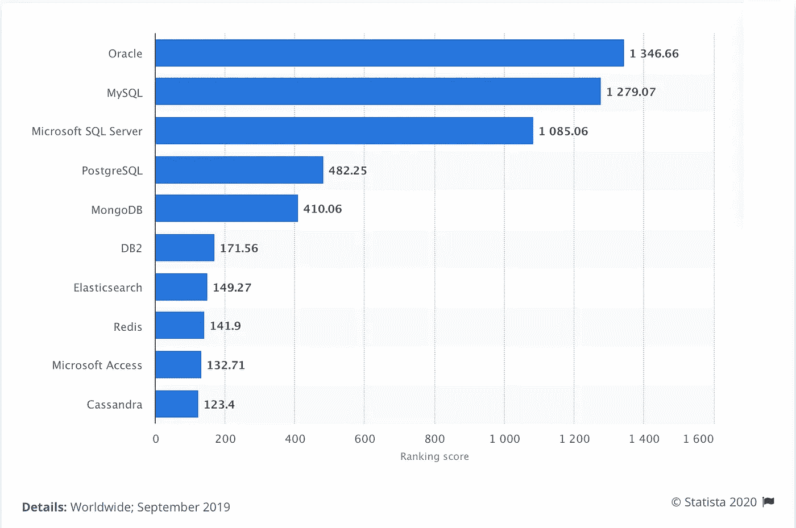
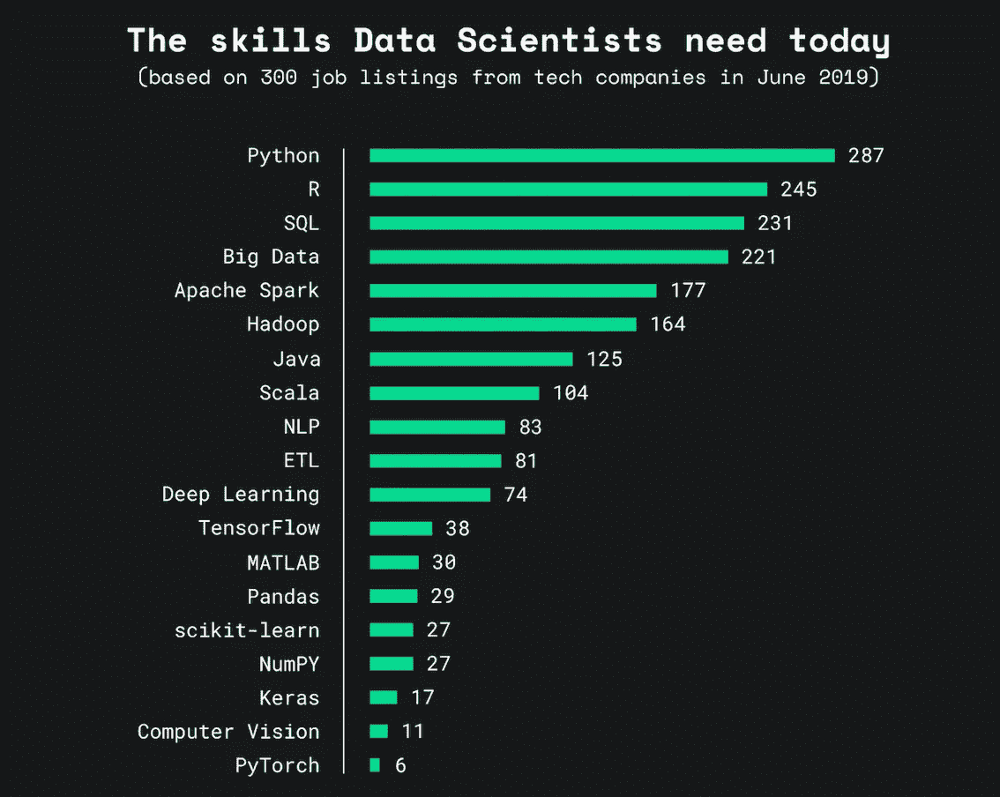
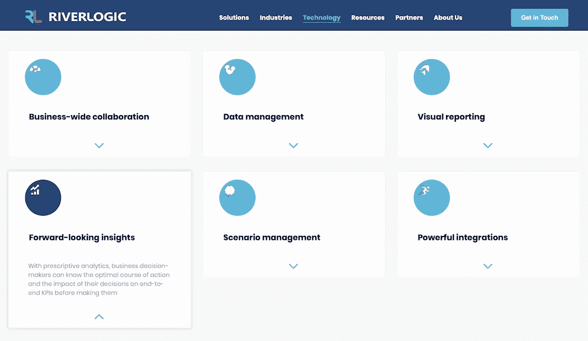

# 数据科学最流行的工具和软件

> 原文：<https://towardsdatascience.com/top-20-most-popular-tools-for-data-science-93c5618893a4?source=collection_archive---------36----------------------->

## 数据科学家在 2020 年使用的最终工具列表

在 [Unsplash](https://unsplash.com/s/photos/tools?utm_source=unsplash&utm_medium=referral&utm_content=creditCopyText) 上由 [Elena Rouame](https://unsplash.com/@roum?utm_source=unsplash&utm_medium=referral&utm_content=creditCopyText) 拍照

# 数据管理

# 1.Hadoop

Apache Hadoop 是管理大数据的最重要的工具之一。

它还允许用户存储所有形式的数据，即结构化数据和非结构化数据。借助 Hadoop，数据科学家可以跨计算机集群对数据集中的大量数据进行可靠的分布式处理。

成为数据科学家并不迫切需要 Hadoop，但数据科学家必须知道如何首先将数据取出来进行分析，Hadoop 正是存储大量数据的技术，数据科学家可以在这方面工作。

Hadoop 由几个模块组成:Hadoop Common、Hadoop 分布式文件系统、Hadoop YARN、Hadoop MapReduce，实现灵活的数据处理。

# 2.MongoDB

MongoDB 是一个探索你认为合适的结构化数据的工具。作为一个 NoSQL 数据库，它不遵循 SQL 强加的严格的关系格式。通过提供通常需要向 SQL 添加层的功能，它降低了复杂性。借助动态模式，您可以一起处理差异极大的数据并整合分析。

或者，也可以使用其他 NoSQL 工具——Cassandra、CouchDB、ArangoDB、Postgre SQL 或 DynamoDB，将数据传输到提供可靠数据管理的平台。

# 3.关系型数据库

资料来源:DB-Engines via [Statista](https://www.statista.com/statistics/809750/worldwide-popularity-ranking-database-management-systems/)

SQL 是数据科学中最需要的技能之一。

要从数据库中获取数据，您需要 SQL。在 SQL 平台中——MySQL、Microsoft SQL Server、Oracle Database、PostgreSQL、MongoDB、CouchBase、DB2 或其他数据库，Oracle 的数据库解决方案在 2019 年进行的大多数调查中脱颖而出。

MySQL 和微软 SQL Server 位列前三。尽管数据库管理行业包含了一些科技行业中最大的公司，如微软、甲骨文和 IBM，但一些免费的开源 DBMSs，如 PostgreSQL 和 Apache Cassandra，仍然具有很强的竞争力。

当每个人都忙于学习数据科学的 R 或 Python 时，我们往往会忘记没有数据就没有数据科学。数据科学家需要 SQL 来获取这些数据并使用它们。SQL 允许快速方便地存储、查询、创建、解析和操作数据—基本上是数据管理。

# 4.Neo4j

Neo4j 是由 Neo Technology Inc .开发的开源和世界领先的图形数据库管理系统，是一种使用图形结构进行语义查询的数据库，具有节点、边和属性来表示和存储数据。

它旨在优化节点和关系的快速管理、存储和遍历，具有高度可伸缩性，旨在利用数据及其关系。

Neo4j 为数据上的 CRUD 操作提供了可伸缩性、高可用性和灵活性。这个工具是用 Java 编写的。并提供灵活的数据模型以给出实时输出。

# 5.SAP HANA

SAP HANA(高性能分析设备)是一个 RDBMS，由 SAP 开发和销售。它作为数据库服务器的主要功能是根据支持应用程序的请求存储和检索数据。

SAP HANA 是一种基于 ETL 的复制，使用 SAP 数据服务从 SAP 或非 SAP 源迁移数据到 HANA 数据库。在其生物圈中使用 SAP 的企业使用 HANA 在短时间内处理大量实时数据。

由于 SAP 是一个闭源生态系统，HANA 可能不是独立数据科学家的工具，但对于 SAP 中的业务或职业来说，HANA 可能是一个值得炫耀的好技能。

# 6.储备

Apache Hive 是一个建立在 Apache Hadoop 之上的数据仓库软件项目，用于提供数据查询和分析。Hive 类似于一个 SQL 接口，用于查询跨数据库和文件系统存储的数据，以便以后与 Hadoop 集成。

Hadoop、Hive、Pig 本质上在数据管理层紧密合作。

Hive 以提供数据汇总和数据查询而闻名。HIVE 是为工作的人构建的，在 SQL 知识方面，不需要学习一种全新的语言来获取 Hadoop 生态系统中的数据并与之交互。

# 7.阿帕奇火花

Apache Spark 是一个用于大规模数据处理的统一分析引擎。它可以跨多种语言编写应用程序，这使得它非常健壮——Java、Scala、Python、R 和 SQL。

数据科学家使用 Spark 进行数据清理和转换、功能工程、模型构建、模型评估评分和“生产化”数据科学管道。我从 Python 中读到 Spark 致力于提供类似熊猫的体验，这让我很感兴趣。

我不太了解 Apache Spark，但我会在秋季学习它🙈。如果你有兴趣了解更多关于 Apache Spark 的知识，这里的[是一个很好的参考资源。](https://thenewstack.io/the-good-bad-and-ugly-apache-spark-for-data-science-work/)

# 8.快速采矿机

RapidMiner 是一款开源、完全透明、功能强大的端到端数据挖掘工具，用于快速构建预测模型。该工具支持数百种数据准备和机器学习算法，以支持一系列数据挖掘项目。

RapidMiner 可用于准备数据、机器学习和模型开发。它支持多种数据管理技术和机器学习步骤，如数据准备、数据可视化、预测分析、部署等。这个工具是用 Java 编写的。

# 数据可视化

# 9.Microsoft Power BI

Microsoft Power BI 是一款用于商业智能的交互式数据可视化和分析工具。我在 2017 年在 Larsen & Toubro 实习时听说过 Power BI，使用 Power BI 进行跨部门的收入支出分析、员工效率、焊接和拱架轮班的实时数据处理。

数据科学家可以从广泛的来源提取数据，并创建漂亮的仪表板来跟踪对业务非常重要的指标

微软关于为什么 PowerBI 的博客非常清楚地解释了为什么 Power BI 对数据科学家来说是事实。Power BI 可轻松连接、建模和可视化数据，创建难忘的报告，并根据品牌的 KPI 进行个性化设置。

Power BI 可以轻松地与 Microsoft Office 应用程序(Microsoft Teams 和 Excel)集成，使组织能够做出数据驱动的业务决策，从而推动他们采取战略行动。

# 10.（舞台上由人扮的）静态画面

Tableau 是目前商业智能中非常流行和强大的数据可视化工具。Tableau 的数据分析快速而强大。通过可视化仪表板和工作表，Tableau 涵盖了将原始数据简化为非常容易理解的格式、清理数据以及识别潜在趋势和模式。

很长一段时间以来，像百事可乐、威瑞森、查尔斯·施瓦布、可口可乐、Chipotle 这样的大公司都在使用 Tableau 来利用他们的数据并做出结论性的明智决策。对于任何对数据科学或数据分析职业感兴趣的人来说，Tableau 这样的工具是必不可少的。

# 11.QlikView

想想饼图、折线图、数据透视表、条形图等等📊，QlikView 是一款在行业中广泛使用的工具。

QlikView 也是一个商业智能和数据发现工具，其目标是为目标业务挑战创建导向分析应用程序和仪表板。该软件使用户能够揭示各种变量之间的数据洞察力和关系。

关于 Tableau 和 QlikView 的争论相当激烈。虽然 Tableau 口袋里有 bog 品牌，但 QlikView 使用内存数据模型，使其能够即时准确地处理庞大的数据集，这是 Tableau 的改进范围。

# 12.TIBCO Spotfire

Spotfire 是一家位于马萨诸塞州萨默维尔的商业智能公司，于 2007 年被 TIBCO 收购(维基百科)。Spotfire 具有与 Tableau 或 QlikView 相同的通用可视化功能。

虽然 Tableau Public 和 Power BI Desktop 可以免费使用，但 TIBCO Spotfire 的价格为每位用户每年 650 美元。没有免费版本可能会使它在独立数据科学家中不那么受欢迎。然而，我最近看到了[这个](https://www.tibco.com/customers/accorhotels)故事，讲述了*雅高酒店如何使用 TIBCO Spotfire 改善客户体验，以及更快、更容易、更简单的整合。*

TIBCO 最初是集成和分析领域的全球领导者，拥有庞大的客户群。你可以点击这里访问 TIBCO 客户名单[。](https://www.tibco.com/customers)

# 数据分析

来源:2019 年 6 月最受欢迎的数据科学技能[1]

# 13.计算机编程语言

你认为这不会在清单上吗？Python 在数字方面压倒了一切。

Python 面向对象的特性有助于数据科学家以更好的稳定性、模块化和代码可读性来执行任务。虽然数据科学只是多样化的 Python 生态系统的一小部分，但 Python 拥有丰富的专业深度学习和其他机器学习库以及流行的工具，如 *scikit-learn、Keras 和 TensorFlow。*

毫无疑问，Python 使数据科学家能够开发出可以直接插入生产系统的复杂数据模型。Python 有大量的包和库，不仅仅是为了数据分析，而是为了数据分析。

Python 的数据分析库， ***Pandas*** 无疑是数据探索的最佳选择。通过组织成数据框， *Pandas* 可以轻松地过滤、排序和显示数据。

# 14.稀有

作为数据科学的典型统计工具，R 不仅仅是一种语言，它本身就是一个执行统计计算的完整生态系统。它有助于执行数据处理、数学建模、数据可视化等操作。

r 是为了对大型数据集进行统计和数值分析而构建的，因此，有大量的操作可用于数据分析和探索——排序数据、转置表、创建图表、生成频率表、采样数据、概率分布、合并数据、变量转换等等。探索封装 *dplyr* 和 *tidyr* 以获得最佳结果。

# 15.斯堪的纳维亚航空公司

*SAS —统计分析系统*

和 R 一样，SAS 是为高级数据分析和复杂的统计操作开发的工具。它是一个闭源的专有工具，提供了各种各样的统计功能来执行复杂的建模。由于其高可靠性，SAS 主要由大型组织和专业人员使用。

虽然 SAS 不是最适合初学者和独立数据科学爱好者的工具，但它 SAS 是为满足高级业务需求而量身定制的，如果你在职业生涯中寻找特定的数据科学角色，良好的 SAS 知识将为你的档案增添光彩。

SAS 在企业分析领域一直是无可争议的市场领导者，但是，要将其功能与 Python 或 R 进行比较，SAS 似乎很难对数据进行建模和可视化。此外，学习曲线是棘手的，有时很难，主要是由预算庞大的大公司使用。

# 16.矩阵实验室

MATLAB 是我用于数据科学的第一个工具。当我发现 MATLAB 是进行深奥的数学运算的有效工具时，我在我的一门本科课上把 MATLAB 作为图像处理工具。虽然数据科学也与数学有关，但我抓住机会探索是什么使这项技术成为数学建模、图像处理和数据分析的强大工具。

MATLAB 拥有一个庞大的数学函数库，用于线性代数、统计、傅立叶分析、滤波、优化、数值积分和求解常微分方程。MATLAB 提供了用于可视化数据的内置图形和用于创建自定义绘图的工具。

我不认识很多用 MATLAB 的数据科学家。说了这么多，不可否认对于数学和建模来说是很棒的。随着 R 和 Python 在数据科学领域的出现，MATLAB 一直在走下坡路，但正如我们在上面的统计数据中看到的那样，它仍然在那里。

# 17.附加电源装置（Supplementary Power Supply Set 的缩写）

IBM SPSS 软件平台提供高级统计分析、庞大的机器学习算法库、文本分析、开源可扩展性、与大数据的集成以及无缝部署到应用程序中。

我可以说，IBM SPSS 是一个相对较少使用的工具。它更受社会科学、心理学、金融、人力资源等领域的研究学者和学者的欢迎。虽然大多数数据科学家和行业使用 R、Python 或 SAS 作为主要工具，但如果你在心理学或相关领域工作，SPSS 是一个很好的工具。

# 18.斯塔塔

Stata 是一个强大的统计软件，使用户能够分析、管理和生成数据的图形可视化。它主要由经济学、生物医学和政治学领域的研究人员用来检查数据模式。

正如 [Stata](https://www.stata.com/disciplines/data-science/) 的官网所说“数据科学家依赖 Stata 是因为它强大的编程能力、可再现性、可扩展性和互操作性。从数据争论到报告，Stata 为您提供完成分析所需的工具。许可授权允许您轻松地将其集成到您的专有工作流程中。”

# 19.河流逻辑

RiverLogic 是一个建模和分析平台，它利用诊断、预测和说明性分析来进行假设分析和优化分析。

其规范性分析平台使用户能够通过协作、快速、基于云的场景分析来解决无限数量的决策挑战。

来源:河逻辑官方[网站](https://www.riverlogic.com/technology/prescriptive-analytics-platform)

# 20.SAP Lumira

SAP Lumira 让数据科学家和分析师能够构建有影响力的商业智能可视化，以评估风险、提高效率、突出独特见解并发现机会。

SAP Lumira 还支持用于高级分析的 OLAP 技术。Lumira 的可视化为交互式和有效的数据分析提供了自适应布局容器。

**官方网站引用:**
*创建分析应用程序和仪表盘* 开发可移动的交互式仪表盘和分析应用程序，与用户及其数据故事进行协作，并提供可操作的洞察。

开发支持移动的交互式仪表盘和分析应用，与用户及其数据故事进行协作，并提供对可操作洞察的指尖访问。

感谢您的阅读！我希望你喜欢这篇文章。请务必让我知道您以前知道或不知道哪些工具，并且希望在您的数据科学之旅中学习或探索这些工具。

数据帐篷快乐！

*免责声明:本文表达的观点是我自己的观点，不代表严格的观点。*

# 了解你的作者

拉什是芝加哥伊利诺伊大学的研究生。她喜欢将数据可视化，并创造有见地的故事。当她不赶着赶学校的最后期限时，她喜欢喝一杯热巧克力，写一些关于技术、UX 等的东西。