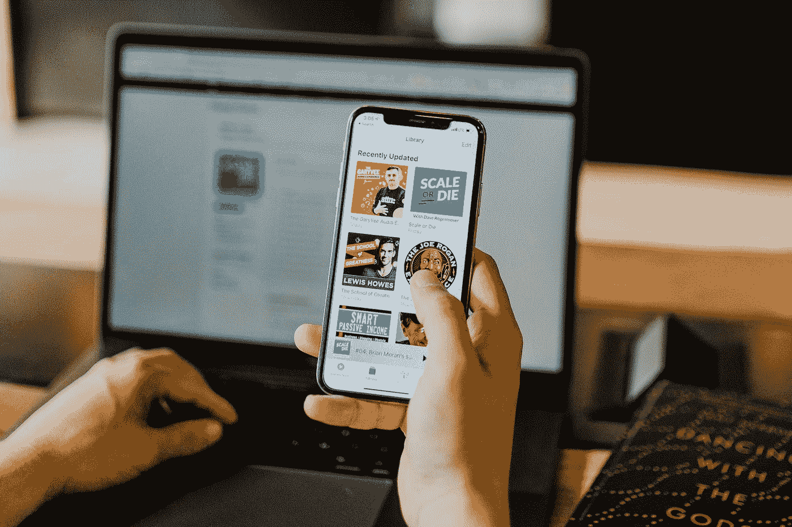
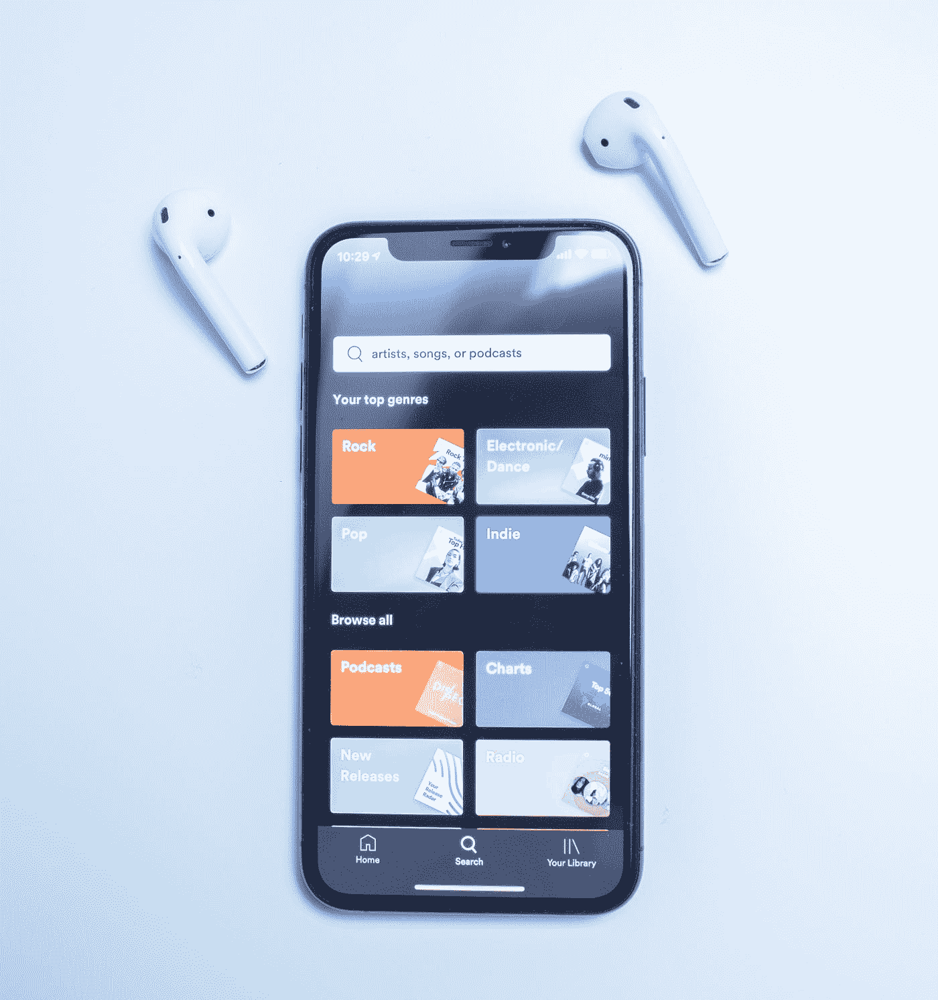

# 2021 年数据科学 22 大播客

> 原文：<https://towardsdatascience.com/top-20-podcasts-for-data-science-83dc9e07448e?source=collection_archive---------4----------------------->

## 数据科学|播客

## 数据科学、机器学习和人工智能最新消息的最佳播客列表。



在 [Unsplash](https://unsplash.com?utm_source=medium&utm_medium=referral) 上由 [Austin Distel](https://unsplash.com/@austindistel?utm_source=medium&utm_medium=referral) 拍摄的照片

视频直播是学习新事物的最佳方法之一，也是培养好奇心和激情的便捷工具。我喜欢在上下班的火车上和散步的时候听 TED 广播一小时。这确保了我每天都有足够的知识，睡觉时比醒来时更聪明，这是我从美国亿万富翁投资者查理芒格那里学到的。

> “睡觉时比醒来时更聪明。”
> 
> ―查理·芒格

随着数据科学的不断发展，了解该领域的最新创新和发明至关重要，这样您才不会在这个快节奏的时代中落后。

播客的伟大之处在于，你可以在通勤、排队、散步等时候听它。这就像在会议上听数据科学家和人工智能专家的对话，但你可以随时暂停、播放和倒带。随时随地提供建议和新闻的图书馆。

因此，无论你只是一个数据科学爱好者，还是一名首席数据科学家，播客都可以为你提供该领域的各种观点和新发展。像这样一个复杂的多学科领域需要大量的研究和学习，还有什么比听播客更好的方法呢？

你还在等什么？现在就向下滚动查看列表吧！

# 目录

```
**General**
1\. Freakonomics**Data Science** 2\. Data Science Salon 
3\. Data Crunch
4\. Data Skeptic
5\. Data Stories
6\. DataFramed7\. Linear Digression
8\. Not So Standard Deviations
9\. Making Data Simple
10\. Data Engineering Podcast
11\. Super Data Science
12\. Data Science at Home
13\. The Digital Analytics Power Hour
14\. O’Reilly Data Show**AI and ML** 15\. HumAIn Podcast
16\. Talking Machines
17\. The TWIML AI Podcast
18\. Learning Machines 101
19\. Artificial Intelligence (AI Podcast) with Lex Fridman
20\. AI Today Podcast: Artificial Intelligence Insights, Experts, and Opinion
21\. Artificial Intelligence in Industry with Daniel Faggella
22\. Gradient Dissent
```

在我们开始进入播客列表之前，如果你还不知道，走向数据科学有他们自己的播客，在那里他们分享关于数据科学的概念、想法和代码。每周都有该领域的不同专家，他们在那里分享建议、经验和见解。

[](https://open.spotify.com/show/63diy2DtpHzQfeNVxAPZgU) [## 走向数据科学 TDS 团队

### 在 Spotify 上收听《走向数据科学》。分享概念、想法和代码

open.spotify.com](https://open.spotify.com/show/63diy2DtpHzQfeNVxAPZgU) 

# 一般

# 1.魔鬼经济学

《魔鬼经济学》一书的合著者斯蒂芬·j·杜布纳是本期播客的主持人。每周，Dubner 都会带你踏上探索一切事物隐含的一面的旅程，从你一直以为你知道的事情到你从未想过你想知道的事情。在数据科学中，你会发现数据的隐藏价值，因此了解更多并扩展你的思维不会有什么坏处。

[](https://open.spotify.com/show/6z4NLXyHPga1UmSJsPK7G1) [## 魔鬼经济电台

### 与《魔鬼经济学》的合著者斯蒂芬·j·杜布纳一起探索一切事物隐藏的一面。每周…

open.spotify.com](https://open.spotify.com/show/6z4NLXyHPga1UmSJsPK7G1) 

# 数据科学

# 2.数据科学沙龙

数据科学沙龙是一个独特的垂直聚焦会议，已发展成为该领域最多元化的高级数据科学、机器学习和其他技术专家社区

他们有一个令人惊叹的播客，其中包括与数据科学、人工智能和机器学习领域的顶尖和后起之秀进行采访和咖啡聊天，讨论推动该领域向前发展的趋势和商业用例。

数据科学沙龙系列是一个独特的垂直聚焦会议，汇集了专家面对面地相互教育，阐明最佳实践，并在休闲的氛围中创新新的解决方案，提供食物、咖啡和娱乐。

他们的最新一期[是关于人工智能在零售行业的趋势和挑战](https://data-science-salon-podcast.simplecast.com/episodes/coffee-chat-from-dss-virtual-retail-e-commerce)，包括顶级数据科学家的参与，如菲利普·罗西(Shopify 数据科学负责人)、赖雅·沙姆加(Lowe's 公司的数据科学家)或杰弗里·邱(沃尔玛实验室数据科学负责人)。

[](https://data-science-salon-podcast.simplecast.com/episodes) [## 剧集|数据科学沙龙播客

### 数据科学沙龙官方播客。我们采访数据科学、机器学习领域的顶尖和后起之秀…

data-science-salon-podcast.simplecast.com](https://data-science-salon-podcast.simplecast.com/episodes) 

# 3.数据紧缩

Data Crunch 是为那些数据科学、人工智能、ML 和 DL 爱好者准备的，他们希望更多地了解它对世界的影响，以及它们如何在社会的每个部分得到利用，从医学到金融。这个节目通常以企业家和专家为特色，他们在这里分享他们处理这项惊人技术的经验——他们的失败、成功和影响。

[](https://open.spotify.com/show/5Kqi6CV44DNi85N4c9Lv5P) [## 数据压缩—数据压缩公司

### 如果你想了解数据科学、人工智能、机器学习和深度学习是如何被用来…

open.spotify.com](https://open.spotify.com/show/5Kqi6CV44DNi85N4c9Lv5P) 

# 4.数据怀疑论者

Data 怀疑论者每周都会为您带来一些故事，讲述如何更多地了解我们的数据驱动世界，以及对统计、ML、大数据、人工智能和数据科学等主题的展望。

[](https://open.spotify.com/show/1BZN7H3ikovSejhwQTzNm4) [## 数据怀疑论者——凯尔·波利奇

### 数据怀疑论者是你对统计学、机器学习、大…

open.spotify.com](https://open.spotify.com/show/1BZN7H3ikovSejhwQTzNm4) 

# 5.数据故事

由 [Enrico Bertini](https://medium.com/u/c8622d0fb3ed?source=post_page-----83dc9e07448e--------------------------------) 和 [Moritz Stefaner](https://medium.com/u/f50f8c4bbcbd?source=post_page-----83dc9e07448e--------------------------------) 主持，这个播客谈论数据及其对我们生活的影响。

[](https://open.spotify.com/show/0aIvhK1ANin1kSOKRhWG1M) [## 数据故事— Enrico Bertini 和 Moritz Stefaner

### 在 Spotify 上听数据故事。一个关于数据及其如何影响我们生活的播客 Enrico Bertini 和 Moritz…

open.spotify.com](https://open.spotify.com/show/0aIvhK1ANin1kSOKRhWG1M) 

# 6.数据框架

由 [DataCamp](https://medium.com/u/e18542fdcc02?source=post_page-----83dc9e07448e--------------------------------) 和 [Hugo Bowne-Anderson](https://medium.com/u/f2a4d039f34a?source=post_page-----83dc9e07448e--------------------------------) 带来的这个节目探讨了数据科学实际上可以解决什么样的问题，而不是解释什么是数据科学(这可能是肤浅和难以理解的)。

[](https://open.spotify.com/show/02yJXEJAJiQ0Vm2AO9Xj6X) [## 数据帧—数据营

### 数据科学是发展最快的行业之一，被称为“21 世纪最性感的工作”。但是…

open.spotify.com](https://open.spotify.com/show/02yJXEJAJiQ0Vm2AO9Xj6X) 

# 7.线性离题

线性离题是所有关于 ML 和数据科学，并集中在 ML 是如何解决世界各地的众多问题，并实现大规模突破被认为是不可能的。

[](https://open.spotify.com/show/1JdkD0ZoZ52KjwdR0b1WoT) [## 线性离题——本·贾菲和凯蒂·马龙

### 在 Spotify 上听线性题外话。线性离题是一个关于机器学习和数据科学的播客…

open.spotify.com](https://open.spotify.com/show/1JdkD0ZoZ52KjwdR0b1WoT) 

# 8.不那么标准偏差

由 Roger Peng 和 Hillary Parker 主持，该节目强调了学术界和工业界在数据科学和分析方面的全新理念，这对于在该领域工作至关重要。

[](https://open.spotify.com/show/1NJ6li5ZpNVBBQfpd3D6bi) [## 不那么标准偏差——罗杰·彭和希拉里·帕克

### 在 Spotify 上听不那么标准的偏差。Roger Peng 和 Hilary Parker 谈论数据科学的最新发展和…

open.spotify.com](https://open.spotify.com/show/1NJ6li5ZpNVBBQfpd3D6bi) 

# 9.简化数据

IBM 数据和人工智能开发副总裁 Al Martin 是该节目的主持人，他提供了关于大数据、人工智能及其对全球公司的影响的最新信息。

[](https://open.spotify.com/show/6i8sGQUN5PNzyExrQJtndx) [## 让数据变得简单— IBM 大数据&分析中心

### 在 Spotify 上听“简化数据”。由 IBM 数据和人工智能开发副总裁 Al Martin 主持，让数据变得简单…

open.spotify.com](https://open.spotify.com/show/6i8sGQUN5PNzyExrQJtndx) 

# 10.数据工程播客

本播客每周为工程师和塑造行业的企业家带来关于数据管理的摘要。这个播客更适合专家和已经在这个领域的人。

[](https://open.spotify.com/show/2iLvljRGVVIGlJshT5vNDS) [## 数据工程播客——托拜厄斯·小萌

### 在 Spotify 上收听数据工程播客。每周与工程师和…深入探讨数据管理

open.spotify.com](https://open.spotify.com/show/2iLvljRGVVIGlJshT5vNDS) 

# 11.超级数据科学

由数据科学教练兼生活方式企业家[基里尔·叶列缅科](https://medium.com/u/6b467d74ac43?source=post_page-----83dc9e07448e--------------------------------)主持。本播客的主要目的是聚集世界各地的领先数据科学家和分析师，提供您的见解和建议，以推动您在这一充满挑战的领域的职业生涯。对于所有渴望在数据分析领域取得成功的人，请听听叶列缅科的观点，并做好笔记。

[](https://open.spotify.com/show/1n8P7ZSgfVLVJ3GegxPat1) [## 超级数据科学——基里尔·叶列缅科:蔻驰数据科学，生活方式企业家

### 基里尔·叶列缅科是一名数据科学教练和生活方式企业家。超级数据科学播客的目标是…

open.spotify.com](https://open.spotify.com/show/1n8P7ZSgfVLVJ3GegxPat1) 

# 12.家庭数据科学

主持 [Francesco Gadaleta](https://medium.com/u/68468a2d58be?source=post_page-----83dc9e07448e--------------------------------) 《数据科学在家中》为您带来关于技术、人工智能和人工智能的有趣讨论和发人深省的问题。一个完美的例子就是这个关于 AI 阴暗面的系列。

[](https://open.spotify.com/show/57AJ6GiMDPVBLGRqvjeoz6) [## 家庭数据科学—

### 在家通过 Spotify 收听数据科学。技术、机器学习和算法。来加入讨论吧…

open.spotify.com](https://open.spotify.com/show/57AJ6GiMDPVBLGRqvjeoz6) 

# 13.数字分析动力时刻

由三位分析师主持——[迈克尔·赫尔布林](https://medium.com/u/1e7d9251f6a0?source=post_page-----83dc9e07448e--------------------------------)、[莫伊·基斯](https://medium.com/u/7b92406a3cfe?source=post_page-----83dc9e07448e--------------------------------)和[蒂姆·威尔森](https://medium.com/u/6ecb39f5234f?source=post_page-----83dc9e07448e--------------------------------)，每一集都是一场开放式的讨论，偶尔会有嘉宾来讨论数字分析。在节目中，他们四个人倾吐了他们对这个话题的想法、经历和疑问。

[](https://open.spotify.com/show/2ReJKUbDtcom5U0GgpOlAz) [## 数字分析的力量时刻——迈克尔·赫尔布林、莫·基斯和蒂姆·威尔逊

### 三位分析师和一位偶尔来访的嘉宾讨论当今的数字分析话题。每集都是一个封闭的话题…

open.spotify.com](https://open.spotify.com/show/2ReJKUbDtcom5U0GgpOlAz) 

# 14.奥赖利数据显示

声名狼藉的 O'Reilly 带来了数据科学、编程、AI、机器学习等方面最好的书籍。这个节目探索了推动数据科学、大数据和人工智能的机会和方法。

[](https://www.oreilly.com/topics/oreilly-data-show-podcast) [## 奥赖利数据显示播客的想法和资源。

### 奥赖利数据秀播客探讨了推动大数据、数据科学和人工智能的机遇和技术

www.oreilly.com](https://www.oreilly.com/topics/oreilly-data-show-podcast) 

# 人工智能和机器学习

# 15.HumAIn 播客

由 David Yakobovitch 主持，这个播客通过与业界思想领袖在 HumAIn 上的炉边对话，探索消费者的人工智能。本播客的演讲者包括首席数据科学家和人工智能顾问，他们是推进人工智能的领导者，HumAIn 播客是发布新的人工智能产品，了解行业趋势，以及在第四次工业革命中弥合人类和机器之间差距的渠道。

[](https://linktr.ee/humain) [## HumAIn 播客

### HumAIn 播客-人工智能、数据科学、工作的未来和开发者教育

linktr.ee](https://linktr.ee/humain) 

# 16.会说话的机器

由凯瑟琳·戈尔曼和尼尔·劳伦斯主持的“会说话的机器”是通向机器学习世界的门户。每一集都为你带来该领域专家的精彩见解，有见地的讨论，以及对你的问题的回答。随着机器学习不断改变世界，我们必须开始学习如何提出正确的问题，以及如何处理这些答案。这些播客可以帮助你做到这一点。

[](https://open.spotify.com/show/0gKf364z7Vri0wbNXsHd2B) [## 会说话的机器——手提袋产品

### 会说话的机器是你进入机器学习世界的窗口。你们的主持人，凯瑟琳·戈尔曼和尼尔·劳伦斯…

open.spotify.com](https://open.spotify.com/show/0gKf364z7Vri0wbNXsHd2B) 

# 17.TWIML 人工智能播客

行业分析师、演讲人、评论员和思想领袖 Sam Charrington 主持 TWIML 人工智能播客，介绍人工智能和人工智能领域的顶尖人物，并为世界各地的研究人员、数据科学家、工程师和数据驱动领导者提供丰富的信息。这个播客涵盖了所有的主题，从 ML 和 AI 到神经网络和深度学习。

[](https://open.spotify.com/show/2sp5EL7s7EqxttxwwoJ3i7) [## TWIML 人工智能播客(原本周机器学习&人工智能)——山姆…

### 机器学习和人工智能正在极大地改变企业运营和人们生活的方式。的…

open.spotify.com](https://open.spotify.com/show/2sp5EL7s7EqxttxwwoJ3i7) 

# 18.学习机器 101

本期节目的主持人理查德·m·戈登(Richard M. Golden)为你解答了自动驾驶汽车和虚拟助手等人工智能设备和机器如何工作，它们来自哪里，以及它们如何变得更像我们。人工智能和机器学习正在呈指数增长，知道它们能做什么和不能做什么是至关重要的，这样你才能为即将到来的事情做好准备。

[](https://open.spotify.com/show/1MVjzhCjFB9y2qENVKDPoP) [## 学习机器 101 —理查德·m·戈尔登博士，电气工程硕士，电气工程学士

### 基于人工智能和机器学习原理的智能机器现在在我们的生活中很普遍…

open.spotify.com](https://open.spotify.com/show/1MVjzhCjFB9y2qENVKDPoP) 

# 19.Lex Fridman 的人工智能(AI 播客)

[莱克斯·弗里德曼](https://medium.com/u/119b8eb57f8e?source=post_page-----83dc9e07448e--------------------------------)是最好的人工智能播客主持人之一。每集都有一段与著名专家(如埃隆·马斯克)关于技术、科学和人类状况的精彩对话。

[](https://open.spotify.com/show/2MAi0BvDc6GTFvKFPXnkCL) [## Lex Fridman 的人工智能(AI 播客)——Lex frid man

### 在 Spotify 上听 Lex Fridman 的人工智能(AI 播客)。关于技术、科学的对话…

open.spotify.com](https://open.spotify.com/show/2MAi0BvDc6GTFvKFPXnkCL) 

# 20.今日人工智能播客:人工智能见解、专家和观点

今天的人工智能提供了大量关于现实世界、行业和采用人工智能的市场研究和情报的信息。如果你需要了解更多关于人工智能的信息，请收听今天的人工智能。

[](https://open.spotify.com/show/4z2M4S9e0K6yk3KB9XrO7h) [## 今日人工智能播客:人工智能见解、专家和观点——认知分析

### 收听 AI Today 播客:人工智能见解、专家和对 Spotify 的看法。现实世界、工业和…

open.spotify.com](https://open.spotify.com/show/4z2M4S9e0K6yk3KB9XrO7h) 

# 21.人工智能在工业中的应用

Emerj 的创始人丹尼尔·法盖拉(Daniel fag gella)将带你踏上一段旅程，探索什么是可能的，什么是人工智能在行业中的应用。拥有顶尖的人工智能和以人工智能为中心的高管以及金融、国防、零售等领域的研究。找出当今人工智能的趋势，并了解如何在这个人工智能时代茁壮成长。

[](https://open.spotify.com/show/4gD9xiYU9iC24vnjUx1PTg) [## 人工智能在工业中的应用

### 了解人工智能在企业中的可能性和作用。每周，Emerj 创始人…

open.spotify.com](https://open.spotify.com/show/4gD9xiYU9iC24vnjUx1PTg) 

# 22.**梯度异议——一个机器学习播客**

gradient dissubmission 是一个每周一次的机器学习播客，它让你看到行业领导者如何在现实世界中使用深度学习的幕后场景。这个很棒的播客邀请了像

*   [Fast.ai 的杰瑞米·霍华德](https://t.co/EWFpNMzsju?amp=1)
*   谷歌研究总监彼得·诺维格
*   卡格尔首席执行官安东尼·戈德布卢姆
*   [Insitro 首席执行官兼 Coursera Daphne 柯勒联合创始人](https://youtu.be/prGz_6Jb16M)
*   还有更多！

[](https://wandb.ai/site/podcast) [## 梯度异议-机器学习播客

### 梯度异议是一个机器学习播客，我们采访行业领袖，并讨论机器学习在…

wandb.ai](https://wandb.ai/site/podcast) 

# 行动计划



照片由 [Patrik Michalicka](https://unsplash.com/@patrikmichalicka?utm_source=medium&utm_medium=referral) 在 [Unsplash](https://unsplash.com?utm_source=medium&utm_medium=referral) 上拍摄

D ata 科学不易。尽管如此，在播客的帮助下，你会遇到发人深省的问题，并激发数据科学领域专家之间的辩论。播客可以帮助你理解复杂的概念，让你了解最新的突破，而不是练习灌输式的研究新课题的方法——教科书和测试。因此，将播客融入到你的日常生活中，并开始看到你思维过程的变化。

## 建议/提示

在听播客的时候，不要只是被动地听，试着在你的头脑中想象这个想法，积极地处理进入你大脑的信息并将这些想法拼凑起来。听完播客后，把你学到的东西写在一张纸上或电脑上，并存放在安全的地方。

通过积极倾听和回忆大脑中的信息，你可以对所听的事实和内容有更高的记忆力。这可以确保你确实从这些播客中受益，因为与阅读相比，听的人往往对想法的记忆力较低。

通过几个小时的倾听，你获得了所有这些新的想法和原则，你能够将它们融合在一起，为你生活中的问题提供新的解决方案。

所以，当你戴上耳机按下播放键时，确保你真的在集中注意力，而不只是被动地消费。

总结一下，下面是 Gimlet Media 首席执行官 Alex Blumberg 的一段话，

> “很多人听播客是因为他们想学习一些东西，并在途中得到娱乐。”

感谢阅读这篇文章，我希望它能启发你开始听播客。

请在下面留下你想分享的任何其他播客的评论！

## 如果你对学习数据科学感兴趣，就从这两个伟大的系列开始吧！

[](https://medium.com/better-programming/how-to-ultralearn-data-science-part-1-92e143b7257b) [## 如何“超级学习”数据科学—第 1 部分

### 这是一个简短的指南，基于《超学习》一书，应用于数据科学

medium.com](https://medium.com/better-programming/how-to-ultralearn-data-science-part-1-92e143b7257b) [](/the-data-scientists-toolbox-part-1-c214adcc859f) [## 数据科学简介

### 关于什么是数据科学、大数据、数据和数据科学过程及其应用。

towardsdatascience.com](/the-data-scientists-toolbox-part-1-c214adcc859f) 

## 查看这些关于数据科学资源的文章。

[](/everything-you-need-to-learn-python-from-zero-to-hero-3dc950cb1b4c) [## 从零到英雄学习 Python 所需的一切

### 分享我用来学习 Python 的资源，从书籍、课程、播客到编码网站和…

towardsdatascience.com](/everything-you-need-to-learn-python-from-zero-to-hero-3dc950cb1b4c) [](/top-20-youtube-channels-for-data-science-in-2020-2ef4fb0d3d5) [## 2020 年你应该订阅的 25 大数据科学 YouTube 频道

### 以下是你应该关注的学习编程、机器学习和人工智能、数学和数据的最佳 YouTubers

towardsdatascience.com](/top-20-youtube-channels-for-data-science-in-2020-2ef4fb0d3d5) [](/top-20-free-data-science-ml-and-ai-moocs-on-the-internet-4036bd0aac12) [## 互联网上 20 大免费数据科学、ML 和 AI MOOCs

### 以下是关于数据科学、机器学习、深度学习和人工智能的最佳在线课程列表

towardsdatascience.com](/top-20-free-data-science-ml-and-ai-moocs-on-the-internet-4036bd0aac12) [](https://medium.com/swlh/top-20-websites-for-machine-learning-and-data-science-d0b113130068) [## 机器学习和数据科学的 20 大网站

### 这里是我列出的最好的 ML 和数据科学网站，可以提供有价值的资源和新闻。

medium.com](https://medium.com/swlh/top-20-websites-for-machine-learning-and-data-science-d0b113130068) [](/the-best-book-to-start-your-data-science-journey-f457b0994160) [## 开始数据科学之旅的最佳书籍

### 这是你从头开始学习数据科学应该读的书。

towardsdatascience.com](/the-best-book-to-start-your-data-science-journey-f457b0994160) 

# 联系人

如果你想了解我的最新文章[，请通过媒体](https://medium.com/@benthecoder07)关注我。

其他联系方式:

*   [领英](https://www.linkedin.com/in/benthecoder/)
*   [推特](https://twitter.com/benthecoder1)
*   [GitHub](https://github.com/abhinavsagar)
*   [Reddit](https://www.reddit.com/user/benthecoderX)

快乐聆听！