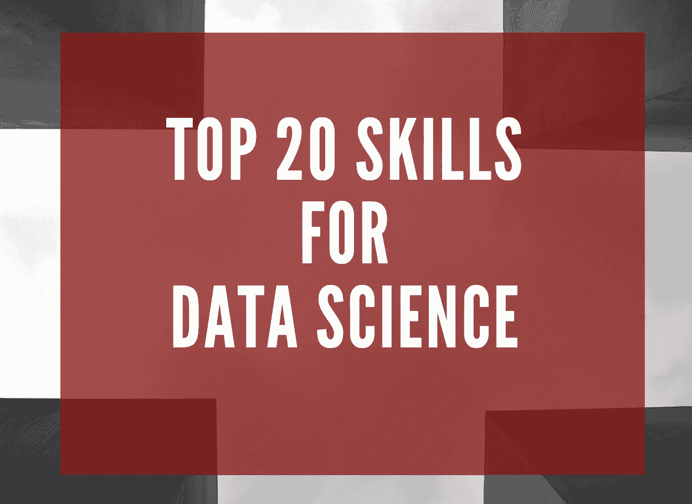

# 数据科学的 20 大技能和关键词

> 原文：<https://towardsdatascience.com/top-20-skills-and-keywords-for-data-science-6bc6bfc8c28a?source=collection_archive---------15----------------------->

在隔离即将结束的时候，你想学习新技能还是重温旧技能？

全球疫情和经济放缓对就业市场的影响非常不均衡。虽然 Slack 和 Zoom 等远程工作支持者正在加速招聘，但我们必须解决裁员和职位取消的问题。在这样一个时代，我们都想为那些仍然空缺的职位全力以赴。

众所周知，最大的战斗是与 ATS 的战斗。每个数据科学职位都有一个被雇佣者必须遵守的角色和职责。如果 ATS 无法从你的简历中识别出任何重要的技能或关键词，认为你不适合这份工作，那么你可能无法通过 ATS 可读性测试。

为了顺利通过 ATS 并突出您的技能，我按照字母顺序研究了您下一个数据科学职位*的 30 项顶级技能和关键词。*让我们看看它们是什么。

# 1.自动警报系统

云服务对于各种规模的企业来说都非常有用，可以帮助他们准备后端基础架构，通过只在需要时付费来显著降低云存储开支。云计算的先驱 AWS 已经成为数据科学家的一个充满活力的工具。

1.  弹性计算云(EC2)
2.  简单存储服务(S3)
3.  关系数据库服务
4.  红移
5.  弹性 MapReduce

是 AWS 使用的一些实例。使用云服务的经验，尤其是像 AWS 这样受欢迎的服务，在你的数据科学职业生涯中是一个巨大的优势。

大多数技术公司现在都依赖这些服务，并坚持不懈地使用它们。因此，如果你熟悉这些服务中的一个，它肯定会给他们信心，你需要更少的培训来加入。随着越来越多的人进入数据科学领域，您希望您的简历尽可能突出！

# 2.大数据

数据科学是一个包含与数据相关的一切的领域。从清理、挖掘、准备和分析，数据科学是一个过程。

大数据是指难以实时存储和处理的海量数据。这些数据可用于分析洞察力，从而做出更好的决策。数据科学的原则保持不变，数据量成倍增长。

在真实的商业世界中，需要处理的是大数据。因此，从现在开始，无论你做什么项目，大数据都是你可以关注分析的东西。

# 3.商业智能(BI)

我不是说商业智能是数据科学的一部分。

然而，由于两者都必须做大量的工作来检查仅由业务流程使用的数据，因此 BI 通常与数据科学一起使用。简而言之，虽然 BI 帮助*解读*过去的数据，但数据科学可以*分析*过去的数据，识别趋势或模式，以做出未来预测。

BI 主要用于报告或描述性分析，这也可以通过数据科学来完成，因此，这是一项很好的学习技能。

**热门 BI 工具:**

1.  [微软的 PowerBI](https://powerbi.microsoft.com/en-us/)
2.  [画面](https://www.tableau.com)
3.  [SAP 商业智能](https://www.sap.com/products/analytics/business-intelligence-bi.html)(针对企业)
4.  [Qlik](https://www.qlik.com/us/)

# 4.云计算

数据科学实践通常包括使用云计算产品和服务来帮助数据专业人员访问管理和处理数据所需的资源。

数据科学家的日常工作通常包括分析和可视化存储在云中的数据。您可能已经读到过数据科学和云计算携手并进，这通常是因为云计算帮助数据科学家使用提供数据库、框架、编程语言和操作工具的平台。

1.  亚马逊— AWS
2.  谷歌云平台——GCP
3.  微软— Azure
4.  阿里巴巴——阿里云

# 5.数据分析

数据科学是一个涵盖多个相关学科的总称，包括数据分析。虽然数据科学家应该根据过去的模式预测未来，但数据分析师可以从各种数据源中提取有意义的见解。

数据分析跨越描述性、诊断性、规范性和预测性分析，每种分析都有自己的应用。

数据分析的应用似乎永无止境。每天收集的数据越来越多，这为将数据分析应用于商业、科学和日常生活的更多领域带来了新的机遇。

# 6.数据探索

仓库中有数据，但是这些数据非常不一致。所以你必须清理和统一杂乱复杂的数据集，以便于访问和分析。

*探索性数据分析(EDA)* 是数据分析过程的第一步。在这里，你要弄清楚你所拥有的数据，然后弄清楚你想问什么问题，如何设计这些问题，以及如何最好地操作你可用的数据源来得到你需要的答案。

# 7.数据管理

您将处理的许多数据将会很混乱，可能会丢失值，可能会出现日期和字符串格式不一致的情况。在开始处理之前，您需要清理和整理您的数据。

> 数据的价值不是基于其来源、质量或格式；它的价值取决于你用它做什么！

数据管理包括获取、验证、存储、保护和处理所需的数据。数据管理可以包括以下技能—

1.  数据争论—为下游运营转换和映射数据
2.  数据处理—从原始数据中检索、转换和分类信息
3.  数据安全性—防止未经授权的访问和数据损坏
4.  数据治理—管理可用性、可用性、完整性和安全性
5.  数据操作—使数据更容易阅读或更有条理
6.  数据建模——数据、查询、设计数据流之间的关联
7.  数据迁移—选择、准备、提取、转换和传输数据
8.  数据仓库—存储来自数据源的数据，用于报告和分析
9.  数据转换等等..

# 8.数据可视化

数据可视化是数据分析最重要的部分之一。以一种可理解的、视觉上吸引人的格式呈现数据一直是很重要的。数据可视化是数据科学家为了更好地与最终用户沟通而必须掌握的技能之一。有多种工具，如 Tableau、Power BI，它们给你一个很好的直观界面。

当然，这是数据科学的重要组成部分，因为它让科学家向技术和非技术受众描述和交流他们的发现。像 matplotlib、ggplot 或 d3.js 这样的工具让我们可以做到这一点。另一个很好的工具是 Tableau。

# **9。DevOps**

我一直听说并相信数据科学是为那些懂数学、统计学、算法和数据管理的人准备的。然而，最近，我发现 DevOps 对于数据科学越来越重要。

DevOps 是一套结合软件开发和 IT 运营的方法，旨在缩短开发生命周期，并提供高质量的不间断交付。

DevOps 团队与开发团队紧密合作，有效地管理应用程序的生命周期。数据转换要求数据科学团队与 DevOps 紧密协作。DevOps 团队预计将提供高度可用的 Apache Hadoop、Apache Kafka、Apache Spark 和 Apache Airflow 集群来处理数据提取和转换。

## DevOps 可以为数据科学做些什么？

1.  调配、配置、扩展和管理数据集群
2.  通过持续集成、部署和监控数据来管理信息基础架构
3.  创建脚本，为各种环境自动提供和配置基础。

# 10.HADOOP

*Hadoop 是数据科学家的必备品。*

Hadoop 的主要功能是存储大数据。它还允许用户存储所有形式的数据，即结构化数据和非结构化数据。Hadoop 还提供了像*猪*和*蜂巢*这样的模块来分析大规模数据。

现在，我不会说 Hadoop 是成为数据科学家的必要条件，但数据科学家必须知道如何首先将数据取出来进行分析，Hadoop 正是存储大量数据的技术，数据科学家可以在这方面工作。

# 11.机器学习

顾名思义，机器学习是让机器变得智能的过程，这些机器具有思考、分析和决策的能力。通过建立精确的机器学习模型，一个组织有更好的机会识别有利可图的机会——或避免未知的风险。

您应该对各种监督和非监督算法有很好的实践知识。

深度学习将传统的机器学习方法提升到了一个新的水平。它受到生物神经元(脑细胞)的启发。这里的想法是模仿人脑。使用这种人工神经元的大型网络，这被称为深度神经网络。现在的机构大多要求深度学习的知识，这个不要错过。

# 12.多元微积分和线性代数

大多数机器学习，总是数据科学模型，是建立在几个预测器或未知变量的基础上的。多元微积分的知识对于建立机器学习模型是很重要的。以下是在数据科学领域工作时您可能会熟悉的一些数学主题:

1.  导数和梯度
2.  阶跃函数、Sigmoid 函数、Logit 函数、ReLU(校正线性单位)函数
3.  成本函数(最重要)
4.  功能绘图
5.  函数的最小值和最大值
6.  标量、矢量、矩阵和张量函数

对于不喜欢或者不精通数学的人来说，数据科学很可能不是一个好的职业选择。数据科学家奇才擅长数学和统计学，同时能够与业务线高管密切合作，交流复杂方程的“黑匣子”中实际发生的事情

# 13.矩阵实验室

由 MathWorks 开发的 MATLAB 展示了深度学习的全套能力，并提供了从研究到原型的端到端集成工作流

数据科学和机器学习必须与矩阵打交道，MATLAB 最适合矩阵计算，用较少的代码行轻松设计复杂的神经架构。

Coursera 上吴恩达的 ML 课程在 Octave 上教授机器学习，Octave 是 MATLAB 的同义词。增加一项技能会让你的简历更引人注目，不是吗？

# 14.Python 河

当然啦！数据科学本质上是关于编程的。数据科学编程技能汇集了将原始数据转化为可操作见解所需的所有基本技能。虽然编程语言的选择没有特定的规则，但是 Python 和 R 是最受欢迎的。

我不是一个对编程语言偏好或平台有宗教信仰的人。数据科学家选择一种编程语言来满足手头问题陈述的需要。然而，Python 似乎已经成为最接近数据科学通用语言的东西。

点击阅读更多关于*十大数据科学 Python 库* [。](/top-10-python-libraries-for-data-science-cd82294ec266)

# 15.斯堪的纳维亚航空公司

就分析软件而言，SAS 是最老的软件之一。SAS 有自己的类似 SQL 的编程语言。任何数据分析语言的未来在未来几年都是非常光明的，因为根据高需求，训练有素的专业人员是不可用的。加入 SAS 的主要原因是—

SAS 工作——SAS 编程技能的需求是惊人的。*统计显示，70%的分析工作是在 SAS 编程*，其次是 R，然后是 Python。它根据行业需求不断演变的功能是其受欢迎的一个主要因素。

对于大一新生来说，情景会话的范围很广。银行大量使用情景应用程序，保险和其他金融服务公司如汇丰、花旗、摩根大通和富国银行也是如此。SAS 提供多种认证项目，让你接受技能培训。

# 16.附加电源装置（Supplementary Power Supply Set 的缩写）

IBM SPSS 软件平台提供高级统计分析、庞大的机器学习算法库、文本分析、开源可扩展性、与大数据的集成以及无缝部署到应用程序中。

我可以说，IBM SPSS 是一个相对较少使用的工具。它更受社会科学、心理学、金融、人力资源等领域的研究学者和学者的欢迎。虽然大多数数据科学家和行业使用 R、Python 或 SAS 作为主要工具，但如果你在心理学或相关领域工作，SPSS 是一个很好的工具。

也有人说，随着 R 接管，SPSS 正在消亡

# 17.统计数字

作为一名数据科学家，你应该能够使用统计测试、分布和最大似然估计等工具。一个优秀的数据科学家会意识到什么技术是解决他/她的问题的有效方法。有了统计数据，你可以帮助利益相关者做决定，设计和评估实验。

# 18.结构化查询语言

SQL 是第四代语言；一种特定领域的语言，设计用于管理存储在 RDMS(关系数据库管理系统)中的数据，并用于 RDSMS(关系数据流管理系统)中的流处理。在数据变量相互关联的情况下，我们可以用它来处理结构化数据，这是数据科学的核心

# 19.（舞台上由人扮的）静态画面

Tableau 是目前商业智能中非常流行和强大的数据可视化工具。Tableau 的数据分析快速而强大。通过可视化仪表板和工作表，Tableau 涵盖了从简化原始数据到非常容易理解的格式，清理数据和识别潜在的趋势和模式。

很长一段时间以来，像百事可乐、威瑞森、查尔斯·施瓦布、可口可乐、Chipotle 这样的大公司都在使用 Tableau 来利用他们的数据并做出结论性的明智决策。对于任何对数据科学或数据分析职业感兴趣的人来说，Tableau 这样的工具是必不可少的。

# 20.VBA

Excel 是各种业务中最常用的工具之一。Excel 本身非常灵活和强大，然而，当甚至复杂的功能都不够好时，VBA 就出现了。

你可以在 VBA 计算、模拟或测试这些数据。Excel VBA 有自己的局限性和替代方案。同样的工作也可以在 SQL 或 Python 中高效地完成，但是，这显然取决于您的业务需求。

*注意*:如果你在一个 excel 文件在工作流程中占很大比重的环境中工作，特别是你自己的工作输出必须是 excel 文件本身的环境中，你可能想要学习 VBA。

感谢您的阅读！我希望你喜欢这篇文章。请务必告诉我，在您的数据科学之旅中，您期待学习或探索什么技能？

数据帐篷快乐！

*免责声明:本文表达的观点仅代表我个人，不代表严格的观点。*

# 了解你的作者

拉什是芝加哥伊利诺伊大学的研究生。她喜欢将数据可视化，并创造有见地的故事。当她不赶着赶学校的最后期限时，她喜欢喝一杯热巧克力，写一些关于技术、UX 等的东西。