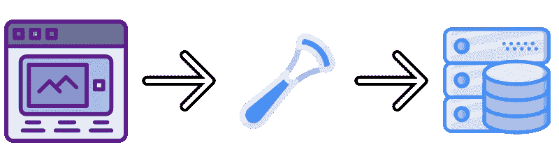
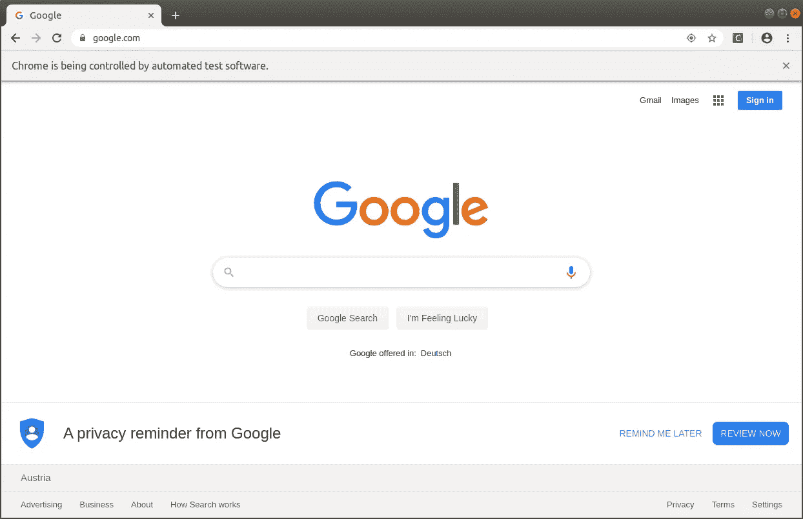
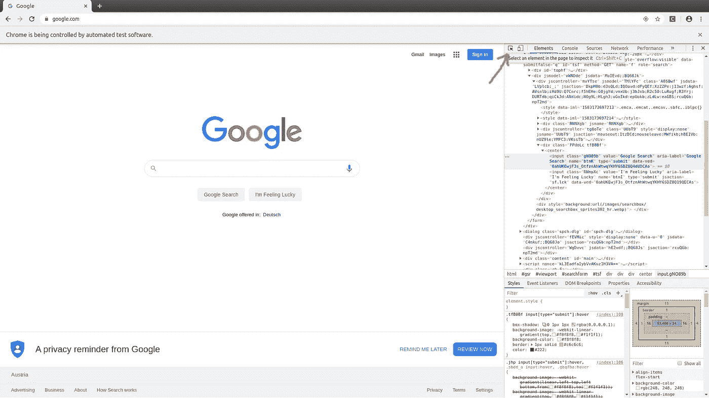
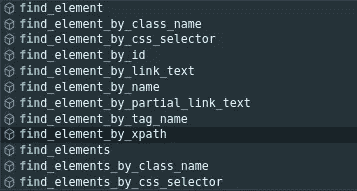
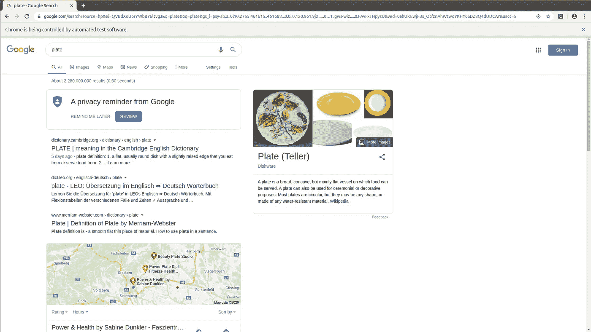
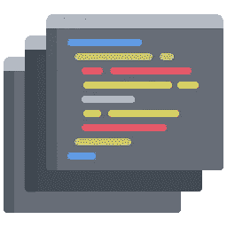
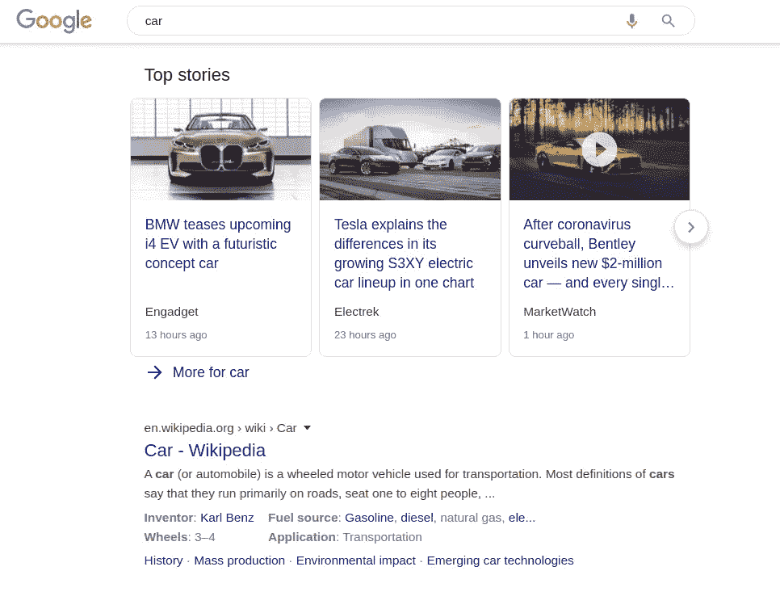

# 25 大 Selenium 功能，让你成为网页抓取专家

> 原文：<https://towardsdatascience.com/top-25-selenium-functions-that-will-make-you-pro-in-web-scraping-5c937e027244?source=collection_archive---------9----------------------->

W


获取数据，然后按照你想要的方式进行处理。

这就是为什么今天我想向大家展示 Selenium 的一些顶级功能，Selenium 是一个用于 Web 抓取的库。

我以前写过关于 Selenium 和 Web Scraping 的文章，所以在你开始之前，我建议你阅读这篇文章“[关于 Web Scraping](/everything-you-need-to-know-about-web-scraping-6541b241f27e) 的一切”，因为它的设置过程。如果你已经比较精通网络抓取，可以试试我的高级脚本，比如“[如何用 Python 省钱](/how-to-save-money-with-python-8bfd7e627d13)”和“[如何用 Python 制作分析工具](/how-to-make-an-analysis-tool-using-python-c3e4477b6d8)”。

让我们直接投入进去吧！



# 获取()

我以前写过这个，但是 get 函数很重要，没有它你什么都做不了。

get 命令启动一个新的浏览器，并在您的 [Webdriver](https://chromedriver.chromium.org/) 中打开给定的 URL。它只是将字符串作为您指定的 URL，并打开它进行测试。

如果您使用的是 Selenium IDE，它类似于 open command。

> *示例:*

```
driver.get(“https://google.com");
```

“驱动程序”是您的 web 驱动程序，您将在其上执行所有操作，在执行上面的命令后，它看起来像这样:



测试目的窗口


# find_element()

当您想要访问页面上的元素时，这个函数非常重要。假设我们想要访问“Google search”按钮来执行搜索。

有许多方法可以访问元素，但是我更喜欢的方法是找到元素的 XPath。XPath 是元素在网页上的最终位置。

通过点击 F12，您将检查该页面，并获得关于您所在页面的背景信息。



通过单击选择工具，您将能够选择元素。

找到按钮后，单击右边蓝色标记的部分，复制元素的“完整 Xpath”。

```
self.driver.find_element_by_xpath('/html/body/div/div[4]/form/div[2]/div[1]/div[3]/center/input[1]')
```

这是查找特定元素的完整命令。与常规 XPath 相比，我更喜欢完整的 XPath，因为如果新会话中的元素发生变化，常规的 XPath 可能会发生变化，而下次执行脚本时，它就不起作用了。

其他 find_element 函数概述。(还有 find _ element**s**s)



find_element 函数的所有选项


# 发送键()

Send_keys 函数用于将文本输入到您使用 find_element 函数选择的字段中。

假设我们想在 google 中输入“plate ”,这就是我们使用 send_keys 函数的原因。

```
google_tray = self.driver.find_element_by_xpath('/html/body/div/div[4]/form/div[2]/div[1]/div[1]/div/div[2]/input')google_tray.send_keys("plate")google_search = self.driver.find_element_by_xpath('/html/body/div/div[4]/form/div[2]/div[1]/div[3]/center/input[1]')google_search.click()
```

为了更加清晰，我将元素保存在各自的变量中，然后对它们执行函数。

最后你会得到这个:



# 单击()

该函数使用找到的元素，并对其执行“单击”操作。简单的东西。

这是一个点击“谷歌搜索”按钮的代码示例。

```
google_search = self.driver.find_element_by_xpath('/html/body/div/div[4]/form/div[2]/div[1]/div[3]/center/input[1]')google_search.click()
```


# getClass()

该命令用于检索表示该对象的运行时类的类对象。这意味着您执行这个函数来获取某个元素的类。

```
driver.getClass()
```


# 当前网址()

当你已经在某个页面上使用这个命令时，你可以检索你所在的 URL。

这个命令不需要参数，它返回字符串。

```
driver.current_url()
```


# getPageSource()

使用这个命令，您将能够检索页面的源代码。

这个命令不需要参数，它返回字符串。

```
driver.getPageSource()
```

该命令可以与 contains()等其他命令结合使用，以检查该过滤器下是否存在该字符串。

```
driver.getPageSource().contains("Example");
```

在这种情况下，这将是一个布尔值，所以不是真就是假。


# getTitle()

检索您当前所在网站的标题。

这个命令不需要参数，它返回字符串。如果找不到标题，将返回 null。

```
driver.getTitle()
```


# getText()

使用这个命令，您将获得 Web 元素的文本部分。

这个命令不需要参数，它返回字符串。

```
driver.findElement(By.id("Price")).getText()
```


# getAttribute()

使用这个命令，您将获得 Web 元素的属性。

我们传递一个字符串参数，它应该是我们想要知道的属性，然后返回一个字符串值。

```
driver.findElement(By.id("Price")).getAttribute("val");
```


# getWindowHandle()

当我们有多个窗口要处理时，使用这个命令。

该命令帮助我们切换到新打开的窗口，并在新窗口上执行操作。

如果他/她愿意，您也可以切换回上一个窗口。

```
String winHandleBefore = driver.getWindowHandle()
driver.switchTo().window(winHandleBefore)
```


# getWindowHandles()

这个命令类似于 getWindowHandles()，但是基本的区别是我们在这里处理多个窗口。所以不止两个。

```
driver.getWindowHandles()
```



# 链接文本()

此命令用于根据页面上的超链接及其包含的文本来查找页面上的元素。

假设我们想在谷歌搜索中找到第一个链接。



```
driver.findElement(By.linkText(“Car - Wikipedia”))
```

这种链接搜索还有另一个选项:

# partialLinkText()

您也可以在页面上搜索部分或子字符串，而不是键入要查找的整个字符串。

```
driver.findElement(By.partialLinkText(“BMW”))
```

这个命令将在谷歌上找到**头条**的第一个链接。


# 提交()

在表单的字段中输入文本后，可以使用 submit 函数单击该按钮并完成表单。

```
driver.findElement(By.<em>id</em>("submit")).submit();
```


# 关闭()

该方法关闭用户正在操作的当前窗口。

该命令不需要任何参数，也不返回值。

```
driver.close()
```


# 退出()

它可能看起来非常类似于 close 命令，但是主要的区别是它关闭了用户当前打开的所有窗口。

该命令不需要任何参数，也不返回值。

```
driver.quit()
```


# I 启用()

当您想要检查 Web 驱动程序中是否启用了该元素时。

首先，你必须找到元素，然后检查它。

它有一个布尔值，所以不是真就是假。

```
driver.findElement(By.id("Price")).isEnabled()
```


# 大小()

使用这个函数，您可以获得所选 Web 元素的大小。

```
driver.findElements(By.id("Price")).size()
```

它返回元素的大小，输出如下所示:

```
{'width': 77, 'height': 22}
```


# 睡眠()

这个函数用于暂停线程执行一段时间。

例如，您输入登录凭证，在下一个页面加载之前，会有一个时间延迟。这就是为什么我们使用睡眠来克服这些加载时间。

这个函数通常是有用的，它不是来自 Selenium，但是有一些 Selenium 内置的函数。

```
sleep(1)
```

这将暂停执行 1 秒钟。


# pageLoadTimeout()

使用 sleep 函数，你必须基本上猜测你想要克服的加载时间，但是使用 pageLoadTimeout()你可以将其设置为特定的。

```
driver.manage().timeouts().pageLoadTimeout(3, SECONDS);
```

该命令将等待 3 秒钟以加载页面。


# 隐式等待()

这是那些睡眠/等待函数的又一次迭代，将帮助你实现[完美多线程](/proper-multithreading-have-perfect-multithreading-in-your-program-4cbbf8270af3)。

为了避免抛出错误和异常，我们在页面上定位元素之前，在特定的时间内向添加一个命令。

```
driver.manage().timeouts().implicitlyWait(3, TimeUnit.SECONDS);
```

执行下一个命令前等待 3 秒钟。


# 导航()+前进()+后退()

这些被组合在一起，以便在 URL 之间切换，并按照您的意愿后退和前进。

所以您想打开另一个页面，但是您不想使用 get()，而是想使用 navigate here 并轻松地在这些页面之间进行操作。

```
driver.navigate().to("https://www.facebook.com");
driver.navigate().back();
driver.navigate().forward();
```


# 临终遗言

如前所述，这不是我第一次写关于 Selenium 和 Web 抓取的文章。我还想介绍更多的功能，还会有更多的功能。我希望你喜欢这个教程，为了跟上进度，请继续关注我！

**感谢阅读！**

[](https://medium.com/@lazar.gugleta)

查看我的**其他文章**并关注我的[媒体](https://medium.com/@lazar.gugleta)

[](https://twitter.com/intent/user?screen_name=LazarGugleta)

当我发布一篇新文章时，请在 Twitter 上关注我