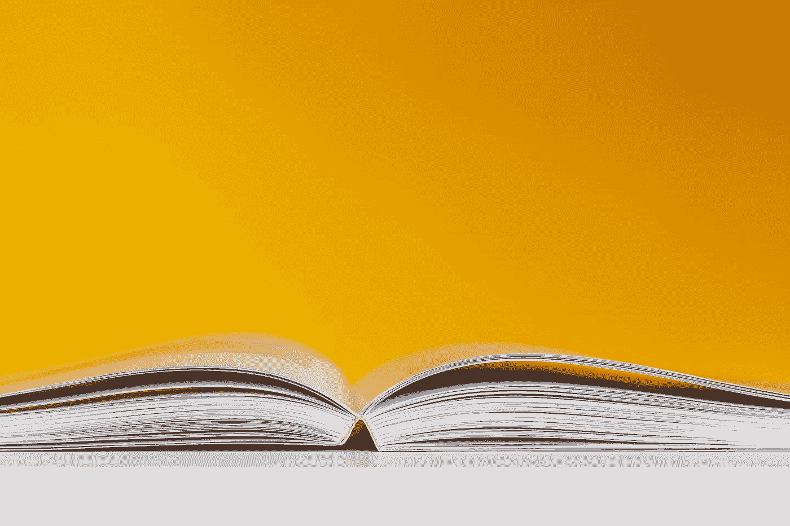
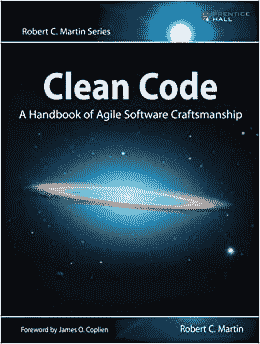
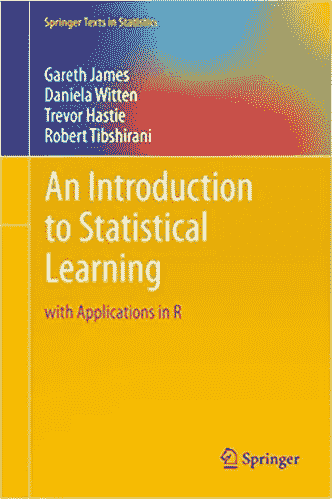
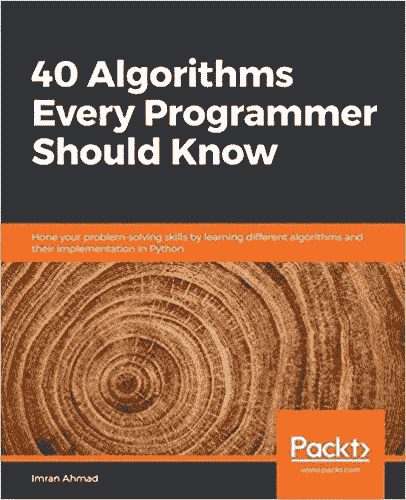

# 每位数据科学工程师的前三本书

> 原文：<https://towardsdatascience.com/top-3-books-for-every-data-science-engineer-e1180ab041f1?source=collection_archive---------19----------------------->

## 软件开发

## 我放在书架上的伟大资源，我喜欢介绍给软件工程师和数据科学家。

照片来自[像素](https://www.pexels.com/)上的 [Stas Knop](https://www.pexels.com/@stasknop)

在大学里，我不太喜欢课本。但自从毕业并全职工作以来，我发现自己收集了一些关于数据科学和软件工程的书籍，放在办公桌上以备工作之用。我正在开发一个小型的参考图书馆，当我解决一个问题或者学习一个特定的领域时，我可以参考这个图书馆。到目前为止，我发现最有帮助的三本书是《干净的代码》、《统计学习入门》和《每个程序员都应该知道的 40 种算法》。

# **清洁码**

来自[亚马逊列表](https://amzn.to/3wAAzZb)的图书封面图片

**作者:**罗伯特·塞西尔·马丁

《干净的代码》对软件工程师来说是一本完美的书，但也适用于主要从事代码工作的数据科学家，尤其是面向对象的代码。我第一次接触这本书是在我以前工作的一个工程师读书俱乐部。来自所有不同部门的工程师每周聚在一起阅读一章，讨论它如何应用到他们的工作中，以及为什么他们可能会或可能不会遵循基于他们团队制定的标准的方法。在读书俱乐部会议期间有许多有趣的讨论。这些对话包括整个组织的团队如何看待编码标准，以及如何在其工作范围内定义干净的代码标准。

通过阅读这本书，你会明白写不好的代码意味着什么，以及如何才能写出更干净的代码。每一节都详细介绍了如何将代码从不好的转变为好的，讨论了命名、创建函数、对象和类。作者还详述了如何最好地格式化代码以获得最大的可读性，我发现这是最有帮助的。在这本书的结尾，他讨论了错误处理和单元测试，这些不会混淆编码逻辑，并有助于测试驱动的开发。《干净的代码》是迄今为止我最喜欢的技术书籍之一，也是必读之作。

# 统计学习导论

来自[亚马逊列表](https://amzn.to/2UJ2iK8)的图书封面图片

**作者:**加雷斯·詹姆斯，丹妮拉·威滕，特雷弗·哈斯蒂，罗伯特·蒂布拉尼

作为我在硕士期间阅读的唯一的教科书之一，这是我的必读书籍之一，因为它是统计学习的极好指南。本书涵盖了可用于建模和理解数据的不同工具。我喜欢这本书，因为它解决问题的实用方法是针对最终应用的，而不仅仅是算法的数学实现。这本书还使用 R 中的例子来分解主题，允许读者跟随并自己实现这些例子。你需要理解统计学的术语和概念，但是这本书是书架上很好的参考资料。

在统计学习的开始讨论了评估模型准确性和解释不同类型的机器学习的概念。通读开篇章节后，本书对不同种类的算法进行了更详细的描述，如线性回归、分类、基于树的模型和支持向量机。然而，我最喜欢的一章是关于重采样方法的，它更详细地介绍了交叉验证和引导。这一章是关于如何在机器学习中使用交叉验证的很好的参考。当我寻找一些关于 ML 模型的信息时，我经常会参考这本书，然后用它作为垫脚石来确定我缺少什么信息来解决我的问题。

# 每个程序员都应该知道的 40 种算法

亚马逊列表的封面图片

**作者:**伊姆兰·艾哈迈德

《40 算法》是我书架上最新的一本书，因为它讨论了标准的软件算法，包括机器学习算法。这本书是一个算法的集合，涵盖了排序，搜索，图形，机器学习，自然语言处理，推荐引擎，数据，密码学和大规模的需求。我被这本书吸引是因为它的评论是一个很好的资源，有清晰的材料和 Python 代码片段。这本书的实际应用例子是理解如何在实践中使用这些算法的好方法。

这本书的第一章介绍了算法设计技术、性能分析和算法验证。在这个介绍之后，这本书讨论了算法中常用的不同的数据结构，如果你还没有关于数据结构的单独的书，这是一个很好的复习。这本书然后用两个不同的例子分解了如何设计一个算法:旅行推销员问题和页面排序问题。本书另一个令人兴奋的章节讨论了开发者在开发算法时可能会考虑的实际问题。这一章着眼于算法的伦理和可解释性。总而言之，这是一个很好的参考资料，可以添加到我的书架上，因为它从数据科学问题的角度讨论了计算机科学算法。

# 摘要

最后，如果我必须向对数据科学和软件开发感兴趣的人推荐 3 本书，我会推荐:

*   罗伯特·塞西尔·马丁的《干净的代码》
*   [统计学习介绍](https://amzn.to/2UJ2iK8)作者 Gareth James，Daniela Witten，Trevor Hastie，Robert Tibshirani
*   [每个程序员都应该知道的 40 种算法](https://amzn.to/2TRcznu)

你的书架上有什么有用的书吗？如果有，它们是什么？

*本文包含会员链接。如果你想了解更多，可以看看我下面的其他文章！*

 [## 公众演讲能在数据科学领域帮助你的三大理由

### 理解你的听众，回答问题，并寻求反馈

towardsdatascience.com](/top-3-reasons-public-speaking-can-help-you-in-data-science-18cdbf4bb2f2)  [## 远程工作很难让你成为一名出色的数据科学家

### 不要因为你太安静而被忽视

towardsdatascience.com](/remote-work-can-make-it-hard-to-stand-out-as-a-strong-data-scientist-71e9a2a6bc0)  [## 离开我热爱的工作的三大教训

### 跳槽到下一个机会:成为数据科学顾问

towardsdatascience.com](/top-3-lessons-learned-from-leaving-a-job-i-loved-6c71a76cae7)