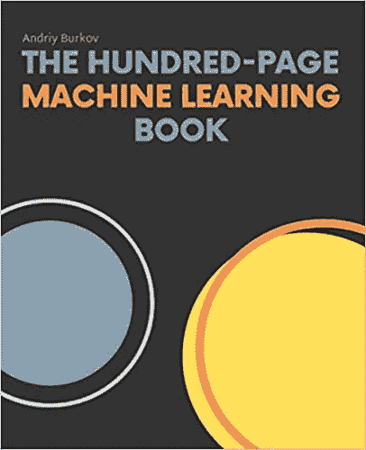
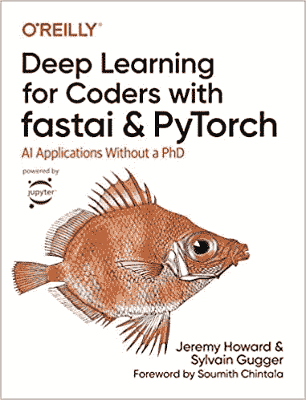

# 启动你的机器学习之旅的前三本书

> 原文：<https://towardsdatascience.com/top-3-books-to-kickstart-your-machine-learning-journey-58e8668717f2?source=collection_archive---------23----------------------->

## 无论你是数据分析师还是程序员

机器学习不像以前那么难了。每天都有新的书籍和课程出现，选择你会坚持的书籍和课程变得越来越难。这个列表应该能帮助你更快地到达那里，与你的背景无关。

在 [Unsplash](https://unsplash.com/s/photos/books?utm_source=unsplash&utm_medium=referral&utm_content=creditCopyText) 上由 [Toa Heftiba](https://unsplash.com/@heftiba?utm_source=unsplash&utm_medium=referral&utm_content=creditCopyText) 拍摄的照片

该列表对每个人都有帮助——不管你的时间安排是否很紧，或者几乎没有机器学习经验。这些书没有任何顺序，所以挑一本你觉得最舒服的。

请记住——下面你会找到我推荐的书籍的附属链接。这对你来说没什么，因为价格是一样的，但是如果你决定购买，我会得到一点佣金。我只收录了我亲自阅读过的书籍，可以保证 100%的质量。

先说第一个。

# 一百页的机器学习书

它更像一本 150 页的机器学习书，但你明白了。它是为赶时间的人设计的，因为它不太关注细节，但仍然设法涵盖所有重要的事情。

【https://amzn.to/340xXJ6 

它从基础开始——机器学习和最重要的统计概念(如随机变量和贝叶斯定理)的介绍。

故事还没有结束，因为每一个主要的监督算法都得到了很好的解释，从*线性回归*到*支持向量机*。无监督算法也涵盖在内，但稍后。还涵盖了来自特征工程的基本概念，如一键编码、标准化和丢失数据处理。

这本书还通过最重要的模型评估指标，如准确性，精确度，召回，和 AUC/ROC 曲线。你也可以期待获得一些深度学习技术的覆盖面，但这本书在那里相当模糊。

总的来说，对于任何刚开始阅读的人或者没有时间看完一本 800 页的书的人来说，这都是显而易见的。

你可以在这里得到书[。](https://amzn.to/340xXJ6)

# 使用 Scikit-Learn、Keras 和 TensorFlow 进行机器实践学习

如果你是那种愿意花几个月的时间阅读 800 多页的书的人——恭喜你，你会得到一份享受。

[https://amzn.to/2T1qDGF](https://amzn.to/2T1qDGF)

这本书在亚马逊上长期畅销，只是因为它涵盖了人们在该领域工作可能需要的一切，解释得非常清楚。说真的，这本书涵盖了从机器学习定义到 *GANs* 和*强化学习*的主题。

我很高兴这本书是我的机器学习大学课程的必修课，因为我从它身上学到的比从教授那里学到的多得多。如果你的教授不是*吴恩达*，而是更多像*西拉杰*这样的人，我估计也会这样。

如前所述，这些书籍从简单的主题，如数据收集、EDA、功能扩展，到通过决策树、随机森林和梯度增强等算法进行的实际机器学习。它还涵盖了主要的降维技术和无监督学习。所有这些都在头 300 页里！

剩下的留给神经网络和深度学习，从理论到应用在 *TensorFlow* 库中。期望学到很多关于 ann、CNN、RNNs、自动编码器、gan 和强化学习的知识。

如果你有时间的话，另一个简单的方法。还有威尔。

你可以在这里得到书[。](https://amzn.to/2T1qDGF)

# 利用 Fastai 和 PyTorch 为编码人员提供深度学习

*PyTorch* 是我一直以来最喜欢的深度学习库，而 *FastAI* 是另一个值得你花时间的库，因为它使用 PyTorch 快速开发生产就绪的模型——你已经猜到了。

[https://amzn.to/3dADtoP](https://amzn.to/3dADtoP)

它是针对软件开发人员的，因为它更侧重于实践部分。它也非常适合不愿意深入理论的数据科学家。理论部分会在书的后面提供，但我不认为它是必读书。

如前所述，主要关注的是 *FastAI* 库，它广泛用于以尽可能少的代码处理计算机视觉、表格、NLP 和推荐系统任务。官方网站提供一些免费课程，所以去看看是个好主意。

这本书非常深入地涵盖了前面提到的四个主题，这足以在您的应用程序中使用深度学习的力量。

总的来说，这是一本优秀的书，绝对值得你花时间去读。

你可以在这里得到这本书。

# 离别赠言

这三本书我觉得特别有用，也很容易读懂。没有必要全部读完，所以如果你不能决定，请参考下面的要点:

*   如果你是从机器学习开始，并且没有太多的空闲时间，读第一本书
*   如果你对实用的机器学习和深度学习感兴趣，请阅读上一本书
*   如果你有时间和意愿去学习该领域的理论和实践，请阅读第二本书

这次就这样了。感谢阅读。

[**加入我的私人邮件列表，获取更多有用的见解。**](https://mailchi.mp/46a3d2989d9b/bdssubscribe)

*喜欢这篇文章吗？成为* [*中等会员*](https://medium.com/@radecicdario/membership) *继续无限制学习。如果你使用下面的链接，我会收到你的一部分会员费，不需要你额外付费。*

 [## 通过我的推荐链接加入 Medium-Dario rade ci

### 作为一个媒体会员，你的会员费的一部分会给你阅读的作家，你可以完全接触到每一个故事…

medium.com](https://medium.com/@radecicdario/membership) 

*原载于 2020 年 10 月 16 日 https://betterdatascience.com***。**