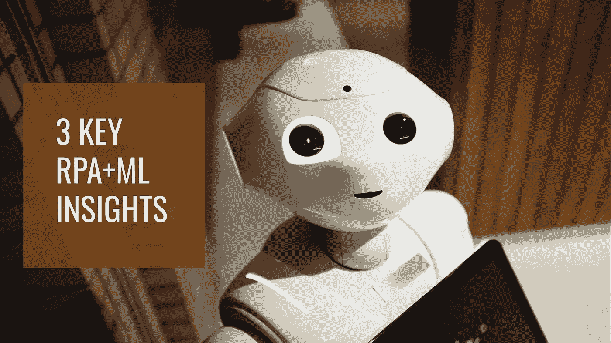
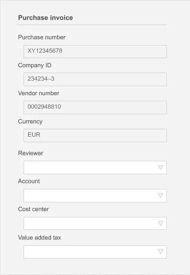
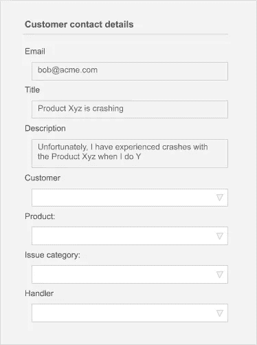

# 使用基于查询的 ML 自动化发票处理的三大见解

> 原文：<https://towardsdatascience.com/top-3-insights-from-using-query-based-ml-to-automate-invoice-processing-a3260c3b840d?source=collection_archive---------38----------------------->

## RPA 中的 ML 1)可能很容易，2)它需要不同的思维模式，3)它有许多使用案例



在 Posti 项目中，一个软件机器人使用机器学习来填写采购发票流程表单。照片由 [Unsplash](https://unsplash.com/s/photos/robot?utm_source=unsplash&utm_medium=referral&utm_content=creditCopyText) 上的 [Mantas Hesthaven](https://unsplash.com/@mantashesthaven?utm_source=unsplash&utm_medium=referral&utm_content=creditCopyText) 拍摄

芬兰物流巨头 [Posti](https://www.posti.fi/en) 的 [RPA](http://Robotic_process_automation) 团队开始使用机器学习来提升他们的发票自动化。这些是那个项目的关键见解。这是一本很好的读物，适合那些在利用机器学习实现现有自动化并使其智能化时领导或做出贡献的人。

你可以在这里阅读更多关于这个项目的信息。简而言之，问题是 [Posti](https://www.posti.fi/en) 一个月收到一万张购物发票。出于会计、支付和税务目的，每张发票需要与 1)审核人 2)预算/账户 3)部门和 4)增值税代码相关联。



在采购发票自动化流程中，目标是根据 4 个已知的发票字段自动填充 4 个缺失字段。几乎所有组织中的无数高级雇员、会计师、经理和主管不断地填写这种表格。图片来源:Aito

作为解决方案，UiPath 用于将历史发票复制到预测数据库。然后使用预测性数据库查询来预测缺失的字段:

```
{
  “from” : “purchase_invoices”,
  “where”: {
    “purchase_number “: “XY12345678”,
    “company_id”: “234234–3”,
    “vendor_number”: “0002948810”,
    “currency” : “EUR"
  },
  “predict”: “reviewer”
}
```

然后，RPA 机器使用具有高置信度/概率估计值的预测来填充发票中缺失的字段，并使流程的不同阶段自动化。

这是我们学到的。

# 洞察力 1:使用正确的工具，智能自动化并不难

在实施的发票自动化中，基本的交互非常简单:

1.  首先，RPA 机器人将已处理的发票表单从会计系统中抓取到预测数据库中。
2.  其次，机器人读取收到的发票，进行 4 次简单的预测查询来预测缺失的字段
3.  第三，机器人使用预测将缺失的字段写入会计系统，并改变发票处理状态。

有许多 RPA+ML 问题可以用类似的简单方式解决。本质上，无论何时您看到一个带有表单的流程，有点像这样，它都可能以同样的方式被自动化:



任何包含表单的流程都是基于 ML+RPA 的自动化的潜在目标。在本例中:客户可以根据电子邮件进行统计推断，而产品、问题类别和正确的客户支持人员可以根据标题和描述进行推断。因此，支持人工智能的机器人可以完美地处理大多数案件。图片来源:Aito

尽管 RPA 部分可能相对简单，但 ML 部分可能正好相反。在典型场景中，您会要求数据科学团队花费时间来拟合、部署和集成 4 ML 模型，这些模型对 4 个不同的领域进行预测。数据科学项目可能需要一段时间，可能会很昂贵，本质上:数据科学团队将根据更广泛的公司优先级来安排时间。

另一方面，如果您使用预测数据库来查询未知字段，体验类似于使用 SQL 数据库来查询已知字段。对于大多数 RPA 开发人员来说，这种类似 SQL 的体验非常简单，相关的工作和时间投入更适合紧张的 RPA 预算和计划。Posti RPA 开发人员评论道:“我最喜欢 Aito 的一点是它易于使用”，这反映了这种方法的内在简易性。还有一种观点认为，预测性数据库集成只是项目的一小部分。

因此，使用正确的工具，RPA+ML 很容易实现。在可供选择的 ML 工具中:预测数据库似乎特别有前途，因为[用预测查询进行机器学习非常容易](https://aito.ai/blog/could-predictive-database-queries-replace-machine-learning-models/)。

# 洞察力 2: RPA+ML 需要业务影响思维

虽然在传统的基于规则的 RPA 中，您可以有力地保证流程没有错误，但使用智能自动化很难创建完全没有错误的解决方案。这是因为机器学习组件以统计方式运行。


统计系统引入了可控的误差率。由[micha Parzuchowski](https://unsplash.com/@mparzuchowski?utm_source=unsplash&utm_medium=referral&utm_content=creditCopyText)在 [Unsplash](https://unsplash.com/s/photos/poker?utm_source=unsplash&utm_medium=referral&utm_content=creditCopyText) 拍摄的照片

虽然你不可能拥有一个完美无误的系统，但你可以拥有:

*   可控的误差率。在 Posti 案例中，ML 组件能够在 99%的案例中以小于 1%的误差填充缺失税码字段，在 63%的成本中心案例中以小于 5%的误差填充缺失税码字段。在发票自动化的情况下，会计部门会对内容进行双重检查，因此小的错误率通常不是问题。
*   极端复杂系统的自动化速度大大提高。在 Posti 案例中，您可以看到成千上万种不同的采购发票类型&特殊案例。在这种情况下，开发和维护数以千计的不同规则来实现基于规则的高覆盖率 RPA 是完全不可行的。虽然复杂的基于规则的自动化可能设法处理例如 10%的发票，但我已经看到基于 ML 的解决方案的 80%或 90%的自动化率。

RPA+ML 的本质是:你接受一个受控的错误率，以换取一个根本上更高的自动化率、更低的维护成本和解决无法解决的问题的能力。

在实践中，这需要改变思维模式，并与业务所有者直接讨论统计误差和最佳误差率/自动化率的权衡。还可能需要在流程中增加一个步骤来审查和纠正错误率超过 1%的统计决策。


作为 Posti 项目的一部分，RPA 团队和会计团队开会决定自动化率和错误率之间的权衡。由 [You X Ventures](https://unsplash.com/@youxventures?utm_source=unsplash&utm_medium=referral&utm_content=creditCopyText) 在 [Unsplash](https://unsplash.com/s/photos/meeting?utm_source=unsplash&utm_medium=referral&utm_content=creditCopyText) 上拍摄的照片

你可以在 TDS 关于 [ML 投资回报](/return-on-investment-for-machine-learning-1a0c431509e)的文章中找到更多相关信息

# 洞察力 3:有许多用例

RPA 和流程自动化通常是机器学习应用非常有益的领域，因为:

1.  公司往往对其核心业务流程有高质量和完整的记录，因为没有这些记录(如订单或发票)企业就无法运营，如果业务记录保存不好，在最坏的情况下可能会产生法律影响(如发票)。
2.  大多数过程都有非常强的模式。例如，来自“停车公司”的发票往往总是进入“停车预算”。这种模式很容易从数据中获取并用于过程自动化，例如允许 20%-99%的自动化率，以换取统计过程中 1%-5%的误差。
3.  大公司的核心流程可能会有大量的数据。例如:Posti 每月处理大约一万张发票。

由于良好的数据、高自动化率和高容量，现有的过程数据通常很容易在智能自动化中开发和重用，从而获得巨大的业务收益。


RPA+ML 领域有巨大的机会，尤其是现在，当机器学习的经济学更适合有限的 RPA 项目预算时。照片由 [Unsplash](https://unsplash.com/s/photos/opportunity?utm_source=unsplash&utm_medium=referral&utm_content=creditCopyText) 上的 [Mantas Hesthaven](https://unsplash.com/@mantashesthaven?utm_source=unsplash&utm_medium=referral&utm_content=creditCopyText) 拍摄

根据与项目团队的讨论:

*   如果使用预测数据库，RPA+ML 项目与传统 ML 项目相比并不昂贵。Posti RPA 团队估计，中等 RPA 项目可能平均需要 3 个月(通常涉及大量分析、沟通和组织开销)，而 RPA+ML 项目可能需要 4 个月(因为 ML 部分、额外的数据集成、额外的沟通和处理可能错误的额外步骤)。尽管如此，为您的组织完成的第一个 RPA+ML 项目预留更多的时间还是有好处的。
*   RPA+ML 应用程序的商业收益可能很高:可能高达数十万欧元，因为在适度复杂的大容量流程中自动化率很高
*   总体而言，可能 10%-20%的 Posti RPA 用例会受益于类似预测数据库的机器学习。

作为这些讨论的结果:团队已经确定了许多有价值的商业案例和机会，并决定使用相同的工具设置来扩展 ML 的部署。

# 结论和建议

RPA+ML 不需要太难，不需要数据科学家，并且可以立即产生业务影响。

然而，我们发现大多数公司在识别 RPA+ML 用例方面存在困难。这是完全可以理解的，因为 RPA 团队通常缺乏市场上大多数解决方案所需的机器学习经验和专业知识。


虽然 RPA+ML 机会很多，但在识别用例方面存在挑战，因为 RPA 团队缺乏机器学习专业知识。照片由[马库斯·斯皮斯克](https://unsplash.com/@markusspiske?utm_source=unsplash&utm_medium=referral&utm_content=creditCopyText)在 [Unsplash](https://unsplash.com/s/photos/binoculars?utm_source=unsplash&utm_medium=referral&utm_content=creditCopyText) 拍摄

结果是:虽然一个公司可能有大量好的用例，但是这些用例很大程度上没有被认识到。现在来解决关于用例的问题:

1.  一个简单的思维练习会有所帮助。就像之前提到的:任何可以被认为是表单的业务流程都是潜在的 RPA+ML 自动化目标。
2.  网上有很多用例描述。
3.  你也可以随时咨询智能自动化专家或像我们这样的 T2 供应商的建议。

如果您对该主题有任何疑问或意见，我们很乐意在 https://aito.ai/contact-us/[提供帮助，或者您可以通过](https://aito.ai/contact-us/) [Sisua Digital](https://sisuadigital.com/) 联系我们的 RPA 顾问朋友。Sisua 在 ML 支持的 RPA 自动化方面拥有丰富的专业知识，他们在 Posti 发票自动化项目中担任顾问角色。