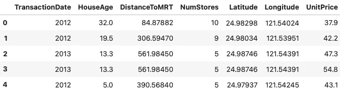
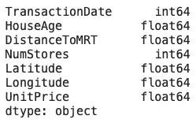
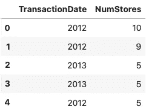
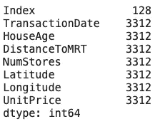
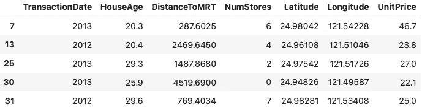
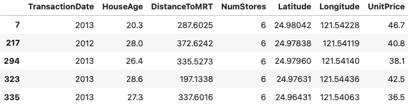

# 三大鲜为人知的熊猫功能

> 原文：<https://towardsdatascience.com/top-3-lesser-known-pandas-function-9cab7d490702?source=collection_archive---------29----------------------->

## 作为一名现代数据科学家，您需要了解熊猫的功能

说到 Python 中的数据科学库，`Pandas`可能是最有用的一个。它已经存在了相当长的一段时间，包含了很多节省时间的功能。本文以实用的方式介绍了三个鲜为人知的`Pandas`函数。


照片由 [XPS](https://unsplash.com/@xps?utm_source=unsplash&utm_medium=referral&utm_content=creditCopyText) 在 [Unsplash](https://unsplash.com/?utm_source=unsplash&utm_medium=referral&utm_content=creditCopyText) 上拍摄

不想看书？看看我关于这个主题的视频:

你需要一个房价数据集来跟进，所以请从[这个链接](https://www.betterdatascience.com/wp-content/uploads/2020/11/HousingPrices.csv)下载。让我们把熊猫装进去:

```
import pandas as pd df = pd.read_csv('HousingPrices.csv') 
df.head()
```

以下是数据集的外观:



图片 1-房价数据集标题(图片由作者提供)

事不宜迟，让我们直接进入第一个函数。

# select_dtypes()

`select_dtypes`函数用于只选择特定数据类型的列。假设您想对字符串做一些工作——您可以使用上面提到的函数来创建非数字列的子集，并从那里执行操作。

我们的数据集不包含字符串列，如下图所示:



图 2 —每列的数据类型(作者图片)

我们将使用`select_dtypes`函数只保留整数列。根据之前的图像，应该只保留`TransactionDate`和`NumStores`列:

```
df.select_dtypes('int64').head()
```

结果如下:



图 3-整数列(作者图片)

让我们进行下一个功能。

# 内存使用量()

`memory_usage`函数顾名思义就是报告内存使用情况。默认情况下，报告是以列和字节为单位进行的，但是我们稍后将看到如何更改它。

对整个数据集调用该函数:

```
df.memory_usage()
```

该调用为我们的数据集产生了以下系列:



图 4 —以每列字节为单位的内存使用情况(图片由作者提供)

如果您想得到总数，您可以对结果集调用`sum()`函数:

```
df.memory_usage().sum()
```

这将产生`23312`字节。由于字节不像兆字节那样容易理解，我们接下来进行转换:

```
df.memory_usage().sum() / 1e+6
```

上面的代码在执行时输出`0.023312`，代表住房数据集占用多少兆字节的内存。

您可以进一步使用[日志](/logging-explained-in-5-minutes-walkthrough-with-python-8bd7d8c2cf3a)来监控生产应用程序中的内存使用情况，但这超出了本文的范围。

让我们复习一下最后一个功能。

# 查询()

`query`函数用于过滤数据集并获取感兴趣的记录。过滤格式是它的特别之处。如果您按多个条件进行过滤，则不需要管理几十个括号，因为该函数使您能够将过滤条件作为字符串传递。

让我们先看一个简单的例子，我们对 20 到 30 年的房子感兴趣:

```
df.query('20 < HouseAge <= 30').head()
```

结果如下:



图片 5—20 至 30 年楼龄的房屋(图片由作者提供)

但是如果我们想测试多种情况呢？只需在中间插入`and`或`or`关键词:

```
df.query('20 < HouseAge <= 30 and NumStores == 6').head()
```

这是产生的子集:



图片 6-20 至 30 年的房屋，附近有 6 家商店(图片由作者提供)

你只需要知道这些。让我们在下一部分总结一下。

# 离别赠言

`Pandas`是 Python 中顶尖的数据科学库之一，这是有原因的——没有什么是你不能简单直观地完成的。复杂的过滤会让事情变得混乱，但是新学到的`query`函数会让事情变得更简单。

你最喜欢的鲜为人知的`Pandas`功能有哪些？请在下面的评论区告诉我。

感谢阅读。

## 加入我的私人邮件列表，获取更多有用的见解。

*喜欢这篇文章吗？成为* [*中等会员*](https://medium.com/@radecicdario/membership) *继续无限制学习。如果你使用下面的链接，我会收到你的一部分会员费，不需要你额外付费。*

[](https://medium.com/@radecicdario/membership) [## 通过我的推荐链接加入 Medium-Dario rade ci

### 作为一个媒体会员，你的会员费的一部分会给你阅读的作家，你可以完全接触到每一个故事…

medium.com](https://medium.com/@radecicdario/membership) 

*原载于 2020 年 11 月 16 日 https://www.betterdatascience.com**T21*[。](https://www.betterdatascience.com/top-3-pandas-functions/)