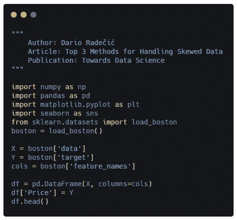
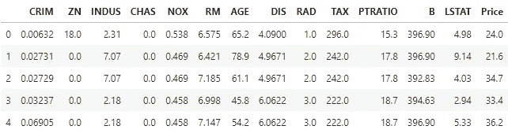
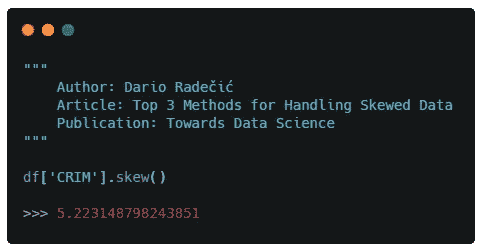
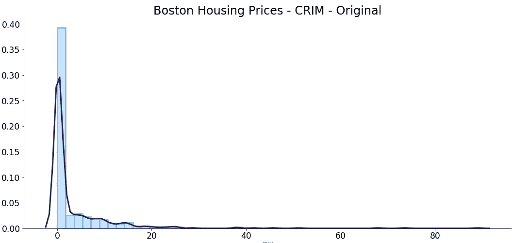
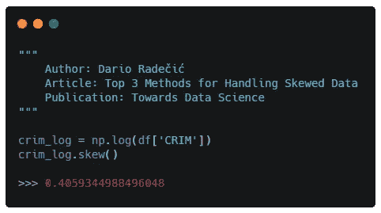
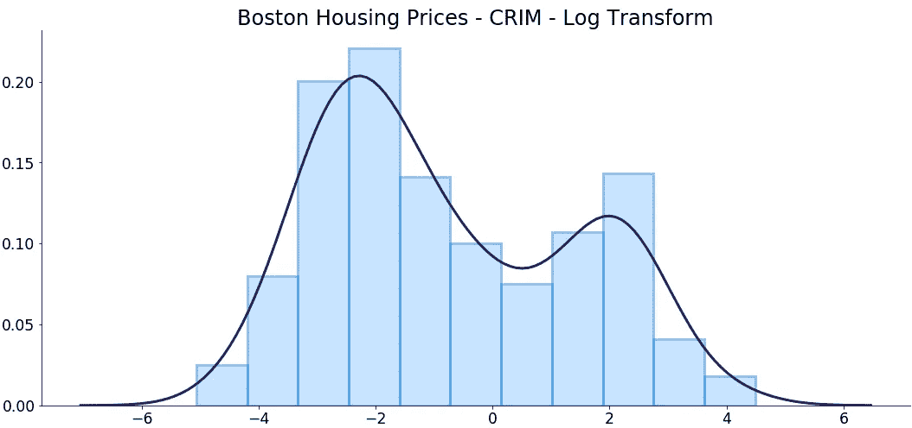
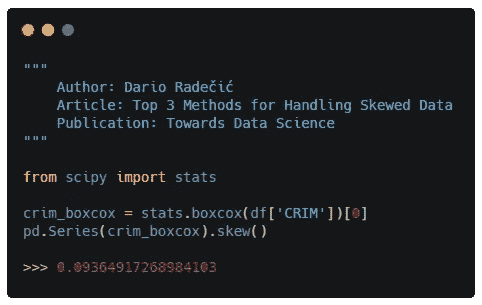
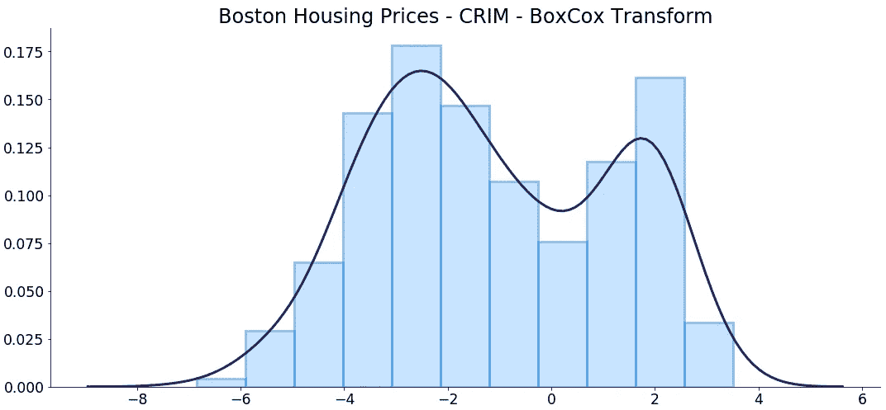

# 处理倾斜数据的三大方法

> 原文：<https://towardsdatascience.com/top-3-methods-for-handling-skewed-data-1334e0debf45?source=collection_archive---------1----------------------->

真实世界的数据可能会很混乱。甚至一些学习数据集包含的属性在用于预测建模之前需要进行严格的修改。

这很好。

[梁杰森](https://unsplash.com/@ninjason?utm_source=medium&utm_medium=referral)在 [Unsplash](https://unsplash.com?utm_source=medium&utm_medium=referral) 上的照片

让我们以线性回归模型为例。你可能已经知道了这一点，但是模型对你提供的数据做了大量的**假设**，例如:

1.  **线性**:假设预测值和目标变量之间的关系是线性的
2.  无噪声:例如，数据中没有异常值
3.  **无共线性**:如果您有高度相关的预测值，那么您的模型很可能会过拟合
4.  **正态分布**:如果预测值和目标变量呈正态分布，则预测更可靠
5.  **缩放**:这是一种基于距离的算法，所以预测器应该被缩放——就像标准缩放器一样

对于一个简单的模型来说，这已经很多了。今天我想重点谈谈第四点，那就是预测值和目标变量应该遵循高斯分布。

这并不总是可能做到的，因此你不能将任何分布转换成完美的正态分布，但这并不意味着你不应该尝试。

首先，让我们加载一个简单的数据集并施展魔法。

# 数据集

我将使用熟悉的**波士顿房价**数据集来探索一些处理扭曲数据的技巧。

没有必要下载它，因为你可以直接从 *Scikit-learn* 导入它。下面是所有导入和数据集加载的代码:

在执行时，将显示前几行，您应该得到和我一样的输出:

我不想探究所有的变量，因为我之前已经做过一些测试，并得出了变量`CRIM`具有最高偏斜的结论。下面是验证我的声明的代码:

酷毙了。现在你可以使用 *Seaborn* 库制作一个柱状图，旁边是 KDE 图，看看我们在处理什么:

这当然不符合正态分布。是的，如果你想知道我是如何从糟糕的默认可视化中摆脱出来的，这里有一篇文章你应该看看:

 [## 您需要的最后一个 Matplotlib 调整指南

### 默认的 Matplotlib 样式已经过时了——但是我们可以做些什么

towardsdatascience.com](/the-last-matplotlib-tweaking-guide-youll-ever-need-dbd4374a1c1e) 

好了，现在我们已经讨论过了，让我们来探索一些处理偏斜数据的方法。

# 1.对数变换

对数变换很可能是您应该做的第一件事，以消除预测器的偏斜。

这可以通过 *Numpy* 轻松完成，只需调用所需列上的`log()`函数。然后，您可以轻松地检查偏斜:

就这样，我们的偏斜系数从 5.2 降到了 0.4。但在下结论之前，我们还应该快速想象一下:

嗯，它肯定不是正态分布的，但比我们以前拥有的要好得多！

如您所料，对数转换不是您可以使用的唯一方法。让我们探索更多的选择。

# 2.平方根变换

平方根有时很有效，但有时并不是最好的选择。在这种情况下，我仍然希望转换后的分布看起来有点指数，但是由于取平方根，变量的范围会更小。

您可以通过调用`sqrt()`函数，使用 *Numpy* 应用平方根变换。代码如下:

偏斜系数从 5.2 变为 2，这仍然是一个显著的差异。然而，日志转换最终得到了更好的结果。

然而，让我们想象一下现在的一切:

分布基本相同，但是范围比预期的要小。

在宣布 log 转换为赢家之前，让我们再探索一个。

# 3.博克斯-考克斯变换

这是我今天要探讨的最后一个转化方法。由于我不想深究背后的数学，这里有一篇[短文](https://www.statisticshowto.datasciencecentral.com/box-cox-transformation/)给对那部分感兴趣的人。

你只需要知道这只是另一种处理扭曲数据的方式。要使用它，**你的数据必须是正的**——所以有时会令人失望。

您可以从 *Scipy* 库导入它，但是检查倾斜需要将结果 Numpy 数组转换成 Pandas 系列:

哇！偏斜仅从 5.2 下降到 0.09。不过，让我们看看转换后的变量是什么样子的:

这种分布与对数变换产生的分布非常相似，但我想说的是双峰分布稍微少了一点。

# 在你走之前

如果处理不当，扭曲的数据会破坏预测模型的能力。

这应该是不言而喻的，但是你应该记住你对哪个属性执行了什么转换，因为在做预测的时候你必须**反转**一次，所以要记住这一点。

尽管如此，这三种方法应该很适合你。

***你在用什么转化方法？请告诉我。***

喜欢这篇文章吗？成为 [*中等会员*](https://medium.com/@radecicdario/membership) *继续无限制学习。如果你使用下面的链接，我会收到你的一部分会员费，不需要你额外付费。*

 [## 通过我的推荐链接加入 Medium-Dario rade ci

### 作为一个媒体会员，你的会员费的一部分会给你阅读的作家，你可以完全接触到每一个故事…

medium.com](https://medium.com/@radecicdario/membership)