# 熊猫 1.0 的三大新功能

> 原文：<https://towardsdatascience.com/top-3-new-features-in-pandas-1-0-4a92d98a9a8f?source=collection_archive---------15----------------------->

## 一些新的节省时间和精力的功能

熊猫 1.0 版本发布已经有几周了，它带来了一些令人兴奋的新功能，尽管其中一些仍处于实验阶段。

这篇文章背后的主要思想是简要地探索它们，并向您展示如何升级到 Pandas 1.0，因为您可能仍在运行 0.25 版本。所以事不宜迟，让我们看看如何做到这一点。

## 从 0.25 升级到 1.0

如果我打开 **Jupyter 笔记本**并查看当前版本的熊猫图书馆，我会得到这个:

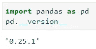

我的版本是 0.25.1，所以要升级我需要执行下面的命令(也可以通过 Jupyter 完成，不需要打开终端或命令提示符):

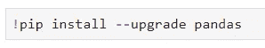

然而，如果您得到一些**权限错误**，以管理员身份运行命令行，或者如果您在 Linux 上，在命令前面加上`sudo`。现在让我们看看一切是否如预期的那样:

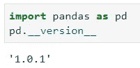

请记住，你可能看不到“1.0.1”，这取决于你何时阅读这篇文章，它可能是一个更新的版本。完成后，让我们简单讨论一下我将用来做演示的数据集，以及从哪里获得它。

## 使用的数据集

我决定使用 **MT Cars 数据集**，这是任何用户都熟悉的数据集，非常适合一些基本的数据操作。它可以从[这个链接](https://raw.githubusercontent.com/plotly/datasets/master/mtcars.csv)下载，或者你可以直接通过 Pandas 复制链接并阅读:

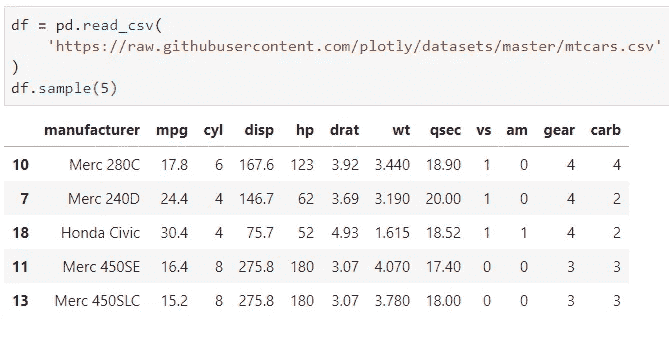

好了，现在当这一切都结束了，我可以开始写文章了！

# 1.降价转换

现在，作为 Pandas DataFrame 操作的结果，您可以轻松地生成减价表。不过，您还需要一个额外的库，名为`tabluate`:

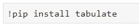

为了演示，我决定只保留 6 缸汽车，只保留`manufacturer`和`mpg`列:

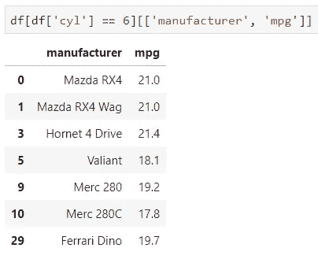

现在很容易将这个结果导出到 markdown 表。只需在陈述的末尾添加`.to_markdown()`，并确保用`print()`陈述将所有内容括起来:

现在，您可以复制该文本并将其粘贴到 markdown 单元格中(选择一个单元格，然后选择`ESC` — `M` — `Enter`):

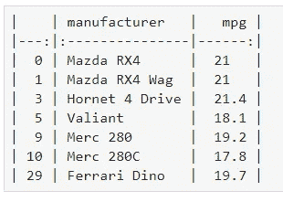

瞧啊。该单元格现在包含来自您的数据的减价表:

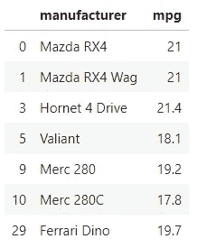

# NA 标量

Pandas 最终得到了一个标量来表示缺失值。其背后的思想是用一个标量来表示所有数据类型中一致的缺失值。到目前为止，我们有:

*   `np.nan` —用于彩车
*   `None` —用于对象
*   `pd.NaT` —表示日期和时间

现在我们可以用`pd.NA`代替上面提到的那些来表示缺失值。值得一提的是，它仍然是一个**实验特性**，并且可以在没有预先警告的情况下改变其行为，所以我还不会将它包含在产品代码中。

然而，这并不意味着我们可以玩弄它。要快速查看它的动作，只需在任意 Jupyter 单元格中执行`pd.NA`:

为了查看它在一个基本示例中是如何工作的，我将创建一系列的几个元素，并将其中一个声明为 missing，首先使用`None`关键字:

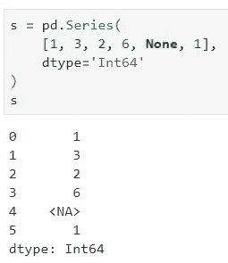

你可以看到`None`是如何毫无问题地“翻译”到`NA`的。您也可以通过`pd.NA`直接指定缺失值:

现在，从这里开始，您可以使用您的标准方法来查看一个系列是否包含缺失值:

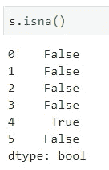

现在差不多就是这样了。再说一次，这个特性是实验性的，所以我不建议在产品代码中使用它。

# 字符串数据类型

到目前为止，我们只有`object`数据类型来处理任何非数值的东西，这可能会有问题，原因有几个:

1.  您可以将字符串和非字符串存储到一个数据类型数组中
2.  没有明确的方法只提取字符串列，因为数据类型为`object`的`.select_dtypes()`会导致第一个讨论的问题

就像`pd.NA`一样，这仍然被认为是实验性的，这意味着它很容易在没有警告的情况下发生变化。

让我们回头看看我们的 **MT Cars** 数据集，看看我们在其中存储了哪些数据类型:

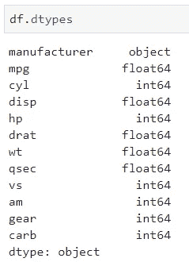

我们可以看到，`manufacturer`很明显是一个字符串，被声明为`object`。对您来说，这听起来没什么大不了的，但是想象一下这样一个场景，您想要对数据集进行子集化，只保留 string 数据类型的列。在那里，您可以很容易地得到一个数字列，其中只有一个非数字的值。这是我们想要避免的问题。

幸运的是，我们可以使用`.convert_dtypes()`方法将潜在的对象转换成字符串:

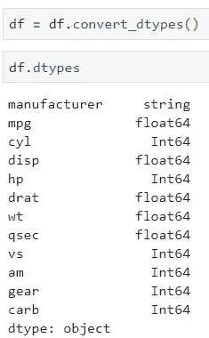

现在，我可以更安全地基于列数据类型创建子集了:

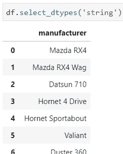

# 在你走之前

最后，我只希望你能从这篇文章中得到一些有用的东西。没有一个新特性是开创性的，但这并不意味着它们不能帮助你编写更好、更统一的代码。

我很想知道熊猫背后的开发团队将会添加哪些功能，所以如果你想在它们发布后尽快了解它们，请继续关注。

感谢阅读。

喜欢这篇文章吗？成为 [*中等会员*](https://medium.com/@radecicdario/membership) *继续无限制学习。如果你使用下面的链接，我会收到你的一部分会员费，不需要你额外付费。*

 [## 通过我的推荐链接加入 Medium-Dario rade ci

### 作为一个媒体会员，你的会员费的一部分会给你阅读的作家，你可以完全接触到每一个故事…

medium.com](https://medium.com/@radecicdario/membership)