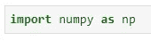
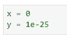
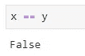
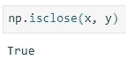
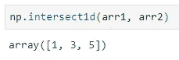
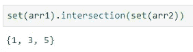
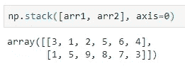
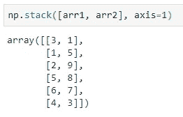

# 你不知道(可能)的前 3 个 Numpy 函数

> 原文：<https://towardsdatascience.com/top-3-numpy-functions-you-dont-know-about-probably-f3f49299a749?source=collection_archive---------28----------------------->

## 不是每个操作指南都包括的

作为最受欢迎的科学计算 Python 库之一，Numpy 当然不缺乏有用和有趣的函数，值得深入探索。本文将探讨一些最有趣但鲜为人知的内容，希望能鼓励您自己进一步探索。

尼克·希利尔在 [Unsplash](https://unsplash.com?utm_source=medium&utm_medium=referral) 上拍摄的照片

作为一名数据科学家，我每天都使用 Numpy 库，主要用于**在各种操作中处理数组**——乘法、连接、整形、比较等。

以下是本文将涉及的功能:

1.  `isclose()`
2.  `intersect1d()`
3.  `stack()`

进口方面，您只需要 Numpy:

所以事不宜迟，我们开始吧！

# isclose()

有多少次你查看数据帧中的条目，看到 0 的值，然后决定过滤掉 0，却发现你的代码没有做它应该做的事情？

你的代码(某种程度上)没有问题，问题在于数字如何被**四舍五入**以在你的屏幕上占据更少的空间。以此为例:

变量`x`和`y`虽然非常接近，但并不相同，测试相等将导致`False`:

但在大多数情况下，低至这个数字可以认为是 0。问题依然存在，**如何在代码中实现这一点？**

幸运的是，Numpy 有一个`isclose()`函数可以帮助我们。它将在一个容差内测试两个数是否相等，缺省情况下是`1e-8`。让我们来看看实际情况:

如您所见，给定的数字在阈值内是相同的，因此函数返回`True`。如果出于某种原因，您想要调整阈值，以下是操作方法:

太好了，我们继续。

# 交叉 1d()

该函数的主要思想是将两个数组作为输入，并返回包含在两个数组中的**元素。把它想成一个集合交集，但是你知道，不用把数组转换成集合，计算交集。**

为了演示，让我们声明两个数组:

现在，为了查看两者中存在哪些元素，我们需要做这样的事情:

太好了！另一种方法，前面提到的那种，写起来会有点长，而且会包含更多的括号:

两个都可以，但我更喜欢第一个。

# 堆栈()

现在，这是我在为预测建模准备数据集时经常使用的方法——更准确地说，是在**分类变量嵌入**的过程中。

假设您已经嵌入了一些变量，并希望将它们放入一个矩阵形式中，其中每个变量都是一个单独的列—唯一符合逻辑的做法是沿着列轴堆叠变量。

但是我有点想太多了。

出于演示目的，我们将处理之前的相同阵列:

太好了。现在让我们使用`stack()`函数沿着行轴堆叠数组:

请记住，`axis=0`在这里是可选的，因为它是执行堆叠的默认轴，但是我已经将它指定得更明确了。

实践中更常见的例子是沿着列轴堆叠(至少在我的工作中是这样的):

# 在你走之前

我希望你能在作为数据分析师/科学家的日常工作中利用这三个功能——它们是很好的时间节省工具。

和往常一样，如果你有一些日常使用的**附加**功能，不要犹豫，在评论区分享吧。

感谢阅读。

*喜欢这篇文章吗？成为* [*中等会员*](https://medium.com/@radecicdario/membership) *继续无限制学习。如果你使用下面的链接，我会收到你的一部分会员费，不需要你额外付费。*

 [## 通过我的推荐链接加入 Medium-Dario rade ci

### 作为一个媒体会员，你的会员费的一部分会给你阅读的作家，你可以完全接触到每一个故事…

medium.com](https://medium.com/@radecicdario/membership)