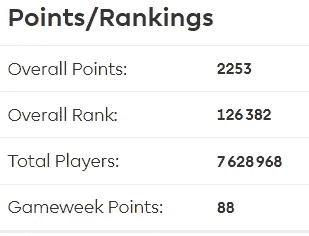
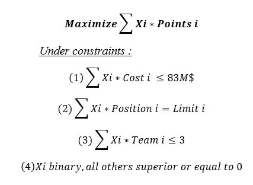
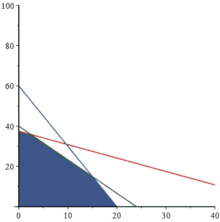
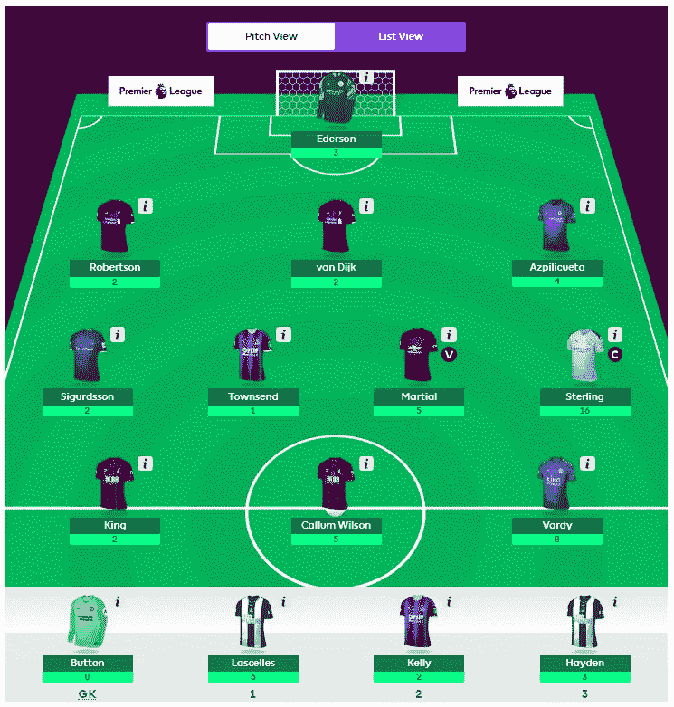

# 我是如何在梦幻超级联赛中名列前 2%的

> 原文：<https://towardsdatascience.com/top-3-on-fantasy-premier-league-here-is-how-i-did-it-cbca4cf5ef39?source=collection_archive---------63----------------------->

## 我如何利用数据科学和运筹学取得进步，以及我本可以如何改进

来源:https://unsplash.com/photos/ObhCU6Vhoe8

经过长时间的休息，体育运动正在慢慢回归。一周前，英国政府宣布英超联赛可以在 6 月 1 日闭门回归。这让我想到了我幻想中的英超球队。我决定加入这个游戏，因为这是一个结合我的两个爱好，体育和数据科学的好方法。赛季开始时，我的目标是进入前 5%。这就是我现在站的地方。

给你，前 2%。准确的说是前 1.6%。赛季还没有结束，但是到目前为止我对结果很满意。我是这样做的，运用数据科学和运筹学。

## **第一部分:挑选我的初始团队**

在赛季开始之前，你如何决定挑选哪些球员？一个球员的好价钱是多少？你应该得到尽可能多的超级巨星，还是得到更多的平衡阵容？考虑到所有这些可能性，在遵守 1 亿美元预算的同时，很难选出最好的 15 名球员。

经过大约 12 秒的思考，我很快意识到，这整个梦幻英超的事情就是教科书上的“背包问题”。背包问题是一个组合优化问题，你有一组物品，它们有一定的价值和体积，你想把它们放进背包里。考虑到背包容量有限，你要决定哪些物品放在包里才能实现价值最大化。这里有一个很好的插图，适合视觉学习者。

来源:https://en.wikipedia.org/wiki/Knapsack_problem

将这个问题转化为 FPL 问题，我只是想选择 15 名球员的组合(3 名守门员，5 名后卫，5 名中场球员和 3 名前锋)，这将使总积分最大化，同时尊重 1 亿美元的预算。但是我如何定义下个赛季的最大积分呢？好吧，因为我不知道这些信息，我必须最大化上个赛季获得的分数，同时查看今年所有球员的成本。

现在，在一个正常的比赛周，只有我们的首发阵容会真正得分。因此，我决定自己选择尽可能便宜的替代品，并且在上一个赛季的成本类别中具有最佳的单位成本比率。选了一个守门员，两个后卫和一个中场，总共 1700 万美元，这样我的首发阵容就剩下 8300 万美元了。

然后我就可以真正地解决创造最佳首发阵容的问题了。下面是为表示这个问题而创建的模型(为了便于理解而进行了简化)，其中 *Xi* 是玩家 *i* :

简而言之，我想最大化 FPL 点数的数量，同时遵守四组约束条件，即我们的球员总成本必须低于或等于 8300 万美元(约束条件 1)，我们需要每个位置有正确数量的球员(约束条件 2)，我们不能有超过 3 名球员来自一个团队(约束条件 3)，我们只能选择一名球员一次，不能有负值(约束条件 4)。

为了解决这个问题，我使用了单纯形算法，这是线性规划中最流行的算法。这是它在 2D 的做法。

来源:https://math.stackexchange.com/

基本上，它根据约束(线)定义可行区域(蓝色)，然后尝试区域边界的每个点。下面是使用 Excel 求解器通过单纯形算法获得的起始 11。是的，Excel 可以做基本的运筹学(如果有人对这方面的教程感兴趣，请告诉我)！

来源:我的 FPL 队第一场比赛的快照

从一开始就拥有一个强大的团队是至关重要的。瓦迪，马夏尔，罗伯森，范迪克每周都还在我的首发阵容里。尽管如此，这只是工作的一部分。以下是我在赛季中为确保成功所做的。

## 第 2 部分:季节调整和奖金的使用

预测的第一条规则很简单:预测范围越短，预测就越好。记住这一点，每个星期，我都尽可能地等待，以确定我的阵容，并决定我是否应该转会。这样，在做决定之前，我就有了所有可能的信息(尤其是关于伤病的)。

我在赛季中做的最重要的事情就是等到我有两次自由转会机会时再进行转会。如果你想转让一名球员，替换该球员的选择是有限的:必须是同一位置的球员，价值更低或相等。当你有两次转会时，你有更多可能的替代选择。更多的球员可供选择，你就有更多的机会得到你真正想要的球员。很简单的逻辑。

此外，我使用(或将使用)我的奖金使用一个简单的策略:最小化夹具难度排名(FDR)。也就是说，如果玩家不是在和一个 FDR 低的弱队比赛，你就不应该使用奖励。这也是简单的逻辑。耐心也是关键。我等到比赛第 26 周才使用我的第一笔奖金。

## 第 3 部分:我应该做些什么

我很快意识到，我把上个赛季看得太重，认为它是下一个赛季的最佳预测。这意味着一些在 18-19 赛季表现突出的球员(乔什·金、汤森、卡勒姆·威尔逊)总是会被算法选中，而其他几年表现不佳的球员则被遗忘(例如德·布鲁恩)。我应该考虑到至少两个赛季的数据。我可以对季节进行加权，最近的季节更重要，或者我可以简单地取一个平均值。这将消除异常，我将避免选择“一击不中的奇迹”。

最后，在疯狂的圣诞节期间，我意识到，如果至少有一个像样的替代球员，我会过得更好。轮换和伤病意味着我有几个比赛周需要替补球员上场。显然，你得到了你所付出的。在我的情况下，我从来没有得到很多。我认为有一个额外的“真正的”首发会有所帮助，也会给我更多的灵活性来根据本周的比赛调整我的阵型/阵容。

赢得 FPL 需要很大的运气，没有一个确定的方法可以表现得很好，因为像伤病、轮换和状态这些事情完全不在你的控制之内。有很多方法可以增加你的机会。就像在数据科学中一样，总是存在不确定性，没有模型或算法可以 100%准确地预测。谢天谢地，你不需要完美，你只需要打败别人！

如果你做到了这一步，那么非常感谢你的阅读！