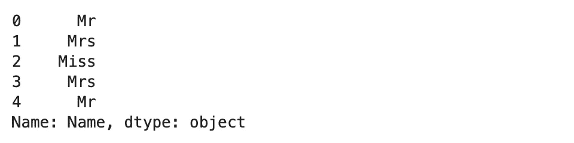
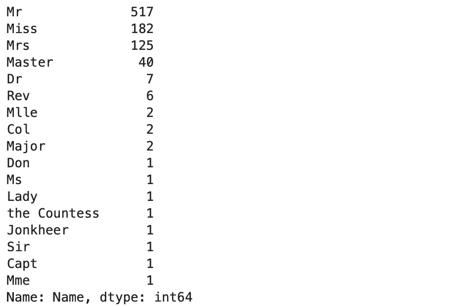
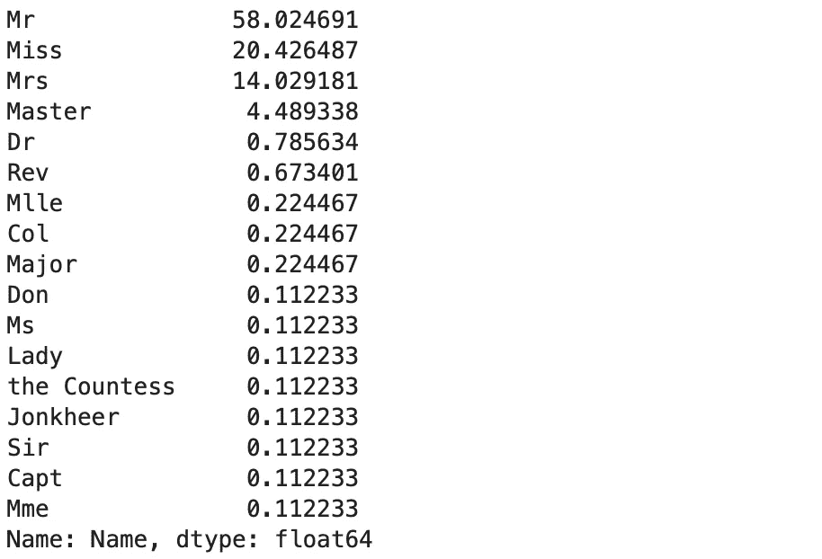
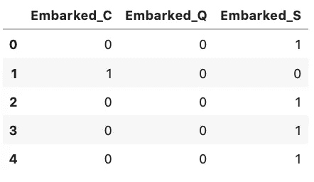
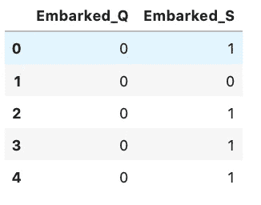

# 熊猫三大功能:数据科学版

> 原文：<https://towardsdatascience.com/top-3-pandas-functions-data-science-edition-e7c593cb1103?source=collection_archive---------52----------------------->

## 最受欢迎的数据分析库提供了什么。

毫无疑问，Pandas 是最受欢迎的数据科学库之一。它已经存在了相当长的一段时间，包括了很多节省时间和神经的功能。今天我们将探索其中的三种。


马克·巴萨拉布在 [Unsplash](https://unsplash.com?utm_source=medium&utm_medium=referral) 上的照片

如果你更喜欢视频，或者只是想巩固你的知识，请随意观看我们关于这个主题的视频。[源代码](https://github.com/betterdatascience/YouTube/blob/master/0003_Top3PandasFunctions.ipynb)包含:

准备步骤很少，因为我们只需要导入 Pandas 库和数据集:

```
import pandas as pd
df = pd.read_csv(‘[https://raw.githubusercontent.com/datasciencedojo/datasets/master/titanic.csv'](https://raw.githubusercontent.com/datasciencedojo/datasets/master/titanic.csv'))
```

仅此而已。事不宜迟，让我们从第一个函数开始吧！

# 1.应用()

*apply()* 函数允许您将预定义的或匿名的函数应用于特定的列。当没有一大堆你想执行的逻辑时，匿名或 lambda 函数是很棒的，因为 lambda 会很快变得很乱。

我们想从*名称*属性中提取标题。标题可以在第一个逗号之后，第一个点之前找到。我们只需要知道这些。

如果您选择预定义的函数，以下是解决问题的方法:

```
def extract_title(string):
    string = string.split(‘,’)[-1]
    string = string.strip()
    string = string.split(‘.’)[0]
    return stringtitles = df[‘Name’].apply(extract_title)
```

还不错，每个人都能体会到这段代码有多整洁。这肯定是一种更长的方法，但是代码不需要注释就能被其他人理解。

接下来是匿名函数方法，这是一行程序:

```
titles = df[‘Name’].apply(lambda x: x.split(‘,’)[-1].strip().split(‘.’)[0])
```

当然，这种方法更短，但是想象一下如果我们需要执行更多的分割。兰姆达斯就不是个好选择了。

下面是前几个标题的样子:



你现在可以使用这个计算栏来查看一个标题是否对生存机会有任何影响。

# 2.值计数()

*value_counts()* 的目的是统计指定属性中值的不同出现次数。这是前面提到的 *apply()* 函数的一个很好的下一步，这正是我们将使用它的目的。

我们可以调用*片头的功能*系列:

```
titles.value_counts()
```



现在您可以创建一个二进制属性，如果头衔不常见(比如 Dr、Rev、Mlle 等)，则值为 1，否则为 0(Mr、Miss、Mrs ),并执行一些进一步的分析。

我喜欢看百分比，而不是原始数据。这很容易做到:

```
titles.value_counts(normalize=True) * 100
```



差不多就是这样，简单且不言自明的函数。

# 3.get_dummies()

*get_dummies()* 函数用于将分类列转换为虚拟变量— 0 或 1。这很有用，因为你不能将字符串类别输入到机器学习模型中，这些值必须是数字。

我们将在*登船*列执行此操作，该列有 3 个值，指示乘客在哪个港口登船。

让我们看看默认情况下会发生什么:

```
emb = pd.get_dummies(df[‘Embarked’])
```


我不得不承认，这不是最具描述性的列名。幸运的是，有一个简单的解决方法:

```
emb = pd.get_dummies(df[‘Embarked’], prefix=’Embarked’)
```



现在情况有所好转。仍然不理想，因为我们有**共线性**问题。我们不需要 3 列来知道乘客在哪个港口上船。看一下第一行——C 和 Q 的值都是 0，这表明乘客登上了港口 S(南安普敦)。

这个问题有一个快速解决方案:

```
emb = pd.get_dummies(df[‘Embarked’], prefix=’Embarked’, drop_first=True)
```



将 *drop_first* 值指定为 *True* 解决了共线性问题。现在，您可以将该数据框架连接到原始数据框架，并继续进行分析。

# 在你离开之前

这并不是熊猫图书馆的全面指南，因为网上已经有很多这样的指南了。相反，我想分享我在最初的数据清理过程之后使用的一些功能(填充缺失值和处理损坏的记录)。

我希望你已经设法从这篇文章中得到了一些有用的东西。如果你有这三个功能的其他例子，请在评论区分享。

感谢阅读。

*喜欢这篇文章吗？成为* [*中等会员*](https://medium.com/@radecicdario/membership) *继续无限制学习。如果你使用下面的链接，我会收到你的一部分会员费，不需要你额外付费。*

[](https://medium.com/@radecicdario/membership) [## 通过我的推荐链接加入 Medium-Dario rade ci

### 作为一个媒体会员，你的会员费的一部分会给你阅读的作家，你可以完全接触到每一个故事…

medium.com](https://medium.com/@radecicdario/membership)