# 初学者的 3 大熊猫功能

> 原文：<https://towardsdatascience.com/top-3-pandas-functions-for-beginners-36373ee47075?source=collection_archive---------30----------------------->

## ***想学习 Python 中的数据分析？*** 那么就没有回避熊猫了，强大的 Python 库正好可以做到这一点。

Arif Wahid 在 [Unsplash](https://unsplash.com?utm_source=medium&utm_medium=referral) 上拍摄的照片

根据官方文件:

> Pandas 是一个开源的、BSD 许可的库，为 Python 编程语言提供了高性能、易于使用的数据结构和数据分析工具。[1]

你应该在几乎所有的情况下使用它——唯一的例外是当你的数据集有几个 GB 大的时候——那时，也只有那时，你才需要一个更复杂的库，比如 **Dask** 或 **PySpark** 。

对于这篇文章，我选择使用著名的[泰坦尼克号数据集](https://raw.githubusercontent.com/datasciencedojo/datasets/master/titanic.csv)，主要是因为它受欢迎，非常干净，并且容易理解。您只需要导入 Pandas 库:

`import pandas as pd`

并从提供的 URL 加载数据集:

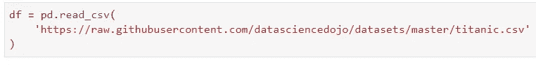

现在你已经准备好跟随了！

# 头部()和尾部()

这两个函数几乎是我所做的任何分析的第一步。你已经加载了数据集，唯一合乎逻辑的事情就是看看**看起来怎么样**。

您可以使用`head()`函数查看前 5 行，使用`tail()`函数查看后 5 行。

数字 5 并不是一成不变的，可以很容易地改变，但一会儿会有更多的变化。这是默认情况下的输出，没有改变参数:

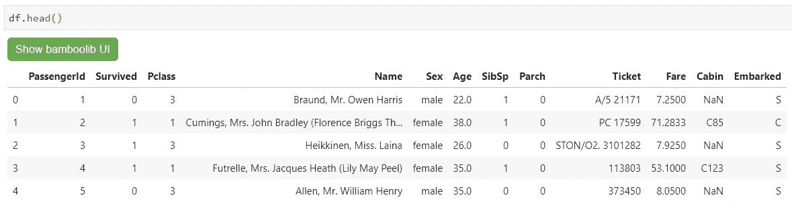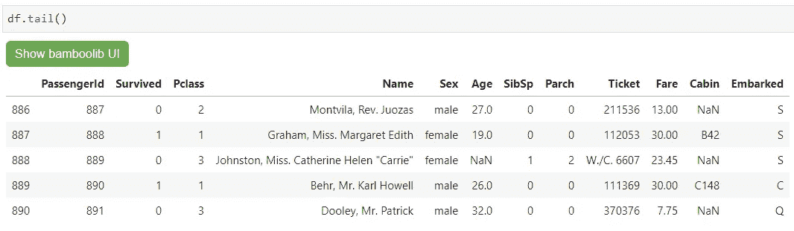

正如我所承诺的，下面是如何更改希望返回的行数:

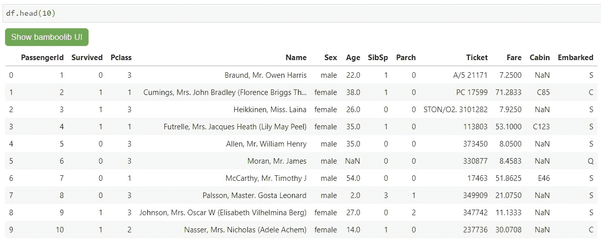

***挺容易的吧？*** 是的，以防你想知道 *Bamboolib* 是什么:

 [## 熊猫图形用户界面 Bamboolib 简介

### 学习熊猫和数据分析从未如此容易

towardsdatascience.com](/introducing-bamboolib-a-gui-for-pandas-4f6c091089e3) 

# 值计数()

当想要获得任何**分类属性**的“摘要”时，该函数非常有用。例如，您希望了解每个可能的值在属性中的表现程度。

幸运的是，我们可以在`Embarked`属性上执行这个操作，它向我们显示了有多少乘客登上了 where ( *C =瑟堡；Q =皇后镇；S =南安普顿*):

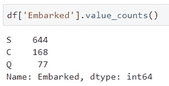

但是，如果您不关心计数，而是想查看**百分比**中的值，该怎么办呢？没问题，只需修改`normalize`参数:

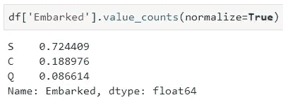

然而，这并没有真正输出百分比。不用担心，你唯一要做的就是把所有东西都乘以 100:

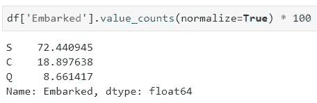

我对`value_counts()`函数的主要问题是，默认情况下，它不包括**缺失值**。这真的没什么大不了的，因为您只需再指定一个参数的值，称为`dropna`:

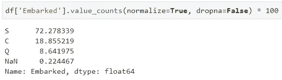

这就是我所知道的关于这个函数的全部内容。我每天都用它，真的没有再用过它。

让我们跳到最后一个。

# isnull()

这是我今天要讲的最后一个初级函数。该函数将接受一个**系列**甚至一个**数据帧**对象，如果值丢失，则输出*真*，否则输出*假*。让我们更深入地探讨一下:

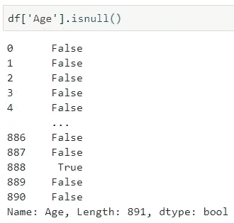

输出不容易处理。仅仅通过查看，你无法知道这一列中有多少缺失值。幸运的是，Python 将 *False* 解释为 0，将 *True* 解释为 1，这意味着我们可以轻松地调用`sum()`函数:

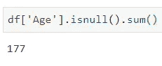

这就是我们想要的结果！它指出在属性`Age`中有 177 个丢失的值。

就像我之前说过的，你可以在整个**数据帧**上调用`isnull()`函数。如果对结果求和，您将分别获得所有列名和缺失值数量的列表:

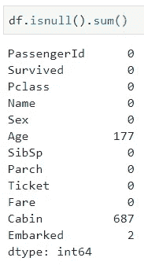

*喜欢这篇文章吗？成为* [*中等会员*](https://medium.com/@radecicdario/membership) *继续无限制学习。如果你使用下面的链接，我会收到你的一部分会员费，不需要你额外付费。*

 [## 通过我的推荐链接加入 Medium-Dario rade ci

### 作为一个媒体会员，你的会员费的一部分会给你阅读的作家，你可以完全接触到每一个故事…

medium.com](https://medium.com/@radecicdario/membership) 

# 想要更多吗？

前一段时间，我发表了一些关于熊猫各种功能的文章，所以一旦这些功能成为你的第二天性，你就可以去看看:

 [## 你应该更经常使用的 3 个熊猫功能

### 停止重新发明轮子。说真的。

towardsdatascience.com](/3-pandas-functions-you-should-be-using-more-often-696b41e8d7ca)  [## 你不知道的熊猫的三大功能(大概)

### 为我节省了大量时间和挫折的功能

towardsdatascience.com](/top-3-pandas-functions-you-dont-know-about-probably-5ae9e1c964c8) 

# 参考

[1][https://pandas.pydata.org/](https://pandas.pydata.org/)