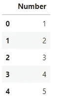
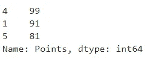
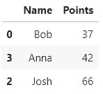
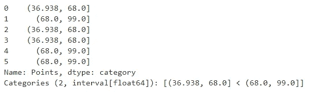
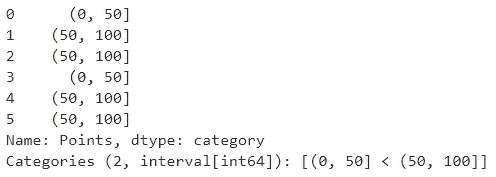
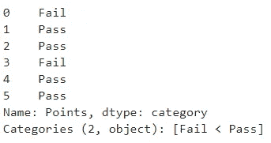

# 熊猫的三大功能我希望我能早点知道

> 原文：<https://towardsdatascience.com/top-3-pandas-functions-i-wish-i-knew-earlier-6711030bf48a?source=collection_archive---------8----------------------->

## 节省时间和精力的功能——一定要了解它们。

数据科学是一个如此广阔的领域，不可能有人精通每一种语言和每一个库——在这个行业呆了这么久，我知道的就这么多。不断的学习让我在游戏中坚持下来，回头看看这篇文章中的函数将会节省大量的时间(和精力)。


照片由 [Kilyan Sockalingum](https://unsplash.com/@kilyan_s?utm_source=medium&utm_medium=referral) 在 [Unsplash](https://unsplash.com?utm_source=medium&utm_medium=referral) 上拍摄

其中一些纯粹是一个功能，但另一方面，一些是指你使用熊猫的方式，以及为什么一种方法比另一种更好。

所以让我们从第一个开始——它的效率可能会让你吃惊。

# itertuples()

*等等，什么？*是的，这不是一个函数，它指的是使用 Pandas 的更有效的方式，因此是通过数据集迭代的更快的方式。

现在，在您在评论部分为难之前，我知道有更有效的方法来对列值求和，但是我这样做只是为了说明一点。

我们将声明一个只有一列的简单数据集，包含从 1 到 100 万的数字。方法如下:

```
df = pd.DataFrame(data={
   'Number': range(1, 1000000)
})
```

下面是前几行的样子:



现在让我们用错误的方式做事。我们将声明一个变量`total`并将其设置为`0`。然后，通过使用`iterrows()`，我们将对数据集进行迭代，并将`total`增加当前行的值。此外，我们将测量时间。代码如下:

```
%%timetotal = 0for _, row in df.iterrows():
    total += row['Number']

total**>>> Wall time: 18.7 s**
```

对于这个琐碎的操作，几乎需要 **19 秒**——但是有更好的方法。让我们现在做同样的事情，但是用`iteruples`代替`iterrows`:

```
%%timetotal = 0for row in df.itertuples(index=False):
    total += row.Number

total**>>> Wall time: 82.1 ms**
```

我不会做计算，但速度的提高是显着的。下次执行循环时记住这一点。

# nlargest()和 nsmallest()

就在昨天，我还在计算两个纬度/经度对之间的千米距离。这是问题的第一部分，第二部分是选择距离最小的前 N 个记录。

回车— `nsmallest()`。

顾名思义，`nlargest()`将返回 N 个最大值，而`nsmallest()`则正好相反。

让我们看看它的实际效果。对于实践部分，我准备了一个小数据集:

```
df = pd.DataFrame(data={
    'Name': ['Bob', 'Mark', 'Josh', 'Anna', 'Peter', 'Dexter'],
    'Points': [37, 91, 66, 42, 99, 81]
})
```

这是它的样子:


现在，让我们假设这个数据集不包含 6 行，而是包含 6000 行，您希望找出哪些学生表现最好，因此他们有最大的**点数**。一种方法是这样的:

```
df['Points'].nlargest(3)
```

不是最佳解决方案，因为它会导致以下结果:



这并不好，因为你并不清楚实际的名字。以下是改进的方法:

```
df.nlargest(3, columns='Points')
```

现在结果更加令人满意:


您可以使用几乎相同的逻辑找到 3 名表现最差的学生——使用`nsmallest()`函数:

```
df.nsmallest(3, columns='Points')
```

以下是输出结果:



现在让我们进行最后一个函数。

# 切割()

为了演示这个函数的功能，我们将使用上一节中的数据集。概括一下，这就是:

```
df = pd.DataFrame(data={
    'Name': ['Bob', 'Mark', 'Josh', 'Anna', 'Peter', 'Dexter'],
    'Points': [37, 91, 66, 42, 99, 81]
})
```


`cut()`函数背后的基本思想是将宁滨值分成**个离散区间**。下面是最简单的例子——我们将从`Points`属性创建两个 bin:

```
pd.cut(df['Points'], bins=2)
```



暂时没什么用处。但是如何声明第一个 bin 从 0 到 50，第二个 bin 从 50 到 100 呢？听起来像个计划。代码如下:

```
pd.cut(df['Points'], bins=[0, 50, 100])
```



但是，假设你想显示`Fail`而不是`(0, 50]`，显示`Pass`而不是`(50, 100]`。下面是如何做到这一点:

```
pd.cut(df['Points'], bins=[0, 50, 100], labels=['Fail', 'Pass'])
```



这下好了。

# 在你走之前

如果你刚刚开始，这个功能将帮助你节省时间和精力。如果你不是，阅读这篇文章将帮助你**巩固这些函数存在的知识**——因为很容易忘记它们并从头开始编写逻辑。

但是这样做没有意义。

我希望你喜欢它。感谢阅读。

*喜欢这篇文章吗？成为* [*中等会员*](https://medium.com/@radecicdario/membership) *继续无限制学习。如果你使用下面的链接，我会收到你的一部分会员费，不需要你额外付费。*

[](https://medium.com/@radecicdario/membership) [## 通过我的推荐链接加入 Medium-Dario rade ci

### 作为一个媒体会员，你的会员费的一部分会给你阅读的作家，你可以完全接触到每一个故事…

medium.com](https://medium.com/@radecicdario/membership)